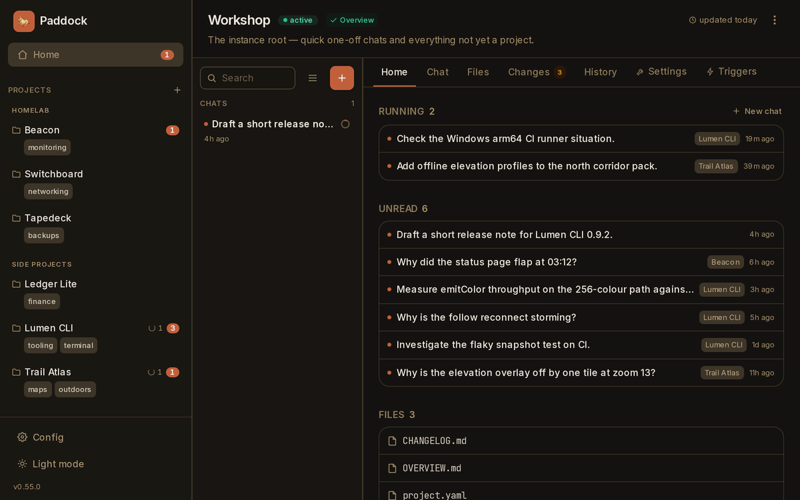
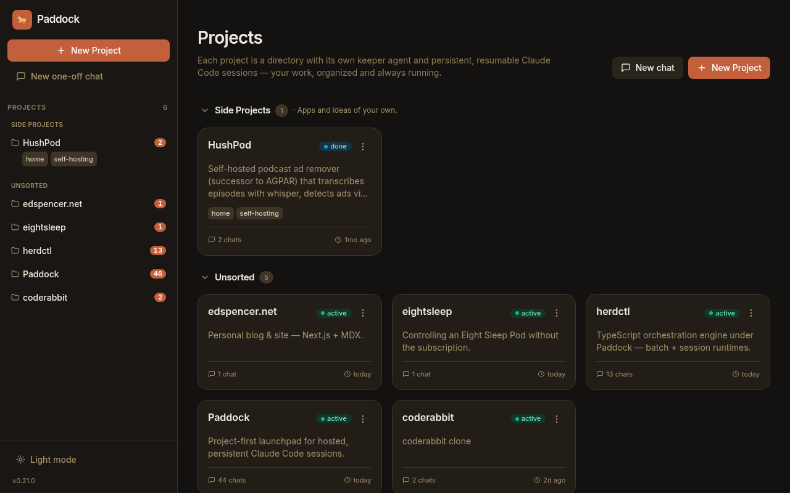
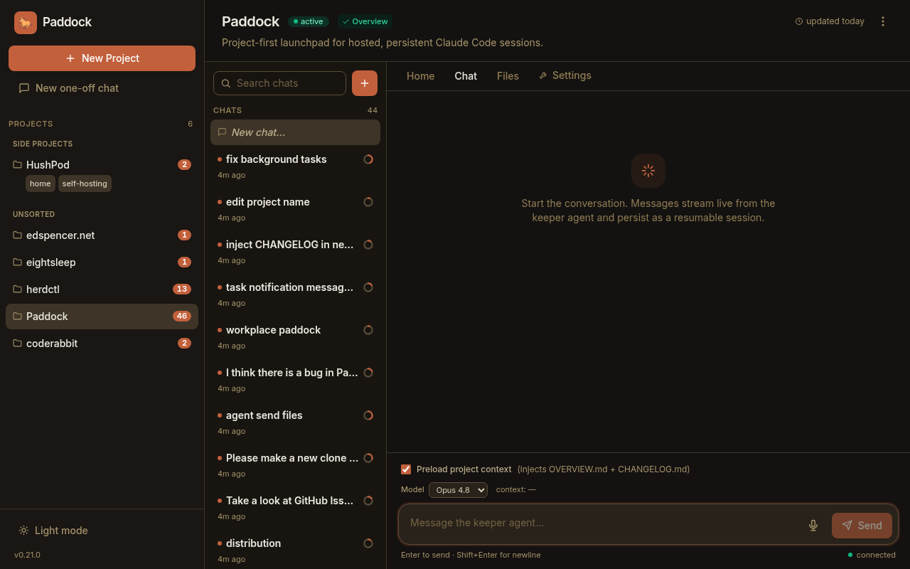
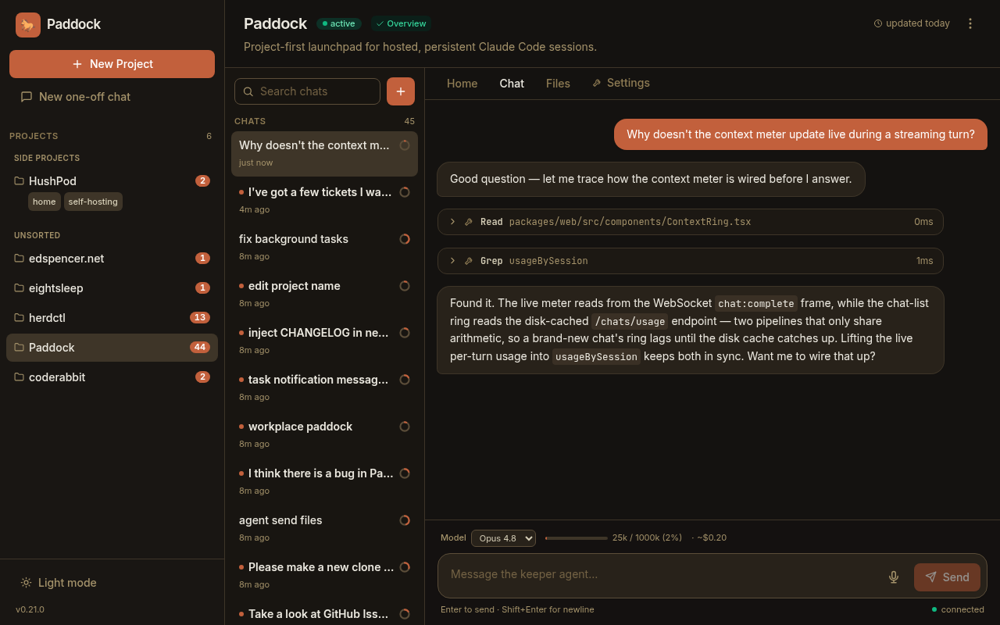
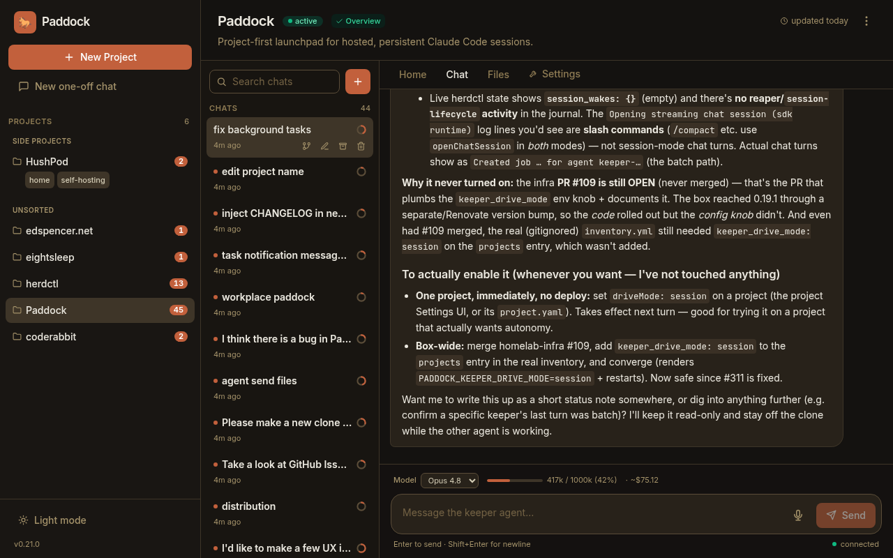
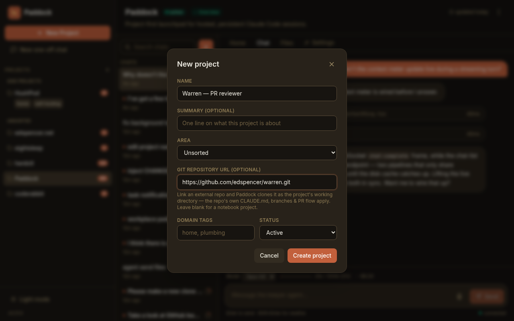
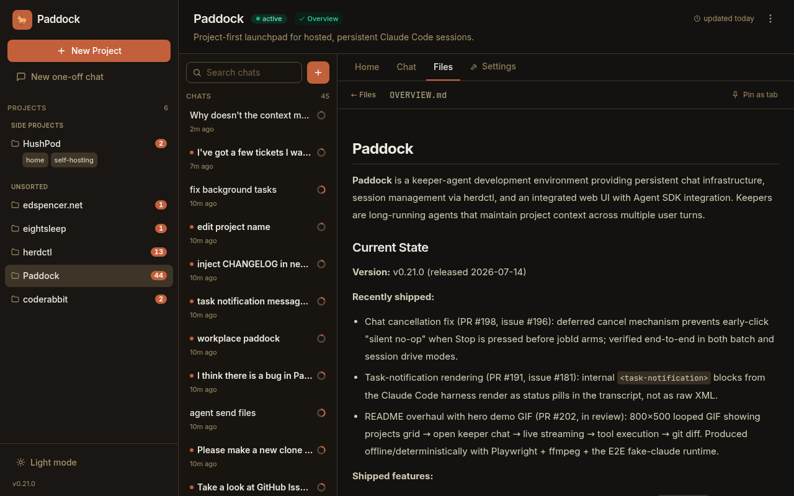
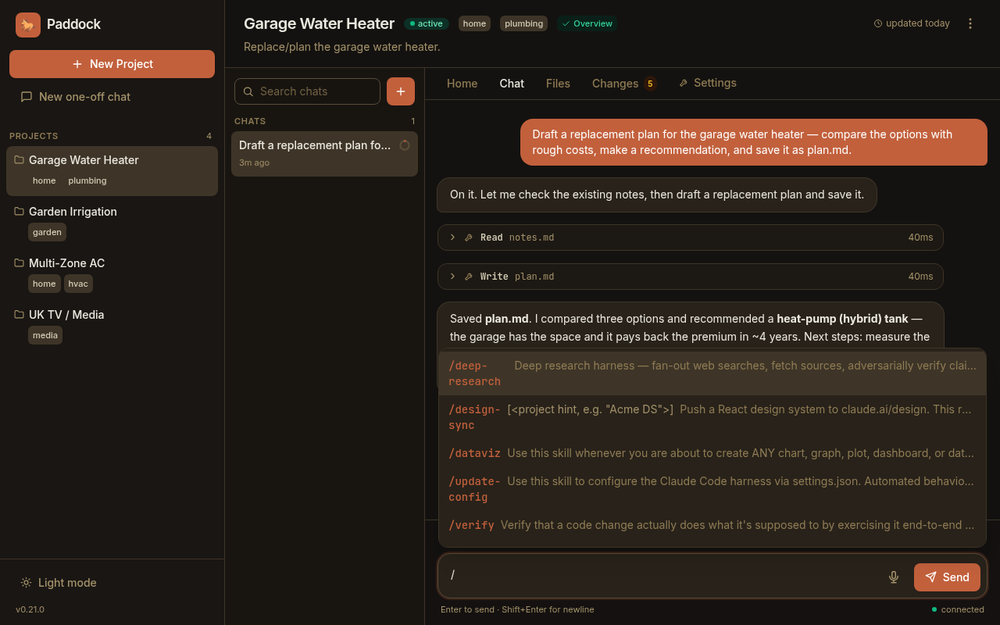
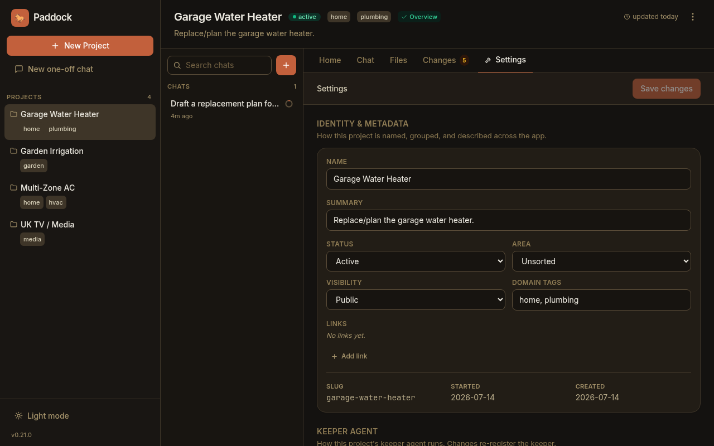
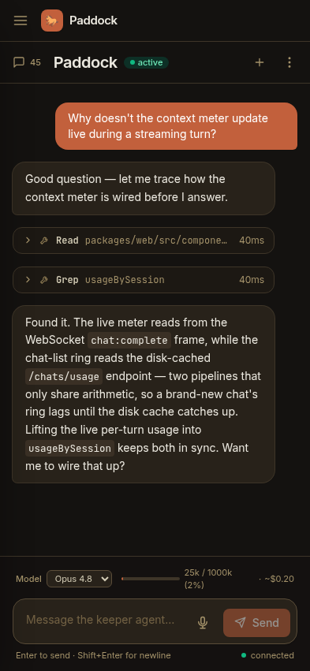

<h1 align="center">🐎 Paddock</h1>

<p align="center">
  <strong>Your Claude Code agents, hosted and organized by project.</strong><br/>
  Persistent, resumable Claude Code sessions with a web UI — from your desk or your phone.
</p>

<p align="center">
  <a href="https://github.com/edspencer/paddock/actions/workflows/ci.yml"></a>
  <a href="https://github.com/edspencer/paddock/releases"></a>
  <a href="https://github.com/edspencer/paddock/pkgs/container/paddock"></a>
  <a href="https://github.com/edspencer/herdctl"></a>
</p>

<p align="center">
  <a href="https://paddock.edspencer.net">Docs</a> •
  <a href="#quickstart">Quickstart</a> •
  <a href="#drive-it-from-outside">Management API</a> •
  <a href="#configuration">Configuration</a> •
  <a href="#how-it-works">How it works</a> •
  <a href="https://github.com/edspencer/herdctl">herdctl</a> •
  <a href="https://github.com/edspencer/paddock/issues">Issues</a>
</p>

---

<p align="center">
  
</p>

## Why Paddock

**Paddock** is a project-first launchpad for [herdctl](https://github.com/edspencer/herdctl).
It turns Claude Code into something you run on a server and reach from a browser:
long-lived agents, one per project, whose chats persist and resume — instead of a
laptop full of terminal tabs you can't get back to from your phone.

A **project** is just a directory. Each one gets a herdctl **keeper agent** whose
working directory *is* that project, and the chats you see in the UI are that
agent's Claude Code sessions — persisted on disk and resumable across reloads,
reconnects, and devices. There are two kinds:

- **Notebook** — a directory in your data repo for planning, notes, and light work.
- **Repo-backed** — an external git repo cloned as the keeper's working directory,
  so the repo's own `CLAUDE.md`, branches, and PR flow apply. The natural unit for
  doing real engineering.

One-off "scratch" chats work too, and can be promoted into a project (keeping their
history). The whole UI is responsive — the same launchpad works from a phone.

It also runs without you watching. Keepers are fired by schedules, lifecycle
events and each other; background work a keeper starts survives the turn that
started it and wakes the keeper when it lands. And the boundary now opens the
other way: an instance **exposes itself as an MCP server**, so Claude Code on
your laptop — or CI, or a peer Paddock — can drive it from outside. Less an app
you visit, more a service your other tools talk to.

## Highlights

- 🗂️ **Project-first** — every project has its own keeper agent, files, and changelog
- 💬 **Persistent, resumable chats** — server-hosted sessions survive reloads, reconnects, and devices
- ⌨️ **Token-by-token streaming** — replies, real tool calls, and subagents render live as they run, with rich tool cards (Edit diffs, Bash exit codes, Grep counts)
- 🛰️ **Drive it from outside** — an [external Management API](#drive-it-from-outside) serves the management tools as MCP at `/mcp`, so Claude Code on your laptop, CI, or a peer Paddock can list projects, read chats, and (with the scope for it) start turns
- ⏰ **Triggers & automation** — run a keeper turn on a schedule, on a lifecycle event, or on demand; each trigger can carry its own scoped toolset
- 🤖 **Self-driving keepers** — an opt-in, depth-gated in-process MCP lets a keeper list projects, read chats, spawn and fork chats to fan work out across parallel keepers, manage its own triggers, and — behind a further flag — provision new projects
- ⏳ **Background work outlives the turn** — a build, deploy, or sub-agent a keeper backgrounds keeps running after the turn ends and wakes the keeper with its result
- 📎 **Send files & images** — pick, drag-drop, or paste into the composer; Claude reads images and PDFs natively
- 📁 **Files & Changes** — browse rendered project files and review the agent's work as git diffs
- 🧩 **Two project types** — notebook (data-repo subdir) or repo-backed (clone an external repo as cwd)
- 📱 **Works from your phone** — the same launchpad, fully responsive
- 🔀 **Chat ergonomics** — star to pin, mark unread, fork or rewind from any message, queue-while-streaming, stop, search, archive; spawned chats nest under the chat that created them
- 🎛️ **Settings, per project and per instance** — model, permission mode, curation budgets and more per project; an instance-wide screen edits `paddock.config.yaml` from the UI
- 🧠 **Claude Opus 5 by default** — with Opus 4.8, Fable 5, Sonnet 5 and Haiku 4.5 selectable, and an allow-list if you'd rather offer fewer
- 📈 **Token & cost tracking** — per-chat context meter and estimated API cost, live
- 🎙️ **Voice dictation & slash commands** — mic-to-text in the composer, `/`-autocomplete for skills
- 🔌 **Built on herdctl** — anything the fleet engine can do, Paddock can wire in

## Quickstart

Run the published image, point it at a data volume, and give it a Claude token:

```bash
docker run -d --name paddock -p 127.0.0.1:4000:4000 \
  -e CLAUDE_CODE_OAUTH_TOKEN=…       `# Claude Max/Pro plan (OAuth)` \
  -e PADDOCK_DATA_DIR=/data \
  -v paddock-data:/data \
  ghcr.io/edspencer/paddock:latest
```

Then open **http://localhost:4000** and click **New Project**.

Two images ship from the same source: **`:latest`** is the lean base (app plus
`git`, `gh`, and the `claude` CLI), and **`:devbox`** layers on a coding-agent
toolbox — PM2-backed preview servers, `ffmpeg`, a headless Playwright browser,
the Docker CLI, `python3`/`uv`, `jq`, `rsync`. Same app and same `/data` layout,
so you can swap tags against
one volume. Ready-made self-hosting recipes (Compose, Kubernetes, Proxmox,
a Basic Auth sidecar) live in
[**`paddock-deploy`**](https://github.com/edspencer/paddock-deploy).

<details>
<summary>docker-compose</summary>

```yaml
services:
  paddock:
    image: ghcr.io/edspencer/paddock:latest   # or :devbox for the coding-agent toolbox
    ports:
      - "127.0.0.1:4000:4000"
    environment:
      CLAUDE_CODE_OAUTH_TOKEN: ${CLAUDE_CODE_OAUTH_TOKEN} # Claude Max/Pro (OAuth); or ANTHROPIC_API_KEY for API-key billing
      PADDOCK_DATA_DIR: /data
    volumes:
      - paddock-data:/data
volumes:
  paddock-data:
```
</details>

> **The web UI has no login of its own** — run it behind a reverse proxy / auth
> layer you trust (see [AUTH.md](AUTH.md)). Paddock reads credentials from the
> environment and from files the host provides; it never stores secrets itself.
> It also fails closed: a source or tarball run binds loopback by default, and
> refuses to start on a routable interface with `PADDOCK_AUTH_MODE=none` unless
> you explicitly set `PADDOCK_DANGEROUSLY_ALLOW_OPEN`. (The
> [Management API](#drive-it-from-outside) is the one surface that authenticates
> itself rather than delegating to your proxy.)

## A tour

_These are real screenshots — Paddock is dogfooded on its own dev stack: **Paddock**, **herdctl** (the engine underneath it), and **Warren** (an agentic PR reviewer) all live here as projects that build one another._

**Every project gets a keeper agent, organized on one page.**

<p align="center"></p>

**Each project keeps dozens of persistent, resumable chats — searchable, forkable, archivable.**

<p align="center"></p>

**Chat with the keeper — real tool calls and subagents stream in, with a live context + cost meter.**

<p align="center"></p>

**Built for real, long-running work** — persistent sessions track their own context window and estimated cost as they grow (this one's 42% of a 1M-token window):

<p align="center"></p>

<table>
<tr>
<td width="50%"><b>Repo-backed projects</b><br/>Clone an external repo as the keeper's working directory — its own <code>CLAUDE.md</code>, branches, and PR flow apply.<br/><br/></td>
<td width="50%"><b>Rendered project files</b><br/>Markdown, Mermaid, code, images, PDF and video render inline; pin files as tabs.<br/><br/></td>
</tr>
<tr>
<td width="50%"><b>Slash-command autocomplete</b><br/>Type <code>/</code> to discover and run the agent's skills.<br/><br/></td>
<td width="50%"><b>Per-project settings</b><br/>Identity, model, permission mode, links, curation budgets, and keeper config — deep-linkable.<br/><br/></td>
</tr>
</table>

<p align="center"><i>…and it all works from your phone.</i></p>
<p align="center"></p>

## Drive it from outside

Paddock isn't only something you open in a browser. An instance can expose its
**Management API** as an MCP server over streamable HTTP at **`/mcp`** — so a
Claude Code session on your laptop, a CI job, or a peer Paddock can list
projects, read chats, and, if you grant it, start turns. External callers get
the *same* toolset a keeper receives in-process, so the two surfaces can't
drift.

Clients are declared in `paddock.config.yaml`, and their tokens are
**referenced, never inlined** — a literal secret in the config file is a hard
error:

```yaml
managementApi:
  instanceId: my-paddock
  publicUrl: https://paddock.example.com
  clients:
    my-laptop:
      auth:
        ref: env:PADDOCK_MCP_TOKEN_MY_LAPTOP   # value lives in the environment
      # no scope ⇒ read-only, across all projects
```

```sh
claude mcp add --transport http --scope user paddock \
  https://paddock.example.com/mcp \
  --header "Authorization: Bearer $PADDOCK_MCP_TOKEN_MY_LAPTOP"
```

A few things worth knowing before you widen that scope:

- **Read-only is the default, and it should usually stay that way.** A client
  configured without an explicit scope gets `list_projects`, `list_chats`,
  `list_triggers` and `read_chat` — nothing else. This is not timidity: any
  write scope can start a keeper turn, and a keeper has `Bash`. **Granting write
  access to the Management API is equivalent to granting remote code execution
  on the host.** Treat such a token like an SSH key, scope it to specific
  projects, and expect the boot log to warn you by name when a client holds one.
- **Static bearer tokens are the only credential that works today.** OAuth is
  not implemented — `auth.type` accepts only `"token"`, and anything else is a
  config error. Paddock will publish RFC 9728 protected-resource metadata once an
  authorization server is configured, but there is no OAuth path to configure one
  against yet, so mint a token and use it.
- **It authenticates itself.** `/mcp` is credential-gated independently of
  `PADDOCK_AUTH_MODE` and of any reverse proxy, so it stays closed even on an
  instance running `auth.mode: none`, and a bad token gets a `401` rather than a
  login redirect no MCP client could follow.
- **It fails closed.** The endpoint `404`s entirely until you've configured both
  clients *and* a `publicUrl`; if every client's token resolves to nothing, it
  goes back to `404`ing rather than opening up.

Full setup, the scope grammar, and the per-tool reference:
[Management API](https://paddock.edspencer.net/reference/mcp/) and the
[self-management MCP](https://paddock.edspencer.net/reference/self-mcp/).

## Configuration

Configuration is environment-first, with an optional **YAML instance-config file**
(precedence: built-in defaults < file < env) and per-project overrides in each
project's `project.yaml`.

| Var | Default | Purpose |
|-----|---------|---------|
| `PORT` | `4000` | HTTP/WS port |
| `HOST` | `127.0.0.1` | Bind address. Loopback by default so a fresh source/tarball run is network-closed; the container images bind `0.0.0.0` because the network namespace is their boundary. |
| `PADDOCK_DANGEROUSLY_ALLOW_OPEN` | — | Required to bind a routable interface with `PADDOCK_AUTH_MODE=none`. Without it, Paddock refuses to start — it runs code and spends your Claude tokens. |
| `PADDOCK_DATA_DIR` | `./data` | Data root — holds `projects/`, `scratch/`, `.herdctl/` state, the generated `herdctl.yaml`. Setting this cascades all derived paths. |
| `CLAUDE_CODE_OAUTH_TOKEN` | — | Claude auth — Max/Pro plan (OAuth). |
| `ANTHROPIC_API_KEY` | — | Claude auth — API-key billing. |
| `PADDOCK_KEEPER_DRIVE_MODE` | `session` | `session` (SDK runtime — token-by-token streaming + cross-turn autonomy) or `batch` (legacy one-shot CLI runtime). Per-project `driveMode` overrides it. |
| `PADDOCK_MODELS` | — | Comma-separated allow-list of model ids to offer. Unset offers the whole catalog. |
| `PADDOCK_OPENAPI_ENABLED` | off | Mounts a Swagger UI at `/open-api` (raw spec at `/open-api.json`) generated from the route schemas. |

The **complete `PADDOCK_*` reference** — every variable, its default, and purpose
— is in **[docs/CONFIGURATION.md](docs/CONFIGURATION.md)**;
[`.env.example`](.env.example) is a runnable starting point. Most of these can
also be edited from the **Settings** screen in the UI, which writes
`paddock.config.yaml` and shows which fields an environment variable has pinned.

Authentication modes (`none` / `trusted-header` / `jwt`) and secret handling
(GitHub tokens, SSH keys, per-platform mapping) are documented in **[AUTH.md](AUTH.md)**;
the Management API carries its own credentials, [documented separately](https://paddock.edspencer.net/reference/mcp/).

### Multiple instances

Paddock is one process per data root + port. To run several (e.g. one per area —
open-source / house / homelab), start one process each with its own
`PADDOCK_DATA_DIR` and `PORT`, and front them with a reverse proxy that maps a
hostname to each port. Nothing is shared between instances except the host.

## How it works

Paddock is a thin project layer over the public `@herdctl/core` FleetManager. It
wires **projects**, **chats**, and a **git backing store** on top; anything the
herdctl CLI/dashboard can do, the library can too.

Keeper turns run through herdctl's **session runtime** (persistent
`openChatSession`) by default — that's what lets chats resume across reloads,
stream token-by-token, and carry autonomous work (`ScheduleWakeup`, `/loop`)
across turn boundaries. **Triggers** (schedules, lifecycle events, and
reserved webhooks), the self-management MCP, and external `/mcp` callers all
drive the same `startAgentTurn` core as a human message does, so anything a
person can start in a chat, an automation can start too. The management
operations sit behind a single policy layer rather than one per transport, so
every access path inherits identical scoping instead of reimplementing it.

- `packages/server` — Fastify + WebSocket backend; wraps the FleetManager + a
  Project layer (`ProjectStore`). Serves the built SPA in production.
- `packages/web` — React + Vite + Tailwind project-first SPA.

For the full picture, start with the documentation site —
**[paddock.edspencer.net](https://paddock.edspencer.net)** — which covers
[getting started](https://paddock.edspencer.net/getting-started/),
[deploying](https://paddock.edspencer.net/guides/deploying/),
[binding and exposure](https://paddock.edspencer.net/configuration/binding-and-exposure/),
the [Management API](https://paddock.edspencer.net/reference/mcp/), and
[what's new](https://paddock.edspencer.net/whats-new/) in each release. In the
repo:

- **[docs/ARCHITECTURE.md](docs/ARCHITECTURE.md)** — the canonical architecture
  overview (monorepo shape, the three storage classes, WebSocket/session flow,
  MCP injection, auth boundary, the sweeper, drive modes).
- **[docs/concepts/](docs/concepts/)** — short explanations of the core ideas:
  [projects](docs/concepts/projects.md) (notebook vs. repo-backed),
  [keeper agents](docs/concepts/keepers.md),
  [chats are Claude Code sessions](docs/concepts/chats.md), and
  [the sweeper](docs/concepts/sweeper.md).
- **[docs/API.md](docs/API.md)** — Paddock's own REST + WebSocket API reference.
  Every REST route carries a schema, so a live OpenAPI 3 document and a Swagger
  UI are available at `/open-api` when `PADDOCK_OPENAPI_ENABLED` is set.
- **[docs/INTEGRATION.md](docs/INTEGRATION.md)** — the exact public
  `@herdctl/core` API contract Paddock depends on.

## Development

```bash
npm install                 # install all workspaces
npm run build               # build server (tsc) + web (vite)
npm run typecheck           # typecheck both packages
npm test                    # server (unit + integration) + web (component) tests
npm run test:e2e            # Playwright journeys (incl. mobile) against the real server + a fake `claude`

# Run locally (two terminals):
npm run dev                 # server on :4000 (API + WS)
npm run dev:web             # Vite dev server, proxies /api + /ws to :4000
```

The E2E suite drives the **real** server, FleetManager, and CLI runtime; only the
LLM is swapped for a fake `claude` on PATH (zero Anthropic calls). Opt into a
real-Claude run with `npm run test:e2e:live` (`PADDOCK_TEST_LIVE=1`). More detail
in **[DEV.md](DEV.md)** and **[docs/TESTING.md](docs/TESTING.md)**.

The documentation site in [`website/`](website/) is deliberately outside the root
workspaces — install and build it separately if you're changing docs.

New contributor? Start with **[CONTRIBUTING.md](CONTRIBUTING.md)** — conventions,
env gotchas, and the changesets flow.

## License

See the repository for license details.
