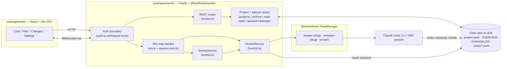
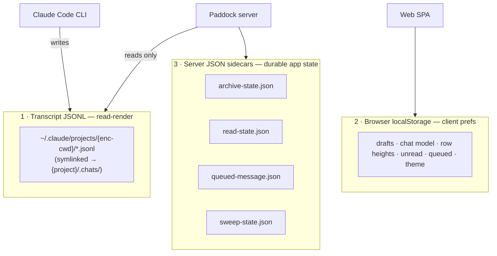
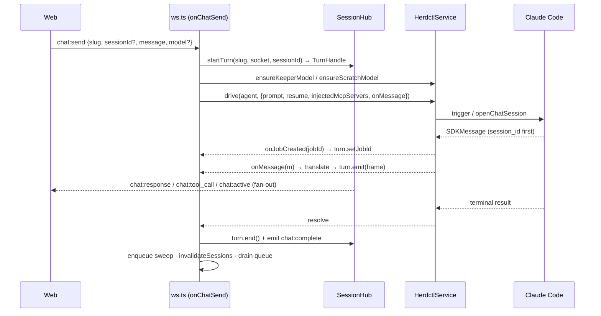

# Paddock architecture

> Canonical architecture overview for Paddock — the project layer over
> [`@herdctl/core`](https://github.com/edspencer/herdctl) that turns Claude Code
> into hosted, per-project, resumable chat. This document is the "how it fits
> together" map; the exact public `@herdctl/core` API contract Paddock depends on
> lives in [`INTEGRATION.md`](./INTEGRATION.md), and the feature-level wire
> contracts in [`CONTRACT-v2.md`](./archive/CONTRACT-v2.md) / [`CONTRACT-v3.md`](./archive/CONTRACT-v3.md).
> For the conceptual model (what a project, keeper, chat, or sweeper *is*), see
> [`concepts/`](./concepts/).

Everything here is grounded in the code under `packages/server/src` — file and
symbol names are cited so you can jump straight to the source.

---

## 1. The big picture

Paddock is a thin, opinionated layer on top of the public `@herdctl/core`
`FleetManager`. herdctl runs the actual Claude Code agents (as `claude -p` CLI
subprocesses or managed SDK sessions) and owns session discovery; Paddock wires
**projects**, **chats**, a **WebSocket streaming transport**, **in-process MCP
tools**, an **auth boundary**, and a **git backing store** on top.



The through-line: **a browser turn arrives over `/ws`, `ws.ts` drives it through
`HerdctlService` into a herdctl agent (a Claude Code process), SDK messages stream
back out as WS frames via `session-hub.ts`, and a post-turn sweep curates the
project's `OVERVIEW.md`/`CHANGELOG.md`.**

---

## 2. Monorepo shape

Two packages, versioned and released together (see [`RELEASING.md`](../RELEASING.md)):

| Package | Stack | Role |
|---|---|---|
| `packages/server` | **Fastify 4** + **`@fastify/websocket`** (the `ws` library), `@fastify/static`, `@fastify/multipart` | The backend: wraps the `FleetManager`, the Project layer, the WS transport, and serves the built SPA in production. |
| `packages/web` | **React + Vite + Tailwind** | A project-first SPA (Chat / Files / Changes / Settings). PWA with a versioned service worker. |

Both are `private` and `fixed` together in `.changeset/config.json`, so they
always share one number — "the Paddock version." Paddock is shipped as a Docker
image + release tarball, **not** published to npm.

### Server bootstrap

`index.ts` owns only the process lifecycle: `buildApp()` → register
`SIGINT`/`SIGTERM` handlers → `app.listen({ port, host })`
(`index.ts:12-21`). All wiring lives in `app.ts`'s `buildApp()` (`app.ts:74`),
which never binds a port or installs signal handlers — a deliberate testability
seam.

`buildApp()` constructs and dependency-injects the whole graph, in order:

1. `cfg = loadPaddockConfig()` (`app.ts:75`).
2. `Fastify({ logger })` (`app.ts:77`).
3. **`registerAuth(app, cfg.auth)` first** (`app.ts:85`) so its `onRequest`
   hook guards every REST + WS request.
4. Stores + services: `ProjectStore`, `HerdctlService`, `GitService`,
   `GithubAuth`, `ArchiveStore`, `ReadStateStore`, `QueuedMessageStore`,
   `AttachmentStore`, the transcriber (`app.ts:88-103`).
5. Fleet init: `await herdctl.init(projects)` then `herdctl.start()`, wrapped in
   try/catch so a fleet failure still leaves project CRUD working
   (`app.ts:108-115`).
6. `SweepService({ herdctl, projects, dataDir, logger })` (`app.ts:118`).
7. Transports: `app.register(websocket)`, `app.register(fastifyMultipart)`,
   `registerRoutes(app, deps)` (REST), and `makeChatHandler(deps)` mounted at
   `GET /ws` with `{ websocket: true }` (`app.ts:126-140`).
8. In production, serve the built SPA from `cfg.webDist` with branding injected
   into `index.html` and a SPA-aware not-found handler that serves the shell for
   navigations but 404s missing hashed assets (`app.ts:150-191`, issue #220).

Configuration is entirely environment-based — no config files. Every knob is a
`PADDOCK_*` env var resolved once by `loadPaddockConfig()` into a frozen
`PaddockConfig` (`config.ts:308`). See [§8](#8-configuration) for the catalog.

---

## 3. Data model — the three storage classes

Paddock deliberately keeps three *separate* classes of state, each authoritative
for a different kind of data. This is the single most important thing to
internalize about the backend.



### Class 1 — Transcript JSONL (read-render; owned by Claude Code)

The chat transcript is a JSONL file **written by the Claude Code CLI**, never by
Paddock — Paddock only reads and renders it. Claude Code stores transcripts under
`~/.claude/projects/<encoded-cwd>/<sessionId>.jsonl`, where `<encoded-cwd>` is the
agent's absolute working directory with every non-`[A-Za-z0-9]` char replaced by
`-` (`transcripts.ts:28`). **The working directory *is* the session key** — no
manual tagging.

To make transcripts portable (so a project directory is self-contained and can be
backed up / moved), Paddock replaces that encoded directory with a **symlink to
`<projectDir>/.chats/`** via `ensureProjectChats()` (`transcripts.ts:51`). It is
idempotent and self-healing: it creates `.chats/`, then repoints a drifted
symlink, migrates a pre-existing real transcript directory (EXDEV-safe `cp`+`rm`
across mounts), or just creates the symlink — and never throws. For a repo-backed
project the transcripts land in the **metadata dir**, not the external checkout
(the `chatsHostDir` split, issue #187).

Paddock reads transcripts two ways:

- **Rendering** — the full role/tool-call render is produced by
  `HerdctlService.sessionMessages()` (herdctl's `SessionDiscoveryService`),
  enriched with `toolUseResult` sidecar metadata for per-tool renderers (Edit line
  numbers, Bash exit codes, Grep/Read counts — see the `tooldetails.ts` recovery
  pass).
- **Preview** — `readFirstUserText()` (`transcripts.ts:108`) streams the JSONL
  line-by-line and stops at the first user message, returning the *untruncated*
  first prompt (Claude Code's own preview is capped at 100 chars — issue #62).

The transcript is the authoritative record of what was said; everything else is
derived or presentational.

### Class 2 — Browser localStorage (client-only prefs)

Purely client-side UI state lives in the browser under a `paddock:` key
namespace (`packages/web/src/lib`). None of it is authoritative server state —
losing it costs a draft or a scroll position, nothing more:

| Key pattern | Holds |
|---|---|
| `paddock:draft:<sessionId \| "new:"+slug>` | Composer draft text |
| `paddock:chatModel:<sessionId \| "new:"+slug>` | Per-chat model selection |
| `paddock:queued:*` / `paddock:queuedts:*` | Optimistic queued-message mirror |
| `paddock:lastSeen:*` | Optimistic unread mirror |
| `paddock:itemHeight` (via `itemHeight.ts`) | Virtualized row heights |
| `paddock:lastTab:*`, `paddock:area`, `paddock:theme`, `paddock:fork:*` | Open tab, area, theme, fork lineage |

Two of these — queued messages and read-state — have since been promoted to
**server sidecars** (Class 3) so they follow a user across devices; the
localStorage entries now act as an optimistic client mirror.

### Class 3 — Server JSON sidecars (durable app state)

State that Paddock owns but that isn't part of the transcript lives in small,
write-through JSON sidecar files in `cfg.dataDir`. Three follow one shared
pattern, plus the sweep watermark:

| Store | File | Persists | Keying / authority |
|---|---|---|---|
| `ArchiveStore` (`archive.ts:29`) | `archive-state.json` | Per-chat archived flag (issue #95) | `keyOf(agent, sessionId)` NUL-separated; stored as a JSON **array** of archived keys only. Sole source of truth for the flag. |
| `ReadStateStore` (`read-state.ts:45`) | `read-state.json` (mode `0o600`) | Per-chat last-seen timestamp / unread (issues #160/#161/#189) | `keyOf(username, agent, sessionId)`: real identity → user-scoped; anonymous/`none` mode → a **shared bucket** (`agent\0sessionId`). Stored as a JSON **object**. `setLastSeen` is monotonic (only advances). |
| `QueuedMessageStore` (`queued-message.ts:37`) | `queued-message.json` | Per-chat queued follow-up message (issues #91/#197/#245) | `keyOf(agent, sessionId)`. `take()` is an **atomic read-and-delete** (no `await` between get and delete) so two concurrent drains can't double-send. Server-authoritative. |
| `SweepService` watermark (`sweep.ts:64`) | `sweep-state.json` | Per-project last-swept session mtime + timestamp | Keyed by slug; drives the activity gate ([§6](#6-the-sweeper)). |

**Shared sidecar pattern.** Each is a lightweight, corruption-tolerant JSON
sidecar: lazy single-load into an in-memory `Map`/`Set` via `ensureLoaded()`
(empty on missing/corrupt file), **write-through on every mutation serialized
through a `private writing: Promise<void>` chain** so overlapping writes never
interleave, and non-throwing reads that degrade to a default. New durable app
state should follow this same shape.

> Implementation note: `QueuedMessageStore`'s key separator is a space, not the
> NUL byte the other two use (`queued-message.ts:24`) — a benign inconsistency,
> but don't assume a uniform separator across all three.

---

## 4. WebSocket / session flow

All live chat runs over a single `GET /ws` endpoint. The two files that matter
are `ws.ts` (protocol + turn lifecycle) and `session-hub.ts` (fan-out, buffering,
re-attach). The key design goal (issue #54): **a turn's stream is decoupled from
the single socket that started it**, so it survives socket death and can be
replayed to reconnecting or additional clients.

### Protocol

Client → server (`ClientMessage` union, `ws.ts:301`):

| Type | Purpose |
|---|---|
| `chat:send` | Start a turn (`projectSlug`/`target`, `sessionId`, `message`, `preloadContext?`, `model?`). |
| `chat:command` | Run a slash command. |
| `chat:cancel` | Stop a running turn (`jobId`). |
| `chat:subscribe` | Re-attach to a session (`sessionId`, `wantReplay?`, `lastSeq?`). |
| `chat:set_queue` | Set/clear the queued follow-up message. |
| `ping` | Keepalive. |

Server → client (`ServerMessage` union, `ws.ts:454`):

| Type | Payload highlight |
|---|---|
| `chat:response` | A text delta (the token/chunk frame). |
| `chat:tool_start` / `chat:tool_call` | Tool invocation start / completed result. |
| `chat:message_boundary` | End of one assistant message. |
| `chat:complete` | Turn done — `success`, `error?`, `model?`, `usage?` (context-meter data). |
| `chat:active` | `{ sessionId, jobId, running }` — drives the Stop button / running indicator, broadcast to *all* sockets. |
| `chat:error` | Turn error to the origin socket. |
| `chat:resync` | Buffer aged out — client should re-hydrate from the REST transcript. |
| `chat:queued_flushed` | A queued message was auto-sent. |
| `pong` | Keepalive reply. |

Every hub-routed frame carries a `Routing` payload (`ws.ts:311`): `projectSlug`,
`target` (legacy alias), `sessionId`, `jobId`, and a hub-stamped monotonic `seq`.

### Turn lifecycle (`onChatSend`, `ws.ts:1034`)



Step by step:

1. **Register the turn.** `hub.startTurn(slug, socket, sessionId ?? null)` returns
   a `TurnHandle`. A resumed chat is keyed immediately; a new chat is keyed later
   once the session id arrives.
2. **Translate.** `createSDKMessageHandler` (from `@herdctl/chat`) maps SDK
   messages → `onText`→`chat:response`, `onBoundary`→`chat:message_boundary`,
   `onToolStart`→`chat:tool_start`, `onToolCall`→`chat:tool_call`. Frames are
   emitted through `turn.emit(...)`, never written straight to the socket.
3. **Resolve model + drive mode.** The `model` override wins if
   `isKnownModel`, else `project.model` (scratch → keeper default); the keeper is
   re-registered via `ensureKeeperModel` because there's no per-trigger model API
   (`ws.ts:1119-1148`). Drive mode is `project.driveMode ?? cfg.keeperDriveMode`.
4. **Preload (optional).** For a *new* chat with `preloadContext` and a non-empty
   `OVERVIEW.md`, the overview + changelog tail are wrapped and prepended to the
   prompt (`ws.ts:1157`, CONTRACT-v2 §2).
5. **Drive the turn.** `const drive = driveMode === "session" ? herdctl.chatSession
   : herdctl.chat` (`ws.ts:1315`), called as `drive(agentName, { prompt, resume,
   triggerType: "web", injectedMcpServers, onJobCreated, onMessage })`.
6. **Capture ids mid-stream.** `onJobCreated` records the `jobId`
   (`turn.setJobId`). Inside `onMessage`, when `m.session_id` first appears, for a
   new chat Paddock calls `attributeRunningSession(...)` **once** (so the chat is
   listed *before* the hub broadcasts `chat:active`, fixing the "in-flight chat
   invisible" bug #100), then `turn.setSession(...)`. Per-turn usage/model are
   captured via `extractUsage` for the context meter.
7. **Complete.** Build the `chat:complete` usage payload (context tokens vs. the
   model's limit), emit it through the hub, and `turn.end()`.
8. **Post-turn.** A successful non-scratch turn `enqueue`s a sweep, calls
   `invalidateSessions(agentName)` (so a brand-new chat surfaces before the 30s
   discovery cache TTL), and drains any queued follow-up message.
9. **Error path.** Always send a plain `chat:error` to the origin socket; if a
   session resolved, also emit a terminal `chat:complete` through the hub so
   re-attached clients aren't left "streaming"; always `turn.end()`.

### SessionHub — fan-out, buffering, re-attach

`SessionHub` (`session-hub.ts:114`) is transport-agnostic (it depends only on a
minimal `HubSocket` interface). One shared hub is created per WS handler
(`ws.ts:564`).

- **State:** `bySession: Map<sessionId, Turn>` and `subscribers: Map<sessionId,
  Set<HubSocket>>`, plus an `onActive` callback the WS layer wires to broadcast
  `chat:active` to every connected socket.
- **Per-turn buffer:** each `Turn` keeps a `frames` buffer with `baseSeq`/`nextSeq`.
  `emit()` stamps a monotonic `seq`, appends to the buffer (trimming past
  `MAX_FRAMES` = 4000, advancing `baseSeq`), and writes to all recipients — the
  origin socket plus every subscriber. A dead/closed socket is skipped and send
  errors are swallowed, so one broken client never blocks a live one.
- **Turn end:** `end()` marks `running = false`, fires active state, and schedules
  eviction after `COMPLETED_TTL_MS` (60s) — the buffer lingers so an
  end-of-turn reconnect still catches the tail including `chat:complete`.

**Re-attach / replay** uses buffered-frame replay, not transcript-only recovery:

- A client reconnecting mid-turn sends `chat:subscribe { wantReplay, lastSeq }`.
  `hub.attach()` subscribes the socket and, if there's a live turn and
  `wantReplay`, replays every buffered frame with `seq >= lastSeq + 1`.
- If the needed range has already aged out below `baseSeq`, the hub returns a
  `resync` status and the server sends `chat:resync` — the client re-hydrates from
  the REST transcript instead.
- **Contract:** `wantReplay` MUST be `false` on a fresh mount (which hydrates via
  REST) to avoid duplicating the transcript; `true` only for a genuine mid-turn
  reconnect. A freshly-connected socket is also caught up on all running sessions
  at connect time via `hub.runningSessions()` → `chat:active`.

Server-initiated turns (autonomous `startAgentTurn`, scheduler wakes via
`onSessionWake`, slash commands) go through the exact same hub machinery, so their
output streams to whoever is attached to that session.

---

## 5. MCP injection

Keepers receive extra tools via **in-process MCP injection** — no network, no
auth, no static `allowed_tools` change. Paddock builds herdctl
`InjectedMcpServerDef` objects and passes them as `injectedMcpServers` on the
trigger call; herdctl's CLI runtime stands up a localhost HTTP MCP bridge per
injected server and auto-allowlists `mcp__<key>__*` (the keeper is a `claude -p`
subprocess that can't reach an in-process SDK server directly).

Two servers, both wired in `ws.ts` (`ws.ts:1173-1310`):

- **`send_file`** (server key `paddock`, tool `mcp__paddock__send_file`) —
  `sendFileServerDef()` in `send-file-mcp.ts`. Injected on **every** turn (keeper
  and scratch). Lets the agent render a file inline in chat: either an inline
  virtual file (content in the envelope) or a real file copied into the
  `AttachmentStore` as an immutable snapshot. The web renders off the tool call
  itself, so it survives live streaming and reload (issue #112/#113).
- **Self-management** (server key `paddock_manage`) — `selfMcpServerDef()` in
  `self-mcp.ts`. **Keeper-only and env-gated** (`PADDOCK_SELF_MCP`), never on
  scratch. Read tools (`list_projects`, `list_chats`, `read_chat`) are always
  present; write tools (`create_chat`, `fork_chat`, `send_message`,
  `fork_chat_batch` fan-out) are appended only when `PADDOCK_SELF_MCP_WRITE` is
  *also* on. Write tools spawn real keeper turns via `startAgentTurn`, so spawned
  chats appear in the sidebar, stream live, and are re-attachable (issue #214).

**Anti-fork-bomb design:** spawned/automated turns (`startAgentTurn`,
`triggerType: "agent"`) and scheduler wakes are injected with `send_file`
**only** — never the self-MCP. An automated child therefore can't itself
create/fork/message; recursion is simply not wired into the automated path. A
human who later opens a spawned chat gets full tools again through the normal
socket path.

---

## 6. The sweeper

After every user chat turn in a real project, a **post-turn sweep** curates the
project's `OVERVIEW.md` and `CHANGELOG.md`. `SweepService` (`sweep.ts:67`) is the
engine; the agent that does the writing is a dedicated **tool-less** per-project
`sweeper-<slug>` agent.

- **Trigger + debounce.** `ws.ts` calls `enqueue(slug)` after a successful
  non-scratch turn (fire-and-forget, never throws). At most one sweep per project
  per `minIntervalMs` (default **5 min**, env `PADDOCK_SWEEP_MIN_INTERVAL_MS`);
  overlapping turns fold into a single trailing timer, and an in-flight sweep for
  the same slug re-enqueues rather than running concurrently.
- **Activity gate (mtime watermark).** `runIfActivity()` reads the project's
  recent sessions, takes the newest session mtime, and **skips** if it hasn't
  advanced past the persisted `sweep-state.json` watermark for that slug (no new
  activity → no sweep). On success the watermark advances; on failure only the
  timestamp advances (not the mtime), so the next sweep retries the same activity.
- **Digest.** `buildDigest()` summarizes the last ~40 messages of the 3 newest
  sessions (tool calls compacted, text trimmed) and `curationPrompt()` bundles
  that with the current `OVERVIEW.md`, `CHANGELOG.md` tail, and `CLAUDE.md`.
- **Tool-less contract.** The sweeper is configured with `allowed_tools: []` and
  instructed to use **no tools** and emit exactly three marked sections as plain
  text:

  ```
  <<<OVERVIEW>>>   …full markdown, replaces OVERVIEW.md wholesale…
  <<<CHANGELOG>>>  …one bare bullet line (no leading "- ", no date)…
  <<<CLAUDE>>>     …new durable facts to append, or literal NOCHANGE…
  <<<END>>>
  ```

  `SweepService` parses the markers (`parseSweeperOutput`, `sweep.ts:436`) and
  writes the files itself: `writeOverview` (wholesale replace), `appendChangelog`
  (one dated bullet, the service adds `- ` + the `## YYYY-MM-DD` heading), and
  `appendClaudeMd` (amend-only, and **skipped for repo-backed projects** whose
  `CLAUDE.md` is upstream-owned). If the markers are missing/unparseable, it
  throws — the watermark doesn't advance and no partial/garbage content is
  written. All sweep failures are non-fatal to the chat.

Why tool-less: the sweeper returns text-only so it can never touch the working
tree, can never enqueue another sweep, and runs cheaply on a small model
(`SWEEPER_DEFAULT_MODEL`, Haiku by default). It runs **out of band** — Paddock
writes the files, not the agent.

---

## 7. Auth boundary

Paddock has **no native login**. It sits behind a reverse proxy / OIDC IdP and
turns the upstream identity into `req.user` at the request edge, without
hardcoding a provider (`auth.ts`). `registerAuth(app, cfg.auth)` is registered
**before routes** and installs an `onRequest` hook that guards every REST + WS
request, populating `req.user: AuthUser { username, email?, groups?, anonymous? }`
or replying 401.

Three providers, selected by `PADDOCK_AUTH_MODE`:

- **`none`** (default) — fully open; every request gets a frozen `ANONYMOUS`
  user. Read-state then falls back to the shared bucket ([§3](#3-data-model--the-three-storage-classes)).
- **`trusted-header`** — reads identity from proxy-set headers
  (`X-Forwarded-User` by default, plus optional email/groups headers). Trust is
  network-level: only safe if the proxy is the sole path in.
- **`jwt`** — verifies a signed JWT against a remote JWKS (`jose`,
  `createRemoteJWKSet` built once at registration). Fail-closed: missing
  `jwksUrl` throws at startup; a bad token → 401.

**Exemptions** (`isExempt`, `auth.ts:100`): health/readiness probes and immutable
static front-end assets (`/assets/`, `/icons/`, `/fonts/`, `/sw.js`,
`/manifest.webmanifest`, `/favicon.ico` — issue #223) bypass auth so the SSO
login flow and the PWA shell load cleanly; every `/api` and `/ws` route stays
authenticated. The identity is exposed to the SPA via `GET /api/me`
(`routes.ts:151`).

---

## 8. Configuration

Everything is environment-based (`config.ts`); there are no config files. The
main knobs:

| Area | Vars (default) |
|---|---|
| **Server** | `PORT` (4000), `HOST` (0.0.0.0), `LOG_LEVEL` (info) |
| **Paths** | `PADDOCK_DATA_DIR` (./data), `PADDOCK_PROJECTS_DIR`, `PADDOCK_STATE_DIR` (`.herdctl`), `PADDOCK_HERDCTL_CONFIG`, `PADDOCK_SCRATCH_DIR`, `PADDOCK_WEB_DIST`, `CLAUDE_HOME` (~/.claude) |
| **Auth** | `PADDOCK_AUTH_MODE` (none), `PADDOCK_AUTH_USER_HEADER` (X-Forwarded-User), `..._EMAIL_HEADER`, `..._GROUPS_HEADER`, `..._JWT_HEADER` (Authorization), `..._JWKS_URL`, `..._JWT_ISSUER`, `..._JWT_AUDIENCE`, `..._USERNAME_CLAIM`, `..._GROUPS_CLAIM` (groups) |
| **Keeper** | `PADDOCK_KEEPER_DRIVE_MODE` (session), `PADDOCK_KEEPER_NATIVE_PROMPT` (true), `PADDOCK_SELF_MCP` (false), `PADDOCK_SELF_MCP_WRITE` (false; implies read) |
| **Sweeper** | `PADDOCK_SWEEP_MIN_INTERVAL_MS` (300000) |
| **Whisper** | `PADDOCK_WHISPER_MODE` (off/local/remote), `PADDOCK_WHISPER_ENDPOINT`, `PADDOCK_WHISPER_MODEL` (base), `PADDOCK_WHISPER_API_KEY`, `PADDOCK_WHISPER_LANGUAGE`, `PADDOCK_WHISPER_MAX_UPLOAD_BYTES` (25 MB) |
| **Brand** | `PADDOCK_BRAND_NAME` (Paddock), `PADDOCK_BRAND_LOGO` (🐎), `PADDOCK_BRAND_ACCENT` (#c2603c) |

> Running long-lived dev/preview servers is a capability of the **devbox image**
> (which ships the `pm` PM2 wrapper) advertised via an instance-wide `CLAUDE.md` on
> the data volume — not a Paddock config flag.

---

## 9. Keeper drive mode — session vs. batch

Each keeper turn runs in one of two modes (`PADDOCK_KEEPER_DRIVE_MODE`, default
`session` (#316), overridable per project via `project.driveMode`, resolved at
dispatch in `ws.ts`):

- **`batch`** — `HerdctlService.chat()` wraps `manager.trigger()`, a one-shot job
  that streams via `onMessage` and resolves when the turn ends. Simple and
  stateless between turns.
- **`session`** — `HerdctlService.chatSession()` drives a persistent
  `openChatSession({ manageLifecycle: true })`, registered in `liveSessions`. The
  session is kept alive by herdctl's reaper across turn boundaries, so
  **background tasks and scheduled wake-ups survive the turn** — the basis for
  cross-turn keeper autonomy. `cancel()` maps to `session.interrupt()` in session
  mode and `manager.cancelJob()` in batch mode.

See [`concepts/keeper-and-scratch.md`](./concepts/keeper-and-scratch.md) for the
agent model and [`INTEGRATION.md`](./INTEGRATION.md) for the underlying herdctl
trigger API.

---

## 10. Git backing store

The data root is designed to be a git repo (see
[`DESIGN-backing-store.md`](./DESIGN-backing-store.md)). Generated/derived files
(`OVERVIEW.md`, `CHANGELOG.md`, `.chats/**`) are meant to be auto-committed for
durability, while **authored** changes surface in a per-project **Changes** view
(git status + diff) with a one-click Commit + Push. `GitService` (`git.ts`) backs
`GET /api/projects/:slug/git/status`, `/git/diff`, and the commit/push endpoints;
`GithubAuth` handles the in-app GitHub device-flow connect. A repo-backed project
adds a *second*, nested git checkout (the external repo) whose `.git` and `.chats/`
are kept out of the data repo by a sidecar `.gitignore` (git-in-git; see the
Projects concept page).

---

## Source map

| Concern | File(s) |
|---|---|
| Bootstrap / DI | `app.ts`, `index.ts` |
| Config | `config.ts`, `models.ts` |
| Auth boundary | `auth.ts` |
| REST | `routes.ts` |
| WS transport | `ws.ts`, `session-hub.ts` |
| herdctl wrapper | `herdctl.ts`, `spike.ts` |
| Project layer | `projects.ts` |
| Sidecar stores | `archive.ts`, `read-state.ts`, `queued-message.ts`, `attachments.ts` |
| Transcripts | `transcripts.ts`, `tooldetails.ts`, `usage.ts`, `subagents.ts` |
| Sweeper | `sweep.ts` |
| MCP injection | `send-file-mcp.ts`, `self-mcp.ts` |
| Git backing store | `git.ts`, `github-auth.ts` |

For the conceptual model, continue to [`concepts/`](./concepts/).
