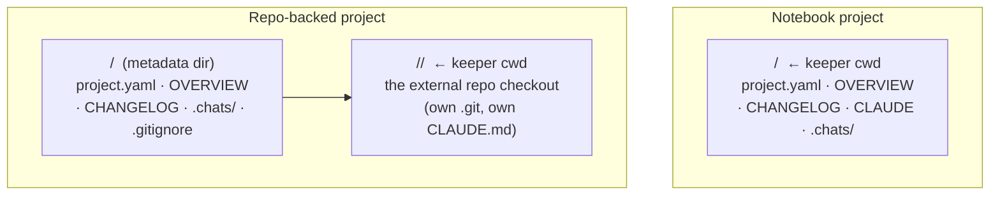

# Projects

A **project** is the top-level unit of organization in Paddock. Concretely, it is
**a directory plus a `project.yaml`** — a slug-named directory under the data root
(`PADDOCK_PROJECTS_DIR`) that holds the project's metadata, curated notes, and its
chat transcripts. One project → one long-lived Claude Code agent (its
[keeper](./keeper-and-scratch.md)) whose working directory is tied to that project.

## What's in a project directory

```
<projectsRoot>/<slug>/
├── project.yaml     # metadata (the on-disk ProjectYaml)
├── OVERVIEW.md      # current synthesized state — sweeper-curated, replaced wholesale
├── CHANGELOG.md     # append-only dated history — sweeper + hand-edited
├── CLAUDE.md        # durable project identity / working conventions (notebook only)
├── .chats/          # the chat transcripts (JSONL), symlinked from ~/.claude
└── <authored files> # notes.md, spec.html, diagrams… (you write these)
```

`project.yaml` is the source of truth for metadata. On disk it carries only what's
set — required fields (`name`, `slug`, `status`, `visibility`, `started`,
`updated`, `summary`) plus optional ones (`group`, `links`, `pinned`, `model`,
`permissionMode`, `maxTurns`, `docker`, `driveMode`, `repo`). The server reads it
into a `ProjectYaml`, then resolves a fully-concrete `Project` DTO for the API —
filling defaults (e.g. `model ?? KEEPER_DEFAULT_MODEL`) and deriving fields like
`dir`, `workingDir`, `repoBacked`, and `hasOverview`. `stripDto()` is the inverse,
so round-tripping never rewrites fields that weren't set.

`OVERVIEW.md` and `CHANGELOG.md` are maintained by the [sweeper](./sweeper.md).
`CLAUDE.md` holds what the project *durably is* and how you work on it — seeded
terse and amended conservatively. (See `projects.ts` for `ProjectStore`.)

## The two project types

A project is one of two types, distinguished by a single field: the optional
`repo` (an external git repo URL) in `project.yaml` (`repoBacked =
Boolean(yaml.repo)`). The type is set at creation and **immutable** thereafter.

### Notebook (the classic type)

No `repo` field. The project directory itself is the keeper's working directory
— the keeper's cwd **is** `dir`. A notebook project is pure Paddock-managed
content: notes, docs, plans, and its chats, all living in the data repo. This is
the right type for research, planning, ops notes, or any work that isn't itself a
code repository.

```
workingDir === dir           # keeper runs directly in the project dir
```

### Repo-backed (an external git repo as the keeper's cwd)

`repo` is set to an external git URL (https, ssh, `git@host:owner/repo`, git://,
or a local path). At creation Paddock **clones that repo into a nested checkout**
inside the project directory, and the keeper's working directory becomes that
checkout — so the repo's own `CLAUDE.md`, git history, branches, and PR workflow
all work natively. This is the right type when the project *is* a codebase you
want the keeper to build, branch, and open PRs against.

```
dir         = <projectsRoot>/<slug>            # metadata dir (Paddock-owned)
workingDir  = <dir>/<repo-name>                # nested checkout (keeper's cwd)
```

The checkout name is derived deterministically from the repo URL's basename
(`repoCheckoutName()`), which is why `repo` is immutable. The project's Paddock
metadata — `project.yaml`, `OVERVIEW.md`, `CHANGELOG.md`, and `.chats/` — always
lives in the **metadata dir** (`dir`), never inside the checkout. A sidecar
`.gitignore` written into `dir` keeps the nested checkout and the transcripts out
of the enclosing data repo (a deliberate "git-in-git" arrangement). Because the
checkout's `CLAUDE.md` is upstream-owned, the sweeper never amends it for a
repo-backed project.



## Why the split

Keeping metadata in `dir` and the working tree in `workingDir` is what lets a
project be **self-contained and portable**: the whole project directory (notes +
chats + attribution) can be backed up or moved as a unit, while a repo-backed
project still gives the keeper a first-class checkout to do real engineering in.
See [`../DESIGN-backing-store.md`](../DESIGN-backing-store.md) for the durability
model and [`../ARCHITECTURE.md`](../ARCHITECTURE.md) for how `dir`/`workingDir`
flow through the system.
