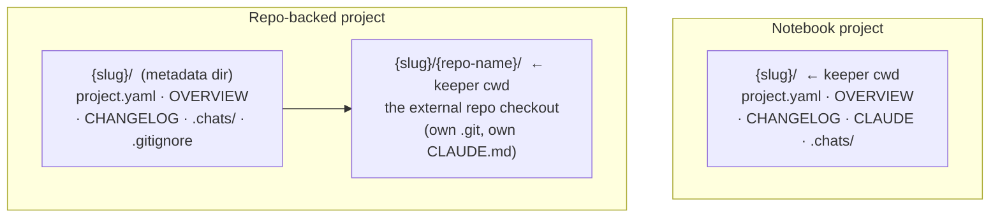

# Projects

A **project** is the top-level unit of organization in Paddock. Concretely, it is
**a directory plus a `project.yaml`** — a slug-named directory under the data root
(`PADDOCK_PROJECTS_DIR`) that holds the project's metadata, curated notes, and its
chat transcripts. One project → one long-lived Claude Code agent (its
[keeper](./keepers.md)) whose working directory is tied to that project.

## What's in a project directory

```
<projectsRoot>/<slug>/
├── project.yaml     # metadata (the on-disk ProjectYaml)
├── OVERVIEW.md      # current synthesized state — sweeper-curated, replaced wholesale
├── CHANGELOG.md     # append-only dated history — sweeper + hand-edited
├── CLAUDE.md        # durable project identity / working conventions (notebook only)
├── .chats/          # the chat transcripts (JSONL), symlinked from ~/.claude
└── <authored files> # notes.md, spec.html, diagrams… (you write these)
```

`project.yaml` is the source of truth for metadata. On disk it carries only what's
set — required fields (`name`, `slug`, `status`, `visibility`, `started`,
`updated`, `summary`) plus optional ones (`group`, `links`, `pinned`, `model`,
`permissionMode`, `maxTurns`, `docker`, `driveMode`, `repo`). The server reads it
into a `ProjectYaml`, then resolves a fully-concrete `Project` DTO for the API —
filling defaults (e.g. `model ?? KEEPER_DEFAULT_MODEL`) and deriving fields like
`dir`, `workingDir`, `repoBacked`, and `hasOverview`. `stripDto()` is the inverse,
so round-tripping never rewrites fields that weren't set.

`OVERVIEW.md` and `CHANGELOG.md` are maintained by the [sweeper](./sweeper.md).
`CLAUDE.md` holds what the project *durably is* and how you work on it — seeded
terse and amended conservatively. (See `projects.ts` for `ProjectStore`.)

## The two project types

A project is one of two types, distinguished by a single field: the optional
`repo` (an external git repo URL) in `project.yaml` (`repoBacked =
Boolean(yaml.repo)`). The type is set at creation and **immutable** thereafter.

### Notebook (the classic type)

No `repo` field. The project directory itself is the keeper's working directory
— the keeper's cwd **is** `dir`. A notebook project is pure Paddock-managed
content: notes, docs, plans, and its chats, all living in the data repo. This is
the right type for research, planning, ops notes, or any work that isn't itself a
code repository.

```
workingDir === dir           # keeper runs directly in the project dir
```

### Repo-backed (an external git repo as the keeper's cwd)

`repo` is set to an external git URL (https, ssh, `git@host:owner/repo`, git://,
or a local path). At creation Paddock **clones that repo into a nested checkout**
inside the project directory, and the keeper's working directory becomes that
checkout — so the repo's own `CLAUDE.md`, git history, branches, and PR workflow
all work natively. This is the right type when the project *is* a codebase you
want the keeper to build, branch, and open PRs against.

```
dir         = <projectsRoot>/<slug>            # metadata dir (Paddock-owned)
workingDir  = <dir>/<repo-name>                # nested checkout (keeper's cwd)
```

The checkout name is derived deterministically from the repo URL's basename
(`repoCheckoutName()`), which is why `repo` is immutable. The project's Paddock
metadata — `project.yaml`, `OVERVIEW.md`, `CHANGELOG.md`, and `.chats/` — always
lives in the **metadata dir** (`dir`), never inside the checkout. A sidecar
`.gitignore` written into `dir` keeps the nested checkout and the transcripts out
of the enclosing data repo (a deliberate "git-in-git" arrangement). Because the
checkout's `CLAUDE.md` is upstream-owned, the sweeper never amends it for a
repo-backed project.


```mermaid
flowchart TB
  subgraph Notebook["Notebook project"]
    N["{slug}/  ← keeper cwd\n project.yaml · OVERVIEW · CHANGELOG · CLAUDE · .chats/"]
  end
  subgraph Repo["Repo-backed project"]
    D["{slug}/  (metadata dir)\n project.yaml · OVERVIEW · CHANGELOG · .chats/ · .gitignore"]
    Ck["{slug}/{repo-name}/  ← keeper cwd\n the external repo checkout (own .git, own CLAUDE.md)"]
    D --> Ck
  end
```

## Why the split

Keeping metadata in `dir` and the working tree in `workingDir` is what lets a
project be **self-contained and portable**: the whole project directory (notes +
chats + attribution) can be backed up or moved as a unit, while a repo-backed
project still gives the keeper a first-class checkout to do real engineering in.
See [`../DESIGN-backing-store.md`](../DESIGN-backing-store.md) for the durability
model and [`../ARCHITECTURE.md`](../ARCHITECTURE.md) for how `dir`/`workingDir`
flow through the system.

## The root workspace

A **workspace** is a directory with a keeper agent, chats, files, changes,
history, settings, triggers and pinned files. The instance's own directory —
`projectsRoot` — is the **root workspace**, and a *project* is a workspace nested
inside it. So "project" keeps its ordinary meaning (a directory you created under
the root); the root is not a project, it is the workspace that *contains* the
projects.

```
<projectsRoot>/          # ← the ROOT workspace (key "")
├── CLAUDE.md            # reaches every keeper (the SDK's cwd walk-up)
├── .chats/              # root-level chats (gitignored, like every workspace's)
├── project.yaml         # optional — written only when a setting changes
├── some-project/        # a child workspace (key "some-project")
└── other-project/       # a child workspace
```

A workspace is identified by its **path relative to `projectsRoot`**, so the root
workspace's key is the empty string. That is not a reserved name — it is the zero
value already in the key space — and it is what keeps resolution branch-free:
`path.join(root, "")` *is* the root. `list()` walks subdirectories, so it
enumerates the root's children and never the root itself.

**The root workspace always exists**, because its directory always does. There is
nothing to create and nothing to enable: on a brand-new instance, `/` is already
root Home and New chat already works. `project.yaml` is optional — absent, every
field falls back to a default (the name is the directory's basename) and the file
is written lazily on the first setting you change.

Its URLs are flat and top-level rather than namespaced under `/projects/:slug`:
`/` is root Home, `/chat[/:sessionId]` its chats, and the projects grid is its
**children tab** at `/projects`. `/` always renders Home — unlike a project,
there is no redirect to a sticky last tab, so the front door is predictable.

Over HTTP the workspace-scoped routes are mounted twice — `/api/root` for the
root and `/api/projects/:slug` for a project — from one set of handlers, because
an empty key cannot ride in a URL path segment. Root and project therefore run
literally the same code, rather than two implementations kept in step by hand.

The one place the empty key cannot be used directly is the **herdctl agent
namespace**, which requires non-empty names satisfying two different patterns.
There the key is encoded as `_root` (so the root keeper is `keeper-_root`), which
no project can collide with because `SLUG_RE` rejects underscores. That encoding
is a name, applied at one boundary — not an identity.

> **The root keeper is an omniscient admin, by design.** Its working directory
> *contains* every project, so root chats can read and edit any project's files
> and the root's git status is the whole repo. That is the point — the root is
> where you act across the instance — but it is a meaningful escalation over a
> project keeper, which is confined to its own subtree. Two things follow from
> it: `remove()` refuses the root (its directory is the entire store), and
> `promote()` refuses it (that directory is already the instance's backing repo).
