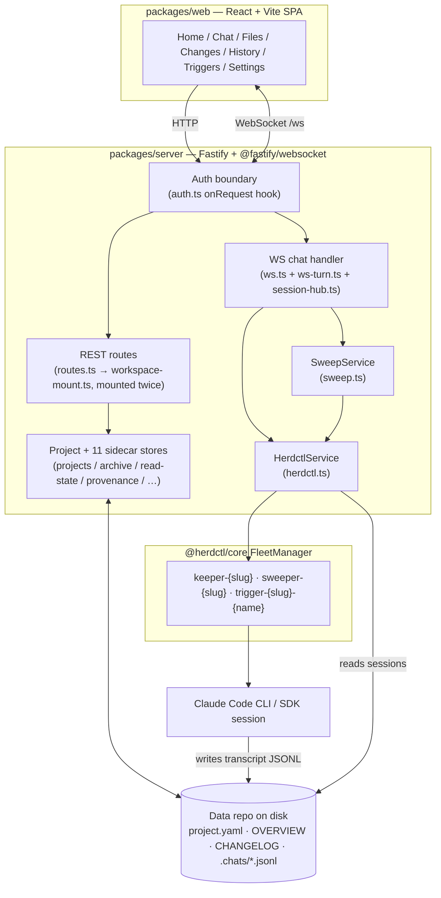
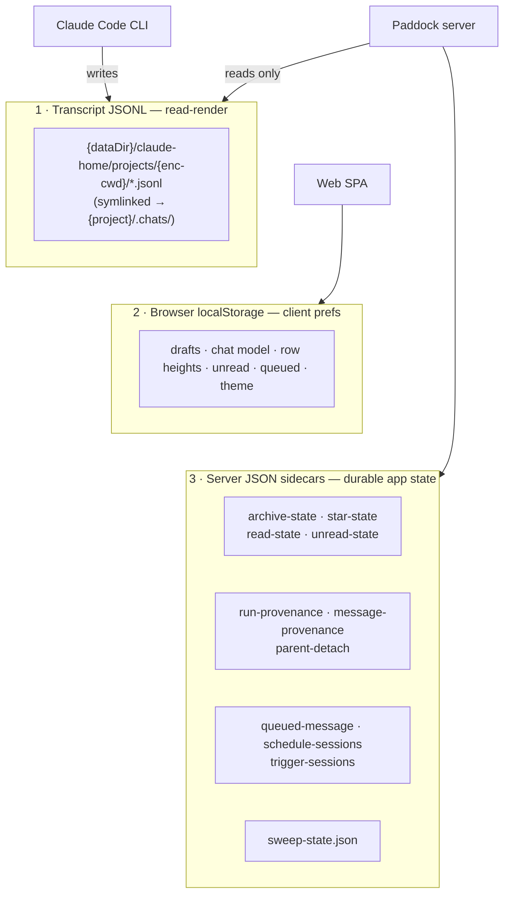
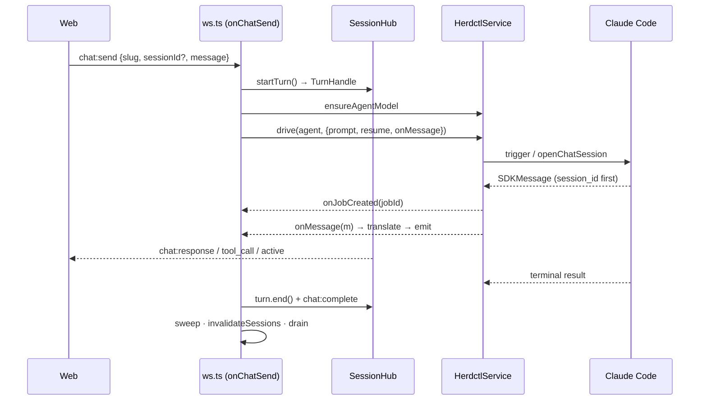

> Canonical architecture overview for Paddock — the project layer over
> [`@herdctl/core`](https://github.com/edspencer/herdctl) that turns Claude Code
> into hosted, per-project, resumable chat. This document is the "how it fits
> together" map; the exact public `@herdctl/core` API contract Paddock depends on
> lives in [`INTEGRATION.md`](/architecture/herdctl-integration), and the feature-level wire
> contracts in [`CONTRACT-v2.md`](https://github.com/edspencer/paddock/blob/main/docs/archive/CONTRACT-v2.md) / [`CONTRACT-v3.md`](https://github.com/edspencer/paddock/blob/main/docs/archive/CONTRACT-v3.md).
> For the conceptual model (what a project, agent, chat, or sweeper *is*), see
> [`concepts/`](/concepts/).

Everything here is grounded in the code under `packages/server/src`. Citations name a
**file and a symbol** (`buildApp()` in `app.ts`) and deliberately carry **no line
numbers** — a symbol survives the refactor that moves it, a line number does not, and
a stale line number is worse than none. `grep -n` the symbol.

---

## 1. The big picture

Paddock is a thin, opinionated layer on top of the public `@herdctl/core`
`FleetManager`. herdctl runs the actual Claude Code agents — chats as managed
**Claude Agent SDK** sessions, the sweeper and triggers as one-shot `claude -p`
CLI subprocesses (see [§9](#9-drive-mode--session-vs-batch)) — and owns
session discovery; Paddock wires **projects**, **chats**, a **WebSocket streaming
transport**, **in-process MCP tools**, an **auth boundary**, and a **git backing
store** on top.



The through-line: **a browser turn arrives over `/ws`, `ws.ts` drives it through
`HerdctlService` into a herdctl agent (a Claude Code process), SDK messages stream
back out as WS frames via `session-hub.ts`, and a post-turn sweep curates the
project's `OVERVIEW.md`/`CHANGELOG.md`.**

---

## 2. Monorepo shape

Two packages, versioned and released together (see [`RELEASING.md`](https://github.com/edspencer/paddock/blob/main/RELEASING.md)):

| Package | Stack | Role |
|---|---|---|
| `packages/server` | **Fastify 4** + **`@fastify/websocket`** (the `ws` library), `@fastify/static`, `@fastify/multipart` | The backend: wraps the `FleetManager`, the Project layer, the WS transport, and serves the built SPA in production. |
| `packages/web` | **React + Vite + Tailwind** | A workspace-first SPA — seven tabs (Home / Chat / Files / Changes / History / Triggers / Settings, `ProjectView.tsx`) plus an instance-wide `/config` admin screen (`main.tsx`). PWA with a versioned service worker. |

Both are `private` and `fixed` together in `.changeset/config.json`, so they
always share one number — "the Paddock version." Paddock is shipped as a Docker
image + release tarball, **not** published to npm.

### Server bootstrap

`index.ts` owns only the process lifecycle: `buildApp()` → register
`SIGINT`/`SIGTERM` handlers → `app.listen({ port, host })`. All wiring lives in
`app.ts`'s `buildApp()`, which never binds a port or installs signal handlers — a
deliberate testability seam.

`buildApp()` constructs and dependency-injects the whole graph, in order:

1. `cfg = opts.config ?? loadPaddockConfig()`.
2. `Fastify({ logger })`.
3. **The bind-safety guard** (`evaluateBindSafety`, issue #435): a non-loopback
   `cfg.host` combined with `auth.mode === "none"` **refuses to boot**, because that
   would expose an unauthenticated Paddock — which runs code and spends tokens — on a
   routable interface. `PADDOCK_DANGEROUSLY_ALLOW_OPEN` downgrades the refusal to a
   boot warning.
4. **`registerAuth(app, cfg.auth)` next** so its `onRequest` hook guards every REST +
   WS request.
5. Stores + services: `ProjectStore`, `HerdctlService`, `GitService`, `GithubAuth`,
   the eleven sidecar stores ([§3](#3-data-model--the-three-storage-classes)),
   `AttachmentStore`, `PaddockEventBus`, `TriggerService`, the transcriber.
6. Fleet init: the root workspace is resolved explicitly and appended to
   `projects.list()` — `list()` enumerates the root's *children*, so the root is never
   in it — then `await herdctl.init(...)` and `herdctl.start()`, wrapped in try/catch
   so a fleet failure still leaves project CRUD working.
7. `new SweepService({ herdctl, projects, dataDir, minIntervalMs, budget, logger })`.
8. Transports: `app.register(websocket)` and `app.register(fastifyMultipart)`.
9. **OpenAPI**, when `cfg.openapi.enabled` — `@fastify/swagger` **must** register
   *before* the routes, because it hooks `onRoute` to collect each route's schema into
   the live document ([§12](#12-openapi-reference)).
10. `makeChatHandler(deps)`, then `registerRoutes(app, deps)` (REST), then the
    `GET /ws` mount with `{ websocket: true }`.
11. In production, serve the built SPA from `cfg.webDist` with branding injected
    into `index.html` and a SPA-aware not-found handler that serves the shell for
    navigations but 404s missing hashed assets (issue #220).

Configuration resolves once, at startup, into a frozen `PaddockConfig` via
`loadPaddockConfig()` (`config.ts`) — from a **YAML instance file** layered
under the `PADDOCK_*` environment (`loadConfigFile()`, same file, reading
`PADDOCK_CONFIG` or `<dataDir>/paddock.config.yaml`). Env wins over file. See
[§8](#8-configuration) for the catalog.

---

## 3. Data model — the three storage classes

Paddock deliberately keeps three *separate* classes of state, each authoritative
for a different kind of data. This is the single most important thing to
internalize about the backend.



### Class 1 — Transcript JSONL (read-render; owned by Claude Code)

The chat transcript is a JSONL file **written by the Claude Code CLI**, never by
Paddock — Paddock only reads and renders it. Claude Code stores transcripts under
`<claudeHome>/projects/<encoded-cwd>/<sessionId>.jsonl`, where `<encoded-cwd>` is the
agent's absolute working directory with every non-`[A-Za-z0-9]` char replaced by
`-` (`encodeProjectDir()` in `transcripts.ts`). Paddock always points Claude Code
at a Claude home **it owns** — `<dataDir>/claude-home` (`resolveClaudeHome()` in
`config.ts`), and it refuses to start if that resolves to the user's `~/.claude` —
so in practice the path is `<dataDir>/claude-home/projects/<encoded-cwd>/`.
**The working directory *is* the session key** — no manual tagging.

Paddock then replaces that encoded directory with a **symlink**, via
`ensureProjectChats()` (`transcripts.ts`). What it points at is chosen by the
`claude.transcripts` config key ([reference](/configuration/config-file/#transcripts)):

- `own` (the default) — the symlink targets `<projectDir>/.chats/`, so transcripts
  are portable: a project directory is self-contained and can be backed up or moved.
- `host` — the symlink targets the user's real `~/.claude/projects/<encoded-cwd>/`,
  so chats are shared with the machine's own terminal `claude` history. In that mode
  Paddock additionally points the project's `.chats/` at the user's folder, so the
  by-path readers below keep working unchanged.

The routine is idempotent and self-healing: it creates `.chats/`, then repoints a
drifted symlink, migrates a pre-existing real transcript directory (EXDEV-safe
`cp`+`rm` across mounts), or just creates the symlink — and never throws. For a
repo-backed project the transcripts land in the **metadata dir**, not the external
checkout (the `chatsHostDir` split, issue #187).

Paddock reads transcripts two ways:

- **Rendering** — the full role/tool-call render is produced by
  `HerdctlService.sessionMessages()` (herdctl's `SessionDiscoveryService`),
  enriched with `toolUseResult` sidecar metadata for per-tool renderers (Edit line
  numbers, Bash exit codes, Grep/Read counts — see the `tooldetails.ts` recovery
  pass).
- **Preview** — `readFirstUserText()` (`transcripts.ts`) streams the JSONL
  line-by-line and stops at the first user message, returning the *untruncated*
  first prompt (Claude Code's own preview is capped at 100 chars — issue #62).

The transcript is the authoritative record of what was said; everything else is
derived or presentational.

### Class 2 — Browser localStorage (client-only prefs)

Purely client-side UI state lives in the browser under a `paddock:` key
namespace (`packages/web/src/lib`). None of it is authoritative server state —
losing it costs a draft or a scroll position, nothing more:

| Key pattern | Holds |
|---|---|
| `paddock:draft:<sessionId \| "new:"+slug>` | Composer draft text |
| `paddock:chatModel:<sessionId \| "new:"+slug>` | Per-chat model selection |
| `paddock:queued:*` / `paddock:queuedts:*` | Optimistic queued-message mirror |
| `paddock:itemHeight`, `paddock:panewidth` | Virtualized row heights, sidebar width |
| `paddock:lastTab:*`, `paddock:theme`, `paddock:fork:*`, `paddock:chatView`, `paddock:chatsCollapsed` | Open tab, theme, fork lineage, nested/flat chat list, collapsed subtrees |
| `paddock:lastSeen:*` | **Legacy only** — see the caution below |

Queued messages have since been promoted to a **server sidecar** (Class 3) so they
follow a user across devices; the localStorage entries act as an optimistic mirror.

:::caution[Read-state is *not* mirrored in localStorage any more]
`paddock:lastSeen:*` was a **persistent** mirror combined with
`readLastSeen = max(server, local)`. That made devices diverge permanently: a local
value the server never received marked a chat read on that device only and never
synced upward, so two devices on one account reported different unread counts
indefinitely. #488 separated *persistence* from *optimism* — the optimistic instant
clear now lives in the **same in-memory map** the server payload folds into
(`lib/lastSeen.ts`), so every reload re-derives from server truth and divergence is
structurally impossible rather than merely repaired. A failed `POST …/seen` rolls the
bump back (`revertSeenLocally`) instead of silently sticking. The one-time backfill
that pushed surviving pre-#488 values up to the server has drained and been deleted
(#552), so **nothing in the client reads or writes these keys any more** — any left
in an old browser profile are inert.
:::

### Class 3 — Server JSON sidecars (durable app state)

State that Paddock owns but that isn't part of the transcript lives in small,
write-through JSON sidecar files in `cfg.dataDir`. There are **eleven** — ten sharing
one pattern, plus the sweep watermark. All ten are constructed in `buildApp()` and
handed to the route + WS layers in the dep bag, so this is the complete set:

| Store | File | Persists | Keying / authority |
|---|---|---|---|
| `ArchiveStore` (`archive.ts`) | `archive-state.json` | Per-chat archived flag (issue #95) | `keyOf(agent, sessionId)` NUL-separated; stored as a JSON **array** of archived keys only. Sole source of truth for the flag. |
| `StarStore` (`star.ts`) | `star-state.json` | Per-chat starred/pinned flag (#373) | `keyOf(agent, sessionId)`. Orthogonal to archive — starred chats float to the top of *both* the active and Archived lists. |
| `ReadStateStore` (`read-state.ts`) | `read-state.json` (mode `0o600`) | Per-chat last-seen timestamp (issues #160/#161/#189) | `keyOf(username, agent, sessionId)`: real identity → user-scoped; anonymous/`none` mode → a **shared bucket** (`agent\0sessionId`). Stored as a JSON **object**. `setLastSeen` is monotonic (only advances). |
| `UnreadStore` (`unread.ts`) | `unread-state.json` | Per-user manual "unread" override (#458) | Layered *on top of* read-state so a chat can be re-flagged unread after its last turn was already seen. Cleared whenever the chat is marked seen. |
| `ParentDetachStore` (`parent-detach.ts`) | `parent-detach.json` | Explicit "detached from its parent" flag (#508) | Checked **ahead of both** parent-resolution tiers. Detach cannot be expressed by clearing an edge — most live edges are *inferred* and would just be re-derived on the next load. See [Provenance](/concepts/provenance/). |
| `RunProvenanceStore` (`run-provenance.ts`) | `run-provenance.json` | Per-chat creation provenance (#261) — origin, spawn depth, and the recorded parent edge (#485) | Keyed by `sessionId` alone. Feeds the depth gate ([§5](#5-mcp-injection)) and the nested chat list. |
| `MessageProvenanceStore` (`message-provenance.ts`) | `message-provenance.json` | Per-**message** provenance (#290) — *who* injected each machine-added turn | The per-message analog of `runProvenance`; also the backfill source for an inferred parent edge. |
| `QueuedMessageStore` (`queued-message.ts`) | `queued-message.json` | Per-chat queued follow-up message (issues #91/#197/#245) | `keyOf(agent, sessionId)`. `take()` is an **atomic read-and-delete** (no `await` between get and delete) so two concurrent drains can't double-send. Server-authoritative. |
| `ScheduleSessionStore` (`schedule-session.ts`) | `schedule-sessions.json` | The one chat an accreting schedule resumes into (#265) | Maps a `resume_session: true` schedule to its owned chat across fires. |
| `TriggerSessionStore` (`trigger-session.ts`) | `trigger-sessions.json` | The owned chat of a `run.session: "resume"` trigger (Epic T / T1) | Rebinds that trigger's chat after a restart. |
| `SweepService` watermark (`sweep.ts`, `STATE_FILE`) | `sweep-state.json` | Per-project last-swept session mtime + timestamp | Keyed by slug; drives the activity gate ([§6](#6-the-sweeper)). |

**Shared sidecar pattern.** Each is a lightweight, corruption-tolerant JSON
sidecar: lazy single-load into an in-memory `Map`/`Set` via `ensureLoaded()`
(empty on missing/corrupt file), **write-through on every mutation serialized
through a `private writing: Promise<void>` chain** so overlapping writes never
interleave, and non-throwing reads that degrade to a default. New durable app
state should follow this same shape.

:::caution[A workspace key can be the empty string]
Several of these are keyed by, or carry, a **workspace key** — and the root
workspace's key is `""` ([Workspaces](/concepts/workspaces/)). So `if (!slug)` is a
**bug** wherever a workspace key is being tested: it silently drops the root. Test
`!== undefined` / `!== null` explicitly. `makeParentResolver` in `chat-dto.ts` carries
a comment marking exactly this trap on the recorded-edge check.
:::

---

## 4. WebSocket / session flow

All live chat runs over a single `GET /ws` endpoint. Four files matter:

| File | Owns |
|---|---|
| `ws.ts` | The socket handler and the browser-driven turn lifecycle (`onChatSend`, `onChatCommand`). |
| `ws-turn.ts` | The **server-initiated** turn engine — `startAgentTurn`, the path every autonomous, spawned, scheduled and trigger-fired turn takes (extracted from `ws.ts` in #424). It is also where a chat's provenance marker, including its recorded `parentSessionId`, is persisted. |
| `ws-triggers.ts` | Trigger dispatch plus the shared `composePreloadedPrompt`. |
| `session-hub.ts` | Fan-out, buffering, re-attach. |

The key design goal (issue #54): **a turn's stream is decoupled from
the single socket that started it**, so it survives socket death and can be
replayed to reconnecting or additional clients.

### Protocol

Client → server (`ClientMessage` union, `ws-protocol.ts`):

| Type | Purpose |
|---|---|
| `chat:send` | Start a turn (`projectSlug`/`target`, `sessionId`, `message`, `preloadContext?`, `model?`). |
| `chat:command` | Run a slash command. |
| `chat:cancel` | Stop a running turn (`jobId`). |
| `chat:subscribe` | Re-attach to a session (`sessionId`, `wantReplay?`, `lastSeq?`). |
| `chat:set_queue` | Set/clear the queued follow-up message. |
| `chat:continue` | Re-drive a hung chat from a killed-task notice (`sessionId`); gated on `recovery.surfaceKilledTask`. |
| `ping` | Keepalive. |

Server → client (`ServerMessage` union, `ws-protocol.ts`):

| Type | Payload highlight |
|---|---|
| `chat:response` | A text delta (the token/chunk frame). |
| `chat:tool_start` / `chat:tool_call` | Tool invocation start / completed result. |
| `chat:message_boundary` | End of one assistant message. |
| `chat:complete` | Turn done — `success`, `error?`, `model?`, `usage?` (context-meter data). |
| `chat:active` | `{ sessionId, jobId, running }` — drives the Stop button / running indicator, broadcast to *all* sockets. |
| `chat:error` | Turn error to the origin socket. |
| `chat:resync` | Buffer aged out — client should re-hydrate from the REST transcript. |
| `chat:queued_flushed` | A queued message was auto-sent. |
| `chat:killed_task` | A background task the chat awaited was killed — broadcast live by the recovery engine so the Continue affordance appears without a refresh. |
| `chat:notice` | The turn dead-ended (usage limit, max-turns, error) — rendered inline so the chat says why it stopped. |
| `pong` | Keepalive reply. |

Every hub-routed frame carries a `Routing` payload (`ws-protocol.ts`): `projectSlug`,
`target` (legacy alias), `sessionId`, `jobId`, and a hub-stamped monotonic `seq`.

### Turn lifecycle (`onChatSend`, `ws.ts`)



Step by step:

1. **Register the turn.** `hub.startTurn(slug, socket, sessionId ?? null)` returns
   a `TurnHandle`. A resumed chat is keyed immediately; a new chat is keyed later
   once the session id arrives.
2. **Translate.** `createSDKMessageHandler` (from `@herdctl/chat`) maps SDK
   messages → `onText`→`chat:response`, `onBoundary`→`chat:message_boundary`,
   `onToolStart`→`chat:tool_start`, `onToolCall`→`chat:tool_call`. Frames are
   emitted through `turn.emit(...)`, never written straight to the socket.
3. **Resolve model + drive mode.** The `model` override wins if
   `isKnownModel`, else `project.model`, else the instance default; the
   agent is re-registered via `ensureAgentModel` because there's no per-trigger
   model API (`ws.ts`). Drive mode is `project.driveMode ?? cfg.driveMode`.
4. **Preload (optional).** For a *new* chat with `preloadContext` and a non-empty
   `OVERVIEW.md`, the overview + changelog tail are wrapped and prepended to the
   prompt (`composePreloadedPrompt()` in `ws-triggers.ts`, CONTRACT-v2 §2).
5. **Drive the turn.** `const drive = driveMode === "session" ? herdctl.chatSession
   : herdctl.chat` (`ws.ts`), called as `drive(agentName, { prompt, resume,
   triggerType: "web", injectedMcpServers, onJobCreated, onMessage })`.
6. **Capture ids mid-stream.** `onJobCreated` records the `jobId`
   (`turn.setJobId`). Inside `onMessage`, when `m.session_id` first appears, for a
   new chat Paddock calls `attributeRunningSession(...)` **once** (so the chat is
   listed *before* the hub broadcasts `chat:active`, fixing the "in-flight chat
   invisible" bug #100), then `turn.setSession(...)`. Per-turn usage/model are
   captured via `extractUsage` for the context meter.
7. **Complete.** Build the `chat:complete` usage payload (context tokens vs. the
   model's limit), emit it through the hub, and `turn.end()`.
8. **Post-turn.** A successful turn `enqueue`s a sweep, calls
   `invalidateSessions(agentName)` (so a brand-new chat surfaces before the 30s
   discovery cache TTL), and drains any queued follow-up message.
9. **Error path.** Always send a plain `chat:error` to the origin socket; if a
   session resolved, also emit a terminal `chat:complete` through the hub so
   re-attached clients aren't left "streaming"; always `turn.end()`.

### SessionHub — fan-out, buffering, re-attach

`SessionHub` (`session-hub.ts`) is transport-agnostic (it depends only on a
minimal `HubSocket` interface). One shared hub is created per WS handler
(`ws.ts`).

- **State:** `bySession: Map<sessionId, Turn>` and `subscribers: Map<sessionId,
  Set<HubSocket>>`, plus an `onActive` callback the WS layer wires to broadcast
  `chat:active` to every connected socket.
- **Per-turn buffer:** each `Turn` keeps a `frames` buffer with `baseSeq`/`nextSeq`.
  `emit()` stamps a monotonic `seq`, appends to the buffer (trimming past
  `MAX_FRAMES` = 4000, advancing `baseSeq`), and writes to all recipients — the
  origin socket plus every subscriber. A dead/closed socket is skipped and send
  errors are swallowed, so one broken client never blocks a live one.
- **Turn end:** `end()` marks `running = false`, fires active state, and schedules
  eviction after `COMPLETED_TTL_MS` (60s) — the buffer lingers so an
  end-of-turn reconnect still catches the tail including `chat:complete`.

**Re-attach / replay** uses buffered-frame replay, not transcript-only recovery:

- A client reconnecting mid-turn sends `chat:subscribe { wantReplay, lastSeq }`.
  `hub.attach()` subscribes the socket and, if there's a live turn and
  `wantReplay`, replays every buffered frame with `seq >= lastSeq + 1`.
- If the needed range has already aged out below `baseSeq`, the hub returns a
  `resync` status and the server sends `chat:resync` — the client re-hydrates from
  the REST transcript instead.
- **Contract:** `wantReplay` MUST be `false` on a fresh mount (which hydrates via
  REST) to avoid duplicating the transcript; `true` only for a genuine mid-turn
  reconnect. A freshly-connected socket is also caught up on all running sessions
  at connect time via `hub.runningSessions()` → `chat:active`.

Server-initiated turns (autonomous `startAgentTurn`, scheduler wakes via
`onSessionWake`, slash commands) go through the exact same hub machinery, so their
output streams to whoever is attached to that session.

---

## 5. MCP injection

Agents receive extra tools via **in-process MCP injection** — no network, no
auth, no static `allowed_tools` change. Paddock builds herdctl
`InjectedMcpServerDef` objects and passes them as `injectedMcpServers` on the
trigger call; herdctl auto-allowlists `mcp__<key>__*` and carries the def to the
agent by whichever route its runtime needs:

- **SDK runtime** (chats, the `session` default) — the def becomes an
  **in-process SDK MCP server** (`createSdkMcpServer`). No bridge, no socket.
- **CLI runtime** (the sweeper, triggers, `driveMode: batch` chats) — the agent
  is a separate `claude -p` process that can't reach an in-process SDK server, so
  herdctl stands up a **localhost HTTP MCP bridge** per injected server.

Either way the tool handlers execute inside the Paddock server process.

Two servers, both wired into `injectedMcpServers` in `ws.ts`'s `onChatSend`:

- **`send_file`** (server key `paddock`, tool `mcp__paddock__send_file`) —
  `sendFileServerDef()` in `send-file-mcp.ts`. Injected on **every** turn. Lets the agent render a file inline in chat: either an inline
  virtual file (content in the envelope) or a real file copied into the
  `AttachmentStore` as an immutable snapshot. The web renders off the tool call
  itself, so it survives live streaming and reload (issue #112/#113).
- **Self-management** (server key `paddock_manage`) — `selfMcpServerDef()` in
  `self-mcp.ts`. **Project-only and env-gated.** Its 14 tools sit
  in four tiers, each behind its own flag on top of the one below it: **read**
  (`PADDOCK_SELF_MCP`), **write** (`PADDOCK_SELF_MCP_WRITE` — the chat-mutating
  tools, including `archive_chat` / `unarchive_chat`), **project**
  (`PADDOCK_SELF_MCP_PROJECTS`, `create_project` only), and **triggers**
  (`PADDOCK_HOOKS_MCP`, with a per-project override). Several of them spawn real
  turns via `startAgentTurn`, so spawned chats appear in the sidebar, stream live,
  and are re-attachable (issue #214). The
  [self-management MCP reference](/reference/self-mcp/) is the authoritative
  per-tool list and [gating matrix](/reference/self-mcp/#the-gating-matrix) — this
  page deliberately doesn't restate it.

A **third** MCP server can reach agents, but *not* by injection: the Playwright
browser MCP (headless Chromium — navigate / click / snapshot / screenshot) is written
into the **static herdctl agent config** by `browserMcpServers()` in
`herdctl-agent-config.ts`, gated on `cfg.browserMcp` (`PADDOCK_BROWSER_MCP`, default
off). It is scoped per *instance*, not per turn, so a box without the browser stack
leaves it off and there are no failed spawns.

The same `mcp_servers` key is how the user's OWN servers arrive under
`claude.mcpServers: host` (#691, `claude-mcp.ts`): paddock reads `~/.claude.json`
once at boot — top-level `mcpServers` plus `projects.<abs-dir>.mcpServers` — and
`buildAgentConfig` merges the ones matching a project's working directory into the
same key. That is deliberately *not* `injectedMcpServers`, whose
`InjectedMcpServerDef` carries in-process JS handlers and cannot express a stdio
command; `mcp_servers` is also the one seam that reaches BOTH runtimes, since the
SDK adapter turns it into `sdkOptions.mcpServers` and the CLI runtime serialises it
into `--mcp-config`. A host server also forces `allowed_tools` to be restated
(`FLEET_ALLOWED_TOOLS` + one `mcp__<name>__*` per server): both runtimes auto-deny
any tool absent from an explicit allowlist, and herdctl auto-adds those patterns for
*injected* servers only — which is why `mcp__playwright__*` is hard-coded into the
fleet defaults.

**Anti-fork-bomb design:** recursion is bounded by a **depth gate**, not by
withholding the toolset from every automated turn. Every server-initiated turn
carries a spawn `depth` (a human turn is the un-gated **depth-0 root**; each chat
spawned by a tool-carrying parent is one hop deeper). `buildInjectedMcpServers()`
in `wake-injection.ts` — the single injection policy shared by the live
`startAgentTurn` path and scheduler-wake rebuilds — hands a spawned/automated turn
the self-MCP iff `depth ≤ maxSpawnDepth`, per `spawnedSelfMcpDecision()` in
`spawn-capability.ts`. The comparison is `≤` because it is evaluated **at the
child**, using the child's own depth.

`maxSpawnDepth` (`PADDOCK_MAX_SPAWN_DEPTH`, or `maxSpawnDepth` in
`paddock.config.yaml`, with a per-project override that wins at dispatch) defaults
to **`1`** and accepts `0`–`8`. So on a stock instance — once the self-MCP flags
are on at all — a depth-1 child **does** receive the toolset, write tools included:
it can `send_message` back to its parent and can itself spawn. Its depth-2
grandchild fails `2 ≤ 1` and gets `send_file` only, so the tree terminates. Setting
`maxSpawnDepth: 0` is what actually forbids *any* spawned child the toolset. The
tier flags still apply on top: writes need `PADDOCK_SELF_MCP_WRITE`, so an operator
who leaves writes off gets read-only children regardless of depth. A human who
later opens a spawned chat gets full tools again through the normal socket path.

---

## 6. The sweeper

After every user chat turn in a workspace, a **post-turn sweep** curates the
project's `OVERVIEW.md` and `CHANGELOG.md`. `SweepService` (`sweep.ts`) is the
engine; the agent that does the writing is a dedicated **tool-less** per-project
`sweeper-<slug>` agent.

- **Trigger + debounce.** `ws.ts` calls `enqueue(slug)` after a successful
  turn (fire-and-forget, never throws). At most one sweep per project
  per `minIntervalMs` (default **5 min**, env `PADDOCK_SWEEP_MIN_INTERVAL_MS`);
  overlapping turns fold into a single trailing timer, and an in-flight sweep for
  the same slug re-enqueues rather than running concurrently.
- **Activity gate (mtime watermark).** `runIfActivity()` reads the project's
  recent sessions, takes the newest session mtime, and **skips** if it hasn't
  advanced past the persisted `sweep-state.json` watermark for that slug (no new
  activity → no sweep). On success the watermark advances; on failure only the
  timestamp advances (not the mtime), so the next sweep retries the same activity.
- **Digest.** `buildDigest()` summarizes the last ~40 messages of the 6 newest
  sessions (`MAX_DIGEST_SESSIONS`; tool calls compacted, text
  trimmed) and `curationPrompt()` bundles
  that with the current `OVERVIEW.md`, `CHANGELOG.md` tail, and `CLAUDE.md`.
- **Tool-less contract.** The sweeper is configured with `allowed_tools: []` and
  instructed to use **no tools** and emit exactly three marked sections as plain
  text:

  ```
  <<<OVERVIEW>>>   …full markdown, replaces OVERVIEW.md wholesale…
  <<<CHANGELOG>>>  …the full curated CHANGELOG.md, or literal NOCHANGE…
  <<<CLAUDE>>>     …the full curated managed section, or literal NOCHANGE…
  <<<END>>>
  ```

  `SweepService` parses the markers (`parseSweeperOutput`) and
  writes the files itself: `writeOverview` and `writeChangelog` (both
  **wholesale replace** — the sweeper returns each file in full, so it can
  coalesce and prune as well as add) and `writeClaudeCurated`, which replaces
  only the managed section and is **skipped for repo-backed projects** whose
  `CLAUDE.md` is upstream-owned. If the markers are missing or unparseable it
  throws — the watermark doesn't advance and no partial content is written. All
  sweep failures are non-fatal to the chat.

  :::caution[This is a full-file curator, not an appender]
  It used to be one: pre-v0.41 the contract was `appendChangelog` (one bare
  bullet, the service adding `- ` and a `## YYYY-MM-DD` heading) and an
  amend-only `appendClaudeMd`. Neither function exists any more. The distinction
  matters because a prompt still written against the *append* contract will
  emit one bullet, and the replace-semantics writer will take that as the
  entire new file — see [#480](https://github.com/edspencer/paddock/issues/480).
  :::

Why tool-less: the sweeper returns text-only so it can never touch the working
tree, can never enqueue another sweep, and runs cheaply on a small model
(`SWEEPER_DEFAULT_MODEL`, Haiku by default). It runs **out of band** — Paddock
writes the files, not the agent.

---

## 7. Auth boundary

Paddock has **no native login**. It sits behind a reverse proxy / OIDC IdP and
turns the upstream identity into `req.user` at the request edge, without
hardcoding a provider (`auth.ts`). `registerAuth(app, cfg.auth)` is registered
**before routes** and installs an `onRequest` hook that guards every REST + WS
request, populating `req.user: AuthUser { username, email?, groups?, anonymous? }`
or replying 401.

Three providers, selected by `PADDOCK_AUTH_MODE`:

- **`none`** (default) — fully open; every request gets a frozen `ANONYMOUS`
  user. Read-state then falls back to the shared bucket ([§3](#3-data-model--the-three-storage-classes)).
- **`trusted-header`** — reads identity from proxy-set headers
  (`X-Forwarded-User` by default, plus optional email/groups headers). Trust is
  network-level: only safe if the proxy is the sole path in.
- **`jwt`** — verifies a signed JWT against a remote JWKS (`jose`,
  `createRemoteJWKSet` built once at registration). Fail-closed: missing
  `jwksUrl` throws at startup; a bad token → 401.

**Exemptions** (`isExempt` in `auth.ts`) — three groups, not two:

1. **Health/readiness probes**, so a proxy can probe a locked-down instance.
2. **Immutable static front-end assets** (`/assets/`, `/icons/`, `/fonts/`,
   `/sw.js`, `/manifest.webmanifest`, `/favicon.ico` — issue #223), so the SSO
   login flow and the PWA shell load cleanly.
3. **The Management API** — the `/mcp` prefix and
   `/.well-known/oauth-protected-resource` (`isManagementApiPath` in `auth.ts`). This one is not
   a hole: `/mcp` runs its own per-client token authenticator, independent of
   `PADDOCK_AUTH_MODE`, and 404s until an operator configures it. It is exempt
   *because* the browser modes are actively wrong for it — `jwt` mode would
   consume the client's own `Authorization: Bearer`. See
   [Management API (MCP)](/reference/mcp/).

Every other `/api` and `/ws` route stays authenticated. The identity is exposed
to the SPA via `GET /api/me` (`routes/meta.ts`).

---

## 8. Configuration

Two layers, resolved in `config.ts`: a **YAML instance file**
(`PADDOCK_CONFIG`, else `<dataDir>/paddock.config.yaml`) with the environment
layered on top — env wins per key. An explicitly-set `PADDOCK_CONFIG` that
doesn't exist is a hard startup error; an absent default file is fine. The file
is also what the Config screen edits (`instance-config.ts`), and it is the
*only* home for the `managementApi` block, which has no env equivalent. See
[Config file (YAML)](/configuration/config-file/).

The main knobs:

| Area | Vars (default) |
|---|---|
| **Server** | `PORT` (4000), `HOST` (or `PADDOCK_HOST`; **127.0.0.1** since v0.44 — see [Binding & exposure](/configuration/binding-and-exposure/)), `LOG_LEVEL` (info), `PADDOCK_DANGEROUSLY_ALLOW_OPEN` (false — downgrades the bind-safety refusal to a warning) |
| **Paths** | `PADDOCK_DATA_DIR` (./data), `PADDOCK_PROJECTS_DIR`, `PADDOCK_STATE_DIR` (`.herdctl`), `PADDOCK_HERDCTL_CONFIG`, `PADDOCK_WEB_DIST`, `CLAUDE_CONFIG_DIR` (`<dataDir>/claude-home` — paddock ALWAYS owns its Claude home and refuses to start if this resolves to the user's `~/.claude` (#691); resolved once by `resolveClaudeHome()` in `config.ts` and threaded to BOTH paddock's transcript paths and the engine's `claudeHomePath`), `PADDOCK_CLAUDE_TRANSCRIPTS` (`own`|`host` — whose transcripts), `PADDOCK_CLAUDE_CREDENTIALS` (`own`|`host`, **default `host`** — whose login; sets `CLAUDE_SECURESTORAGE_CONFIG_DIR=""` so Claude Code reads the machine's unsuffixed keychain entry without moving the home, `claude-credentials.ts`), `PADDOCK_CLAUDE_INSTRUCTIONS` (`own`|`host` — whose `CLAUDE.md`/`agents/`/`commands/`/`plugins/`; symlink bridge, `claude-instructions.ts`), `PADDOCK_CLAUDE_HOOKS` (`own`|`host` — whether the host's `settings.json` hooks execute here; `own` cannot be a symlink decision, so paddock writes a filtered `settings.json` and re-derives it each boot, `claude-settings.ts`), `PADDOCK_CLAUDE_MCP_SERVERS` (`own`|`host` — whose MCP servers the keepers get; NOT a bridge, since they are declared in `~/.claude.json` BESIDE the home rather than inside it, so paddock reads that file once at boot and puts the servers on the keeper's `mcp_servers` agent config — the one seam both runtimes read — widening `allowed_tools` by `mcp__<name>__*` or every call would be auto-denied, `claude-mcp.ts`). All five are keys of `claude:` in the config file |
| **Auth** | `PADDOCK_AUTH_MODE` (none), `PADDOCK_AUTH_USER_HEADER` (X-Forwarded-User), `..._EMAIL_HEADER`, `..._GROUPS_HEADER`, `..._JWT_HEADER` (Authorization), `..._JWKS_URL`, `..._JWT_ISSUER`, `..._JWT_AUDIENCE`, `..._USERNAME_CLAIM`, `..._GROUPS_CLAIM` (groups) |
| **Agent** | `PADDOCK_DRIVE_MODE` (session), `PADDOCK_NATIVE_PROMPT` (true) |
| **Self-MCP + spawning** | `PADDOCK_SELF_MCP` (false), `PADDOCK_SELF_MCP_WRITE` (false; implies read), `PADDOCK_SELF_MCP_PROJECTS` (false; `create_project`, rides on write), `PADDOCK_HOOKS_MCP` (false; the trigger tools, per-project override), **`PADDOCK_MAX_SPAWN_DEPTH` (`1`, bounded `0`–`8`)** — see [§5](#5-mcp-injection) |
| **Agent capabilities** | `PADDOCK_BROWSER_MCP` (false — Playwright/headless Chromium, via the static agent config, not injection) |
| **Sweeper** | `PADDOCK_SWEEP_MIN_INTERVAL_MS` (300000) |
| **Curation budgets** | `PADDOCK_CURATION_OVERVIEW_MAX_TOKENS` (2000), `PADDOCK_CURATION_CHANGELOG_MAX_TOKENS` (8000), `PADDOCK_CURATION_CLAUDEMD_MAX_TOKENS` (6000) — `curation.*` in YAML, per-project overridable (`curation-config.ts`) |
| **Chat recovery** | `PADDOCK_RECOVERY_SURFACE` (**true** — `surfaceKilledTask`, the `chat:killed_task` affordance), `PADDOCK_RECOVERY_AUTODRIVE` (false), `PADDOCK_RECOVERY_DEBOUNCE_MS` (5000), `PADDOCK_RECOVERY_MAX_RETRIES` (1), `PADDOCK_RECOVERY_LIMBO_MS` (0 = off) |
| **Attachments** | `PADDOCK_ATTACHMENTS_ENABLED` (true), `PADDOCK_ATTACHMENTS_MAX_FILE_SIZE_MB` (25), `PADDOCK_ATTACHMENTS_MAX_FILES_PER_MESSAGE` (10), `PADDOCK_ATTACHMENTS_ALLOWED_TYPES` (`*` — a hygiene guardrail, **not** a security boundary) |
| **OpenAPI** | `PADDOCK_OPENAPI_ENABLED` (false), `PADDOCK_OPENAPI_PATH` (`/open-api`) — see [§12](#12-openapi-reference) |
| **Management API** | **YAML-only** `managementApi.*` — `clients[]`, `instanceId`, `trustedProxies` — plus the `PADDOCK_MCP_TOKEN_<CLIENT>` credentials and `PADDOCK_MANAGEMENT_TRUSTED_PROXIES`. See [Management API (MCP)](/reference/mcp/). |
| **Whisper** | `PADDOCK_WHISPER_MODE` (off/local/remote), `PADDOCK_WHISPER_ENDPOINT`, `PADDOCK_WHISPER_MODEL` (base), `PADDOCK_WHISPER_API_KEY`, `PADDOCK_WHISPER_LANGUAGE`, `PADDOCK_WHISPER_MAX_UPLOAD_BYTES` (25 MB) |
| **Git + GitHub** | `PADDOCK_GIT_AUTHOR_NAME`, `PADDOCK_GIT_AUTHOR_EMAIL`, `PADDOCK_GITHUB_CLIENT_ID` |
| **Brand** | `PADDOCK_BRAND_NAME` (Paddock), `PADDOCK_BRAND_LOGO` (🐎), `PADDOCK_BRAND_ACCENT` (#c2603c) |

This is the shape of the surface, not the full field-by-field reference —
[Environment variables](/configuration/environment/) and
[Config file (YAML)](/configuration/config-file/) are authoritative, and
`instance-config.ts` carries the machine-readable field list the Config screen renders
from.

Running long-lived dev/preview servers is a capability of the **devbox image**
(which ships the `pm` PM2 wrapper) advertised via an instance-wide `CLAUDE.md` on
the data volume — not a Paddock config flag.

---

## 9. Drive mode — session vs. batch

Each turn runs in one of two modes (`PADDOCK_DRIVE_MODE`, default
`session` since v0.36, overridable per project via `project.driveMode`, resolved at dispatch in
`ws.ts`):

- **`batch`** — `HerdctlService.chat()` wraps `manager.trigger()`, a one-shot job
  that streams via `onMessage` and resolves when the turn ends. Simple and
  stateless between turns. This is the only chat path that goes through
  `RuntimeFactory.create`, and so the only one where the agent's `runtime` field
  is read — Paddock sets `runtime: "cli"`, so a batch turn is a `claude -p`
  subprocess.
- **`session`** — `HerdctlService.chatSession()` drives a persistent
  `openChatSession({ manageLifecycle: true })`, registered in `liveSessions`. The
  session is kept alive by herdctl's reaper across turn boundaries, so
  **background tasks and scheduled wake-ups survive the turn** — the basis for
  cross-turn autonomy. `cancel()` maps to `session.interrupt()` in session
  mode and `manager.cancelJob()` in batch mode.

:::note[The runtime follows the drive mode, not the agent config]
`openChatSession` hard-codes `new SDKRuntime()` and never consults the agent's
`runtime` field, so a `session` turn always runs the **Claude Agent SDK**
streaming runtime. Since `session` is the default, **chats do not run as
`claude -p`** — despite Paddock setting `runtime: "cli"` on every agent. That
field only reaches `RuntimeFactory.create` on the one-shot `trigger()` path, i.e.
the sweeper, triggers/schedules, and `batch` chats. It is not dead config: flip a
project to `driveMode: batch` and its chats do become CLI subprocesses.
:::

See [`concepts/agents.md`](/concepts/agents) for the
agent model and [`INTEGRATION.md`](/architecture/herdctl-integration) for the underlying herdctl
trigger API.

---

## 10. Git backing store

The data root is designed to be a git repo (see
[`DESIGN-backing-store.md`](https://github.com/edspencer/paddock/blob/main/docs/DESIGN-backing-store.md)). Generated/derived files
(`OVERVIEW.md`, `CHANGELOG.md`, `.chats/**`) are meant to be auto-committed for
durability, while **authored** changes surface in a per-project **Changes** view
(git status + diff) with a one-click Commit + Push. `GitService` (`git.ts`) backs
`GET /api/projects/:slug/git/status`, `/git/diff`, and the commit/push endpoints;
`GithubAuth` handles the in-app GitHub device-flow connect. A repo-backed project
adds a *second*, nested git checkout (the external repo) whose `.git` and `.chats/`
are kept out of the data repo by a sidecar `.gitignore` (git-in-git; see the
Projects concept page).

---

## 11. The REST surface — one plugin, mounted twice

`routes.ts` is a 58-line registrar. Three groups are registered once, globally
(`registerMetaRoutes`, `registerGitRoutes`, `registerProjectRoutes`). The rest — the
**workspace-scoped** half of every group — is registered inside a single call to
`mountWorkspaceRoutes()` (`routes/workspace-mount.ts`), and *that* is the load-bearing
detail: the same plugin is mounted **twice**, at two prefixes.

| Prefix | Workspace key |
|---|---|
| `/api/root` | `""` (the root workspace) |
| `/api/projects/:slug` | `params.slug` |

Both mounts run the **identical handlers**, so root/project parity is a property of the
wiring rather than something contributors have to remember. Handler bodies needed no
changes at all: an `onRequest` hook injects `slug: ""` for the root mount, and
`onRequest` is the earliest lifecycle hook — it runs *before* schema validation, so
every handler sees a normal `params.slug` either way.

Why two mounts instead of one route with an optional segment: the root's key is the
**empty string**, and an empty string cannot ride in a URL path segment —
`/api/projects//chats` simply doesn't match. See
[Workspaces](/concepts/workspaces/) for the model this implements.

Routes worth knowing about that postdate the rest of this page, all workspace-scoped
(so each exists under both prefixes), in `routes/chats.ts`:

| Route | Notes |
|---|---|
| `POST …/chats/batch/archive` · `…/batch/unread` · `…/batch/delete` | Subtree bulk actions (#508). Capped at `BATCH_SESSIONS_MAX` (500) and **all-or-nothing** on validation: one malformed session id fails the whole request rather than silently applying to the rest. |
| `POST …/chats/:sessionId/detach` | Writes the `ParentDetachStore` flag. Nothing is destroyed — the recorded edge stays, the override just wins ahead of it. |
| `GET …/chats/usage?scope=active\|archived\|all` | Per-chat context-window usage for the list's usage rings. Defaults to **`active`**: usage is derived by streaming each transcript, and archived rings sit behind a collapsed group, so computing them by default is wasted work (#537). |

## 12. OpenAPI reference

Paddock derives an OpenAPI document from the route schemas themselves and serves it
with a branded Swagger UI — so the REST surface is browsable rather than something you
reconstruct from source. `@fastify/swagger` + `@fastify/swagger-ui`, wired in
`openapi.ts` (`buildSwaggerOptions` / `buildSwaggerUiOptions`).

- **Off by default.** Set `PADDOCK_OPENAPI_ENABLED=1` (or `openapi.enabled` in YAML).
- **Mounts at `cfg.openapi.path`, default `/open-api`** (`PADDOCK_OPENAPI_PATH`),
  normalized to a leading slash with no trailing slash. The UI's own raw spec is at
  `<path>/json`, plus a stable tool-friendly alias at `<path>.json` that is itself
  hidden from the spec.
- **Registration order is a real constraint** — `@fastify/swagger` hooks `onRoute` to
  collect schemas, so it must register *before* `registerRoutes`.
- **No auth exemption.** The docs sit behind whatever `PADDOCK_AUTH_MODE` is
  configured, gated exactly like the API they describe. The security schemes the spec
  advertises reflect this instance's auth mode (`authDoc` in `openapi.ts`).
- `GET /ws` is marked `hide: true` — it isn't a REST endpoint, so a Swagger "Try it
  out" against it would only fail. The frame protocol is documented in
  [§4](#4-websocket--session-flow) instead.

:::caution[A stale comment in `app.ts` says `/docs`]
The comment above the swagger registration block still claims the UI mounts at `/docs`
with the raw spec at `/docs/json`. It does not — it mounts at `cfg.openapi.path`
(default `/open-api`), as the adjacent `app.log.info({ path: cfg.openapi.path })` and
the "set `PADDOCK_OPENAPI_ENABLED=1` to mount `/open-api`" branch both show. Trust the
code, not that comment.
:::

---

## Source map

| Concern | File(s) |
|---|---|
| Bootstrap / DI | `app.ts`, `index.ts` |
| Config | `config.ts`, `models.ts`, `instance-config.ts` |
| Auth boundary | `auth.ts` |
| REST | `routes.ts` (a 58-line registrar) → `routes/workspace-mount.ts` → `routes/{chats,projects,triggers,meta,git,mcp}.ts` |
| WS transport | `ws.ts`, `ws-protocol.ts`, `ws-turn.ts`, `ws-triggers.ts`, `session-hub.ts` |
| Triggers (hooks + schedules) | `triggers.ts`, `trigger-config.ts`, `hook-config.ts` |
| Management API (`/mcp`) | `management-{config,auth,policy,ops,metadata,mcp-server}.ts` |
| Chat recovery | `recovery-config.ts` |
| herdctl wrapper | `herdctl.ts` |
| Project layer | `projects.ts` |
| Sidecar stores | `archive.ts`, `star.ts`, `read-state.ts`, `unread.ts`, `parent-detach.ts`, `run-provenance.ts`, `message-provenance.ts`, `queued-message.ts`, `schedule-session.ts`, `trigger-session.ts`, `attachments.ts` |
| Chat DTO / parent edge | `chat-dto.ts` (`makeParentResolver`, `buildProjectChats`) |
| Transcripts | `transcripts.ts`, `tooldetails.ts`, `usage.ts`, `subagents.ts` |
| Sweeper | `sweep.ts`, `curation-config.ts` |
| MCP injection | `send-file-mcp.ts`, `self-mcp*.ts`, `ws-self-mcp.ts`, `wake-injection.ts`, `spawn-capability.ts` |
| OpenAPI | `openapi.ts` |
| Git backing store | `git.ts`, `github-auth.ts` |

For the conceptual model, continue to [`concepts/`](/concepts/).
