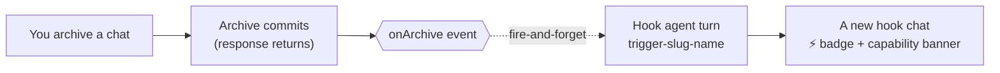
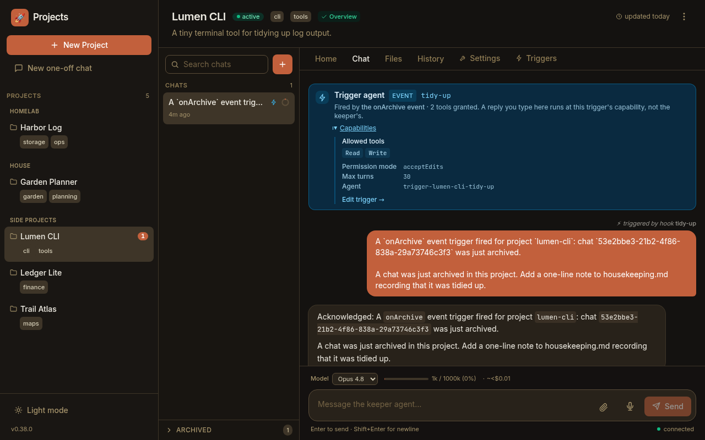

An **event hook** runs one agent turn **when something happens** in Paddock. When
a lifecycle event fires — today that event is `onArchive`, raised when you archive
a chat — Paddock starts an agent turn to react to it. A hook is the
*event-driven* sibling of a **schedule** (which is *time-driven*); in Paddock both
are kinds of **[trigger](/using/automating-with-hooks/)**.

The motivating example is housekeeping: *"when I archive a chat, tidy up after
it"* — spin down a dev server, delete a scratch clone, jot a line in a log. You
declare that once as a hook, and from then on it happens on its own.

## A hook is an agent turn, and its tools are its capability

A hook is **not** a fixed built-in behaviour. It's a small agent turn you
describe, and the tools you grant it **are** its entire capability:

- Grant it **no tools** and it can only read its prompt and think — a hook that
  reasons and returns text.
- Grant it **`Write`** and it can author a file (an `OVERVIEW.md`, a log).
- Grant it **`Bash`** and it can run shell commands — stop a `pm` server, `git`,
  delete a clone — and it does that work itself.

There is no hook "kind", "profile", or "curator" concept to choose from: the
capability *is* the tool list. Under the hood the hook runs as its own agent
(`trigger-<slug>-<name>`) registered exactly like the project's keeper, so the
tools you pick are enforced by the runtime, not merely suggested. A hook's
capability also includes its permission mode, an optional model override, and a
`max_turns` bound (default **30**) so a runaway hook can't loop forever.

:::note[Tool-less by default]
A brand-new event hook is granted **no tools** until you check some in the
capability picker. That's the safe default — a hook can't touch files or run
commands unless you deliberately hand it the tools to.
:::

## It fires *after* the action, and can never break it

The event bus is **in-process** and **fire-and-forget**. A hook fires **after**
the triggering action has already committed, and its turn runs detached — Paddock
never waits on it and never surfaces its errors back onto the action. Archiving a
chat always succeeds and returns immediately, whether or not an `onArchive` hook
is declared, and whether that hook succeeds, fails, or is slow. A hook can
observe and react to an action; it can never block or fail it.

Because the hook fires only *after* a real state change, it won't run on a no-op
(re-archiving an already-archived chat raises nothing).

## New hooks are disabled until you arm them

Every hook has an `enabled` flag, and a newly-created hook defaults to
**disabled** — writing a hook never makes it fire the same instant. You enable it
when you're ready, and disabling it later stops it firing without deleting its
definition (its past runs stay readable).

## A hook run is a chat you can read — and continue

When a hook fires it appears as its own **chat** in the project's sidebar, marked
with a small ⚡ lightning badge so the "ran without me" runs stand out from the
chats you started yourself. Open one and a read-only **capability banner** floats
at the top, stating what fired it (the event), the exact tools it was granted,
its permission mode, model, and `max_turns`, and the agent enforcing them:

The banner is projected from the *same* registered agent config the runtime
enforces, so it can't claim a capability the hook doesn't actually have — it's
truthful by construction. If you type a reply in a hook chat, your turn runs at
**the hook's** capability, not the keeper's full toolset — the banner is there so
that's never a surprise.

## The events a hook can fire on

Today a hook fires on one lifecycle event:

| Event | Fires when | Payload |
| --- | --- | --- |
| `onArchive` | A chat is archived (from the sidebar action or the self-MCP `archive_chat` tool) | The archived chat's session id |

`onArchive` is the first of a family of cheap *after-the-fact* events; the event
list is the extension point for more. (A separate `afterTurn` event exists too,
but it's what powers the [sweeper](/concepts/sweeper/)'s post-turn curation rather
than something you'd normally hook yourself.)

## Where a hook lives

A hook is **configuration**, stored per project so it's versioned with everything
else:

- Its definition — the event, the granted tools, the enabled flag — lives in the
  project's `project.yaml`.
- Its prompt can be inline, or kept in a git-tracked, keeper-editable
  `.md` file under `.paddock/triggers/` and read fresh each time the hook fires.

You rarely edit that by hand — the **[Triggers tab](/using/automating-with-hooks/)**
writes it for you, and the [hook-management MCP tools](/reference/hooks/) let a
keeper agent manage its own hooks.

:::note[Event hooks are managed as *event triggers*]
Event hooks first shipped as a standalone feature and were then folded into
Paddock's single **trigger** model, which unifies event hooks and
time-driven schedules under one management surface. So in today's UI
and API you create an event hook by adding a **trigger** of type **event** — the
concept on this page is exactly that trigger type.
:::

## Next steps

- [Automating with hooks](/using/automating-with-hooks/) — the hands-on
  walkthrough: create an `onArchive` hook, grant it a capability, enable it, and
  read the run it produces.
- [The sweeper](/concepts/sweeper/) — the post-turn curator that rides the
  `afterTurn` event.
- [Hooks reference](/reference/hooks/) — the `project.yaml` schema and the
  hook-management MCP tools.
