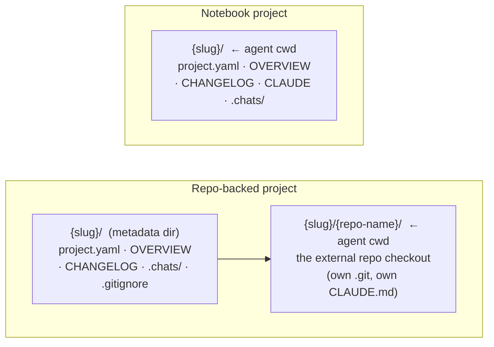

A **project** is a [workspace](/concepts/workspaces) nested inside the root. The
instance's own directory is itself a workspace, and a project is one living beneath it —
so a project is not the top-level unit any more, it is the *nested* case. Concretely it is
**a directory plus a `project.yaml`**: a slug-named directory under the data root
(`PADDOCK_PROJECTS_DIR`) that holds the project's metadata, curated notes, and its
chat transcripts. One project → one long-lived [Claude Code
agent](/concepts/agents) whose working directory is tied to that project.

What distinguishes a project is only that its
[workspace key](/concepts/workspaces#identity-a-workspace-is-its-path) — its path relative
to the projects root — is non-empty; the root's key is the empty string. Chats, files,
changes, history, settings, and triggers all behave identically at either, because they
are served by [literally the same handlers](/concepts/workspaces#one-plugin-two-mounts).
This page covers what is specific to a nested workspace, chiefly the two project *types*.

## What's in a project directory

```
<projectsRoot>/<slug>/
├── project.yaml     # metadata (the on-disk ProjectYaml)
├── OVERVIEW.md      # current synthesized state — sweeper-curated, replaced wholesale
├── CHANGELOG.md     # append-only dated history — sweeper + hand-edited
├── CLAUDE.md        # durable project identity / working conventions (notebook only)
├── .chats/          # the chat transcripts (JSONL), symlinked from
│                    #   <dataDir>/claude-home/projects/<encoded-cwd>
└── <authored files> # notes.md, spec.html, diagrams… (you write these)
```

`project.yaml` is the source of truth for metadata. On disk it carries only what's set.
The eight **required** fields are `name`, `slug`, `status`, `domain` (a `string[]` of
cross-cutting tags, defaulting to `[]`), `visibility`, `started`, `updated`, and `summary`.
The **optional** ones fall into groups:

| Group                 | Fields                                                             |
| --------------------- | ------------------------------------------------------------------ |
| Presentation          | `group` (the project's single "area"), `links`, `pinned`           |
| Agent overrides       | `model`, `models`, `permissionMode`, `maxTurns`, `docker`, `driveMode`, `maxSpawnDepth`, `hooksMcpEnabled` |
| Inherited sub-configs | `recovery`, `attachments`, `curation`                              |
| Backing repo          | `repo`                                                             |
| Automation            | `schedules`, `hooks`, `triggers`                                    |

Every agent override and sub-config follows the same inherit/override discipline: absent
on disk means "inherit the instance default", resolved at dispatch rather than baked
concrete into the file. The three automation blocks are keyed records —
[`triggers`](/concepts/hooks) is the unified successor that collapses the older separate
`schedules` and `hooks` blocks.

The server reads the file
into a `ProjectYaml`, then resolves a fully-concrete `Project` DTO for the API —
filling defaults (e.g. `model ?? DEFAULT_MODEL`) and deriving fields like
`dir`, `workingDir`, `repoBacked`, and `hasOverview`. `stripDto()` is the inverse,
so round-tripping never rewrites fields that weren't set.

`OVERVIEW.md` and `CHANGELOG.md` are maintained by the [sweeper](/concepts/sweeper).
`CLAUDE.md` holds what the project *durably is* and how you work on it — seeded
terse and amended conservatively. (See `projects.ts` for `ProjectStore`.)

### Dot-prefixed paths are refused, not just hidden

The Files API does not merely omit dotfiles from listings — it **refuses to resolve a path
that traverses a dot-prefixed directory segment**. So `.chats/` and `.git/` are unreachable
through `GET …/files` even when named explicitly, including via a normalising detour like
`a/../.git/config`. Directory *listings* are stricter still: the target's own leaf may not
be hidden either, since `?path=.chats` was exactly how every transcript filename used to be
enumerable.

Two deliberate carve-outs are worth knowing:

- Only the path **relative to the project directory** is examined, so a data root that
  itself sits under a dot-prefixed ancestor (`/srv/.paddock/projects`) still works.
- A dotfile **leaf** elsewhere stays readable — that is what lets the Changes pane render
  an untracked `.gitignore`.

Honest severity: this is defence-in-depth, not a privilege boundary. Anyone who can reach
these routes can already start a chat and run Bash, which is strictly more
capability than reading a file. It is worth closing because "hidden in the listing" should
not be the only thing standing between an API and a transcript.

## The two project types

A project is one of two types, distinguished by a single field: the optional
`repo` (an external git repo URL) in `project.yaml` (`repoBacked =
Boolean(yaml.repo)`). The type is set at creation, or later by
[**promoting**](/using/creating-and-organizing-projects/#promote-a-notebook-to-repo-backed)
a notebook to repo-backed in place — a one-way transition. Once `repo` is set it
never changes.

### Notebook (the classic type)

No `repo` field. The project directory itself is the agent's working directory
— the agent's cwd **is** `dir`. A notebook project is pure Paddock-managed
content: notes, docs, plans, and its chats, all living in the data repo. This is
the right type for research, planning, ops notes, or any work that isn't itself a
code repository.

```
workingDir === dir           # Claude runs directly in the project dir
```

### Repo-backed (an external git repo as the agent's cwd)

`repo` is set to an external git URL (https, ssh, `git@host:owner/repo`, git://,
or a local path). At creation Paddock **clones that repo into a nested checkout**
inside the project directory, and the agent's working directory becomes that
checkout — so the repo's own `CLAUDE.md`, git history, branches, and PR workflow
all work natively. This is the right type when the project *is* a codebase you
want Claude to build, branch, and open PRs against.

```
dir         = <projectsRoot>/<slug>            # metadata dir (Paddock-owned)
workingDir  = <dir>/<repo-name>                # nested checkout (agent's cwd)
```

The checkout name is derived deterministically from the repo URL's basename
(`repoCheckoutName()`), which is why `repo` can never be *re-pointed* once set —
the checkout on disk is named after it. The project's Paddock
metadata — `project.yaml`, `OVERVIEW.md`, `CHANGELOG.md`, and `.chats/` — always
lives in the **metadata dir** (`dir`), never inside the checkout. A sidecar
`.gitignore` written into `dir` keeps the nested checkout and the transcripts out
of the enclosing data repo (a deliberate "git-in-git" arrangement). Because the
checkout's `CLAUDE.md` is upstream-owned, the sweeper never amends it for a
repo-backed project.



## Why the split

Keeping metadata in `dir` and the working tree in `workingDir` is what lets a
project be **self-contained and portable**: the whole project directory (notes +
chats + attribution) can be backed up or moved as a unit, while a repo-backed
project still gives Claude a first-class checkout to do real engineering in.
See [`../DESIGN-backing-store.md`](https://github.com/edspencer/paddock/blob/main/docs/DESIGN-backing-store.md) for the durability
model and [`../ARCHITECTURE.md`](/architecture/overview) for how `dir`/`workingDir`
flow through the system.
