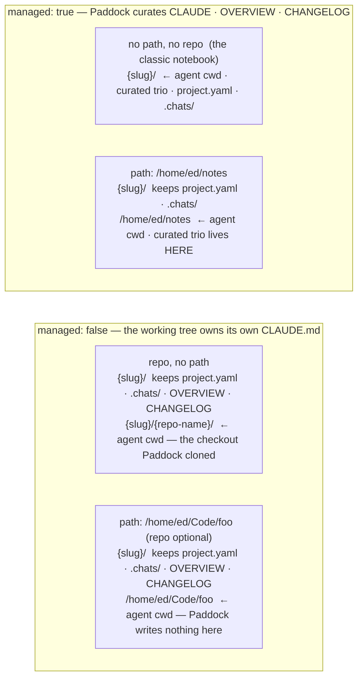

A **project** is a [workspace](/concepts/workspaces) nested inside the root. The
instance's own directory is itself a workspace, and a project is one living beneath it —
so a project is not the top-level unit any more, it is the *nested* case. Concretely it is
**a directory plus a `project.yaml`**: a slug-named directory under the data root
(`PADDOCK_PROJECTS_DIR`) that holds the project's metadata, curated notes, and its
chat transcripts. One project → one long-lived [Claude Code
agent](/concepts/agents) whose working directory is tied to that project.

What distinguishes a project is only that its
[workspace key](/concepts/workspaces#identity-a-workspace-is-its-path) — its path relative
to the projects root — is non-empty; the root's key is the empty string. Chats, files,
changes, history, settings, and triggers all behave identically at either, because they
are served by [literally the same handlers](/concepts/workspaces#one-plugin-two-mounts).
This page covers what is specific to a nested workspace, chiefly how a project's
**backing** is decided.

## What's in a project directory

```
<projectsRoot>/<slug>/
├── project.yaml     # metadata (the on-disk ProjectYaml) — never moves
├── OVERVIEW.md      # current synthesized state — sweeper-curated, replaced wholesale
├── CHANGELOG.md     # append-only dated history — sweeper + hand-edited
├── CLAUDE.md        # durable project identity / working conventions (managed only)
├── .chats/          # the chat transcripts (JSONL), symlinked from
│                    #   <dataDir>/claude-home/projects/<encoded-cwd> — never moves
└── <authored files> # notes.md, spec.html, diagrams… (you write these)
```

That is the classic shape. The three curated files can live somewhere else
entirely — see [Where the files land](#where-the-files-land) — but `project.yaml`
and `.chats/` always stay here.

`project.yaml` is the source of truth for metadata. On disk it carries only what's set.
The eight **required** fields are `name`, `slug`, `status`, `domain` (a `string[]` of
cross-cutting tags, defaulting to `[]`), `visibility`, `started`, `updated`, and `summary`.
The **optional** ones fall into groups:

| Group                 | Fields                                                             |
| --------------------- | ------------------------------------------------------------------ |
| Presentation          | `group` (the project's single "area"), `links`, `pinned`           |
| Agent overrides       | `model`, `models`, `permissionMode`, `maxTurns`, `docker`, `driveMode`, `maxSpawnDepth`, `hooksMcpEnabled` |
| Inherited sub-configs | `recovery`, `attachments`, `curation`                              |
| Backing               | `managed`, `path`, `repo`                                          |
| Automation            | `schedules`, `hooks`, `triggers`                                    |
| Format                | `schemaVersion`                                                     |

Every agent override and sub-config follows the same inherit/override discipline: absent
on disk means "inherit the instance default", resolved at dispatch rather than baked
concrete into the file. The three automation blocks are keyed records —
[`triggers`](/concepts/hooks) is the unified successor that collapses the older separate
`schedules` and `hooks` blocks.

The server reads the file
into a `ProjectYaml`, then resolves a fully-concrete `Project` DTO for the API —
filling defaults (e.g. `model ?? DEFAULT_MODEL`) and deriving fields like
`dir`, `workingDir`, `contentDir`, `managed`, and `hasOverview`. `stripDto()` is
the inverse, so round-tripping never rewrites fields that weren't set. `managed`
is the one derived field whose default is *computed from other fields* rather than
being a constant — see [Axis 1](#axis-1--managed-whose-files-are-these).

`OVERVIEW.md` and `CHANGELOG.md` are maintained by the [sweeper](/concepts/sweeper).
`CLAUDE.md` holds what the project *durably is* and how you work on it — seeded
terse and amended conservatively. (See `projects.ts` for `ProjectStore`.)

### `schemaVersion` — a project from the future is hidden, not mangled

`schemaVersion` is the one field that describes the **file** rather than the
project. It exists because "the server fills in defaults and rewrites the file on
the next save" is the right behaviour for a `project.yaml` an *older* Paddock
wrote and a data-loss bug for one a *newer* Paddock wrote: the normaliser drops
keys it doesn't recognise, and the next save persists the loss. A project
directory is a portable thing — people copy them between instances — so the
version rides in each file rather than in a data-dir manifest.

When a `project.yaml` declares a version newer than the running build
understands, that project is **hidden**: it does not appear in the projects list,
its keeper is not registered, and every route for it answers "not found". A
warning naming the file and its version is logged the first time. Nothing is
written to it — the file survives exactly as you found it, and upgrading Paddock
brings the project straight back.

This is deliberately gentler than the same situation in
[`paddock.config.yaml`](/configuration/config-file/#schemaversion--the-downgrade-guard),
which refuses to start. One project directory copied in from a newer box should
not take the instance down, and an unreadable `project.yaml` already made a
project vanish — the warning is what's new.

As with the config file, adoption costs nothing: today's shape *is* version 1 and
an **absent** `schemaVersion` reads as 1, so every existing file is already
correct. Paddock writes the key on projects it creates and adds it to older files
the next time it saves them for some other reason; reading one never rewrites it.

### Dot-prefixed paths are refused, not just hidden

The Files API does not merely omit dotfiles from listings — it **refuses to resolve a path
that traverses a dot-prefixed directory segment**. So `.chats/` and `.git/` are unreachable
through `GET …/files` even when named explicitly, including via a normalising detour like
`a/../.git/config`. Directory *listings* are stricter still: the target's own leaf may not
be hidden either, since `?path=.chats` was exactly how every transcript filename used to be
enumerable.

Two deliberate carve-outs are worth knowing:

- Only the path **relative to the project directory** is examined, so a data root that
  itself sits under a dot-prefixed ancestor (`/srv/.paddock/projects`) still works.
- A dotfile **leaf** elsewhere stays readable — that is what lets the Changes pane render
  an untracked `.gitignore`.

Honest severity: this is defence-in-depth, not a privilege boundary. Anyone who can reach
these routes can already start a chat and run Bash, which is strictly more
capability than reading a file. It is worth closing because "hidden in the listing" should
not be the only thing standing between an API and a transcript.

## Two axes, not three types

Paddock used to describe projects as a list of *types* — notebook, repo-backed,
linked — collapsed behind one derived `repoBacked` boolean. That flag was a single
word doing four jobs, and it broke the moment a fourth backing shape appeared.
What actually determines a project's shape is **two independent questions**:

1. **`managed`** — does Paddock look after this project's own files?
2. **Where the content lives** — which of `path` and `repo` are set.

They are orthogonal: you can hold either one fixed and vary the other. Only the
first is a genuine property of the project; the second is a location.

### Axis 1 — `managed`: whose files are these?

- **`managed: true`** — Paddock looks after this project's own files. The
  [sweeper](/concepts/sweeper) curates its `CLAUDE.md`, `OVERVIEW.md`, and
  `CHANGELOG.md`. This is precisely what "notebook" used to mean, and it is the
  right shape for research, planning, ops notes, or any work that isn't itself a
  code repository.
- **`managed: false`** (**unmanaged**) — the content is code that you or your
  agents source-control *outside* Paddock. Paddock never writes project files into
  it. The working tree owns its own `CLAUDE.md`, history, branches, and PR
  workflow.

The key is optional in `project.yaml`, and its default is **derived, never
constant**:

```ts
managed = managed ?? !(repo || path)
```

:::caution[Why the default is derived and not just `true`]
Every `project.yaml` on disk today predates this key. If absent meant `true`,
every existing repo-backed project would flip to *managed* the moment Paddock
upgraded, and the sweeper would start writing `CLAUDE.md` into somebody's
checkout. Deriving from the backing gives each legacy file back the meaning it
already had. Newly created projects write the key explicitly, so the derivation
only ever has to serve old files.
:::

**`managed: true` together with `repo` is rejected at creation** — not silently
ignored. Paddock curating files into a repo it also clones is not a combination
with a sensible meaning, so the create fails rather than quietly picking one
interpretation.

`managed` is set once, at creation, and immutable thereafter. The one transition
across the axis is
[**promotion**](/using/creating-and-organizing-projects/#promote-a-notebook-to-repo-backed),
which sets `repo` on an existing managed project in place and flips it to
`managed: false`. It is one-way, and refused for a project that is already
unmanaged or that has its own `path`.

### Axis 2 — where the content lives

This is not a type. It is just which of the two optional location fields are set,
and `workingDirFor()` resolves the agent's cwd from them — `path` wins:

```ts
workingDir = path ?? (repo ? `${dir}/${repoCheckoutName(repo)}` : dir)
```

| Field  | What it is | Applies to |
| ------ | ---------- | ---------- |
| `path` | An absolute path to a directory on the box. **Both** sides of axis 1: *unmanaged + `path`* works in a checkout you already have, in place, with no copy — real history, branches, and remotes; *managed + `path`* nominates where your **notes** should live. | managed **and** unmanaged |
| `repo` | A git URL (https, ssh, `git@host:owner/repo`, git://, or a local path). An acquisition hint, a remote-match for session adoption, and a re-clone hint for disaster recovery. | unmanaged only |

Both are set at creation and immutable thereafter. `repo` can never be
*re-pointed* because the checkout on disk is named after it, deterministically
(`repoCheckoutName()`); `path` can never be re-pointed because the cwd is baked
into every transcript path, so moving it would strand the project's history.

This split is [`DESIGN-backing-store.md`](https://github.com/edspencer/paddock/blob/main/docs/DESIGN-backing-store.md)
§2 goal 4 made concrete: **the base store is a plain directory and git is an
optional layer**, not the thing a project is defined by.

:::note[There is no git requirement anywhere]
Paddock **probes** for git and lights up git features — the Changes tab, commit
and push — when it finds a working tree. It never *rejects* a directory for not
being a repository. A folder of Markdown notes is a perfectly good working
directory, and there is no mandatory git check anywhere in Paddock.
:::

### Acquisition: what happens at creation

`path` and `repo` together describe not just where the content is but how Paddock
should get hold of it:

| Given | What Paddock does |
| --- | --- |
| `path` exists | Use it. If `repo` is set too, verify the directory's remotes include it and **warn on a mismatch** — `repo` is never silently ignored, and never fails the create either. |
| `path` missing, `repo` set | Clone the repo to that path. |
| `path` missing, managed | Create the directory — an empty dir is a valid notebook. |
| `path` missing, unmanaged, no `repo` | **Error.** There is nothing to acquire from, and an empty directory is not a codebase. |
| `repo` set, no `path` | Clone into a nested checkout under the project dir (the pre-existing behaviour). |
| unmanaged, neither | **Error.** An unmanaged project needs something to work in. |

The mismatch warning is deliberately a warning: plenty of legitimate setups (a
fork, a mirror, an `ssh`-vs-`https` spelling) won't match exactly, and the
directory the user named is the one they meant. But silently ignoring `repo` is
its own bug class, so the mismatch is said out loud.

:::caution[Cleanup only ever removes directories Paddock created]
When a create fails partway, the rollback list contains only directories *that
call* brought into being. A pre-existing directory is never in it, so no rollback
can delete one — the target is user-nominated and might be a home directory.
:::

### Where the files land

Content follows the working directory; Paddock's own state does not.

For a **managed project with an external `path`**, the three curated files **move
to the path**:

- `OVERVIEW.md`, `CHANGELOG.md`, `CLAUDE.md` → the working directory.

**This means those files then do not live in the Paddock data dir at all.** That
is an accepted, deliberate outcome, not an oversight: you asked for your notes to
live somewhere, and the curated notes *are* the content.

Two things stay in `<projectsRoot>/<slug>/` regardless:

- **`project.yaml`** — the registry entry. Paddock discovers projects by scanning
  for it, so it structurally cannot move.
- **`.chats/`** — Paddock's own state, and what backup tooling points at.

For an **unmanaged project**, the curated files stay in the metadata dir as
sidecars: `OVERVIEW.md` and `CHANGELOG.md` are still written, just outside the
working tree, and `CLAUDE.md` is **not curated at all** — the working directory
owns its own. Where Paddock clones a nested checkout, a sidecar `.gitignore` in
the metadata dir keeps that checkout and the transcripts out of the enclosing
data repo (a deliberate "git-in-git" arrangement). Where the working directory is
one you already had, Paddock writes nothing into it whatsoever: the transcript
store stays in the metadata dir via `ensureProjectChats`'s two-argument split
(`ensureProjectChats(workingDir, chatsHostDir, home)` — the cwd names the
transcript folder, `chatsHostDir` says where the store lives).

:::caution[Deleting a project never deletes an outside working directory]
Every recursive delete in the project store goes through one guard that refuses
any path not strictly inside `projectsRoot`. Before external paths that
containment was implicit — everything a project owned was nested under its slug
dir — and a working directory outside the root is precisely what breaks that
assumption, so it is now explicit and centralised rather than re-derived at each
call site.
:::

### What a directory you also use by hand buys you

Pointing `workingDir` at a directory you open a terminal in is what several
cwd-keyed features have always needed:

- **Session adoption works with no extra machinery.** Transcripts are keyed by
  working directory, and `candidateSources` already appends the project's own
  `workingDir` last, so the exact-cwd branch matches your prior `claude` sessions
  in that directory natively.
- **`claude.transcripts: host` and per-directory `~/.claude.json` MCP servers
  become meaningful.** Both key on `workingDir`; against a clone Paddock made
  there is nothing on the host side to match.
- **The Changes tab reports on the *working* directory**, not the metadata dir
  (this was bug #597), and appears whenever that directory turns out to be a git
  repo. Detection is per-directory, because the working directory may sit outside
  `projectsRoot` entirely.

The trade is portability: a `path` records an absolute path Paddock did not
create, so it does not survive being rebuilt elsewhere. On a fresh box the project
points at a directory that isn't there until you re-create it — which is exactly
what a `repo` alongside a `path` is there to help with.



The empty cell is the rejected combination: **managed + `repo`**. Everything else
in the grid is a real, supported shape.

## Why the split

Keeping the registry entry and the transcripts in `dir` while the content lives in
`workingDir` is what lets a project be **self-contained and portable**: chats and
attribution ride along as a unit and are always in the one place backup tooling
points at, while an unmanaged project still gives Claude a first-class working
tree to do real engineering in.

Splitting `managed` out from the location is what stops those two concerns from
being decided by the same flag. The sweeper's `CLAUDE.md` suppression and the
promotion guard key on `managed`; the git surface keys on whether `workingDir`
happens to be a git working tree, asked per directory. Neither has to consult a
"type" that guessed at both.

See [`../DESIGN-backing-store.md`](https://github.com/edspencer/paddock/blob/main/docs/DESIGN-backing-store.md) for the durability
model and [`../ARCHITECTURE.md`](/architecture/overview) for how `dir`/`workingDir`
flow through the system.
