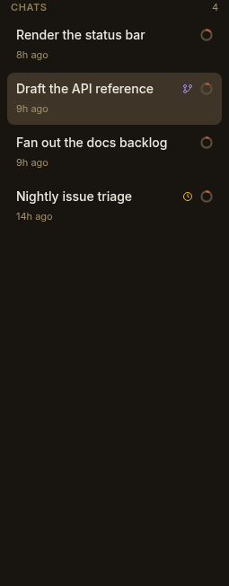
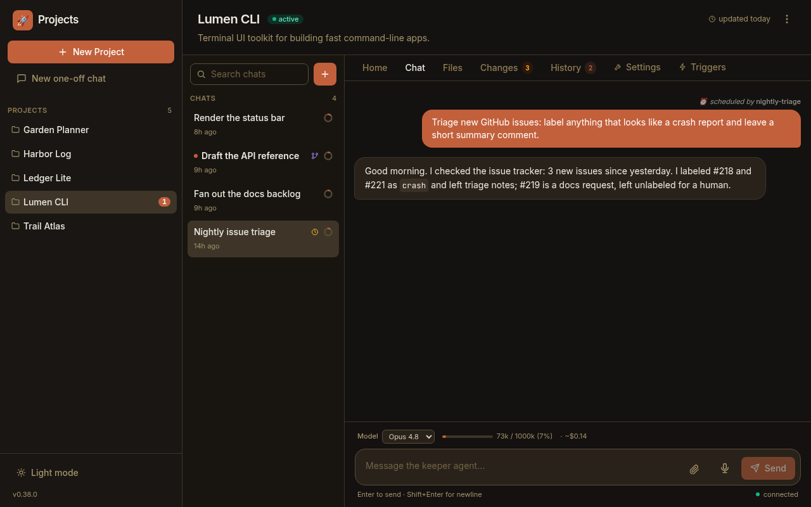

Not every turn in Paddock is typed by a human. A chat can be started by a
**schedule** firing on cron, or **spawned** by another chat that fanned out work;
a message can be **injected** into an already-open chat by a schedule or by a
sibling chat reporting back. In the UI these look identical to something you did
yourself — so Paddock records **provenance**: who or what caused each chat, and
each machine-added turn, to exist.

This page explains the model. To see the tool-level detail of what a keeper did
once a chat is running, see
[Reading a keeper's work](/using/reading-a-keepers-work/).

## The provenance marker: origin + depth

Every server-initiated turn carries a small marker with two fields:

- **`origin`** — how the chat came to exist: `human`, `scheduled`, `spawned`, or
  `hook`.
- **`depth`** — how many spawn hops it is from the human (or scheduled) root of
  its tree. A human-started chat is `depth: 0`; a chat it spawns is `depth: 1`;
  that child's own children are `depth: 2`; and so on.

So a human-started chat is `{ origin: human, depth: 0 }` — the root of any
fan-out tree. A chat a keeper creates with a self-management tool becomes
`{ origin: spawned, depth: parent.depth + 1 }`, and a cron-fired chat is
`{ origin: scheduled, depth: 0 }` — a schedule is a root trigger, just like a
human.

The marker is stamped **once, at chat creation**, and is **never overwritten by a
later turn**. Resuming, waking, or sending a message into an existing chat leaves
its recorded provenance intact — provenance describes how a chat was *born*, not
what last happened in it. It's persisted in a per-chat server sidecar
(`RunProvenanceStore`), the same durable side-metadata pattern Paddock uses for a
chat's archived flag and your read state.

:::note[Depth also bounds autonomy]
The `depth` field isn't only for display. It's what bounds a fan-out: a spawned
chat is only given Paddock's self-management tools while its depth stays within a
configured limit, so a manager's direct children can report back and spawn, but
grandchildren and deeper cannot — the tree can't run away. That capability side of
provenance is covered in the self-management material; here we focus on how it's
*surfaced*.
:::

## Chat-list badges

The per-project chat list turns the marker into a small, subtle icon badge, so the
"ran without me" chats stand out at a glance while ordinary human chats stay
unadorned:

- **Scheduled** chats — a schedule started them — show an **amber clock**.
- **Spawned** chats — another chat created them — show a **violet branch** icon
  (with a note of how many levels deep, when it's more than one).
- **Hook** chats — an event hook fired them — show a **sky bolt**.
- **Human** chats — the default — show **no badge**, so only the unattended runs
  draw the eye.

The same origin colors reappear in the project's **History** tab, which lists
recent runs (You / Scheduled / Spawned) so the work that happened while you were
away is easy to find and open.

## Per-message attribution

A single chat can interleave turns *you* typed with turns a *machine* injected —
a schedule firing into the chat it owns, or a sibling chat sending a message. So
provenance also works at the **per-message** level: a machine-injected user turn
gets a subtle attribution line above its bubble, while your own messages stay
unlabelled (the quiet default).

The wording names the source:

- **⏰ scheduled by ⟨name⟩** — a schedule fire injected the turn.
- **↩ sent by ⟨chat⟩** — another chat sent it; the chat name is a link straight
  to the sender.
- **⚡ triggered by hook ⟨name⟩** — an event hook fired it.
- **⚠ continued after a background task was terminated** — Paddock's keeper-chat
  recovery nudged the turn.

Under the hood this is a separate sidecar (`MessageProvenanceStore`) that records,
per chat, an ordered list of injections with their sender and the exact text
injected; at render time Paddock matches each machine-injected message to the next
recorded injection. Because the injected prompt lands verbatim as the message
content, the match is stable — and a human-typed message never matches, so it's
never mislabelled.

## Injected turns stream in live

Attribution isn't only a history feature. When a message is injected into a chat
you already have open, it now **streams in immediately** over the WebSocket —
you see the incoming turn and its attribution appear in place, rather than only
the reply showing up and having to refresh to learn where it came from.

## Why it matters

As keepers do more unattended work — scheduled triage, a manager chat fanning out
sub-tasks, hooks reacting to events — a project's chat list stops being purely
"conversations I had." Provenance keeps it legible: at a glance you can tell your
own threads from the ones that ran on a timer or were spawned by another chat, and
within a chat you can tell which turns a machine added. It's the connective tissue
that makes autonomous work reviewable instead of mysterious.

## Next steps

- [Reading a keeper's work](/using/reading-a-keepers-work/) — the tool-level view
  of what a chat actually did.
- [Chats are sessions](/concepts/chats/) — what a chat is, and how forking copies
  one.
- [The sweeper](/concepts/sweeper/) — the post-turn curation agent, itself a
  non-human actor.
