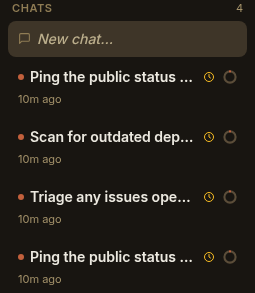

A **schedule** runs an agent turn on a clock. Unlike a chat you drive by typing,
a schedule fires **on its own** — on a cron expression or a repeating interval —
so a project can keep working while you're asleep, at the weekend, or just not
looking. "Triage the overnight issues every morning at 9", "scan for dependency
advisories at 3am", "post a weekly digest each Friday": each is a schedule.

Every firing surfaces as an ordinary chat, tagged so you can tell it apart from
the ones you started yourself:



That clock badge (⏰) means *a schedule started this chat*. The turn streams live,
is re-attachable, and is kept forever — it's a real chat, not a hidden background
job.

## What a schedule is

A schedule is one kind of **trigger** — the unified declaration Paddock uses for
"run an agent turn when *something* happens". A trigger is **when** it fires + **what**
it runs + whether it's **enabled**; a schedule is the trigger whose *when* is a clock:

- **`cron`** — a 5-field cron expression (e.g. `0 9 * * *` for 09:00 daily; the
  `@daily` / `@hourly` macros also work), evaluated in the host's local time.
- **`interval`** — a repeating duration like `30m`, `1h`, or `15m`.

Schedules live in the project's `project.yaml` (so they survive restarts and are
re-armed from the file on boot) and are managed from the per-project
[**Triggers tab**](/using/scheduling-recurring-work/). A minimal one looks like:

```yaml
# project.yaml
triggers:
  morning-triage:
    trigger:
      type: schedule
      cron: "0 9 * * *"          # or:  interval: "1h"
    run:
      prompt: Triage any issues opened overnight, label them, and post a summary.
      session: new                # a fresh chat each firing (the default)
    enabled: true
```

The **prompt** is what the fired turn is asked to do. Instead of an inline
`prompt` you can point at a `promptFile` — a git-tracked `.md` file under the
project's `.paddock/triggers/` directory, read fresh at each firing — which keeps
a long, evolving instruction in version control:

```yaml
    run:
      promptFile: weekly-digest.md   # read from .paddock/triggers/weekly-digest.md
```

:::note[A schedule is armed from `project.yaml`, always]
Declaring a schedule in `project.yaml` is all it takes — the file is the source of
truth and is re-armed on every restart. The per-deployment
[schedule-mutation gate](/configuration/schedules/) only governs *programmatic*
mutation (the older REST API and the self-MCP tools); it never stops a
statically-declared schedule from firing.
:::

## Fresh chat vs. one accreting session

The `session` field decides what a firing *lands in*:

- **`new` (the default)** — every firing starts a **fresh chat**. Good for
  independent, stateless jobs (a nightly scan, an hourly health check): each run
  is its own clean transcript.
- **`resume`** — every firing **accretes into one owned session**. The schedule
  keeps a single, growing chat (created on the first firing, reused after), so a
  "manager" agent builds up context over time — yesterday's triage informs
  today's.

## Tool-less vs. scoped

A schedule's granted **tools** *are* its capability, and they decide how the turn
runs:

- **No tools** → the firing runs as the project's **keeper**, with the keeper's
  full toolset. This is the simplest case: "just do the thing, as me."
- **A tools allow-list** → the firing runs on its **own scoped agent**
  (`trigger-<slug>-<name>`) that can use *exactly* those tools and nothing else —
  the grant is enforced by construction. Use it to hand a recurring job a small,
  deliberate capability (say, `Read` + `Grep` only).

## Schedules vs. `ScheduleWakeup`

Don't confuse a **schedule** with the keeper tool **`ScheduleWakeup`**:

- A **schedule** is **durable configuration**. It lives in `project.yaml`, fires
  on its clock forever, and is completely independent of whether any chat is
  currently alive.
- **`ScheduleWakeup`** is an **ephemeral, session-scoped** autonomy tool a
  session-mode keeper can call *from within its own live turn* to wake *itself*
  a bit later. It's a one-shot follow-up inside one conversation, not a standing
  recurring job, and it vanishes with the session.

Reach for a schedule when you want a job to run **on a clock, indefinitely,
whether or not you're around**.

## Catching up on what fired

Because schedules run unattended, Paddock gives you a per-project **History** tab —
the "while you were away" view — that lists recent runs and highlights the ones
you didn't drive yourself. See
[Scheduling recurring work](/using/scheduling-recurring-work/#catch-up-with-the-history-view)
for the walkthrough.

## Next steps

- [Scheduling recurring work](/using/scheduling-recurring-work/) — the hands-on
  guide: create a schedule in the Triggers tab, self-schedule from a chat, and
  read the History view.
- [Scheduling configuration](/configuration/schedules/) — the per-deployment gate
  for programmatic schedule mutation.
- [Schedules reference](/reference/schedules/) — the full trigger schema, the
  self-MCP tools, and the REST surface.
- [Chats are sessions](/concepts/chats/) — what a fired chat *is* under the hood.
