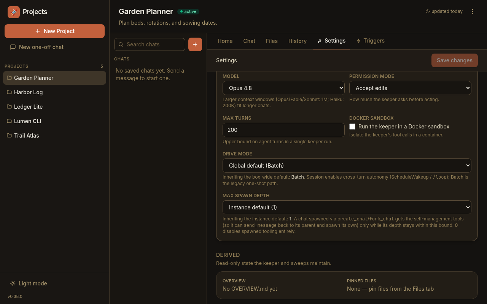

Paddock has always been configured from the environment ([every `PADDOCK_*`
variable is listed here](/configuration/environment/)). As the number of knobs
grew, so did the length of the `-e FOO=bar` list on the run command. Since
**v0.31** you can instead keep an instance's settings in a single **YAML file**
— and every environment variable still wins over it, so you can override one
value at run time without rewriting the file.

This page covers the file: where it lives, how it layers with the environment,
and a realistic example. It documents the same loader as the env-var page
(`packages/server/src/config.ts`), so the two are two views of one config.

## Precedence: file &lt; env, defaults beneath both

There is one resolution order, from lowest to highest priority:

1. **Built-in defaults** — the floor. Every setting has a sane default baked into
   the code (e.g. `PORT` → `4000`, `auth.mode` → `none`).
2. **The YAML file** — overrides the defaults. This is the **base layer**: each
   file value is threaded in as the fallback beneath the matching environment
   read.
3. **Environment variables** — override the file. A `PADDOCK_*` (or plain, e.g.
   `PORT`) env var **always wins** over the file value it shadows.

So the mental model is **defaults &lt; file &lt; env**. An env-only deployment is
completely unaffected: with no file present, resolution is byte-for-byte the
behaviour it had before the loader existed. You can adopt the file gradually —
move your stable settings into it and keep using env vars for the one or two you
tweak per run.

:::note[Same parsing either way]
A file value is coerced through the **same** parsing an env value gets, so all
the rules on the [environment page](/configuration/environment/#how-values-are-parsed)
— blank-is-unset, the `1`/`true`/`yes` boolean convention, unknown-enum-falls-
back-to-default, path canonicalisation — apply identically to file values. A
scalar may be written in its natural YAML type (`port: 4000`, `brand: { name:
Homelab }`) or as a string; both resolve the same way.
:::

## Where the file lives

Paddock looks for the file in one of two places:

- **`PADDOCK_CONFIG`** — if this env var is set, it's an explicit path to the
  file (wins over the default location).
- Otherwise **`<PADDOCK_DATA_DIR>/paddock.config.yaml`** — the default location,
  under your data directory (which defaults to `./data`).

The file is entirely optional:

- **No file → no-op.** If the default file doesn't exist, Paddock runs env-only,
  exactly as before. Existing installs need change nothing.
- **A missing *explicit* file is an error.** If `PADDOCK_CONFIG` points at a path
  that doesn't exist, that's treated as a misconfiguration — startup fails with a
  clear error rather than silently ignoring your intent.
- **A malformed file is an error.** Unparseable YAML, or a top-level list/scalar
  where a mapping is expected, fails startup with a clear message rather than
  booting with a half-empty config.
- **Empty sections are ignored, not fatal.** An empty file (or a comments-only
  one) is treated as "no overrides". A valueless key (`brand:` with nothing after
  it) is dropped, so that section falls back to env/defaults instead of crashing.
- **Unknown keys are ignored.** This leaves room for the schedule and hook
  declarations that share this file to be added without breaking older builds.

## An example config file

Keys mirror the resolved config: top-level scalars plus a few nested sections.
Every value below is optional and overridable by its matching env var. This is
the same YAML house style as `project.yaml` and the generated `herdctl.yaml`.

```yaml
# <PADDOCK_DATA_DIR>/paddock.config.yaml
# A home-lab instance. Every value here is overridable by its env var.

# --- Core ---
port: 4000
host: 0.0.0.0
logLevel: info

# --- Keeper behaviour ---
keeperDriveMode: session      # session enables cross-turn autonomy (ScheduleWakeup / /loop)
nativeSystemPrompt: true      # use the native Claude Code prompt + CLAUDE.md hierarchy

# --- Authentication (see the Authentication page for modes) ---
auth:
  mode: jwt
  jwksUrl: https://idp.example.com/application/o/paddock/jwks/
  jwtIssuer: https://idp.example.com/application/o/paddock/

# --- Per-instance branding (tell several instances apart) ---
brand:
  name: Homelab
  logo: "🏠"
  accent: "#3c6ec2"

# --- Capabilities & safety gates (default OFF; maxSpawnDepth defaults to 1) ---
selfMcpEnabled: true          # read-only self-management MCP for keepers
selfMcpWriteEnabled: true     # + the write tools (create/fork/send/schedule)
maxSpawnDepth: 1              # how deep spawned children may themselves spawn
scheduleMutationEnabled: false
hooksMcpEnabled: false

# --- Inbound composer attachments (file/image upload; all optional) ---
attachments:
  enabled: true                 # master switch (default on)
  maxFileSizeMb: 25             # per-file cap
  maxFilesPerMessage: 10        # per-message cap
  allowedTypes: ["*"]           # a real array here (env is comma-separated)

# --- Voice dictation (Whisper), git author, GitHub OAuth ---
transcription:
  mode: remote
  endpoint: https://whisper.example.com/v1
gitAuthor:
  name: Paddock
  email: paddock@localhost
```

Point Paddock at a file in a non-default place with `PADDOCK_CONFIG`:

```bash
PADDOCK_CONFIG=/etc/paddock/instance.yaml node packages/server/dist/index.js
```

## Capability & safety gates worth setting here

Several of the knobs above are **capability gates** that default to **off** — a
plain instance advertises none of them, and you opt in per instance. They are
prime candidates for the config file because they rarely change between runs.
Each is settable **either** in the YAML **or** via its env var (env wins), and
several also take a per-project override that wins at dispatch time.

| YAML key | Env var | Default | What it gates |
|----------|---------|---------|---------------|
| `selfMcpEnabled` | `PADDOCK_SELF_MCP` | `false` | Give keepers the read-only self-management MCP (`mcp__paddock_manage__*`). |
| `selfMcpWriteEnabled` | `PADDOCK_SELF_MCP_WRITE` | `false` | Add the self-management **write** tools (`create_chat`, `fork_chat`, `send_message`, schedule/hook tools). **Only honoured when `selfMcpEnabled` is also on** — write implies read. |
| `maxSpawnDepth` | `PADDOCK_MAX_SPAWN_DEPTH` | `1` | How deep a spawned chat may itself spawn: a chat at depth `d` gets the self-MCP only if `d ≤ maxSpawnDepth`. `0` restores "no spawned child gets it". A per-project override wins at dispatch. |
| `scheduleMutationEnabled` | `PADDOCK_SCHEDULE_MUTATION` | `false` | Allow schedules to be created/edited/deleted programmatically (self-MCP schedule tools + the mutating Schedules REST routes). Schedules declared statically in `project.yaml` are armed regardless of this gate. |
| `hooksMcpEnabled` | `PADDOCK_HOOKS_MCP` | `false` | Advertise the hook-management MCP tools (`list_hooks` / `set_hook` / `remove_hook`). Only meaningful alongside the self-MCP write tools; a per-project `hooksMcpEnabled` override wins at dispatch. |

For the full list of settings — auth headers, Whisper models, recovery knobs,
dev-server advertising, and more — see the
**[Environment variables reference](/configuration/environment/)**; every
`PADDOCK_*` server setting there has a matching YAML key. (The runtime
credentials — `CLAUDE_CODE_OAUTH_TOKEN` / `ANTHROPIC_API_KEY` — and the Vite
web-build variables are read straight from the environment and have no file key.)

## Per-project overrides layer on top

The YAML file sets **instance-wide** defaults. A handful of settings can then be
overridden **per project** from that project's **Settings** tab (persisted in its
`project.yaml`), which wins at dispatch time — for example `driveMode`,
`maxSpawnDepth`, `hooksMcpEnabled`, the keeper-chat `recovery` knobs, and the
`attachments` group (a project can raise/lower its upload caps or disable uploads
entirely). So the layering is: built-in default → instance YAML/env → per-project
override.



## See also

- **[Environment variables](/configuration/environment/)** — the canonical list
  of every setting, with defaults, that this file mirrors.
- **[Authentication](/configuration/authentication/)** — auth modes and the
  `auth` section in detail.
- **[Keeper-chat recovery](/configuration/keeper-recovery/)** — the `recovery`
  section and its per-project override.
