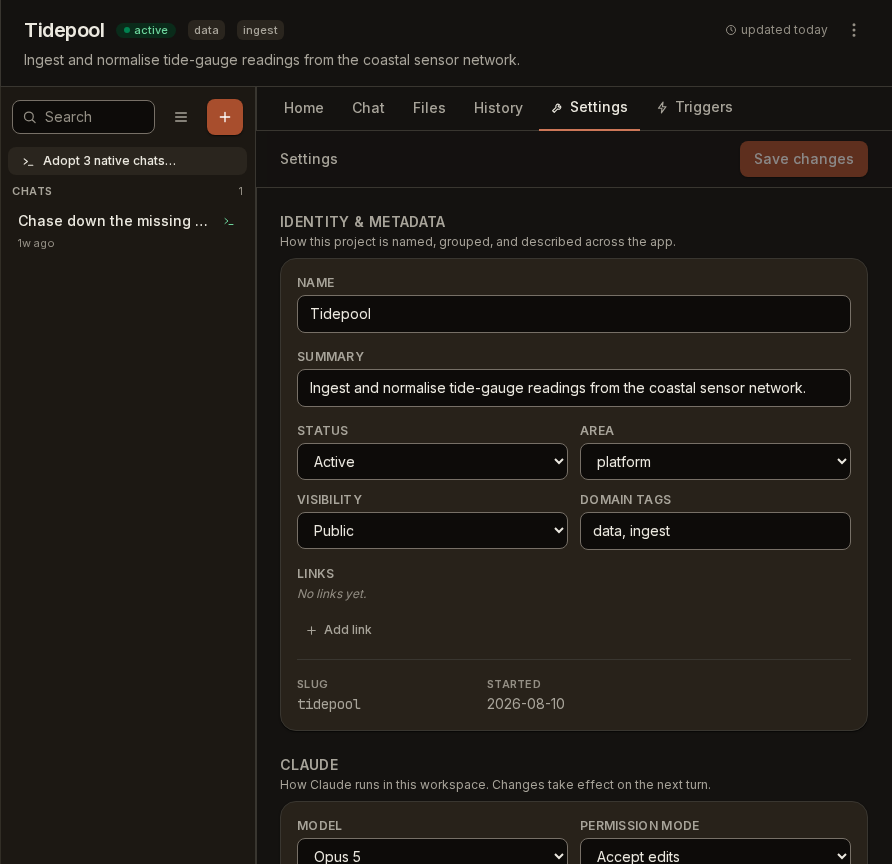

Paddock has always been configured from the environment ([every `PADDOCK_*`
variable is listed here](/configuration/environment/)). As the number of knobs
grew, so did the length of the `-e FOO=bar` list on the run command. Since
**v0.31** you can instead keep an instance's settings in a single **YAML file**
— and every environment variable still wins over it, so you can override one
value at run time without rewriting the file.

This page covers the file: where it lives, how it layers with the environment,
and a realistic example. It documents the same loader as the env-var page
(`packages/server/src/config.ts`), so the two are two views of one config.

## Precedence: file &lt; env, defaults beneath both

There is one resolution order, from lowest to highest priority:

1. **Built-in defaults** — the floor. Every setting has a sane default baked into
   the code (e.g. `PORT` → `7233`, `auth.mode` → `none`).
2. **The YAML file** — overrides the defaults. This is the **base layer**: each
   file value is threaded in as the fallback beneath the matching environment
   read.
3. **Environment variables** — override the file. A `PADDOCK_*` (or plain, e.g.
   `PORT`) env var **always wins** over the file value it shadows.

So the mental model is **defaults &lt; file &lt; env**. An env-only deployment is
completely unaffected: with no file present, resolution is byte-for-byte the
behaviour it had before the loader existed. You can adopt the file gradually —
move your stable settings into it and keep using env vars for the one or two you
tweak per run.

:::caution[One exception: `profile`]
[`profile:`](/configuration/profiles/) sets the built-in **defaults** for the
security and capability keys rather than acting as a layer of its own, so the
chain for those keys is:

**profile &lt; an individual key in the file &lt; an individual env var**

Which means an individual key in the file beats `PADDOCK_PROFILE` in the
environment — the one place the rule above inverts. *Specific beats general*:
`PADDOCK_PROFILE` speaks for the keys you did not mention. Env still wins over
the file for the **same** key.
:::

:::note[Same parsing either way]
A file value is coerced through the **same** parsing an env value gets, so all
the rules on the [environment page](/configuration/environment/#how-values-are-parsed)
— blank-is-unset, the `1`/`true`/`yes` boolean convention, unknown-enum-falls-
back-to-default, path canonicalisation — apply identically to file values. A
scalar may be written in its natural YAML type (`port: 7233`, `brand: { name:
Homelab }`) or as a string; both resolve the same way.
:::

## Where the file lives

Paddock looks for the file in one of two places:

- **`PADDOCK_CONFIG`** — if this env var is set, it's an explicit path to the
  file (wins over the default location).
- Otherwise **`<PADDOCK_DATA_DIR>/paddock.config.yaml`** — the default location,
  under your data directory (which defaults to `./data`).

The file is entirely optional:

- **No file → no-op.** If the default file doesn't exist, Paddock runs env-only,
  exactly as before. Existing installs need change nothing.
- **A missing *explicit* file is an error.** If `PADDOCK_CONFIG` points at a path
  that doesn't exist, that's treated as a misconfiguration — startup fails with a
  clear error rather than silently ignoring your intent.
- **A malformed file is an error.** Unparseable YAML, or a top-level list/scalar
  where a mapping is expected, fails startup with a clear message rather than
  booting with a half-empty config.
- **Empty sections are ignored, not fatal.** An empty file (or a comments-only
  one) is treated as "no overrides". A valueless key (`brand:` with nothing after
  it) is dropped, so that section falls back to env/defaults instead of crashing.
- **Unknown keys are ignored.** This leaves room for the schedule and hook
  declarations that share this file to be added without breaking older builds.
- **A file from a NEWER Paddock is an error.** See below.

## `schemaVersion` — the downgrade guard

Since **v0.66** the file may carry a `schemaVersion:` at the top, and Paddock
**refuses to start** when it declares a version newer than the running build
understands:

```
refusing to start: /data/paddock.config.yaml declares version 2 of the paddock
config format, but this build understands up to version 1. It was written by a
NEWER paddock. …
```

The reason is the bullet just above. "Unknown keys are ignored" is exactly the
right behaviour for a file written by an *older* Paddock and exactly the wrong
one for a file written by a *newer* one: running `npx @edspencer/paddock@0.62.0`
against a data dir 0.66 wrote would read the keys it recognises, ignore the rest,
and — the moment anything saved a setting — write the file back without them.
The version field turns that into a clean stop.

Three things worth knowing:

- **Nothing you have needs changing.** The shape the file has today *is* version
  1, and an **absent** `schemaVersion` reads as 1. Existing files are correct as
  they stand; Paddock adds the key the next time it writes the file itself (a
  save from the Settings screen), and never rewrites one just to add it.
- **It is a plain counter, not semver.** It goes up by one, and only when an old
  reader would get the wrong *answer* — a renamed key, a key whose meaning
  changed, a default whose absence now means something new. Adding an optional
  key does **not** bump it, which is why it will move rarely.
- **`project.yaml` carries the same field, and guards more gently** — see
  [Projects](/concepts/projects/). One project directory from the future gets
  hidden with a startup warning rather than stopping the whole instance.

## An example config file

Keys mirror the resolved config: top-level scalars plus a few nested sections.
Every value below is optional and overridable by its matching env var. This is
the same YAML house style as `project.yaml` and the generated `herdctl.yaml`.

```yaml
# <PADDOCK_DATA_DIR>/paddock.config.yaml
# A home-lab instance. Every value here is overridable by its env var.

schemaVersion: 1              # which version of THIS format the file is in

# --- Core ---
port: 7233
host: 0.0.0.0
logLevel: info

# --- Agent behaviour ---
driveMode: session            # session enables cross-turn autonomy (ScheduleWakeup / /loop)
nativeSystemPrompt: true      # use the native Claude Code prompt + CLAUDE.md hierarchy

# Appended to every keeper turn's system prompt. Omit the key entirely for
# Paddock's built-in text; set it to "" to append nothing. See
# /configuration/instance-settings/#the-environment-prompt
environmentPrompt: |
  You are running in Acme's Paddock — replies render as Markdown in a browser.
  Link every ticket as [ABC-123](https://acme.atlassian.net/browse/ABC-123).

# --- What this instance shares with the host's Claude Code (#691) ---
# `own` = Paddock's, isolated inside the data dir. `host` = this machine's
# Claude Code. Omit the block entirely for full isolation, which is the default:
# nothing outside the data dir is written.
claude:
  transcripts: own            # own | host — see the section below
  credentials: host           # own | host — the ONE key that defaults to host
  instructions: own           # own | host — your ~/.claude CLAUDE.md, agents, commands
  hooks: own                  # own | host — shell commands your settings.json binds
  mcpServers: own             # own | host — the servers you added with `claude mcp add`

# --- MCP servers this instance declares for ITSELF ---
# A sibling of `claude:`, not a key in it: that block borrows what this machine
# already has, this one says what Paddock should have regardless. `env:VAR_NAME`
# anywhere a string goes means "read it from the environment" — keep tokens out
# of this file, it is git-tracked.
mcpServers:
  notion:
    command: npx
    args: ["-y", "@notionhq/notion-mcp-server"]
    env:
      NOTION_TOKEN: env:NOTION_TOKEN

# --- Authentication (see the Authentication page for modes) ---
auth:
  mode: jwt
  jwksUrl: https://idp.example.com/application/o/paddock/jwks/
  jwtIssuer: https://idp.example.com/application/o/paddock/

# --- Per-instance branding (tell several instances apart) ---
brand:
  name: Homelab
  logo: "🏠"
  accent: "#3c6ec2"

# --- Capabilities & safety gates (default OFF; maxSpawnDepth defaults to 1) ---
selfMcpEnabled: true          # read-only self-management MCP for Claude
selfMcpWriteEnabled: true     # + the write tools (create/fork/send/archive/fan-out)
selfMcpProjectsEnabled: false # + create_project / promote_project (clone a repo)
maxSpawnDepth: 1              # how deep spawned children may themselves spawn
scheduleMutationEnabled: false
hooksMcpEnabled: false        # + the trigger tools (list/set/remove/run_trigger)

# --- External Management API (/mcp) — file-first; only trustedProxies has an env var ---
managementApi:
  instanceId: my-paddock                    # binds `pdk_<instanceId>_…` tokens here
  publicUrl: https://paddock.example.com    # required once `clients` is set
  trustedProxies: [172.18.0.0/16]           # whose X-Forwarded-Proto the guard believes
  clients:
    my-laptop:
      auth:
        ref: env:PADDOCK_MCP_TOKEN_MY_LAPTOP  # env reference ONLY — inline is an error
      # omit `scope` for the read-only default

# --- Inbound composer attachments (file/image upload; all optional) ---
attachments:
  enabled: true                 # master switch (default on)
  maxFileSizeMb: 25             # per-file cap
  maxFilesPerMessage: 10        # per-message cap
  allowedTypes: ["*"]           # a real array here (env is comma-separated)

# --- Voice dictation (Whisper), git author, GitHub OAuth ---
transcription:
  mode: remote
  endpoint: https://whisper.example.com/v1
gitAuthor:
  name: Paddock
  email: paddock@localhost
```

Point Paddock at a file in a non-default place with `PADDOCK_CONFIG`:

```bash
PADDOCK_CONFIG=/etc/paddock/instance.yaml node packages/server/dist/index.js
```

## `claude` — what this instance shares with your Claude Code

Paddock drives Claude Code, which means it sits next to state you already have:
transcripts, a login, MCP servers, a `CLAUDE.md`. **By default it writes none of
it, and reads almost none of it.** A fresh instance keeps its own Claude home
under the data dir; the only thing it takes from your `~/.claude` unasked is your
login (see `credentials` below) and the non-executable half of your
`settings.json`. Everything else is a key you turn on.

Each key under `claude:` answers one question — *whose X does this instance use?*
— with one vocabulary, so the guarantee is readable at a glance rather than
inferred from which directory Paddock happens to be pointed at.

```yaml
claude:
  transcripts: own    # own | host — default own
  credentials: host   # own | host — default host
  instructions: own   # own | host — default own
  hooks: own          # own | host — default own
  mcpServers: own     # own | host — default own
```

### `transcripts`

- **`own`** (default) — each project's chats live in its own `.chats/`, inside
  the data dir. Move the data dir and the whole instance moves with it. Deleting
  a chat deletes Paddock's copy.
- **`host`** — Paddock uses your real `~/.claude/projects/<encoded-cwd>/` folder
  for each project's working directory. One set of files, both directions: a chat
  you continue in the terminal with `claude --resume` shows up in Paddock without
  a restart or a re-import, and vice versa. Deleting a chat in Paddock
  **releases** it — the transcript stays on disk, because it is your history
  rather than Paddock's copy (#689). Note the chat does **not** yet leave your
  list: releasing drops Paddock's adoption record, but the engine rediscovers
  the transcript structurally on the next listing and shows it again. Closing
  that gap needs a tombstone and is tracked as
  [#693](https://github.com/edspencer/paddock/issues/693).

#### Switching `host` back to `own`

Set the key back to `own` and restart. Paddock removes the outward symlink each
project's store was using and puts a real directory back, so `own` isolates again
from that boot on — before
[#708](https://github.com/edspencer/paddock/issues/708) the link survived the
flip, which quietly meant new chats were still written into your `~/.claude` and
deleting one removed *your* file rather than Paddock's copy.

Nothing at the other end is read, moved or deleted by that cleanup — but the
chats written while `host` was on stay where they are, so they leave Paddock's
list. The boot log names the exact folder for each project. Chats you started in
a **terminal** can be brought back with **Import chats**; chats Paddock itself
ran during that period are still attributed to this instance and are *not*
offered for import, so moving those is a manual `cp` today. Switching the other
way (`own` → `host`) has no cleanup step at all yet — see
[#882](https://github.com/edspencer/paddock/issues/882).

`host` is implemented as one symlink per project pointing *out* of Paddock's own
Claude home, not by pointing Paddock at `~/.claude`. That distinction is
load-bearing rather than cosmetic: agent memory lives beside the transcripts, and
an agent cannot write to any path containing a `.claude` component — so the home
that moves is the one thing that must not (#690). Paddock refuses to start if
`CLAUDE_CONFIG_DIR` or a `claudeHome:` key resolves to your own `~/.claude`, and
the refusal names this key as what you probably wanted.

### `credentials`

**The one key that defaults to `host`,** and the exception is deliberate:
isolation is about *writes*. Reading a login creates, moves and deletes nothing,
while defaulting it to `own` produces an instance that boots cleanly, says
everything is ready, and then fails every single turn with "Not logged in" —
which is exactly the bug this key closes (#683).

- **`host`** (default) — Paddock uses the Claude Code login already on this
  machine. On macOS that is the Keychain entry `claude /login` wrote; everywhere
  else it is your `~/.claude/.credentials.json`, symlinked into Paddock's home
  rather than copied, so a refreshed token is never duplicated or stale.
- **`own`** — Paddock uses only a login of its own: a `CLAUDE_CODE_OAUTH_TOKEN` /
  `ANTHROPIC_API_KEY` in the environment, or a `.credentials.json` inside its own
  Claude home (`CLAUDE_CONFIG_DIR=<data-dir>/claude-home claude login`). Nothing
  of yours is read. If a previous boot bridged your `.credentials.json` in, that
  symlink is removed on the next start.

The macOS half works because Claude Code resolves its secure-storage scope from
`CLAUDE_SECURESTORAGE_CONFIG_DIR` *instead of* `CLAUDE_CONFIG_DIR` whenever that
variable is defined. Paddock defines it as the **empty string**, which selects the
unsuffixed service name — your real login — while its own Claude home stays
exactly where it is. Nothing else is shared by this key: not transcripts, not
memory, not `.claude.json`. If you set `CLAUDE_SECURESTORAGE_CONFIG_DIR` yourself
to something non-empty, Paddock honours yours and says so at startup.

Paddock says which login it is running on when it has anything to report, and
warns before the first turn — rather than after it — when it can find none.

### `instructions`

Your `~/.claude/CLAUDE.md`, `agents/`, `commands/` and `plugins/` — prompts,
subagent definitions and slash commands. Content the model reads, or definitions
it can invoke by name; nothing here runs a command on its own.

- **`own`** (default) — none of them are loaded. Each project's own `CLAUDE.md`
  and `.claude/` are unaffected, and so is anything you put in Paddock's own
  Claude home.
- **`host`** — all four are symlinked in, which is what every version before
  0.62 did unconditionally.

**This default is a reversal, and it is smaller than it looks.** The version it
reverses argued that dropping these is a silent behaviour regression — your
curated `~/.claude/CLAUDE.md` no longer reaching your agents, with no error.
That is a fair argument, but its premise does not hold for the runtime Paddock
actually runs chats on: user memory, `agents/` and `commands/` all move with
Claude Code's **`user` setting source**, and Paddock's agents run with only
`project` loaded (see the caution under `hooks`). So on a default chat turn these
four have been inert since chats moved to the SDK runtime — bridged or not. They
*do* apply to the CLI paths: the post-turn sweeper, triggers, and
`driveMode: batch` chats.

It is the default anyway because *"`own` everywhere means nothing outside the
data dir is read or written"* has to be a guarantee you can read off this file,
and *"…except your CLAUDE.md, agents, commands and plugins, always, with no key
to turn them off"* is not a guarantee, it is a footnote. Your project's own
`CLAUDE.md` is unaffected in every mode, and so is
agent auto-memory, which lives in the Claude home but is not gated by the setting
source.

**You are told.** When Paddock finds `~/.claude` instruction files it is not
loading, it names them and names this key at startup — as a **warning**, so it
survives the `npx` launcher's quiet default (`LOG_LEVEL=warn` unless you pass
`--verbose`). It says nothing at all if you have none of those files, or if you
are on `host`. Earlier versions wrote that notice at `info`, which the quiet
default filtered out — so if you started on 0.62 and saw nothing, that is why
([#706](https://github.com/edspencer/paddock/issues/706)).

**`plugins/` is this key too, and since 0.63 it actually works.** The symlink
alone never did: the runtime's plugin root is the Claude home and it does
discover what is there, but discovery of an *installed* plugin is driven by
`enabledPlugins`, which lives in `settings.json`, and Paddock's agents run with
only the *project* settings source loaded (see below) — so the flag that would
switch a bridged plugin on never arrived. That is why plugins looked bridged and
did nothing for months.

herdctl 5.32.0 added the channel this needed: a `plugins` array on the agent
config, passed to the SDK's own `plugins` option (and `--plugin-dir` on the CLI
runtime). A plugin passed that way is a **session** plugin, and a session
plugin's enablement is `enabledPlugins["<name>@inline"] ?? manifest.defaultEnabled
!== false` — **enabled by default**, with no settings-source grant required. So
under `instructions: host` Paddock enumerates the host's installed plugins from
`<plugin-root>/installed_plugins.json` and passes them, and your commands,
agents, skills and hooks from a plugin reach your keepers. The host's
`enabledPlugins` is still consulted, but only to **veto**: an id set to `false`
is skipped, so a `/plugin disable` on your machine is respected.

A plugin's *MCP servers* are a second question, gated by
[`mcpServers`](#mcpservers) below — see the truth table there.

### `hooks`

Hooks are **shell commands** your `~/.claude/settings.json` binds to tool use and
session lifecycle (`PreToolUse`, `PostToolUse`, `SessionStart`, …). Before 0.62
they were inherited unconditionally, so every hook you had ever configured ran
inside every Paddock turn with no key to turn it off. This is that key.

- **`own`** (default) — your hooks do **not** run here.
- **`host`** — your `settings.json` is symlinked in whole and your hooks run.

`settings.json` is a mixed bag: it carries `hooks` *and* `permissions`, `model`,
`statusLine`, `enabledPlugins`. A symlink is all-or-nothing and the file is not,
so under `own` Paddock **writes its own `settings.json`** into its Claude home —
your keys, with `hooks` dropped. Two consequences worth knowing:

- **A restart is what applies an edit.** The generated file is regenerated at
  every startup, so changing your `~/.claude/settings.json` reaches Paddock on
  the next start rather than immediately. Only files that actually define hooks
  are copied at all; without them Paddock symlinks yours as before and nothing
  can go stale.
- **A `settings.json` you put in Paddock's own Claude home is never touched.**
  Paddock recognises its own generated file by hash, so editing that file makes
  it yours and Paddock stops regenerating it — and says at startup that `hooks:
  own` is therefore not in force for whatever that file says.

If your `~/.claude/settings.json` cannot be parsed, Paddock plants **nothing**
rather than falling back to the symlink: it would rather run with no user-level
settings than hand over the hooks this key exists to withhold.

:::caution[Which turns this governs today]
`<claude-home>/settings.json` is Claude Code's **`userSettings`** source, and
Paddock's chat runtime does not load it. herdctl invokes the Agent SDK with
`--setting-sources=project` for any agent that has a working directory — which is
every Paddock agent — so a default chat turn reads your *project's*
`.claude/settings.json` and never the Claude home's. The CLI runtime (the
post-turn sweeper, triggers, and `driveMode: batch` chats) passes no such flag and
runs on the default `user,project,local`, so it **does** read it.

So today the host's hooks execute in the sweeper, in triggers and in `batch`
chats, and not in a default SDK chat turn — narrower than it looks, and still
real code execution. The same asymmetry applies to the keys this key *keeps*:
your `permissions` and `model` reach those paths and not the SDK ones, which was
true before this key existed too.
:::

**Scope, stated plainly:** `hooks: own` means "no host hooks", not "no host
commands". `settings.json` has several other keys that name a script to run —
`apiKeyHelper`, `awsAuthRefresh`, `awsCredentialExport`, `gcpAuthRefresh`,
`proxyAuthHelper`, `otelHeadersHelper`, `statusLine`, `subagentStatusLine` — and
they are still inherited. Several of those are how a corporate login *works*, so
dropping them under a key named `hooks` would break authentication for people who
did nothing wrong; where they belong is an open question (#691).

### `mcpServers`

The MCP servers you have added with `claude mcp add` — the external tools your
own Claude Code can call.

- **`own`** (default) — your agents get only the servers Paddock provides itself:
  `send_file`, the optional [self-management tools](/reference/self-mcp/), and the
  optional browser server. Nothing of yours is read.
- **`host`** — Paddock also attaches the servers declared in your
  `~/.claude.json`: the top-level `mcpServers` (user scope, everywhere) plus any
  under `projects.<absolute-dir>.mcpServers` (directory scope), which a project
  gets only when that directory is its own working directory. The boot log names
  every server it attached.

**This key is the odd one out, and the path is why.** MCP servers are not
declared inside `~/.claude` at all — they live in **`~/.claude.json`**, a sibling
*file* next to that directory, because Claude Code resolves it as
`<config-dir-or-home>/.claude.json`. So the config bridge the other keys are built
on could never have reached them, no matter how it was configured, and MCP
inheritance broke silently and separately from everything else.

`host` is therefore a **read**, not a link: Paddock reads that file and passes the
servers to the runtime. It deliberately does not symlink it, because Claude Code
*writes* to it — per-project trust, server approvals, migration flags — and
bridging it would mean a Paddock instance mutating your real config, which is the
thing this whole block exists to prevent.

The file is read **once, at startup**. Add a server and restart Paddock to pick it
up.

:::note[`headers` and `type: sse` are carried — as of 0.63]
Until `@herdctl/core` 5.32.0 the engine's MCP schema was `{command, args, env,
url}` only, so `headers` was silently stripped and every `url` server was
connected to as HTTP. Paddock 0.62 shipped a boot warning naming each server that
lost a field ([#699](https://github.com/edspencer/paddock/issues/699)).

**That is fixed.** herdctl 5.32.0 widened the schema to mirror the SDK's own
`McpServerConfig`, and Paddock 0.63 carries `type` and `headers` through
**verbatim** — an explicit `type` now wins over the bare-`url` ⇒ `http`
inference, so an `sse` server is connected to as SSE. The warning no longer fires
for either.

This mattered more than it looked: MCP OAuth tokens are keyed on a hash of
`{type, url, headers}`, so the old stripping meant the stored token was not
found. Carrying both fields is what makes `credentials: host` +
`mcpServers: host` work for an OAuth server at all.

The one host server still **dropped** is one declaring neither a `command` nor a
`url`, which cannot be started at all.
:::

**MCP logins do follow `credentials`.** An OAuth-authenticated server's tokens
live under an `mcpOAuth` key in the *same* credential store as your Anthropic
login — `~/.claude/.credentials.json`, or the one `Claude Code-credentials`
Keychain item — so `credentials: host` (the default) carries them, and
`credentials: own` means re-authorising inside Paddock. There is no separate MCP
token store.

**Plugins take both keys, one per half.** A plugin bundles commands, agents,
skills and hooks — which is *instructions* — and it can also contribute MCP
servers, which is this key. So the two levers split it, using the SDK's
`skipMcpDiscovery` flag:

| `claude.instructions` | `claude.mcpServers` | result |
|---|---|---|
| `host` | `host` | plugins passed whole, MCP servers included |
| `host` | `own` | plugins passed with `skipMcpDiscovery: true` — skills, hooks, agents and commands only, no `.mcp.json` read |
| `own` | *any* | no plugins at all |

`instructions: own` withdraws the plugin bridge and Paddock says so; passing the
plugins anyway because a *different* key said `host` would contradict a notice
Paddock itself emits. If you set `mcpServers: host` while `instructions` is
`own`, the boot log names `claude.instructions` as the key that turns plugins on.

Paddock also widens each keeper's tool allow-list with
**`mcp__plugin_<plugin>_<server>__*`** for every plugin server it can name,
recovering `<server>` from `<dir>/.mcp.json` and from an inline `mcpServers`
object in `<dir>/.claude-plugin/plugin.json`. A manifest that instead *points*
`mcpServers` at another file or an MCPB source cannot be enumerated: the plugin
is still attached, and a boot warning names it and the exact pattern to add by
hand — because the alternative failure is the silent one, where the server
connects and every call is denied with nothing in the logs.

**Declaring a server that is only for Paddock** is not this key — it borrows
servers you already have. That is the top-level [`mcpServers:`](#mcpservers--the-servers-this-instance-declares-itself)
block below.

## `mcpServers` — the servers this instance declares itself

A **sibling of `claude:`, not a key inside it**, because it answers a different
question. `claude.mcpServers` asks *whose* servers this instance uses; this one
says what this instance should have, whether or not the machine it runs on has
ever heard of it. If you are running Paddock in a container and want Notion in
it, there is nothing on the host to borrow — you declare it here.

```yaml
mcpServers:
  notion:
    command: npx
    args: ["-y", "@notionhq/notion-mcp-server"]
    env:
      NOTION_VERSION: "2022-06-28"
      NOTION_TOKEN: env:NOTION_TOKEN     # a REFERENCE — see below
  linear:
    url: https://mcp.example.com/mcp
    type: sse
    headers:
      Authorization: env:LINEAR_BEARER      # also a REFERENCE
```

The full key set of one declaration — anything else is a typo and refuses the
server:

| Key | Type | Notes |
|-----|------|-------|
| `command` | string | Executable for a **stdio** server. Mutually exclusive with `url`; one of the two is required. |
| `args` | `string[]` | Arguments for `command`. |
| `env` | map of string → string | Environment for the server process. |
| `url` | string | Endpoint for a **remote** server. Mutually exclusive with `command`. |
| `type` | string | `stdio` for a `command`; `http` or `sse` for a `url`. Optional — a bare `url` infers `http`. Must agree with the rest of the declaration. |
| `headers` | map of string → string | Headers for a remote server. **`url` servers only** — `headers` on a `command` server is an error. |

Every string leaf above accepts `env:VAR_NAME` — see
[Keeping the token out of the file](#keeping-the-token-out-of-the-file).

Every project's keeper gets every server here, and Paddock adds each one's
`mcp__<name>__*` pattern to that keeper's tool allow-list — without which the
server would attach and then have every one of its calls silently refused. The
boot log names each attached server.

**This block is file-only.** There is no `PADDOCK_MCP_SERVERS`: a map of servers
does not express as a scalar, and the credentials belong in the environment as
*references* rather than as one JSON blob. Same reasoning as `managementApi`.

:::note[Why not just `claude mcp add` inside the instance, or a `.mcp.json`?]
Both get the server *attached* and neither gets it *usable*. Paddock's agents
carry an explicit tool allow-list, and both runtimes deny any tool missing from
it with no prompt — so a server Paddock did not attach itself has no
`mcp__<name>__*` entry on that list, connects, and then has every single call
refused with nothing in the logs to explain it. Declaring the server here is what
adds the allow-list entry.
:::

**Precedence** — `claude.mcpServers: host` < `mcpServers:` < Paddock's own. A
name you declare here beats the same name inherited from your `~/.claude.json`,
because this file is a statement about *this instance* and that one is ambient
machine state. Paddock's own servers still win: **`paddock`** (which carries
`send_file`) and **`paddock_manage`** (the
[self-management tools](/reference/self-mcp/)) are reserved names and declaring
one is an error, and a `playwright` of yours loses to the built-in browser server
— with a warning at boot, not in silence — unless you set `browserMcp: false`.

### Keeping the token out of the file

This file is git-tracked, and the Config screen can write to it. So anywhere a
string is expected — `command`, an `args` entry, an `env` value, `url`, a
`headers` value —
**`env:VAR_NAME` means "read this from the environment"**, exactly as
`managementApi.clients.<id>.auth.ref` does:

```yaml
mcpServers:
  notion:
    command: npx
    args: ["-y", "@notionhq/notion-mcp-server"]
    env:
      NOTION_TOKEN: env:NOTION_TOKEN
```

If the referenced variable is unset or blank the **server is dropped** with a
warning naming the variable, rather than started without its credential — a
server that connects unauthenticated is worse than one that does not connect.

An inline value is allowed, because unlike a management token an MCP `env` entry
is often not a secret (`NOTION_VERSION` is not one). But an inline value under a
credential-shaped key (`…TOKEN`, `…KEY`, `…SECRET`, `…AUTH`, …) — in `env` or in
`headers`, one rule to learn — or a `url` carrying a query string or
`user:pass@`, gets a warning telling you to move it. **Nothing
Paddock logs about this block ever contains a value from it**: server names, key
names and referenced variable names only, with URLs stripped of their query
string. For the same reason the block is absent from the Config screen and from
every API response.

:::caution[`driveMode: batch` puts the definition on the command line]
There is one place a token escapes, and it is downstream of Paddock. Under
**`driveMode: session`** (the default) the servers are handed to the runtime
in-process, and a stdio server receives its `env` the way any process does —
readable only by its owner, exactly as your own Claude Code does it. Under
**`driveMode: batch`** the engine instead passes the whole definition to `claude`
as a `--mcp-config` **argument**, and a process argument is world-readable on
Linux (`/proc/<pid>/cmdline`, and `ps`). Any local user can read the token for
as long as the turn runs. That covers resolved **`headers`** as well as `env` —
and an `Authorization` bearer is the likelier long-lived credential of the two.

So prefer `session` — the default — for any server holding a credential. Paddock
warns at startup if you are on `batch` with one, and notes it even on `session`,
because a single project pinning `driveMode: batch` for itself brings the
exposure back.
:::

:::caution[What cannot be declared]
Unlike `claude.mcpServers: host` — which passes an imperfectly-carried server
with a warning, on the grounds that you configured it elsewhere for something
else — a declaration here is **refused** if Paddock cannot carry it faithfully.
You typed it at Paddock, so a mistake is one you can fix:

- **an unrecognised key** — `arg:` for `args:` would otherwise start the server
  with the wrong arguments and no indication why.
- both a `command` and a `url`, or **neither**.
- **`headers:` on a `command` server** — only a `url` server can carry headers.
- **a `type:` that disagrees with the declaration** — `stdio` for a `command`,
  `http` or `sse` for a `url`. A `type` that contradicts the rest is a typo, and
  starting the wrong transport is a confusing failure rather than a loud one.
- **a reserved name** — `paddock` or `paddock_manage`.

Each is reported at startup naming the server, and **only that server** is
dropped; the rest still attach and the instance still boots.

`headers:` and `type: sse` *used* to be on that list, because herdctl's schema
had no field for either. Since herdctl 5.32.0 both are carried verbatim, so both
are **accepted** here — and `headers` is a first-class secret-bearing field with
the same `env:VAR` resolution and the same never-print rule as `env`.
:::

## Capability & safety gates worth setting here

Several of the knobs above are **capability gates** that default to **off** — a
plain instance advertises none of them, and you opt in per instance. They are
prime candidates for the config file because they rarely change between runs.
Each is settable **either** in the YAML **or** via its env var (env wins), and
several also take a per-project override that wins at dispatch time.

The first four rows decide which of the fifteen `mcp__paddock_manage__*` tools
Claude is handed; the [self-management MCP reference](/reference/self-mcp/) lists
every tool, its arguments and the exact gating matrix.

| YAML key | Env var | Default | What it gates |
|----------|---------|---------|---------------|
| `selfMcpEnabled` | `PADDOCK_SELF_MCP` | `false` | Give Claude the read-only [self-management MCP](/reference/self-mcp/) (`mcp__paddock_manage__*`): `list_projects`, `list_chats`, `read_chat`. |
| `selfMcpWriteEnabled` | `PADDOCK_SELF_MCP_WRITE` | `false` | Add the self-management **write** tools: `create_chat`, `fork_chat`, `send_message`, `archive_chat`, `unarchive_chat`, `fork_chat_batch`. **Only honoured when `selfMcpEnabled` is also on** — write implies read. (The trigger tools are gated separately, by `hooksMcpEnabled` below.) |
| `selfMcpProjectsEnabled` | `PADDOCK_SELF_MCP_PROJECTS` | `false` | Add the self-management **project** tools (`create_project`, `promote_project`) — provisioning a whole new project, or promoting an existing **managed** (notebook) project into an unmanaged one backed by a repo. **Only honoured when `selfMcpWriteEnabled` (and so `selfMcpEnabled`) is also on.** Their own flag because they create or restructure instance-level state and clone a caller-supplied URL; when off the tools are **absent**, not present-but-refusing. |
| `maxSpawnDepth` | `PADDOCK_MAX_SPAWN_DEPTH` | `1` | How deep a spawned chat may itself spawn: a **server-initiated** turn at depth `d` gets the self-MCP only if `d ≤ maxSpawnDepth`. `0` restores "no spawned child gets it"; valid values are `0`–`8`. A human turn is the depth-0 root and is never depth-gated. A per-project override wins at dispatch. |
| `scheduleMutationEnabled` | `PADDOCK_SCHEDULE_MUTATION` | `false` | Construct herdctl's fleet manager with `allowScheduleMutation`, permitting its runtime schedule add/remove APIs; off (the default) makes them throw. It is **not** what gates the self-MCP trigger tools (that's `hooksMcpEnabled`), and triggers declared in `project.yaml` are armed regardless. |
| `hooksMcpEnabled` | `PADDOCK_HOOKS_MCP` | `false` | Advertise the unified trigger-management MCP tools — `list_triggers`, `set_trigger`, `remove_trigger`, `run_trigger`. (There are no `list_hooks`/`set_hook`/`remove_hook` tools; Epic T collapsed the separate hook and schedule verbs into this one family, and kept this flag as their gate.) Only honoured alongside the self-MCP write tools; a per-project `hooksMcpEnabled` override wins at dispatch. |

### `managementApi` — the file-first block

The external [Management API](/reference/mcp/) is configured **here rather than in
the environment**, because a list of clients each with its own scope doesn't
express well as a scalar.

The one exception is **`trustedProxies`** — a flat list, and the thing a container
deployment most often needs to set per-environment. It also reads
`PADDOCK_MANAGEMENT_TRUSTED_PROXIES`, which **wins over the file**; that is the
only `PADDOCK_MANAGEMENT_*` variable Paddock reads.

`trustedProxies` names the peers whose `X-Forwarded-Proto: https` the `/mcp`
plaintext guard believes. The peer is the socket address, so a client can't forge
it — but a client also can't vouch for its own transport, which is why the list
exists ([#474](https://github.com/edspencer/paddock/issues/474), shipped in
0.48.1):

```yaml
managementApi:
  # Recommended: name your TLS terminator, and only its forwarded scheme is
  # believed. This is what makes the guard a control rather than a footgun-preventer.
  trustedProxies: [172.18.0.5]

  # The DEFAULT, if you omit the key entirely — equivalent to:
  #   trustedProxies: [loopback, linklocal, uniquelocal]
  # Loopback plus the whole private address space. Keeps a TLS-terminating
  # sidecar working, but can't tell your proxy from any other private host, so
  # believing a forwarded scheme under it logs a warning once per peer.
  #
  # Strictest — believe no forwarded scheme at all; reach /mcp over real TLS or
  # over loopback:
  #   trustedProxies: [none]
  #
  # The opposite, `all`, restores the pre-#474 behaviour and boots with a loud
  # warning. Only for a network you fully control.
```

A comma- or newline-delimited string works in place of the array, and an entry
that is not a valid IP, CIDR or preset is dropped with a logged error rather than
failing startup — dropping one can only make the guard stricter.

The one thing that never goes in this file is the **token itself**. This file is
git-tracked (and editable from the instance Config screen), so a client's
credential is given as an environment *reference* — `auth: { ref: "env:VAR" }` —
and an inline `token:`/`secret:` is a **hard config error**, not a warning.

The block fails closed in both directions: `/mcp` returns `404` until both
`clients` and `publicUrl` are set, and a client whose referenced variable is
unset, blank, or under 24 characters is dropped with a warning rather than
weakening the gate. A client with no `scope` gets **read-only** — any write scope
can start turns, and Claude has `Bash`. The
[Management API reference](/reference/mcp/#config-schema) has the full schema,
the scope grammar and a worked example.

For the full list of settings — auth headers, Whisper models, recovery knobs,
dev-server advertising, and more — see the
**[Environment variables reference](/configuration/environment/)**; every
`PADDOCK_*` server setting there has a matching YAML key. (The runtime
credentials — `CLAUDE_CODE_OAUTH_TOKEN` / `ANTHROPIC_API_KEY` — and the Vite
web-build variables are read straight from the environment and have no file key.)

## Per-project overrides layer on top

The YAML file sets **instance-wide** defaults. A handful of settings can then be
overridden **per project** from that project's **Settings** tab (persisted in its
`project.yaml`), which wins at dispatch time — for example `driveMode`,
`maxSpawnDepth`, `hooksMcpEnabled`, the chat `recovery` knobs, and the
`attachments` group (a project can raise/lower its upload caps or disable uploads
entirely). So the layering is: built-in default → instance YAML/env → per-project
override.



## Checking what the file actually did

Three layers plus a profile is enough moving parts that "I edited the file and
nothing changed" is a real experience — usually because an environment variable
shadows the key, which the file cannot tell you about. So don't infer it, print
it:

```bash
paddock config show              # your profile, your file's keys, your env vars
paddock config show --resolved   # every effective value, and which layer won
```

Each row of `--resolved` is labelled `default`, `profile (<name>)`, `file` or
`env <NAME>`, and both views list any key your file sets that is **not** in
effect, with what beat it. It resolves through the same loader the server boots
with, so it cannot disagree with the running instance — and it starts no server
and writes nothing, including the data directory, which it reports as missing
rather than creating.

It is also the quickest way to check a file *parses*: a malformed one exits
non-zero with the same error `paddock start` would fail on, rather than booting
half-configured.

## Writing it all down instead

If you would rather have every value *in* the file than printed on demand,
`paddock config eject` materialises the whole resolution into it — previewing by
default, writing only with `--write`:

```bash
paddock config eject             # what it would write, and what that costs you
paddock config eject --write     # apply it
```

Your comments and any keys Paddock does not manage survive, and the write is
atomic. It leaves out machine-specific bindings (`port`, `dataDir` and friends),
`sensitive` keys, and anything an environment variable currently supplies.

Know the tradeoff before reaching for it: an ejected file **stops inheriting
improved defaults**, and no longer describes the whole surface once a new lever
ships. That is why the thin file is the default. See
[Freezing it into the file](/configuration/profiles/#freezing-it-into-the-file-paddock-config-eject).

## See also

- **[Config profiles](/configuration/profiles/)** — `profile:`, the
  `paddock config show --resolved` output in more detail, and `config eject`.
- **[Environment variables](/configuration/environment/)** — the canonical list
  of every setting, with defaults, that this file mirrors.
- **[Authentication](/configuration/authentication/)** — auth modes and the
  `auth` section in detail.
- **[Chat recovery](/configuration/chat-recovery/)** — the `recovery` section and
  its per-project override.
