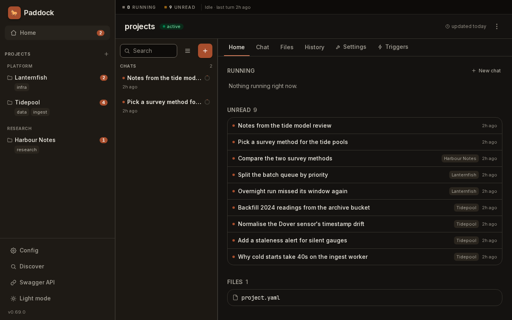

Paddock is a single process per data root + port. The fastest way to try it is
**`npx`** — nothing to install, nothing to clone. For an always-on instance on a server,
use the published Docker image; to hack on Paddock itself, run it from source.

## Try it with npx

If you have Node 22+, one command gets you a running instance:

```bash
npx @edspencer/paddock -o
```

That is the whole thing. It starts the server on **http://127.0.0.1:7233**, keeps its
data in `~/.paddock`, and `-o` opens a browser at it. It does not matter which
directory you run it from.

### Discover: start from the history you already have

A brand-new instance is empty, and an empty instance opens on **Discover** instead of
an empty project list. Discover reads your Claude Code history, works out which
**directories** on this machine you have actually been using `claude` in, and offers
them as projects:



Each row is one directory, with its conversation count, when you last worked there, and
its git remote. Tick the ones you want and press **Import**. Expand a row first if you
would rather pick individual conversations than take the lot — the tickbox goes
three-state once you do.

Every row becomes a **project** pointing at that directory, and its conversations are
copied in as chats you can resume. So instead of an empty instance you are looking at
your own work, on the projects you actually have.

You can reach it again at any time from **Discover** in the sidebar — it is not only a
first-run screen.

:::note[Nothing is written into your directories]
This is the part worth being precise about, because the obvious guess is wrong.
Importing a directory creates **nothing inside it**: no `.paddock/`, no `.chats/`, no
`.gitignore` edit, no `CLAUDE.md`. The project record and the copied transcripts both
live in `~/.paddock`, and the project simply *points at* the path.

Your `~/.claude` is equally untouched. The transcripts are **copied**, with their
timestamps preserved — the originals are never moved or deleted, and your terminal
`claude` keeps working exactly as before.

If you would rather Paddock and your terminal share **one** set of transcripts, rather
than Paddock keeping a copy, that is a config key — `claude: { transcripts: host }`,
see [the config file](/configuration/config-file/#claude--what-this-instance-shares-with-your-claude-code).
:::

Two things Discover deliberately does *not* show you, both adjustable underneath the
list once they have something to hide:

- **Directories with no git repository.** Hidden by default — a directory you ran
  `claude` in once is not necessarily a project.
- **Directories outside your home.** Hidden by default.

It also always skips temp directories, system paths, Paddock's own internals, your
home directory itself, and anything that is already a project. The line above the
toggles tells you how many went each way, so "why 5 and not 12?" has an answer on
screen.

:::note[The CLI still calls this "import"]
**Adopt** is the product word for pulling an existing session into a project that is
already there: it is what the sidebar row, the dialog, the button and the badge all
say. The CLI's own `import-chats` script is one rename behind — same feature, older
label, tracked as [#770](https://github.com/edspencer/paddock/issues/770).
:::

**First run downloads ~250 MB.** Paddock drives Claude Code, and the Claude Agent SDK
ships a per-platform binary of that size. Later runs reuse the npm cache and start
immediately. If you expect to use it often, `npm i -g @edspencer/paddock` is friendlier
than bare `npx`.

Useful flags:

```
  -p, --port <port>       HTTP/WS port (default 7233, or $PORT)
      --host <host>       Bind address (default 127.0.0.1)
  -d, --data-dir <path>   Projects + state (default ~/.paddock, or $PADDOCK_DATA_DIR)
  -o, --open              Open the app in your browser once it is listening
      --verbose           Show the server's own logs (quiet by default)
  -v, --version           Print the Paddock version and exit
  -h, --help              Show this help
```

`--data-dir` is the only thing that picks which instance you get; the directory
you happen to be standing in has no effect. `--verbose` is worth one run on a new instance: several of Paddock's startup
notices — which login it found, what it bridged from `~/.claude`, what it
withheld — are written at `info`, which the quiet default filters out. The one
notice you get either way is the warning that names your `~/.claude` instruction
files when they are not being loaded.

Credentials work the same as everywhere else — see
[Claude authentication](#claude-authentication) below.

An npx run binds **loopback with authentication disabled**, which is the right default
for a laptop, and it *fails closed*: bind a routable address without configuring auth and
it refuses to start. See [Binding & network exposure](/configuration/binding-and-exposure/).

## Run with Docker

For an always-on instance on a server, the published image is the simplest route. Point
it at a data volume and give it a Claude token:

```bash
docker run -d --name paddock -p 127.0.0.1:7233:7233 \
  -e CLAUDE_CODE_OAUTH_TOKEN=…       `# Max plan auth (or ANTHROPIC_API_KEY)` \
  -e PADDOCK_DATA_DIR=/data \
  -e PADDOCK_DANGEROUSLY_ALLOW_OPEN=1 `# required in a container — see below` \
  -v paddock-data:/data \
  ghcr.io/edspencer/paddock:latest
```

Then open **http://localhost:7233** and click **New Project**.

:::caution[Both of those flags are load-bearing — without the first, Paddock won't start]
**`PADDOCK_DANGEROUSLY_ALLOW_OPEN=1` is required for *any* container run.** Inside a
container the app always binds `0.0.0.0`, because Docker's port publishing can't route
to an in-container `127.0.0.1`. Paddock's fail-closed
[bind guard](/configuration/binding-and-exposure/) sees a non-loopback bind under the
default `PADDOCK_AUTH_MODE=none` and **refuses to boot** — the container exits straight
away with `refusing to start: bind host "0.0.0.0" is not loopback…`. The flag downgrades
that refusal to a boot warning.

**`-p 127.0.0.1:7233:7233`** is what actually keeps you safe, and it's why the flag
above is acceptable here. It publishes to the host's loopback only, so the real boundary
is the container's network namespace plus this publish — not the in-container bind.
Publishing on a routable address (`-p 7233:7233`) with no auth mode hands an
unauthenticated, code-executing Paddock to your whole network.

To reach it from another machine, keep the loopback publish and put a reverse proxy in
front — see [Securing Paddock](/guides/securing/).
:::

### Two image flavors: base vs devbox

Paddock publishes **two official images** from the same source — pick the tag that
matches what your agents do:

- **`ghcr.io/edspencer/paddock:latest`** — the **base** image (used above). The lean
  runtime: the Paddock app plus `git`, `openssh-client`, `gh`, and the `claude` CLI.
  Everything a stock instance needs to read, write, and reason over code.
- **`ghcr.io/edspencer/paddock:devbox`** — the **devbox** image. Base *plus* the
  coding-agent toolbox: `pm`/PM2 preview servers, `ffmpeg`, a headless Playwright MCP
  browser, the Docker CLI (with the `buildx` and `compose` plugins), `kubectl`, and a
  scripting kit (`python3`, `uv`, `jq`, `rsync`). Reach for it when Claude needs
  to **build and run** apps, not just edit them.

The devbox only adds tools — same app, same `/data` layout — so you can swap tags
against the same volume. It's a much bigger image (the Chromium layer alone is ~1 GB),
so stay on base unless you need those tools.
[The Dev Box flavor](/guides/dev-box-flavor/) is the canonical breakdown of what each
image carries, and why each tool is in the image it's in.

### docker-compose

```yaml
services:
  paddock:
    image: ghcr.io/edspencer/paddock:latest
    ports:
      # Loopback only. Do NOT use "7233:7233" without an auth mode in front.
      - "127.0.0.1:7233:7233"
    environment:
      CLAUDE_CODE_OAUTH_TOKEN: ${CLAUDE_CODE_OAUTH_TOKEN} # or ANTHROPIC_API_KEY for API pricing
      PADDOCK_DATA_DIR: /data
      # Required in a container — see the caution above.
      PADDOCK_DANGEROUSLY_ALLOW_OPEN: "1"
    volumes:
      - paddock-data:/data
volumes:
  paddock-data:
```

:::tip[Ready-made deploy recipes]
For a maintained starting point, the
[**`paddock-deploy`**](https://github.com/edspencer/paddock-deploy) repo collects
self-hosting recipes you can copy: a base + devbox
[`docker/`](https://github.com/edspencer/paddock-deploy/tree/main/docker)
compose stack, `proxmox-iac/` (Tofu + Ansible), `kubernetes/` (Kustomize), and an
`auth-basic/` Caddy sidecar for a quick login gate. See
[Deploying Paddock](/guides/deploying/) for the recommended setup.
:::

:::caution[No built-in login]
Paddock has **no authentication of its own**. Anywhere it is reachable by more than your
own machine — a server, a container published on a routable address — run it behind a
reverse proxy / auth layer you trust; see
[Authentication](/configuration/authentication/). It reads credentials from the
environment and from files the host provides; it never stores secrets itself.

This is not a concern for a local `npx` run, which binds loopback only.
:::

## Claude authentication

Paddock passes your Claude credentials through to the agents. Provide **one**:

- `CLAUDE_CODE_OAUTH_TOKEN` — Claude **Max plan** auth.
- `ANTHROPIC_API_KEY` — **API-pricing** auth.

Either works on either runtime — the choice of credential is independent of how a
turn is driven.

The token is passed through the process environment; it is never written to disk by
Paddock.

**Or provide neither.** If this machine already has a Claude Code login, Paddock uses
it: the macOS Keychain entry on a Mac, your `~/.claude/.credentials.json` elsewhere.
That is `claude.credentials: host`, the default, and it is the one thing Paddock shares
by default — because reading a login writes nothing. Set `claude: { credentials: own }`
in the [config file](/configuration/config-file/#claude--what-this-instance-shares-with-your-claude-code)
to turn it off.

That login is the *only* thing shared by default. Your `~/.claude/CLAUDE.md`, `agents/`,
`commands/` and `plugins/` are not loaded, and the hooks your `settings.json` binds to
tool use do not run — `claude.instructions` and `claude.hooks` turn each on, and both
default to `own`. If you have a curated `~/.claude/CLAUDE.md`, that is the one to know
about: Paddock warns at startup, naming the key, when it finds files it is not
loading — including on a plain `npx` run.

## Run from source

You need **Node 22+**. Chats resolve the Claude Agent SDK's own bundled binary and never
consult `PATH`, so they work without anything else installed. The **`claude` CLI** on
your `PATH` is needed by the **post-turn sweeper** — the one turn Paddock always runs
through the CLI — and by any turn resolved to **`driveMode: batch`**.

A trigger is *not* automatically a CLI turn: it resolves its drive mode exactly the way
a chat does (project override, else the instance default), so on the built-in default
`session` a scheduled or event trigger goes through the SDK runtime and never consults
`PATH`. It needs `claude` installed only when its project — or the whole instance — is
pinned to `batch`.

```bash
git clone https://github.com/edspencer/paddock.git
cd paddock
npm install
```

### Production-like (one process serves API + WS + SPA)

This is how the deployed service runs — the server serves the built SPA and exposes
`/api` + `/ws` on the same origin.

```bash
# Load your Claude token into the environment (never echo it).
export CLAUDE_CODE_OAUTH_TOKEN=…

npm run build                 # build web dist + server dist
export PADDOCK_DATA_DIR="$(mktemp -d /tmp/paddock-dev.XXXXXX)"   # optional throwaway data dir
npm run start                 # node packages/server/dist/index.js
```

Open **http://localhost:7233/**. Quick checks:

```bash
curl -s http://localhost:7233/api/health     # {"ok":true}
curl -s http://localhost:7233/api/projects    # {"projects":[...]}
```

### Hot-reload dev (two processes)

For frontend iteration — Vite serves the SPA on `:5173` and proxies `/api` + `/ws`
to the backend on `:7233`:

```bash
npm run dev        # terminal 1 — backend (watched) on :7233
npm run dev:web    # terminal 2 — Vite SPA on :5173
```

See the repo's [DEV.md](https://github.com/edspencer/paddock/blob/main/DEV.md) for
the full local-development guide.

## Next steps

- [Concepts](/concepts/) — how projects, agents, chats, and the sweeper fit together.
- [Environment variables](/configuration/environment/) — the complete `PADDOCK_*` reference.
- [Architecture](/architecture/overview/) — what's happening under the hood.
