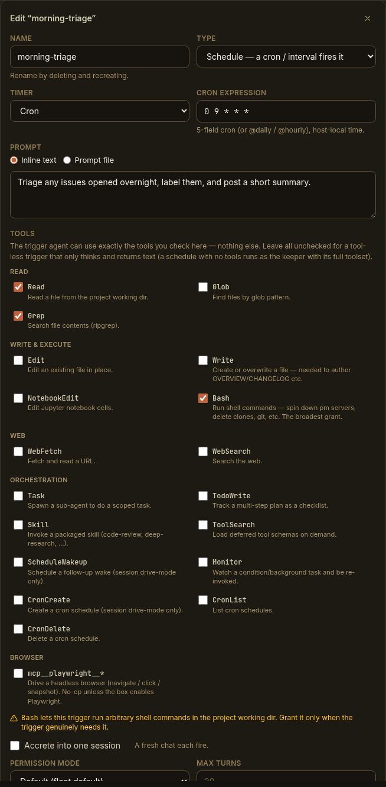

The declarative reference for schedules: the trigger schema, the older standalone
`schedules` block, the self-MCP tools Claude uses to manage a project's schedules,
and the REST surface behind the [Triggers tab](/using/scheduling-recurring-work/).

## The trigger schema (schedule)

A schedule is a **trigger** persisted in a project's `project.yaml` under the
`triggers` map, keyed by name. Each trigger is **`trigger`** (when) +
**`run`** (what) + **`enabled`**:

```yaml
# project.yaml
triggers:
  morning-triage:
    trigger:                       # WHEN — the schedule
      type: schedule
      cron: "0 9 * * *"            # 5-field cron (or @daily / @hourly), host-local
      # interval: "30m"            # …or a duration; exactly ONE of cron / interval
    run:                           # WHAT — the fired agent turn
      prompt: Triage overnight issues and post a summary.
      # promptFile: triage.md      # …or a .md file under .paddock/triggers/; exactly ONE
      session: new                 # "new" (default) | "resume"
      tools: [Read, Grep]          # allow-list = capability; [] = the project's own agent
      model: ""                    # optional model override
      permissionMode: acceptEdits  # default | acceptEdits | bypassPermissions | plan
      maxTurns: 30                 # optional cap (default 30)
      maxSpawnDepth: 0             # optional; 0 = may not spawn children
    enabled: true
```

The fields:

| Field | Values | Notes |
| --- | --- | --- |
| `trigger.type` | `schedule` | The discriminant. Triggers can also be `event` (an `onArchive` / `afterTurn` lifecycle event) or `webhook` — the latter is **shape-reserved but not yet fireable** (no inbound ingress yet). The `afterTurn` event is reserved for the built-in [sweeper/curator](/concepts/sweeper/#customise-or-disable-it). |
| `trigger.cron` | 5-field string | e.g. `0 9 * * *`; `@daily` / `@hourly` accepted. Host-local time. |
| `trigger.interval` | duration string | e.g. `30m`, `1h`, `15m`. |
| `run.prompt` | string | The instruction the firing runs. |
| `run.promptFile` | `*.md` name | Read fresh at firing from `.paddock/triggers/`; traversal and non-`.md` are rejected. |
| `run.session` | `new` \| `resume` | `new` (default) = a fresh chat each firing; `resume` = one owned accreting session. |
| `run.tools` | string array | The fired agent's allow-list. Empty (default) = runs as the project's own agent with full tools; non-empty = its own scoped `trigger-<slug>-<name>` agent with exactly those tools. |
| `run.model` | string | Optional per-trigger model override. |
| `run.permissionMode` | `default` \| `acceptEdits` \| `bypassPermissions` \| `plan` | Permission mode the fired turns run under. |
| `run.maxTurns` | integer | Upper bound on agent turns (default 30). |
| `run.maxSpawnDepth` | integer ≥ 0 | Bounds internal spawning (`0` = may not spawn). |
| `enabled` | boolean | Whether it's armed. A trigger created through the UI or MCP defaults to **disabled**. |

:::note[Exactly-one rules]
A schedule needs **exactly one** of `cron` / `interval`, and its `run` needs
**exactly one** of `prompt` / `promptFile`. A malformed entry in a hand-edited
`triggers` map is dropped (rather than bricking the project), so a bad edit can't
take the project down.
:::

The schedule editor maps one-to-one onto this schema:



### The legacy `schedules` block

Before triggers were unified, schedules lived in their own top-level `schedules`
map. That form is **still honored and armed** — a simpler shape when you only need
a timer:

```yaml
# project.yaml — legacy standalone schedules (still supported)
schedules:
  nightly-scan:
    type: cron                 # cron | interval
    cron: "0 3 * * *"
    prompt: Scan for dependency advisories.
    resume_session: false      # note: snake_case here (false = fresh chat each fire)
    enabled: true
```

Note the differences from the unified `run` block: `resume_session` (snake_case)
in place of `session: new|resume`, and `promptFile` here resolves under
`.paddock/schedules/` rather than `.paddock/triggers/`. New work is better
expressed as a `triggers` entry (it's what the Triggers tab and the MCP tools
read and write), but existing `schedules` blocks keep working.

## Self-MCP tools

When the [trigger-management MCP is enabled](/configuration/schedules/#self-scheduling-from-a-chat)
— the self-MCP write layer (`PADDOCK_SELF_MCP` + `PADDOCK_SELF_MCP_WRITE`) **plus**
`PADDOCK_HOOKS_MCP` (or a per-project `hooksMcpEnabled`) — Claude is given four
tools. They manage every trigger type; for a schedule, use `type: "schedule"`.

### `set_trigger`

Create or update a trigger (a partial patch — an `enabled`-only call just flips the
toggle). Parameters (note the **snake_case** MCP argument names):

| Parameter | Type | Notes |
| --- | --- | --- |
| `name` | string | The trigger's stable key. **Required.** |
| `type` | `schedule` \| `event` \| `webhook` | Omit on an edit to keep the existing *when*. `webhook` is reserved (not yet fireable); `afterTurn` events are reserved for the curator. |
| `cron` | string | For a schedule: a 5-field expression (host-local). Exactly one of `cron` / `interval`. |
| `interval` | string | For a schedule: a duration (`30m`, `1h`). |
| `prompt` | string | Inline instruction. Provide this **or** `prompt_file`. |
| `prompt_file` | string | A `.md` file under `.paddock/triggers/`, read at firing. |
| `session` | `new` \| `resume` | `new` (default) = fresh chat each firing; `resume` = one owned session. |
| `tools` | string / array | Allow-list (one per line, comma-separated, or a JSON array). Empty = the project's own agent. |
| `model` | string | Model override for the fired agent. |
| `permission_mode` | `default` \| `acceptEdits` \| `bypassPermissions` \| `plan` | |
| `max_spawn_depth` | number | `0` = may not spawn. |
| `max_turns` | number | Caps the fired turn. |
| `enabled` | boolean | Defaults **false** on a new trigger; omitted on an existing one leaves it unchanged. |
| `project` | string | Target project slug; omit for the current project. |

### `list_triggers`

List a project's triggers (all types) — what's declared, and their state.

### `remove_trigger`

Delete a trigger by name.

### `run_trigger`

Fire a trigger immediately, without waiting for its cron or event — the same
"Run now" path the Triggers tab uses. Handy for testing a prompt before you leave
it to a schedule. Like the REST route, it starts a real turn, so it is gated with
the rest of this family.

## REST endpoints

The Triggers tab drives the unified trigger surface. These endpoints are always
available (they don't require the schedule-mutation gate):

| Method & path | Purpose |
| --- | --- |
| `GET /api/projects/:slug/triggers` | List triggers + the picker catalog (`grantableTools`, `events`, `triggerTypes`). |
| `GET /api/projects/:slug/triggers/:name` | Get one trigger. |
| `PUT /api/projects/:slug/triggers/:name` | Create or replace one trigger (full `{ trigger, run, enabled }` record). Enable/disable is this call with `enabled` flipped. |
| `DELETE /api/projects/:slug/triggers/:name` | Delete and disarm one trigger. |
| `GET /api/projects/:slug/triggers/runtime` | Just the armed / next-fire runtime state, so the Triggers tab can poll cheaply without re-fetching the config and picker catalog. A static segment, matched before `/:name`. |
| `POST /api/projects/:slug/triggers/:name/run` | **Run now** — fires through the same hub path a cron or event fire uses. `202` with the session id; `404` for an unknown trigger, `502` if the fire started no chat. |

:::note[There are no separate schedule endpoints]
This page previously listed a parallel set of legacy routes —
`GET`/`PUT`/`DELETE` on `/api/projects/:slug/schedules[/:name]`, plus
`…/:name/:action(enable|disable)` and `…/:name/trigger` — described as still
present and governed by the schedule-mutation gate. **None of them are
registered.** The hooks and schedules REST surfaces were retired and collapsed
onto the unified trigger routes above, which are the only ones served.

The legacy **`schedules:` block in `project.yaml`** is a different thing, and it
does still load — it's only the HTTP surface that's gone.
:::

## Next steps

- [Schedules](/concepts/schedules/) — the concept.
- [Scheduling recurring work](/using/scheduling-recurring-work/) — the hands-on guide.
- [Scheduling configuration](/configuration/schedules/) — the deployment gates.
