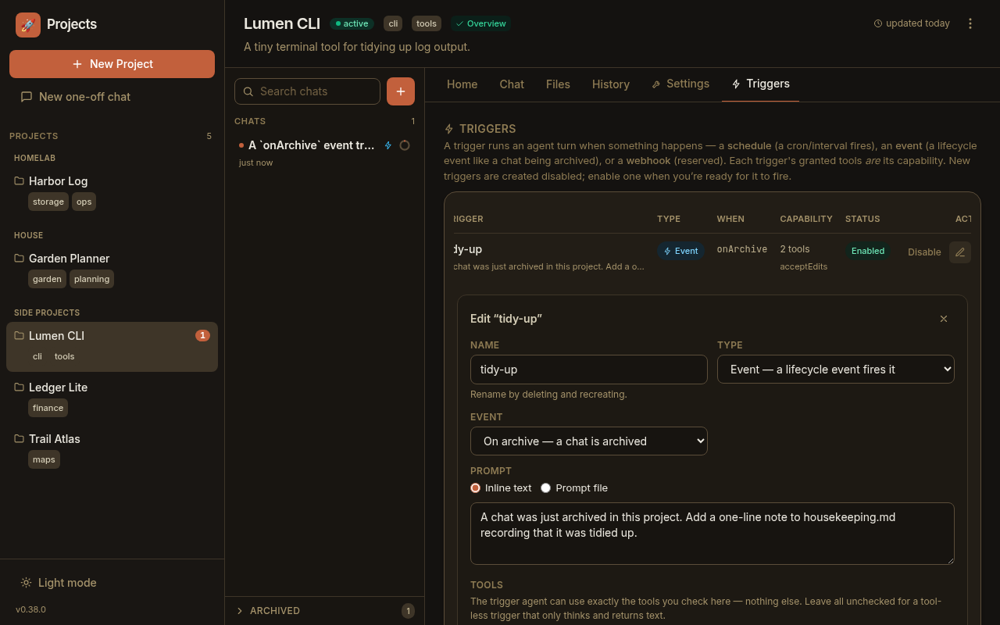
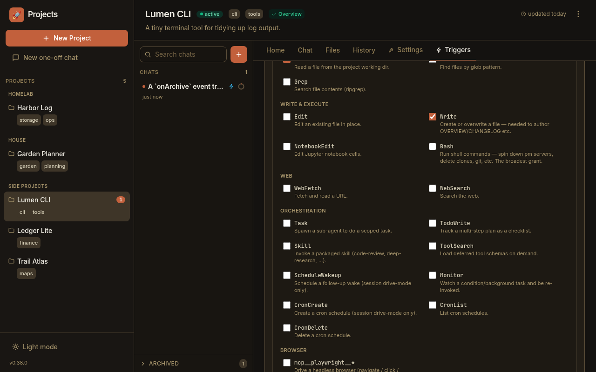

An [event hook](/concepts/hooks/) runs an agent turn **when a lifecycle event
fires**. This guide is the practical companion to that concept page: it walks
through creating an `onArchive` hook — *"when I archive a chat, tidy up after
it"* — granting it exactly the tools it needs, enabling it, and reading the run
it produces. By the end you'll also know how to let a keeper agent manage its own
hooks, and how to steer the built-in curator.

Event hooks are managed as **triggers**, so everything below happens on a
project's **Triggers** tab. (Triggers also cover time-driven *schedules*; this
guide is about the **event** type.)

## Open the Triggers tab

Open any project and click its **Triggers** tab (`/projects/<slug>/triggers`).
Each project has its own trigger list — a hook is per-project, versioned in that
project's `project.yaml`. The list starts empty; each row will show a trigger's
type, its firing condition, its capability, and whether it's enabled.

## Create an `onArchive` hook

Click **Add trigger** to open the editor, then:

1. **Name** it — e.g. `tidy-up`. Letters, numbers, `.`, `_`, `-` (renaming means
   deleting and recreating, so the name is stable).
2. Set **Type** to **Event — a lifecycle event fires it**.
3. Set **Event** to **On archive — a chat is archived** (`onArchive`). *(The
   dropdown also offers **After turn**, but that one customizes the post-turn
   [sweeper](/concepts/sweeper/) rather than a general hook — leave it on **On
   archive** here.)*
4. Write a **Prompt** — what the hook should do when it fires. Choose **Inline
   text** for a short instruction, or **Prompt file** to keep it in a git-tracked
   `.md` file under `.paddock/triggers/` that Paddock reads fresh on each fire
   (handy for a longer runbook the keeper can edit over time).

## Grant it a capability — the tool picker

A hook's granted tools **are** its whole capability, so the editor's **Tools**
section is the most important part. Check exactly the tools the hook needs —
nothing else is available to it:

- Leave **everything unchecked** for a **tool-less** hook that only reads its
  prompt and returns text.
- Check **`Write`** to let it author a file (a log, an `OVERVIEW.md`).
- Check **`Bash`** only when the hook genuinely needs a shell — it lets the hook
  run arbitrary commands in the project working directory, so the editor flags it
  with a warning. That's the grant a real "spin down the dev server and delete
  the clone" cleanup hook needs.

The other capability knobs sit below the picker: a **permission mode**, an
optional **model** override, a **max turns** bound (default **30**), a **max
spawn depth**, and whether the hook accretes into one long-lived chat or starts a
fresh chat each fire.

:::caution[The tool list is the capability — pick the minimum]
Grant the narrowest set that does the job. A hook you type a reply into later
runs at *its* capability, not the keeper's, and the same tools are what it can do
unattended. A tool-less hook is the safest starting point.
:::

## Enable it

New triggers are created **disabled** so nothing fires the instant you save.
Tick **Enabled (fires on its trigger)** when you're ready — or save it disabled
and flip it on later with the row's **Enable** button. Enabling and disabling is
just that toggle; there's no separate "arm" step, and disabling a hook keeps its
definition (and its past runs) intact.

Click **Create trigger** and the hook is live. It now shows in the list as an
**Event** trigger firing on `onArchive`, with a capability summary and an
**Enabled** status.

## Watch it fire

Trigger it: **archive a chat** in this project (the archive action in the chat
list, or a keeper's own `archive_chat`). The archive completes immediately, and
just after it commits your hook fires as its own agent turn. A new chat appears in
the sidebar with a ⚡ lightning badge, and opening it floats a read-only
**capability banner** at the top — what fired it, and the exact tools it was
granted:

The banner is projected from the same agent config the runtime enforces, so it's
truthful by construction — it can't show a capability the hook doesn't have. The
hook never blocks or fails the archive: even if the hook errors, the chat you
archived is still archived.

:::note[Hooks fire only on a real change]
`onArchive` fires when a chat *transitions* into archived. Re-archiving a chat
that's already archived is a no-op and raises nothing, so a hook won't run twice
for the same archive.
:::

## Manage hooks from an agent (the manager pattern)

You don't have to use the tab. A keeper agent can declare, edit, and delete its
own hooks through the **hook-management MCP tools** — the agent twin of the
Triggers tab:

- **`list_triggers`** — enumerate the project's triggers (hooks and schedules).
- **`set_trigger`** — create or update one. It's create-or-update by name, so
  enabling/disabling is just `set_trigger` with `enabled` flipped; a brand-new
  hook defaults to disabled. For an event hook you pass `type: "event"` and
  `event: "onArchive"`, a `prompt` (or `prompt_file`), and the capability
  (`tools`, `permission_mode`, `model`, `max_turns`).
- **`remove_trigger`** — delete one.

This is what makes *"set yourself up to tidy the project whenever I archive a
chat"* a thing you can ask a keeper to do directly.

:::caution[Off by default — a per-project opt-in]
The hook-management tools are **not** injected unless the project opts in. They're
gated by a per-project trigger-management flag (instance default
`PADDOCK_HOOKS_MCP`, overridable per project in `project.yaml`), **off by
default**; when it's off the tools are simply absent, not present-but-refusing.
See [Environment variables](/configuration/environment/) for the switch and the
[Hooks reference](/reference/hooks/) for the exact tool arguments.
:::

## Steer the built-in curator

One related knob isn't a hook you create but a file you drop in. The
[sweeper](/concepts/sweeper/) — the tool-less agent that curates `OVERVIEW.md`
and `CHANGELOG.md` after your turns — reads an optional, git-tracked
`.paddock/hooks/sweep.md` in the project. When present and non-blank, its contents
are appended to the sweeper's prompt as **extra project-specific curator
instructions** (e.g. *"always keep a Glossary section"*, *"note API changes
prominently"*). When it's absent, curation is exactly unchanged, and a missing or
unreadable file never breaks a sweep. It only shapes *how* the curator writes;
it grants no new capability.

## Next steps

- [Event hooks](/concepts/hooks/) — the concept: why the tools are the capability,
  and the fire-and-forget, after-commit guarantee.
- [The sweeper](/concepts/sweeper/) — the curator you steer with
  `.paddock/hooks/sweep.md`.
- [Hooks reference](/reference/hooks/) — the `project.yaml` schema and the exact
  hook-management MCP arguments.
- [Environment variables](/configuration/environment/) — the `PADDOCK_HOOKS_MCP`
  opt-in and other box defaults.
