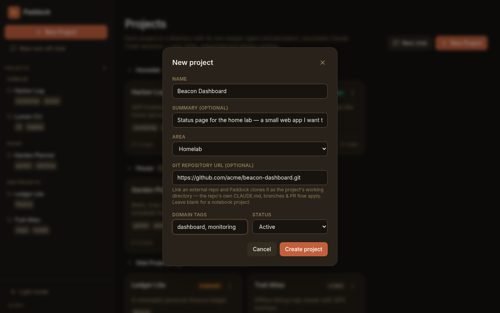
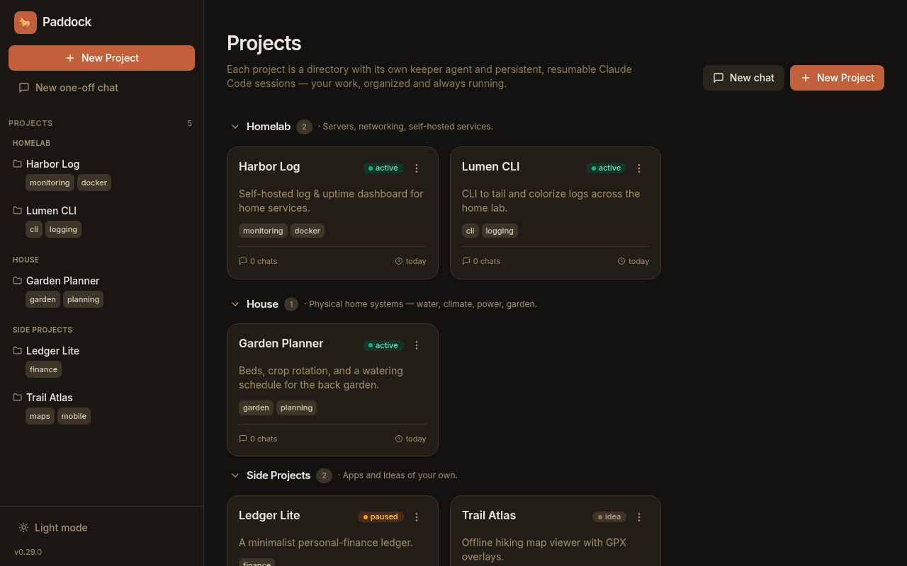

Everything you do in Paddock lives inside a **project**. This guide is the
practical, do-it-now companion to the [Projects concept](/concepts/projects/):
that page explains *what* a project is; this one walks through *how* to create
one, organize a growing collection, and tune it to your taste.

By the end you'll know how to create both kinds of project, sort them into
**areas**, set per-project metadata and keeper behaviour, and rescue a one-off
scratch chat by promoting it into a real project.

## Create a new project

Click **New Project** — the button is in the left sidebar, and again on the
projects home page (top-right, and in the empty state when you have none yet).
That opens the **New project** dialog:



You only have to fill in **one** field — everything else has a sensible default:

- **Name** *(required)* — a human title, e.g. `Garden Planner`. Paddock derives
  the on-disk **slug** from it automatically (`Garden Planner` → `garden-planner`),
  so you never type a slug.
- **Summary** *(optional)* — one line on what the project is about.
- **Area** — the single group this project belongs to (see
  [Organize projects into areas](#organize-projects-into-areas)). Defaults to
  **Unsorted**; you can move it later.
- **Git repository URL** *(optional)* — leave it blank for a **notebook**
  project; paste a repo URL to make it **repo-backed** (next section).
- **Domain tags** — comma-separated, cross-cutting labels like
  `garden, planning`. Unlike the area, a project can carry many tags.
- **Status** — defaults to **active**. Pick `idea` for something you're still
  mulling.

Click **Create project** and you're dropped straight into the project's first
chat, ready to start working.

:::note[No slug or visibility field here]
The dialog keeps creation to the essentials. The **slug** is generated from the
name, and **visibility** defaults to `public`. Both — plus everything above —
are editable afterwards from the project's [Settings tab](#tune-the-keeper-the-settings-tab).
:::

## Choose the project type: notebook vs repo-backed

The single choice that matters at creation time is whether you fill in the
**Git repository URL** field. It's what splits the two project types, and it's
**immutable** once the project exists — so it's worth getting right.

### Notebook — for notes, plans, and ops

Leave the git field blank. The project directory itself becomes the keeper's
working directory, and Paddock seeds it with a starter `CLAUDE.md`. This is the
right choice for research, planning, home-lab runbooks, or anything that isn't
itself a code repository. The keeper works with Markdown notes, docs, and its
chat history — all curated inside Paddock.

### Repo-backed — for a codebase you want the keeper to build

Paste an external git URL and Paddock **clones that repo into a checkout inside
the project**, then points the keeper's working directory at the clone. HTTPS,
SSH (`git@host:owner/repo`), `git://`, and local paths all work.

Because the keeper now lives inside a real checkout, **the repo's own `CLAUDE.md`,
branches, and PR workflow all apply** — the keeper can branch, commit, and open
pull requests against the upstream just like you would. Paddock keeps its own
metadata (`project.yaml`, `OVERVIEW.md`, `CHANGELOG.md`, and the chat transcripts)
in the enclosing project directory, safely outside the checkout via a sidecar
`.gitignore`.

:::caution[Private repos need reachable credentials]
Paddock runs `git clone` with credential prompts disabled, so a **private** repo
URL fails fast rather than hanging. Make sure the host can reach the repo (a token
in the environment, an SSH key, or a public URL) before creating a repo-backed
project. See [Securing Paddock](/guides/securing/) for how credentials reach the
box.
:::

For the full mechanics of `dir` vs `workingDir` and why metadata stays outside
the checkout, see the [Projects concept page](/concepts/projects/).

## What a project.yaml holds

A project is just **a directory plus a `project.yaml`** under your data root. You
rarely edit it by hand — the [Settings tab](#tune-the-keeper-the-settings-tab)
writes it for you — but knowing the shape helps. A fuller example:

```yaml
# Paddock project metadata. Directory name MUST equal `slug`.
# status: idea | active | paused | blocked | done | abandoned
name: Garden Planner
slug: garden-planner
status: active
domain:
  - garden
  - planning
visibility: public
started: 2026-07-17
updated: 2026-07-17
summary: Beds, crop rotation, and a watering schedule for the back garden.
group: house
```

The fields:

| Field | What it is |
| --- | --- |
| `name`, `slug` | Title and its derived directory name. `slug` is **immutable**. |
| `status` | `idea` · `active` · `paused` · `blocked` · `done` · `abandoned`. |
| `visibility` | `public` or `private`. |
| `summary` | The one-liner shown on the card. |
| `domain` | Cross-cutting tags (many per project). |
| `group` | The project's **area** — its single, exclusive home. |
| `started`, `updated` | Creation date (immutable) and last-touched date (auto-bumped). |
| `links` | Optional `{label, url}` bookmarks. |
| `repo` | Present only for repo-backed projects; **immutable**. |
| `model`, `permissionMode`, `driveMode`, `maxTurns`, `docker` | Per-project keeper overrides — see below. Absent means *inherit the box default*. |

Paddock writes only the fields it needs: on a freshly created project, keeper
overrides you didn't set are absent from the file and resolve to the box-wide
defaults at run time. (Saving the [Settings tab](#tune-the-keeper-the-settings-tab)
changes this for some of them — see the caveat there.)

## Organize projects into areas

As your collection grows, the projects home page keeps it legible by clustering
cards under their **area** — the project's `group`. An area is simply a
**free-form label**: the server stores whatever string you give it, so you can
have as many areas as you like and name them anything. To make the common cases
one click, the **Area** dropdown (in the New Project dialog and in Settings)
comes pre-filled with three ready-made suggestions — **Homelab**, **House**, and
**Side Projects** — plus **Unsorted**. You are in no way limited to those.



On the home page an area only becomes a section **once at least one project uses
it** — a fresh Paddock with no projects shows no area sections at all. When
sections do appear they're ordered predictably: the three built-in areas first
(in the order above), then any custom areas alphabetically, then **Unsorted**
last. Each section is collapsible, with a heading and a project count. Set a
project's area at creation from the **Area** dropdown, or change it any time from
Settings.

:::tip[Areas vs. tags — one home, many labels]
A project lives in **exactly one area** (its shelf), but can carry **many domain
tags** (its cross-cutting labels). Tags are clickable — following one filters the
grid to every project that shares it — so use the area for *where a project
lives* and tags for *themes that cut across areas* (e.g. `networking`,
`urgent`).
:::

## Tune the keeper: the Settings tab

Open any project and go to its **Settings** tab (`/projects/<slug>/settings`) to
edit everything the creation dialog left out, plus how the project's **keeper
agent** behaves. Changes are staged and applied with **Save changes**.

**Identity & metadata** — Name, Summary, Status, Area, Visibility, Domain tags,
and Links, all editable here. (Slug, Started, and Created are shown read-only.)

**Keeper agent** — the knobs that shape how the agent runs:

- **Model** — which Claude model the keeper uses. Larger context windows
  (Opus/Fable/Sonnet: 1M; Haiku: 200K) fit longer chats.
- **Permission mode** — how much the keeper asks before acting:
  - **Default (ask each time)**
  - **Accept edits** *(the default)* — applies file edits without asking
  - **Plan only**
  - **Bypass all (use with care)** — runs every tool unprompted; only for
    sandboxes you trust.
- **Drive mode** — **Batch (one-shot per turn)** is the classic path; **Session
  (cross-turn autonomy)** keeps the agent alive across turns so features like
  `ScheduleWakeup` and `/loop` work. Leave it on **Global default** to inherit the
  box-wide `PADDOCK_KEEPER_DRIVE_MODE`; a **Reset to global default** button clears
  an override.
- **Max turns** — an upper bound (1–1000) on agent turns in a single run.
- **Docker sandbox** — run the keeper inside a Docker container (needs a working
  Docker daemon on the box).

:::note[What "inherit" really means once you Save]
Only **drive mode** genuinely keeps tracking the global default: left on **Global
default** it stays *absent* from `project.yaml`, so the project follows the
box-wide `PADDOCK_KEEPER_DRIVE_MODE` as you change it. The other keeper settings
(model, permission mode, max turns, docker) are written with **concrete values**
the first time you **Save** on this tab — so saving *freezes* them at their
current values rather than leaving them to track the box default afterwards.
:::

See [Environment variables](/configuration/environment/) for the defaults a fresh
project starts from.

### Preload project context (in the composer, not Settings)

One keeper-related toggle lives on the **chat composer**, not the Settings tab:
**Preload project context**. On the **first turn of a new project chat**, it
injects the project's curated `OVERVIEW.md` + `CHANGELOG.md` so the keeper starts
already knowing the project's current state and history. It's on by default. On a
brand-new project the toggle still appears but is **disabled** (labelled "no
overview yet") until the [sweeper](/concepts/sweeper/) has written an
`OVERVIEW.md` — there's nothing to preload until then.

## Promote a scratch chat into a project

Not everything starts as a project. Paddock has **one-off (scratch) chats** — a
quick conversation not tied to anything — for when you just want to think out
loud. If one turns out to be worth keeping, don't copy-paste it: **promote it**.

From a one-off chat, click **Promote to project**. Give it a **Project name**
(pre-filled from the chat), and optionally a summary, area, and domain tags:

Paddock then creates a real project **and moves the chat's full history into it**
— transcript and all — so the conversation stays resumable under the new
project's keeper. Nothing is lost; the scratch chat simply becomes the project's
first chat.

:::tip[Start loose, organize later]
This is the intended workflow: brainstorm in a scratch chat with zero setup, and
only promote to a project once it's clearly something you'll return to. You never
have to decide up front.
:::

## Next steps

- [Projects](/concepts/projects/) — the concept behind notebook vs repo-backed,
  and what a project directory contains.
- [Keeper & scratch agents](/concepts/keeper-and-scratch/) — the agents that do
  the work in each project.
- [The sweeper](/concepts/sweeper/) — how `OVERVIEW.md` and `CHANGELOG.md` stay
  curated (and what "Preload project context" injects).
- [Environment variables](/configuration/environment/) — the box-wide defaults
  your per-project settings inherit from.
