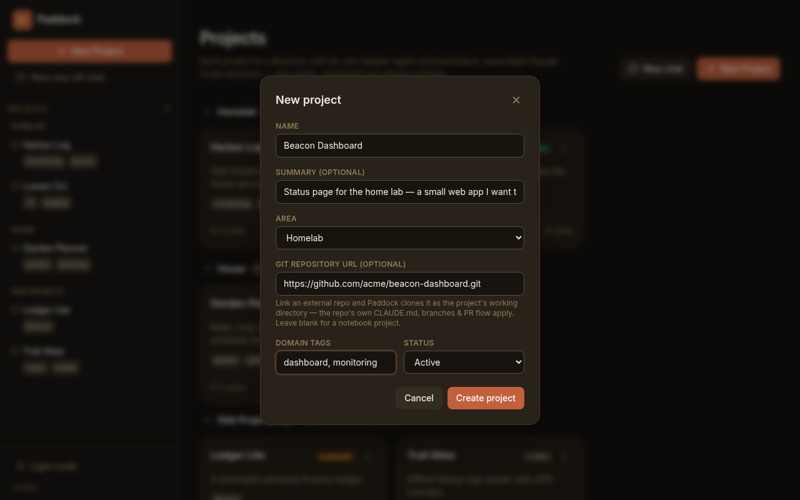
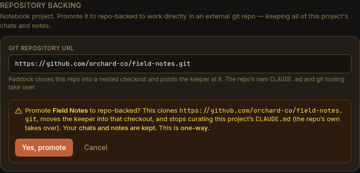
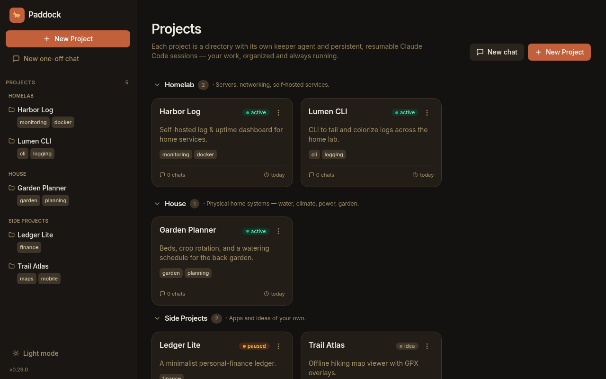
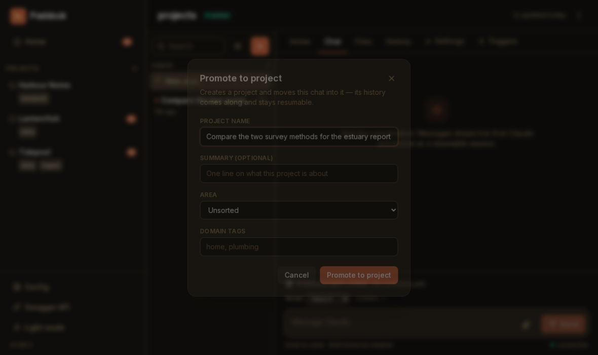

Everything you do in Paddock lives inside a **project**. This guide is the
practical, do-it-now companion to the [Projects concept](/concepts/projects/):
that page explains *what* a project is; this one walks through *how* to create
one, organize a growing collection, and tune it to your taste.

By the end you'll know how to create a project of any shape, sort them into
**areas**, set per-project metadata and agent behaviour, and rescue a root chat
by promoting it into a project of its own.

## You may not need the dialog: Discover

If the directory already exists on this machine and you have been running
`claude` in it, the fastest route into Paddock is not the New project dialog at
all. **Discover** reads your Claude Code history, lists the directories you have
actually been working in, and turns the ones you tick into projects — **with
their conversations**, adopted in the same step.

It is **not only a first-run screen**. An empty instance opens on it, but it is
also a permanent **Discover** entry in the sidebar (below Config) and an ordinary
route at `/discover`, because you keep accruing terminal history and there is
always plausibly something new to find. See
[Discover: start from the history you already have](/getting-started/#discover-start-from-the-history-you-already-have)
for what it offers, what it filters out, and the two toggles that relax the
filters — no need to duplicate the rules here.

What matters for *this* page is the shape of what you get. Each imported row
becomes an **unmanaged project with a `path:`** — exactly what the dialog's
**Directory on this machine** field produces, and unmanaged because Paddock
should not be handed leave to rewrite the `CLAUDE.md` of a checkout you already
own. So everything below — areas, `project.yaml`, the Settings tab, promotion —
applies to a discovered project unchanged; see
[Question 2](#question-2--where-does-the-content-live) for what linking a
directory does and does not do.

:::note[Discover, Import, and "Adopt N native chats"]
Three adjacent words that collide here, and they are three different scopes:

- **Discover** — instance-level: *which directories could become projects?*
- **Import** — the button on that screen: bring the ticked ones in, as projects.
- **Adopt N native chats** — per-project and ongoing: a project you *already*
  have has accrued more terminal history, and this pulls those conversations in.
  See [Adopt your terminal `claude` history](/using/working-in-chats/#adopt-your-terminal-claude-history).
:::

## Create a new project

For a project that does not exist yet — and for anything that needs Paddock to
**clone a repo** for you, which Discover cannot do — the dialog is still the way.

Click **New Project** — the button is in the left sidebar, and again on the
projects home page (top-right, and in the empty state when you have none yet).
That opens the **New project** dialog:



You only have to fill in **one** field — everything else has a sensible default:

- **Name** *(required)* — a human title, e.g. `Garden Planner`. Paddock derives
  the on-disk **slug** from it automatically (`Garden Planner` → `garden-planner`),
  so you never type a slug.
- **Summary** *(optional)* — one line on what the project is about.
- **Area** — the single group this project belongs to (see
  [Organize projects into areas](#organize-projects-into-areas)). Defaults to
  **Unsorted**; you can move it later.
- **Directory on this machine** *(optional)* — an absolute path where the
  project's content lives, or should live (next section).
- **Git repository URL** *(optional)* — a repo for Paddock to clone, or to record
  as the remote behind a directory you named (next section).
- **Domain tags** — comma-separated, cross-cutting labels like
  `garden, planning`. Unlike the area, a project can carry many tags.
- **Status** — defaults to **active**. Pick `idea` for something you're still
  mulling.

Click **Create project** and you're dropped straight into the project's first
chat, ready to start working.

:::note[No slug or visibility field here]
The dialog keeps creation to the essentials. The **slug** is generated from the
name, and **visibility** defaults to `public`. Both — plus everything above —
are editable afterwards from the project's [Settings tab](#tune-the-agent-the-settings-tab).
:::

## Choose the shape: two questions, not three types

There is no menu of project types to pick from. The dialog asks two independent
questions, and everything else derives from your answers:

1. **Is this notes Paddock should curate, or a codebase it shouldn't?** That's the
   **managed** axis.
2. **Where does the content live?** That's the **Directory on this machine** and
   **Git repository URL** fields.

The two are orthogonal — notes can live at a path you nominate, and a codebase can
be one Paddock clones *or* one you already have.

### Question 1 — notes, or a codebase?

**Managed** means Paddock looks after the project's own files: the
[sweeper](/concepts/sweeper/) curates its `CLAUDE.md`, `OVERVIEW.md`, and
`CHANGELOG.md`. This is the classic notebook — research, planning, home-lab
runbooks, anything that isn't itself a code repository. Claude works with Markdown
notes, docs, and the chat history, all curated inside Paddock.

**Unmanaged** means the content is code you or your agents source-control outside
Paddock. Paddock never writes project files into it, so **the repo's own
`CLAUDE.md`, branches, and PR workflow all apply** — Claude can branch, commit, and
open pull requests against the upstream just like you would. `OVERVIEW.md` and
`CHANGELOG.md` are still curated, but they're kept in the project's own folder
inside Paddock's data directory, safely outside your working tree. Its `CLAUDE.md`
is never touched.

You usually don't answer this question directly. **Leave both location fields
blank and you get a managed notebook; fill either one in and you get an unmanaged
project** — which is almost always what you meant. There is exactly one genuinely
ambiguous case, and that's the only time the dialog asks:

:::note[The "These are notes" checkbox]
Give a **directory** with **no repo URL** and a checkbox appears: *"These are
notes — let Paddock curate them."* A bare directory could equally be a folder of
Markdown you want curated or a checkout you want left alone, and Paddock won't
guess. Tick it for notes; leave it clear for code.
:::

One combination is refused outright: **managed plus a git repository URL**.
Paddock curating files into a repo it also clones has no sensible meaning, so the
create fails rather than quietly picking an interpretation.

### Question 2 — where does the content live?

| You fill in | Where Claude works |
|---|---|
| Nothing | The project's own directory inside Paddock's data dir. |
| **Git repository URL** only | A checkout Paddock clones for you, nested inside the project directory. |
| **Directory on this machine** | *That directory*, used **in place, with no copy** — your real history, your branches, your remotes. |
| **Both** | The directory wins as the working directory; the URL is recorded as the remote behind it. |

HTTPS, SSH (`git@host:owner/repo`), `git://`, and local paths all work as repo
URLs. A directory path must be **absolute**, and must sit **outside** Paddock's
own projects root and data directory, and outside every other project's working
directory.

:::tip[Paddock writes nothing into a directory you nominate for code]
For an unmanaged project: no `.chats/`, no `.gitignore`, no `CLAUDE.md`. Chat
transcripts live in the project's own folder inside Paddock's data directory, and
the repo's own `CLAUDE.md` is the only one in play. `git status` in your checkout
stays as clean as you left it.
:::

For a **managed** project a directory means something slightly different: it
nominates where your **notes** should live. `OVERVIEW.md`, `CHANGELOG.md`, and
`CLAUDE.md` then get written *there* rather than inside Paddock's data dir — an
accepted consequence of asking for your notes to live somewhere specific. Only
`project.yaml` and the chat transcripts stay behind.

### What Paddock does with the directory

The path doesn't have to exist yet. What happens depends on what else you gave it:

| Directory | Repo URL | What happens |
|---|---|---|
| Exists | — | Used as-is. |
| Exists | Given | Used as-is, and Paddock checks its git remotes match. A mismatch is a **warning**, not a failure — a fork or an `ssh`-vs-`https` spelling is legitimate, but silently ignoring the URL isn't. |
| Missing | Given | Paddock clones the repo to that path. |
| Missing | — (managed) | Paddock creates the directory. An empty folder is a fine place to start taking notes. |
| Missing | — (unmanaged) | **Rejected.** There's nothing to clone from, and an empty directory isn't a codebase. |

If a create fails partway through, Paddock removes only directories *it* made
during that attempt — a directory that was already there is never deleted.

:::note[No repository required]
Paddock probes for git and lights up the git features — the **Changes** tab,
commit and push — when your working directory turns out to be a repo. It never
insists on one. A plain folder of notes is a perfectly valid project.
:::

:::caution[Private repos need reachable credentials]
Paddock runs `git clone` with credential prompts disabled, so a **private** repo
URL fails fast rather than hanging. Make sure the host can reach the repo (a token
in the environment, an SSH key, or a public URL) before creating a project that
clones. See [Securing Paddock](/guides/securing/) for how credentials reach the
box.
:::

### Why point at a directory you already have

This is the mode for running Paddock on your own machine over the clones you
already work in — and two things follow from the working directory being one you
also use by hand:

- **Prior `claude` sessions in that directory are offered for adoption.**
  Transcripts are keyed by working directory, so the conversations you already had
  there show up in the project's **Adopt chats** list. (This only ever surfaces
  sessions that really happened on this machine at that path.)
- **The [`claude.transcripts`](/configuration/config-file/) and
  `claude.mcpServers` levers finally mean something for a code project.** Both key
  on the working directory. A project pointed at a clone Paddock made points at a
  directory you have never opened a terminal in, so `transcripts: host` has nothing
  to share and your `~/.claude.json` has no per-directory MCP servers registered
  for it. A directory you already use matches natively.

The **Changes** tab reports on the project's *working* directory too, so it shows
the state of your actual checkout.

:::caution[A path is specific to this machine]
It records an absolute path that Paddock did not create, so it does not survive
being rebuilt somewhere else — on a fresh box the project points at a directory
that isn't there yet. Filling in the **Git repository URL** as well is what gives
Paddock something to re-clone from.
:::

**`path` and the managed setting are both fixed at creation and immutable.** The
working directory is baked into every transcript path, so re-pointing it would
strand the project's history.

For the full mechanics of `dir` vs `workingDir` and where each file lands, see the
[Projects concept page](/concepts/projects/).

### Promote a notebook to repo-backed

A notes-only project that turns out to want a codebase doesn't have to be torn
down and recreated. From its **Settings** tab, the **Repository backing** section
turns a managed notebook into a repo-backed project **in place** — keeping every
chat, `OVERVIEW.md`, `CHANGELOG.md`, and every bit of metadata it has accumulated.

This is the one transition across the managed axis, and it only offers itself for
a project that is **managed and has no `path` of its own**. An already-unmanaged
project has nothing to promote; a managed project with its own directory is a
notes folder you nominated, so Paddock refuses rather than turning it into a
checkout behind your back.

Paste the git URL, click **Promote to repo-backed…**, and confirm:



Paddock **clones first**, so a clone that fails leaves the notebook completely
untouched. Once the clone lands, `repo:` is written to `project.yaml`, the project
flips to **`managed: false`**, and the working directory **flips to the checkout**
— from then on the repo's own `CLAUDE.md`, branches, and PR workflow apply,
exactly as for a project created that way.

Two consequences worth knowing before you click:

- **The notebook's `CLAUDE.md` is removed.** It was Paddock's to curate; the
  repo's own now takes over. (The sweeper keeps curating `OVERVIEW.md` and
  `CHANGELOG.md`, which live outside the checkout — it just never writes
  `CLAUDE.md` for an unmanaged project.)
- **It's one-way.** There is no un-promote, and no way to point an existing
  repo-backed project at a different repo. Its Settings tab shows the repository
  and working directory read-only.

If a directory named after the repo already exists inside the project, Paddock
refuses rather than overwriting it.

:::note[Two different "promotes"]
Don't confuse this with
[promoting a *root chat* into a project](#promote-a-root-chat-into-a-project)
further down. This one moves a project across the **managed** axis; that one turns
a loose conversation into a project in the first place.
:::

## What a project.yaml holds

A project is just **a directory plus a `project.yaml`** under your data root. You
rarely edit it by hand — the [Settings tab](#tune-the-agent-the-settings-tab)
writes it for you — but knowing the shape helps. A fuller example:

```yaml
# Paddock project metadata. Directory name MUST equal `slug`.
# status: idea | active | paused | blocked | done | abandoned
name: Garden Planner
slug: garden-planner
status: active
domain:
  - garden
  - planning
visibility: public
started: 2026-07-17
updated: 2026-07-17
summary: Beds, crop rotation, and a watering schedule for the back garden.
group: house
```

The fields:

| Field | What it is |
| --- | --- |
| `name`, `slug` | Title and its derived directory name. `slug` is **immutable**. |
| `status` | `idea` · `active` · `paused` · `blocked` · `done` · `abandoned`. |
| `visibility` | `public` or `private`. |
| `summary` | The one-liner shown on the card. |
| `domain` | Cross-cutting tags (many per project). |
| `group` | The project's **area** — its single, exclusive home. |
| `started`, `updated` | Creation date (immutable) and last-touched date (auto-bumped). |
| `links` | Optional `{label, url}` bookmarks. |
| `managed` | Whether Paddock curates this project's `CLAUDE.md`/`OVERVIEW.md`/`CHANGELOG.md`. Optional; **absent means `!(repo \|\| path)`**, so an old file written before the key existed keeps the meaning it always had. `managed: true` alongside `repo` is rejected. Set **once**, at creation, and immutable — except that [promoting](#promote-a-notebook-to-repo-backed) flips it to `false`. |
| `repo` | A git URL. Set **once** — at creation, or by [promoting](#promote-a-notebook-to-repo-backed) — and never changes. Alone it makes Paddock clone a nested checkout; alongside `path` it records *which* repo that directory is (a remote-match for adoption, and something to re-clone from), without moving the working directory. |
| `path` | An absolute path to the directory the project's content lives in. Set **once**, at creation, and immutable. Takes precedence over `repo` as the working directory. On an unmanaged project it's a checkout used in place; on a managed one it's where the curated notes should live. |
| `model`, `permissionMode`, `driveMode`, `maxTurns`, `docker` | Per-project agent overrides — see below. Absent means *inherit the box default*. |
| `models` | Optional allow-list narrowing which models this project offers — see [Restrict the offered models](#restrict-the-offered-models). |
| `curation` | Optional per-file sweeper token budgets — see [Curation budgets](#curation-budgets). |
| `maxSpawnDepth` | How deep this project may spawn tool-carrying children. |
| `pinned` | The files pinned as tabs in the project header. Paddock maintains this for you. |

Paddock writes only the fields it needs: on a freshly created project, agent
overrides you didn't set are absent from the file and resolve to the box-wide
defaults at run time. (Saving the [Settings tab](#tune-the-agent-the-settings-tab)
changes this for some of them — see the caveat there.)

## Organize projects into areas

As your collection grows, the projects home page keeps it legible by clustering
cards under their **area** — the project's `group`. An area is simply a
**free-form label**: the server stores whatever string you give it, so you can
have as many areas as you like and name them anything. The **Area** dropdown (in
the New Project dialog and in Settings) offers three ready-made ones —
**Homelab**, **House**, and **Side Projects** — plus **Unsorted**. Those four are
what the *UI* offers; to use an area of your own naming, set `group:` in
`project.yaml` (or via the API) and Settings will keep offering it thereafter.



On the home page an area only becomes a section **once at least one project uses
it** — a fresh Paddock with no projects shows no area sections at all. When
sections do appear they're ordered predictably: the three built-in areas first
(in the order above), then any custom areas alphabetically, then **Unsorted**
last. Each section is collapsible, with a heading and a project count. Set a
project's area at creation from the **Area** dropdown, or change it any time from
Settings.

:::tip[Areas vs. tags — one home, many labels]
A project lives in **exactly one area** (its shelf), but can carry **many domain
tags** (its cross-cutting labels). Tags are clickable — following one filters the
grid to every project that shares it — so use the area for *where a project
lives* and tags for *themes that cut across areas* (e.g. `networking`,
`urgent`).
:::

## Tune the agent: the Settings tab

Open any project and go to its **Settings** tab (`/projects/<slug>/settings`) to
edit everything the creation dialog left out, plus how Claude runs in that
project. Changes are staged and applied with **Save changes**.

**Identity & metadata** — Name, Summary, Status, Area, Visibility, Domain tags,
and Links, all editable here. (Slug, Started, and Created are shown read-only.)

**Claude** — the knobs that shape how the agent runs:

- **Model** — which Claude model the project uses. Larger context windows
  (Opus/Fable/Sonnet: 1M; Haiku: 200K) fit longer chats.
- **Permission mode** — how much Claude asks before acting:
  - **Default (ask each time)**
  - **Accept edits** *(the default)* — applies file edits without asking
  - **Plan only**
  - **Bypass all (use with care)** — runs every tool unprompted; only for
    sandboxes you trust.
- **Drive mode** — **Session (cross-turn autonomy)** has been the **built-in
  default since v0.36.0** ([#316](https://github.com/edspencer/paddock/issues/316)): it keeps the agent alive across turns, so background work,
  `ScheduleWakeup` and `/loop` survive a turn boundary. **Batch (one-shot per turn)**
  is the older path — each turn is a fresh `claude` subprocess, which is why it is the
  one that needs the `claude` CLI on `PATH`. Leave the field on **Global default** to
  inherit the box-wide `PADDOCK_DRIVE_MODE`, which is `session` unless your operator
  changed it; a **Reset to global default** button clears an override.
- **Max turns** — an upper bound (1–1000) on agent turns in a single run.
- **Docker sandbox** — run Claude inside a Docker container (needs a working
  Docker daemon on the box).
- **Max spawn depth** — how deep this project's spawned children may themselves
  carry Paddock's tools. Leave it on **Instance default** to inherit.

:::note[What "inherit" really means once you Save]
**Model, permission mode, max turns and docker** are written with **concrete
values** the first time you **Save** on this tab — so saving *freezes* them at
their current values rather than leaving them to track the box default
afterwards.

The genuine inherit/override controls, which stay *absent* from `project.yaml`
until you actually set them (and so keep tracking the instance default as it
changes), are **Drive mode** (left on **Global default**), **Max spawn depth**,
**Offered models**, and the three **Curation budgets**.
:::

Below that block the tab carries three more sections:
**[Offered models](#restrict-the-offered-models)**,
**[Curation budgets](#curation-budgets)**, and — for a managed project with no
`path` — **[Repository backing](#promote-a-notebook-to-repo-backed)**. A final **Derived**
section shows read-only state the agent and sweeps maintain.

See [Environment variables](/configuration/environment/) for the defaults a fresh
project starts from.

### Restrict the offered models

By default a project offers whatever models the **instance** offers. The
**Offered models** field — a checkbox per instance model — narrows that for this
project: the project's own default model and the per-chat model picker are then
constrained to the subset you tick.


A project may only ever **subset** the instance list, never widen it; ticking
every box is the same as inheriting, and an **Offer all instance models** link
clears the override outright. (The instance's own list is set with
`PADDOCK_MODELS` or a `models:` list in `paddock.config.yaml`.) Because each
model's context limit and pricing come from Paddock's built-in catalog, an
allow-list only picks *which* models are offered — it can't misconfigure one.

### Curation budgets

The post-turn [sweeper](/concepts/sweeper/) keeps each of a project's three
curated files under a **token budget**. The **Curation budgets** section overrides
those per file for this project; leave a field blank to inherit the instance
default, which the placeholder shows you:


Inheritance is **field by field** — override `CHANGELOG.md` alone and the other
two keep tracking the instance defaults. Lowering a budget is the lever for a
chatty project whose notes have grown big enough to weigh on every chat that
preloads them. (An unmanaged project never has its `CLAUDE.md` curated, so that
budget is moot for it.)

### Preload project context (in the composer, not Settings)

One agent-related toggle lives on the **chat composer**, not the Settings tab:
**Preload project context**. On the **first turn of a new project chat**, it
injects the project's curated `OVERVIEW.md` + `CHANGELOG.md` so Claude starts
already knowing the project's current state and history. It's on by default. On a
brand-new project the toggle still appears but is **disabled** (labelled "no
overview yet") until the [sweeper](/concepts/sweeper/) has written an
`OVERVIEW.md` — there's nothing to preload until then.

## Promote a root chat into a project

Not everything starts as a project. A **root chat** — a conversation on the
instance root, belonging to no particular project — is where you think out loud
before you know what it is. If one turns out to be worth keeping, don't
copy-paste it: **promote it**.

From a root chat, click **Promote to project**. The dialog asks for a **Project
name** — pre-filled from the chat, so most of the time you just confirm it — and
optionally a summary, an area, and domain tags.



Paddock then creates a real project **and moves the chat's full history into it**
— transcript and all — so the conversation stays resumable under the new
project's agent. Nothing is lost; the root chat simply becomes the project's
first chat.

:::tip[Start loose, organize later]
This is the intended workflow: brainstorm in a root chat with zero setup, and
only promote to a project once it's clearly something you'll return to. You never
have to decide up front.
:::

## Next steps

- [Projects](/concepts/projects/) — the two axes behind a project's shape, and
  what a project directory contains.
- [Agents](/concepts/agents/) — the agents that do the work in each project.
- [The sweeper](/concepts/sweeper/) — how `OVERVIEW.md` and `CHANGELOG.md` stay
  curated (and what "Preload project context" injects).
- [Environment variables](/configuration/environment/) — the box-wide defaults
  your per-project settings inherit from.
