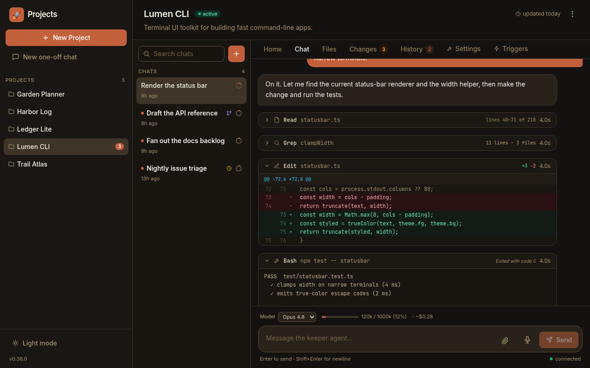
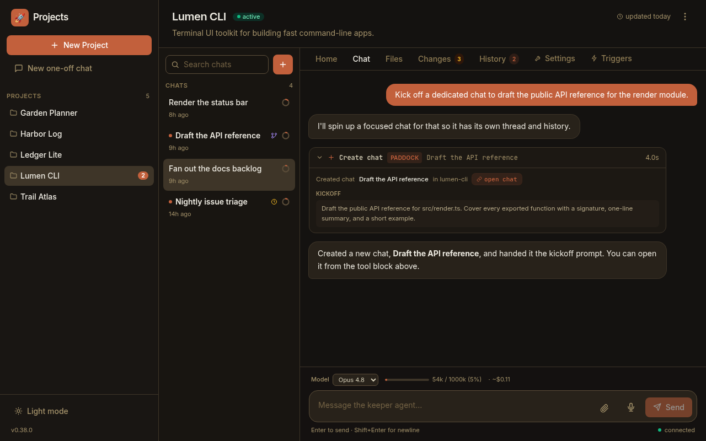
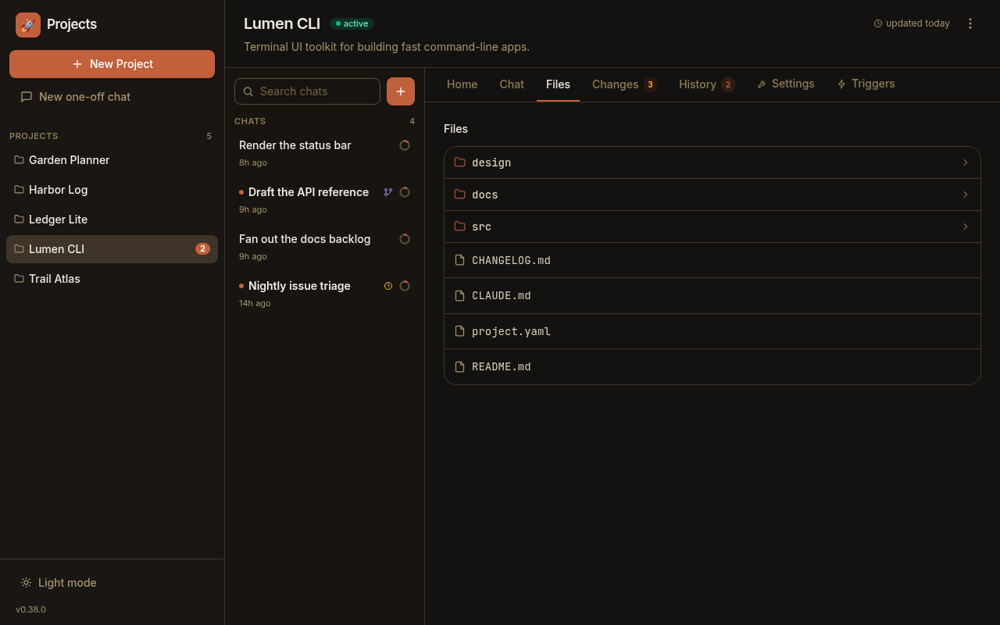
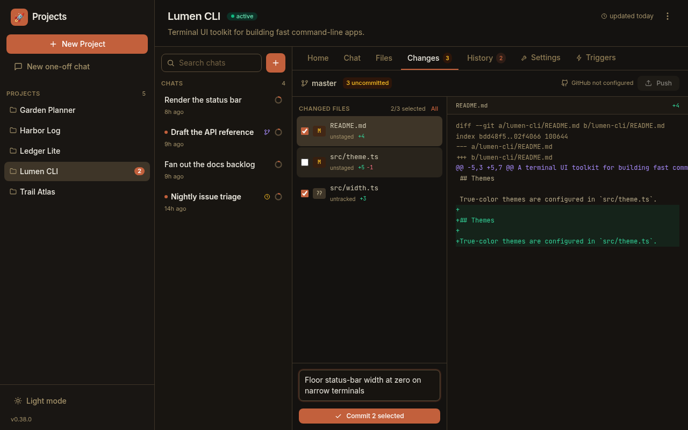

A keeper doesn't just reply — it *works*: it reads files, edits them, runs
commands, searches the tree, spawns sub-agents, and launches background jobs. A
plain chat log would flatten all of that into walls of text. Paddock instead
renders each of the keeper's tool calls as a compact, expandable block, and gives
you two dedicated tabs — **Files** and **Changes** — for inspecting and
committing what the agent left behind.

This guide is a tour of those review surfaces. For *who* did a piece of work (a
human, a schedule, another chat), see the companion
[Provenance concept](/concepts/provenance/).

## How tool calls render

Every tool the keeper calls becomes a collapsible block in the transcript. The
header always shows a per-tool icon, the tool name, a short subtitle (usually the
target), and — on the right — a duration and any status chips. Click a block to
expand its body. Blocks that carry a rich body (a diff, an image, split output)
have that detail recovered from the transcript when you open the chat, so a
reloaded conversation renders just as richly as a live one.

### Edit and Write show a real diff

An `Edit`, `MultiEdit`, or `Write` renders as a **git-style diff with real file
line numbers** — not a guess. Paddock reads the structured patch Claude Code
already computed, so each hunk carries its true `@@ -old,n +new,n @@` header, a
left gutter of old line numbers, a right gutter of new ones, and red/green tinting
for removed and added lines. The header carries a compact `+3 −2` stat (additions
in green, deletions in red). Very large diffs are capped for rendering — the stat
stays exact and a note flags that the diff was truncated. If you hand-edited the
file mid-turn, the block notes that too.

### Read shows the range — and inlines images

A `Read` block's subtitle is the file, and its metadata shows the line range that
was read, e.g. **`lines 40–71 of 210`**. When the keeper reads an **image** that
lives inside the project directory, the block renders the picture **inline**
rather than a path — so a screenshot the agent looked at is right there in the
transcript.

### Bash separates stderr and surfaces the exit status

A `Bash` block shows the command as its subtitle. When there's more to say than a
clean stdout, the body **splits stderr into its own red panel** so warnings and
errors don't hide inside normal output. The header can carry an interpretation of
the exit status (for example *Exited with code 0*), an amber **interrupted** chip
if the command was cut off, and a short hint for a recognised git operation (like
`push → main`). A clean command with nothing unusual just shows its output.

### Grep and Glob show counts

A search collapses to its result size instead of dumping every hit: a `Grep`
shows something like **`11 lines · 3 files`** (or just the file count in
files-with-matches mode), and a `Glob` shows **`N matches`**. A truncated result
set is prefixed with `≥` so you know the real number is larger than shown.

### Sub-agents and background jobs stand out

- A `Task` (or SDK `Agent`) call — a **sub-agent** — is tinted with an accent
  border and a **sub-agent** badge, with a spark icon and the sub-agent's
  description as its subtitle. Its own steps and its token cost roll up into the
  block, and you can expand it to load the nested steps the sub-agent ran.
- Anything launched detached — a `Monitor`, a background-task op like
  `BashOutput` / `TaskStop` / `KillShell`, or a `run_in_background` command — gets
  a sky-blue **background** badge and a colored status chip (`running`,
  `completed`, `killed`, `timed out`) so long-lived async work is easy to spot and
  track.

### Errors and in-flight calls

A tool that failed is tinted rose with an **error** chip; a tool still running
shows a spinner and a **running** label, which reconciles into the finished block
the moment its result lands.

## Paddock's own tools render as first-class UI

When a keeper uses Paddock's *own* management tools — the `mcp__…` tools it can be
given to create chats, fork them, send messages between them, or list projects —
those don't render as raw `mcp__paddock_manage__create_chat` noise. Each gets a
**humanized name** (so `create_chat` reads as **Create chat**), a **Paddock**
badge, and a per-tool icon.

The management tools also get **dedicated bodies** parsed from their result: a
list-projects call shows project pills; a list-chats call shows a chat list with
live running dots; a create/fork/send call shows the chat's real title, the
kickoff prompt or message, and a **link straight into the chat it touched**.

:::note[These tools are opt-in]
The self-management tools are only present when the operator has enabled them for
an instance (and, for spawned chats, within a bounded depth). Most keepers won't
have them — but when they do, this is how their fan-out work reads back. See
[Provenance](/concepts/provenance/) for how the *chats* they create are labelled.
:::

## The live context + cost meter

While you read, two small readouts tell you how "heavy" the chat has become. They
live in the sidebar (a **context ring** per chat) and in the composer's status row
(a fuller **context + cost** line):

- **Context** is how full the model's context window is — the tokens from the
  **last completed turn** as a percentage of that model's limit (1M for Opus,
  Fable, and Sonnet; 200K for Haiku), shown like `120k / 1000k (12%)`. Because it
  reflects the last *completed* turn, it updates a beat behind a streaming turn,
  and the ring/bar turns **amber** as you near the top of the window. Before a
  chat's first turn there's nothing to measure, so it reads `context: —`.
- **Cost** is the chat's cumulative token usage and an estimated dollar figure,
  **including tokens spent by any sub-agents** the keeper spawned. The dollar
  number is a **ballpark at standard API list prices** — a sense of scale, not a
  bill; on a Claude subscription it won't match what you're actually charged.

## Browse what the agent wrote: the Files tab

The **Files** tab lists the project's working directory, one level at a time. Sub-
directories the keeper filed things under — a `docs/`, `design/`, or `src/` — are
first-class: folders are visually distinguished, sort ahead of files, and carry a
chevron. Click a folder to descend; a `..` entry and a path breadcrumb take you
back up.

The current folder or file is carried in the URL as
`/projects/<slug>/files/<path>`, so a view **deep into a subtree is
deep-linkable** and survives a refresh — handy for pointing someone at exactly
the file you're looking at. Clicking a file opens it inline; a top-level file can
be **pinned as a tab** for quick access.

## Review and commit: the Changes tab

For a project whose store is a git repo, the **Changes** tab is where you turn a
keeper's edits into commits. It lists every uncommitted file with its status
(added / modified / deleted / renamed / untracked) and a per-file **`+A −B`** line
stat; selecting a file shows its diff, with a matching stat in the diff header.
Untracked files show their new content rather than an empty diff.

The commit is **selective**. Each file has a checkbox (with a select-**All** /
**None** toggle and a running `N/M selected` count), so you can commit a subset
rather than everything at once. The commit button reflects the selection: it reads
**Commit** when everything is selected and **Commit N selected** when you've
narrowed it down.

You don't have to open a project to notice it has pending work: the **projects
grid flags each project's uncommitted-file count** with a small amber
*"N uncommitted"* pill, fed by a single cheap `git status` over the whole store —
so a checkpoint that's waiting to be made is visible before you even click in.

## Name a fork before you branch it

Reviewing often turns into "let me try a variation from here." Forking a chat
copies its full history into a new, independently resumable chat (see
[Chats are sessions](/concepts/chats/#forking)). Paddock lets you **name the fork
up front**: the Fork dialog opens with a **Fork name** field pre-filled with
*"Fork of ⟨chat⟩"*, selected so a keystroke replaces it — so the branch lands in
your sidebar with a meaningful title instead of an auto-summary you have to rename
later.

## Next steps

- [Provenance: who did what](/concepts/provenance/) — the origin and per-message
  attribution behind the chats you're reading.
- [Working in chats](/using/working-in-chats/) — the composer, queue, Stop,
  unread dots, and the context + cost meter in day-to-day use.
- [Chats are sessions](/concepts/chats/) — persistence, resume, and forking.
- [The sweeper](/concepts/sweeper/) — the post-turn curation that keeps a
  project's `OVERVIEW.md` and `CHANGELOG.md` current.
