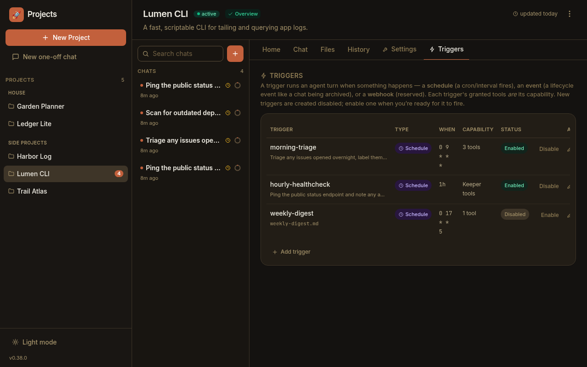
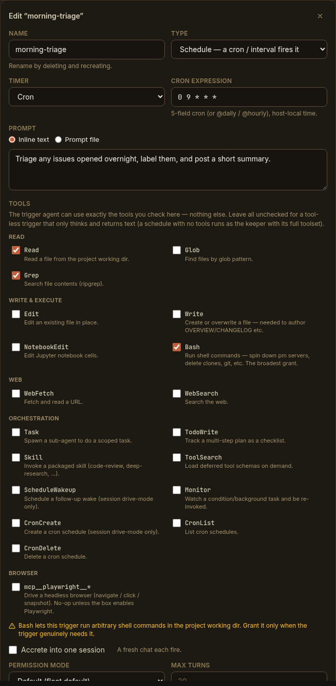
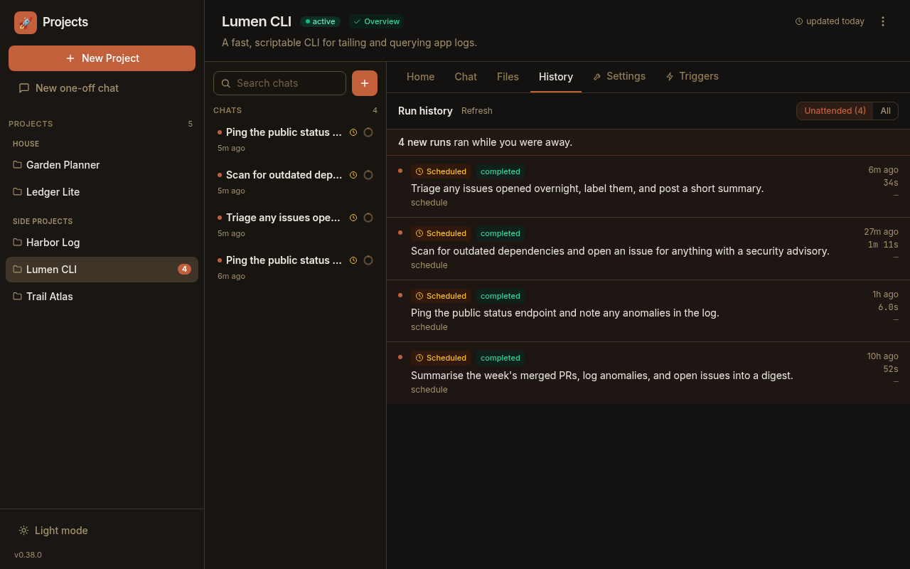

Some work should just *happen* — every morning, every hour, every Friday —
without you starting it. This guide is the practical companion to the
[Schedules concept](/concepts/schedules/): that page explains *what* a schedule
is; this one walks through *how* to create one, self-schedule from a chat, and
catch up on what ran while you weren't watching.

By the end you'll know how to add a schedule from the **Triggers tab**, tune what
it does, let a keeper **schedule itself**, and read the **History** view to see
everything that fired unattended.

## Add a schedule from the Triggers tab

Open a project and go to its **Triggers** tab. Every trigger the project declares
is listed here — schedules included, each with a **Schedule** type badge, its
firing condition (the cron/interval under **When**), a capability summary, and an
enabled toggle:

Click **Add trigger** to create one, or the pencil to edit an existing one. The
editor is a single form:

Fill in:

- **Name** — a stable key, e.g. `morning-triage` (letters, digits, `._-`).
- **Type** — pick **Schedule**.
- **Timer** — **Cron** for a 5-field expression (`0 9 * * *`, or `@daily` /
  `@hourly`), or **Interval** for a repeating duration (`30m`, `1h`). Times are
  the host's local time.
- **Prompt** — what the firing should do. Toggle to **Prompt file** to read the
  instruction from a git-tracked `.md` file under `.paddock/triggers/` instead
  (handy for long, evolving prompts).
- **Tools** — the firing's capability. Leave everything unchecked for a schedule
  that runs as the **keeper** with its full toolset; check specific tools to run
  it on its own **scoped agent** with *only* those tools.
- **Accrete into one session** — off (the default) starts a **fresh chat** each
  firing; on **resumes one owned session** so a "manager" builds up context.
- **Enabled** — whether it's armed.

:::note[New triggers are created disabled]
A brand-new trigger is saved **disabled**, so nothing fires the instant you write
it. Flip **Enabled** (in the editor, or with the row's **Enable** action) when
you're ready for it to run. Enabling and disabling is just a save with the flag
flipped — there's no separate step.
:::

:::tip[Grant tools deliberately]
The tools you check are *exactly* what the fired agent can use — nothing else.
`Bash` in particular lets the schedule run arbitrary shell commands in the
project's working directory, so grant it only when the job genuinely needs it. A
schedule that just reads and summarises needs no write or execute tools at all.
:::

## Schedule from a chat (the manager-agent pattern)

You don't have to open the Triggers tab yourself — on deployments that opt in, a
keeper can **schedule itself** straight from a conversation. Ask it in plain
language ("schedule yourself to triage new issues every morning at 9"), and it
uses Paddock's schedule-management MCP tools to write the trigger:

- **`set_trigger`** — create or update a trigger. For a schedule, pass
  `type: "schedule"` with either `cron` or `interval`, a `prompt` (or
  `prompt_file`), and `session: "new"` or `"resume"`.
- **`list_triggers`** — see what's already declared.
- **`remove_trigger`** — delete one.

This is the *manager-agent* pattern: a keeper you can talk to about its own
routine, that then keeps that routine running without you. See the
[Schedules reference](/reference/schedules/#self-mcp-tools) for the exact tool
parameters.

:::caution[Self-scheduling is opt-in per deployment]
The schedule-management MCP tools are only injected when the operator has enabled
them — they ride on Paddock's self-MCP **write** layer, so it takes
`PADDOCK_SELF_MCP` + `PADDOCK_SELF_MCP_WRITE` **and** `PADDOCK_HOOKS_MCP`. If your
keeper says it can't schedule things, one of those is off — see
[Scheduling configuration](/configuration/schedules/#self-scheduling-from-a-chat).
:::

## Catch up with the History view

Because schedules run when you're not watching, each project has a **History**
tab — the "while you were away" view — so you can see what happened without
opening every chat:

It lists recent runs, each with its origin — **Scheduled** (⏰), **Spawned**, or
**You** — a status chip, when it ran, and how long it took. The details:

- **The "Unattended" filter is the default.** It shows only the runs a schedule
  or another chat produced — the ones you didn't drive — so the noise of your own
  turns is out of the way. Switch to **All** to see everything.
- **A "while you were away" banner** counts the unattended runs that arrived since
  your last visit, and a dot marks each new row. Opening the tab clears the badge.
- **Click a run** to jump straight into its chat and read what the keeper did.

:::note[What shows up here]
The History view is built from the keeper's **batch run records** — one is written
per turn that runs through Paddock's batch execution path. A turn that runs under a
**session-mode** keeper doesn't write a run record, so on a session-mode deployment
some (or all) scheduled runs won't appear in this list even though they fired; the
scheduled chats themselves still show up in the chat list with their ⏰ badge.
Where run records exist, History is the fastest way to answer "what fired
overnight?" at a glance, then drill into any chat that needs your attention.
:::

## Next steps

- [Schedules](/concepts/schedules/) — the concept: cron vs. interval, fresh-chat
  vs. accreting session, and how a schedule differs from `ScheduleWakeup`.
- [Scheduling configuration](/configuration/schedules/) — the per-deployment gates
  for programmatic and self-service schedule mutation.
- [Schedules reference](/reference/schedules/) — the trigger schema, the self-MCP
  tools, and the REST endpoints.
