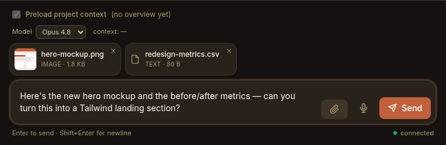

Sometimes the fastest way to explain something is to *show* it: a screenshot of a
broken layout, the PDF spec you're working from, a CSV to summarise, a log file
to trace. Since **v0.38** you can attach files and images to a message right in
the composer, and the keeper reads them directly — native vision on images and
PDFs, plain-text reads on everything else.

This guide covers the day-to-day: the three ways to attach a file, the tray that
holds them before you send, what the keeper actually does with them, and the
limits you can tune. It's the practical companion to
[Working in chats](/using/working-in-chats/).

:::note[Project chats only]
Attachments live in **keeper (project) chats** — the upload is scoped to a
project. A one-off (scratch) chat has no paperclip button. See
[keeper vs one-off chats](/using/working-in-chats/#keeper-chats-vs-one-off-scratch-chats).
:::

## Three ways to attach

Every project chat's composer has a **paperclip** button. There are three ways to
add files, and they all feed the same tray:

- **Pick.** Click the **paperclip** (📎, *"Attach files"*) to open your OS file
  chooser. You can select more than one file at once.
- **Drag & drop.** Drag files from your desktop onto the composer — a *"Drop files
  to attach"* overlay highlights the drop zone — and release.
- **Paste.** Copy an image or file and press **⌘V / Ctrl+V** with the composer
  focused. This is the quick path for a screenshot: grab a region, paste, send.

Each file uploads immediately (an **Uploading…** hint shows while it's in
flight), then lands in the **attachment tray** just above the composer.

## The attachment tray

Staged files appear as a row of removable items above the message box: **images
show as thumbnails**, and every other kind shows as a compact **chip** (icon ·
filename · size). Hover an item and click the **✕** to drop it before sending.

Attachments ride along with your **next** message. Type your prompt and press
**Enter** — the files send with it and the tray clears. You can also send with
**no text at all** as long as at least one file is attached (handy for "here's the
screenshot, take a look"). Everything you've read about the composer and the
[message queue](/using/working-in-chats/#type-while-a-turn-is-running-the-queue)
still applies; attachments simply travel with the turn.

## What the keeper does with them

When your message sends, Paddock copies each file into the project's attachment
store and points the keeper's **`Read`** tool at the stored copies. What the
keeper sees depends on the file:

- **Images** (`.png`, `.jpg`, `.gif`, `.webp`, …) — read with **native vision**.
  The keeper genuinely *sees* the picture: a UI screenshot, a diagram, a photo.
- **PDFs** — read natively too; the keeper reads the rendered document, not just
  extracted text.
- **Text, code, Markdown, CSV, and the like** — read as text through the same
  `Read` tool.

This works on any runtime — it's Claude Code's own `Read` tool doing the reading,
so no special model or configuration is needed.

Sent files stay with the chat. They render inline in the transcript (thumbnails
for images, chips for other files) and **re-render on reload** from the store, so
a shared file looks the same forever — it's an immutable snapshot, not a live link
to a path on the box. Deleting the chat removes its uploaded files too.

## Limits & allowed types

A few guardrails keep uploads sane. The defaults are:

| Limit | Default | Meaning |
|-------|---------|---------|
| Max file size | **25 MB** | Per file. A larger file is rejected. |
| Files per message | **10** | Across a single message's tray. |
| Allowed types | **all** | No type restriction out of the box. |

These are **server-enforced** — the composer mirrors them for a fast, friendly
rejection (a too-big or disallowed file never uploads), but the server is the
authority. If your instance restricts types, the file picker's *accept* hint and
the composer's checks follow the same allow-list.

You can tune all of these **per instance** or **per project**:

- Instance-wide, via the `PADDOCK_ATTACHMENTS_*` environment variables or the
  matching `attachments` block in the
  [config file](/configuration/config-file/) — see the
  [environment reference](/configuration/environment/#attachments-inbound-uploads).
- Per project, via an `attachments` override in that project's `project.yaml`
  (each field inherits the instance default when unset), including turning uploads
  **off** entirely for a project (`enabled: false`) — which hides the paperclip
  and refuses the upload endpoint.

## Next steps

- [Working in chats](/using/working-in-chats/) — the composer, the queue, Stop,
  and keeping the chat list legible.
- [Environment variables](/configuration/environment/#attachments-inbound-uploads)
  — the `PADDOCK_ATTACHMENTS_*` knobs.
- [Config file (YAML)](/configuration/config-file/) — set the same knobs in one
  file, and override them per project.
