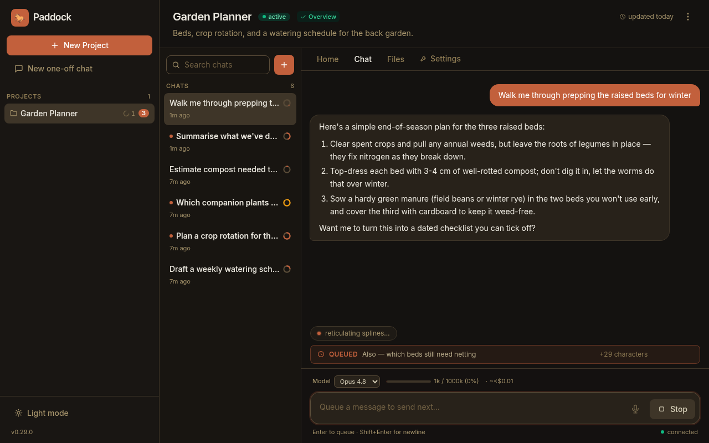
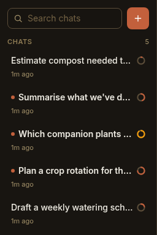

A **chat** is where you actually work in Paddock — one conversation with an
agent, streamed live and kept forever. This guide is the practical companion to
the [Chats are sessions concept](/concepts/chats/): that page explains *what* a
chat is (a persisted, resumable Claude Code session); this one walks through
*how* you work in one day to day.

By the end you'll know how to start a chat, tell **keeper** chats from **one-off
(scratch)** ones, pick a conversation back up from any device, drive the composer
and its message **queue**, **Stop** a running turn, and keep a growing sidebar
legible with **unread** dots, the per-chat **context + cost** meter, **search**,
and **archive**.

## Start a chat

Open a project and you're already in a chat — the composer at the bottom is
waiting for your first message. To begin a **fresh** conversation in the same
project, click **New chat** at the top of the chat list. Type a message and press
**Enter**; that first turn is what brings the chat to life.

Under the hood there's no "create chat" step. Sending the first message with no
session id yet is what mints one: Claude Code generates the session id *mid-turn*,
and Paddock attributes that running session to the project the instant the id
streams back — so the new chat shows up in the sidebar **while the first turn is
still running**, not only after it finishes. You never wait for a round-trip to
see your chat appear.

## Keeper chats vs one-off (scratch) chats

Paddock has two kinds of chat, and the difference is *where the agent works*:

- A **keeper chat** belongs to a project. It runs under that project's **keeper
  agent**, whose working directory is the project directory (or, for a
  repo-backed project, the checkout inside it). Everything the keeper does —
  notes, edits, commits — happens in that project. After a successful keeper
  turn, a [sweep](/concepts/sweeper/) keeps the project's `OVERVIEW.md` and
  `CHANGELOG.md` curated — and on instances where the operator has enabled it,
  the keeper is also given Paddock's self-management tools.
- A **one-off (scratch) chat** is deliberately *not* tied to a project — a quick
  place to think out loud. It runs under a single global **scratch agent** whose
  working directory is a separate scratch folder, not any project. Scratch chats
  skip those project-only extras — no curation sweep runs after them, and the
  self-management tools are never injected.

Both kinds are ordinary Claude Code sessions with the same default model and the
same resumability — the split is scope, not power.

:::tip[Start loose, promote later]
If a scratch chat turns into something you'll return to, don't copy-paste it —
**Promote to project** from the one-off chat. Paddock creates a real project and
*moves the whole transcript into it*, so the conversation continues under the new
project's keeper with nothing lost. See
[Creating & organizing projects](/using/creating-and-organizing-projects/#promote-a-scratch-chat-into-a-project).
:::

## Resume from anywhere

A chat is a session persisted on disk, so you can leave and come back — from the
same tab, a fresh reload, or an entirely different device — and pick up exactly
where you left off. Every later message on a chat resumes that same session
rather than starting a new one.

Paddock survives interruptions at three levels:

- **Reload or a new device.** The client re-fetches the chat's transcript from
  the server and re-renders it. Because the transcript lives on disk and your
  per-user read state is stored server-side, the *same* chat — and which replies
  you've already seen — appears wherever you log in.
- **Mid-turn reconnect.** If your connection drops while a turn is streaming, the
  client re-attaches over the WebSocket and asks the server to **replay** the
  frames it missed, so a live turn keeps streaming to you without restarting. If
  you were away long enough that the buffer aged out, it quietly re-hydrates from
  the transcript instead.
- **Server restart.** Transcripts and all the per-chat sidecar state live on
  disk, so chats — and their archived/unread/queued state — survive a restart of
  the Paddock process itself.

For the mechanics (how the transcript maps to a working directory, and how
forking copies a session), see [Chats are sessions](/concepts/chats/).

## The composer

The composer is the box at the bottom of every chat. A few things worth knowing:

- **Enter sends; Shift+Enter makes a newline.** Press **Enter** to send the
  current message. Hold **Shift** and press Enter to insert a line break and keep
  typing — useful for multi-line prompts. (The hint under the composer reminds
  you which is which, and swaps "send" for "queue" while a turn is running — see
  below.)
- **Your draft is saved as you type.** Whatever you've typed but not yet sent is
  persisted **per chat** in your browser's local storage. Switch chats, reload
  the tab, or come back tomorrow and your unsent draft is still there; sending
  clears it. Each chat keeps its own draft — including a not-yet-started new chat.
- **Attach files and images.** The paperclip button (project chats only) lets you
  send files and images to the keeper — pick, drag-drop, or paste them in. See
  [Sending files & images](/using/sending-files-and-images/).

:::note[Draft persistence is per-browser]
Drafts are stored locally in the browser you typed them in — they're a
convenience, not synced server state. (Your *sent* history and read state, by
contrast, follow you across devices.)
:::

## Type while a turn is running: the queue

You don't have to wait for the agent to finish before writing your next message.
If you type and press **Enter** while a turn is still streaming, Paddock
**queues** the message instead of sending it — and **auto-sends it the moment the
current turn completes successfully**. A queued-message bar appears above the
composer showing the text you've lined up:

A few specifics worth knowing, because the queue is **server-side**, not just a
browser convenience:

- **It's a single slot, and it's durable.** There's one queued message per chat.
  If you queue a second message before the first has sent, Paddock **appends** it
  to the pending one (on a new line) rather than replacing it or building up a
  list. Because the queue is persisted on the server, a queued message survives a
  socket disconnect or even a reload — it isn't lost with your tab.
- **The pill counts hidden characters.** When your queued message spans more than
  one line, the bar shows a `+N characters` pill for the text beyond the first
  line, so you can see there's more queued than the preview shows.
- **A Stopped or failed turn holds the queue.** The follow-up only auto-sends
  after a turn that *completes successfully*. If you **Stop** the turn (or it
  fails), your queued message stays put rather than firing — so hitting Stop
  never accidentally launches the thing you were still deciding about.

## Stop a running turn

While a turn is streaming, the send button becomes a **Stop** button. Click it to
interrupt the agent — Paddock cancels the running job. As noted above, stopping a
turn **holds** any queued follow-up rather than sending it.

:::note[Stop is safe the instant it appears]
There used to be a brief window right after a turn started where the job's id
hadn't yet round-tripped from the server, and a Stop click in that gap did
nothing. That's fixed: if you click Stop before the id has arrived, Paddock
**defers** the cancel and fires it the moment the id lands — so Stop is reliable
as soon as you can see it.
:::

## Keep a growing chat list legible

A busy project accumulates chats fast. The sidebar's chat list has three
affordances that keep it readable:

### Unread dots

When a chat you're **not** currently looking at finishes a turn, Paddock marks it
**unread** — a small accent dot next to the chat name, with the name in a bolder
weight. Opening (focusing) the chat clears it. Read state is tracked
**server-side per user**, so which replies you've seen follows you across devices
rather than living only in one browser. (When Paddock runs without real user
identity, read state falls back to a single shared bucket.)

### The context + cost meter

Each chat carries a small **context ring** in the sidebar, and a fuller
**context + cost** readout in the composer's status row:

- **Context** shows how full the model's context window is — the tokens from the
  last completed turn as a percentage of that model's context limit (1M tokens
  for Opus, Fable, and Sonnet; 200K for Haiku). It reflects the **last completed
  turn**, so it updates a beat behind an in-flight turn, and the ring turns amber
  as you approach the top of the window. Before a chat's first turn finishes
  there's nothing to measure, so it reads `context: —`.
- **Cost** shows the chat's cumulative token usage and an estimated dollar cost so
  far, including tokens spent by any sub-agents the keeper spawned. The dollar
  figure is a **ballpark at standard API list prices** — a rough sense of scale,
  not a bill; if you run the agent on a Claude subscription it won't match what
  you're actually charged.

### Search

The **Search chats** box at the top of the list filters the current project's
chats as you type — a case-insensitive match over each chat's name and its
first-message preview. It filters what's already loaded (no server round-trip), so
it's instant, and it searches archived chats too.

### Archive

To file a finished chat away without deleting it, hover its row and click the
**Archive** button. Archived chats drop out of the main list and collect under a
separate, collapsible **Archived** section at the bottom of the sidebar.
Archiving is purely presentational — the transcript is untouched, and an archived
chat is still openable, resumable, and forkable; unarchive it any time to bring it
back to the top of the list.

## Next steps

- [Chats are sessions](/concepts/chats/) — the concept behind persistence,
  resume, and forking.
- [Keeper & scratch agents](/concepts/keeper-and-scratch/) — the two agents
  behind keeper and one-off chats.
- [Creating & organizing projects](/using/creating-and-organizing-projects/) —
  where keeper chats live, and how to promote a scratch chat.
- [The sweeper](/concepts/sweeper/) — the post-turn curation that runs after
  keeper chats (and not scratch ones).
