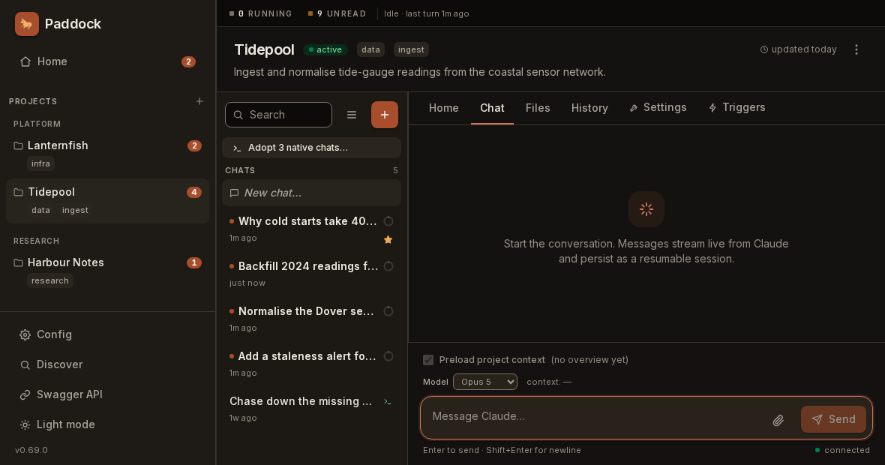
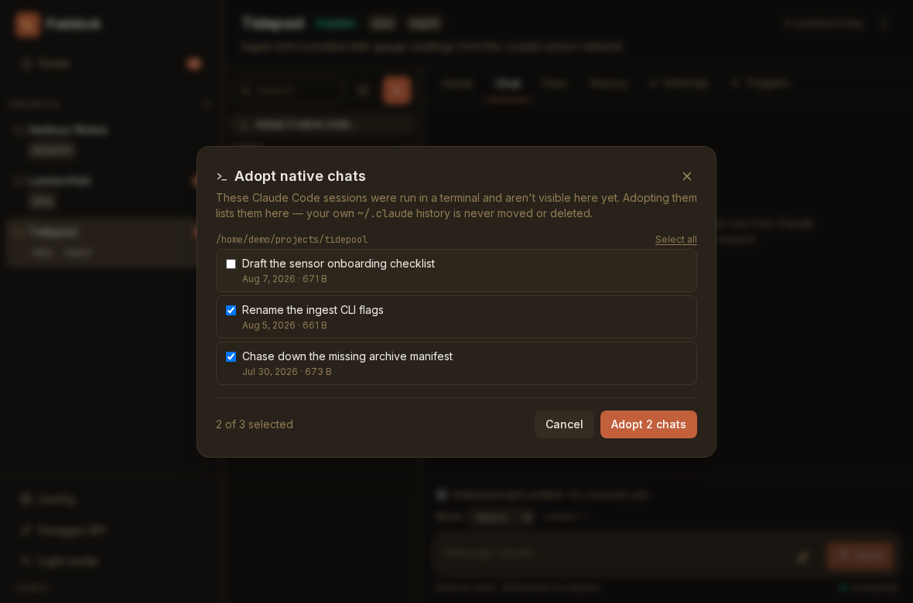
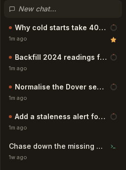
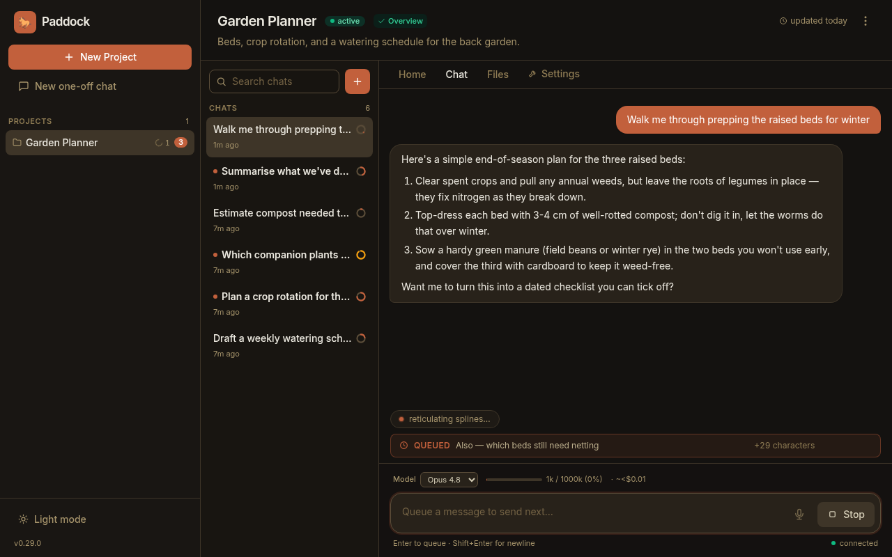
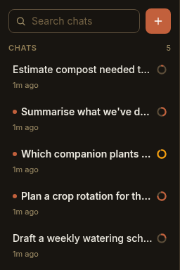

A **chat** is where you actually work in Paddock — one conversation with an
agent, streamed live and kept forever. This guide is the practical companion to
the [Chats are sessions concept](/concepts/chats/): that page explains *what* a
chat is (a persisted, resumable Claude Code session); this one walks through
*how* you work in one day to day.

By the end you'll know how to start a chat, tell **project** chats from **root**
ones, pick a conversation back up from any device, drive the composer
and its message **queue**, **Stop** a running turn, **fork or rewind** from any
message, and keep a growing sidebar legible with **unread** dots, **stars**, the
per-chat **context + cost** meter, **search**, and **archive**.

## Start a chat

Open a project and you're already in a chat — the composer at the bottom is
waiting for your first message. To begin a **fresh** conversation in the same
project, click **New chat** at the top of the chat list. Type a message and press
**Enter**; that first turn is what brings the chat to life.

Under the hood there's no "create chat" step. Sending the first message with no
session id yet is what mints one: Claude Code generates the session id *mid-turn*,
and Paddock attributes that running session to the project the instant the id
streams back — so the new chat shows up in the sidebar **while the first turn is
still running**, not only after it finishes. You never wait for a round-trip to
see your chat appear.

## Adopt your terminal `claude` history

If you already ran `claude` in a terminal against this workspace's working
directory, those conversations can be brought in. When there are any, an
**Adopt N native chats** button appears at the top of the chat list, just above
the **Chats** label. Clicking it opens a dialog listing exactly what is on offer
and where each session came from; confirm it and the list refreshes, with a toast
reporting how many arrived.



The dialog groups the sessions by the directory they were found in and shows each
one's auto-generated name, date and size. Everything is ticked by default; untick
anything you would rather leave in the terminal, and the button follows your
selection.



The count is **live**, not a dismissable prompt. It is recomputed from disk, so
it comes back if you accrue new terminal sessions later, and it reaches zero only
because there is genuinely nothing left to adopt. Empty and slash-command-only
transcripts are withheld as noise, so the number is what you'd actually want.

What gets offered is the workspace's own working directory plus any Claude
transcript folder whose *recorded* working directory matches it. For a project with
a **`repo:`** the match is by checkout name, so history from your own clone of the
same repo, somewhere else on disk, is found too — but a same-named directory has to
*prove* it is a clone of that repo (one of its git remotes must point there) before
anything from it is offered. Without a `repo:`, the match is by exact path.

Two things are deliberate about how it runs:

- **Your originals are never moved or deleted.** Your `~/.claude` history is
  left exactly as it was, and adopting is undoable. Under
  [`claude.transcripts: host`](/configuration/config-file/#transcripts) nothing is copied at
  all — the project's transcript store *is* your `~/.claude` folder, so those
  sessions are already in it. Adopting only registers them so they appear in the
  chat list; it is a consent gate, not a data movement. Under the default `own`
  the transcript is copied into Paddock's own store, leaving your original in
  place.
- **Original timestamps are kept**, so a months-old archive sorts by when those
  conversations actually happened rather than collapsing to today.

Adopted chats resume like any other, and carry an **Adopted** badge (an emerald
terminal icon) so you can tell them from chats started here — see
[Provenance](/concepts/provenance/). They are *not* counted as unattended runs:
you had those conversations, just somewhere else.



:::note[When Paddock can't see your `~/.claude`]
A containerised instance only sees what is mounted. Mount the history at the
`~/.claude` the container's own `$HOME` resolves to, or run the headless importer on
the host against the data dir:

```bash
npm run import-chats -w @paddock/server -- --project <slug> --dry-run
```

**`--project` is required** — the script exits `2` without it. Pass `--root` instead
to target the root workspace (its slug is the empty string, which is why it needs its
own flag). Other options: `--from <dir>` to read somewhere other than the default
history location, `--data-dir <dir>` to name the instance, `--move` to move rather than
copy, `--dry-run` to see what would happen, and `--json` for machine-readable output.

The script keeps the older *import* name deliberately — it predates the UI's rename to
**Adopt**, and renaming it would break anyone's scripts. (The CLI's `--help` text also
still says "import" where it means "adopt"; that part *is* a bug —
[#770](https://github.com/edspencer/paddock/issues/770).)
:::

## Project chats vs root chats

Every chat belongs to a **workspace**, and every workspace has a **keeper agent**
that runs its chats. The only difference is *which* workspace:

- A **project chat** belongs to a project. It runs under that project's own agent,
  whose working directory is the project directory (or, for a repo-backed
  project, the checkout inside it). Everything Claude does — notes, edits,
  commits — happens in that project.
- A **root chat** belongs to the instance **root** — the workspace that *contains*
  every project. It's the natural home for a quick thought that isn't about any
  one project yet. Because the root agent's working directory is the whole
  projects root, a root chat can read and edit across every project, which is
  both the point and a real escalation over a project agent.

Both are ordinary workspace chats, so both get the same treatment: after a
successful turn a [sweep](/concepts/sweeper/) keeps that workspace's
`OVERVIEW.md` and `CHANGELOG.md` curated, and on instances where the operator has
enabled it, Claude is given Paddock's self-management tools.

Otherwise they are the same thing. Both are ordinary Claude Code sessions with
the same default model and the same resumability; both get a
[sweep](/concepts/sweeper/) after a successful turn, and both get the
self-management tools on instances where the operator has enabled them. The split
is scope, not power.

:::tip[Start loose, promote later]
If a root chat turns into something you'll return to, don't copy-paste it —
**Promote to project**. Paddock creates a real project and *moves the whole
transcript into it*, so the conversation continues under the new project's agent
with nothing lost. See
[Creating & organizing projects](/using/creating-and-organizing-projects/#promote-a-root-chat-into-a-project).
:::

## Resume from anywhere

A chat is a session persisted on disk, so you can leave and come back — from the
same tab, a fresh reload, or an entirely different device — and pick up exactly
where you left off. Every later message on a chat resumes that same session
rather than starting a new one.

Paddock survives interruptions at three levels:

- **Reload or a new device.** The client re-fetches the chat's transcript from
  the server and re-renders it. Because the transcript lives on disk and your
  per-user read state is stored server-side, the *same* chat — and which replies
  you've already seen — appears wherever you log in.
- **Mid-turn reconnect.** If your connection drops while a turn is streaming, the
  client re-attaches over the WebSocket and asks the server to **replay** the
  frames it missed, so a live turn keeps streaming to you without restarting. If
  you were away long enough that the buffer aged out, it quietly re-hydrates from
  the transcript instead.
- **Server restart.** Transcripts and all the per-chat sidecar state live on
  disk, so chats — and their archived/unread/queued state — survive a restart of
  the Paddock process itself.

For the mechanics (how the transcript maps to a working directory, and how
forking copies a session), see [Chats are sessions](/concepts/chats/).

## The composer

The composer is the box at the bottom of every chat. A few things worth knowing:

- **Enter sends; Shift+Enter makes a newline.** Press **Enter** to send the
  current message. Hold **Shift** and press Enter to insert a line break and keep
  typing — useful for multi-line prompts. (The hint under the composer reminds
  you which is which, and swaps "send" for "queue" while a turn is running — see
  below.)
- **Your draft is saved as you type.** Whatever you've typed but not yet sent is
  persisted **per chat** in your browser's local storage. Switch chats, reload
  the tab, or come back tomorrow and your unsent draft is still there; sending
  clears it. Each chat keeps its own draft — including a not-yet-started new chat.
- **Attach files and images.** The paperclip button (project chats only) lets you
  send files and images to Claude — pick, drag-drop, or paste them in. See
  [Sending files & images](/using/sending-files-and-images/).

:::note[Draft persistence is per-browser]
Drafts are stored locally in the browser you typed them in — they're a
convenience, not synced server state. (Your *sent* history and read state, by
contrast, follow you across devices.)
:::

## Type while a turn is running: the queue

You don't have to wait for the agent to finish before writing your next message.
If you type and press **Enter** while a turn is still streaming, Paddock
**queues** the message instead of sending it — and **auto-sends it the moment the
current turn completes successfully**. A queued-message bar appears above the
composer showing the text you've lined up:



A few specifics worth knowing, because the queue is **server-side**, not just a
browser convenience:

- **It's a single slot, and it's durable.** There's one queued message per chat.
  If you queue a second message before the first has sent, Paddock **appends** it
  to the pending one (on a new line) rather than replacing it or building up a
  list. Because the queue is persisted on the server, a queued message survives a
  socket disconnect or even a reload — it isn't lost with your tab.
- **The pill counts hidden characters.** When your queued message spans more than
  one line, the bar shows a `+N characters` pill for the text beyond the first
  line, so you can see there's more queued than the preview shows.
- **A Stopped or failed turn holds the queue.** The follow-up only auto-sends
  after a turn that *completes successfully*. If you **Stop** the turn (or it
  fails), your queued message stays put rather than firing — so hitting Stop
  never accidentally launches the thing you were still deciding about.

:::note[An *agent* messaging a busy chat is a different mechanism]
This queue is for **you**, typing in the composer. When one agent messages
another with `send_message`, the text also tends to land at the next turn
boundary — but by a different route, with no visible bar and nothing to cancel.
The distinction matters if you write agents that talk to each other; see
[Sending into a chat that is already running](/reference/self-mcp/#sending-into-a-chat-that-is-already-running).
:::

## Stop a running turn

While a turn is streaming, the send button becomes a **Stop** button. Click it to
interrupt the agent — Paddock cancels the running job. As noted above, stopping a
turn **holds** any queued follow-up rather than sending it.

:::note[Stop is safe the instant it appears]
There used to be a brief window right after a turn started where the job's id
hadn't yet round-tripped from the server, and a Stop click in that gap did
nothing. That's fixed: if you click Stop before the id has arrived, Paddock
**defers** the cancel and fires it the moment the id lands — so Stop is reliable
as soon as you can see it.
:::

## Hover a message: time, context, fork and rewind

Hover any message in the transcript and a small rail fades in at its top-right.
It carries two readouts and two actions:


- **When it happened.** A relative age (`3m ago`, `2d ago`); hover the chip itself
  for the absolute local date and time.
- **How full the window was *at that point*.** The token count and percentage
  shown are a **point-in-time** read for that message, not a running total — so on
  a long chat you can see *where* the context window actually filled up rather
  than only what it totals now.
- **Fork a new chat from here.** Copies the transcript **up to that message** into
  a new chat and drops you into it. The original is untouched — this is how you
  try a second approach from the moment things diverged.
- **Revert conversation back to here.** Truncates this chat **in place**, keeping
  its session id (so the URL and lineage survive). The confirm counts the messages
  and tool calls about to disappear, and the discarded tail is backed up rather
  than destroyed.

:::caution[Reverting rewinds the conversation, not the world]
Files Claude wrote, PRs it opened, messages it sent — none of that is undone by a
revert. You're only rolling back the transcript. Reverting to one of *your
own* messages rewinds to the assistant's previous reply, so the prompt you clicked
is itself removed.
:::

The rail appears on your and Claude's messages once a turn has settled — not
on tool blocks, notices, or the turn currently streaming — and it's a project-chat
feature; one-off chats don't have it.

## Keep a growing chat list legible

A busy project accumulates chats fast. The sidebar's chat list has several
affordances that keep it readable:



Hovering a chat row reveals its **six actions**, tucked beside the timestamp:
**fork**, **rename**, **archive**, **delete**, **mark unread**, and **star**.


### Unread dots — and marking a chat unread

When a chat you're **not** currently looking at finishes a turn, Paddock marks it
**unread** — a small accent dot next to the chat name, with the name in a bolder
weight. Opening (focusing) the chat clears it. Read state is tracked
**server-side per user**, so which replies you've seen follows you across devices
rather than living only in one browser. (When Paddock runs without real user
identity, read state falls back to a single shared bucket.)

You can also raise that cue **yourself**. The envelope action on a chat row
**marks it unread** again — the email-client move for "I glanced at this at
midnight, resurface it in the morning." Opening or focusing the chat spends the
flag, exactly as it would a real unread reply.

Unlike starring and archiving, which are **shared** — archive a chat and everyone
using the instance sees it archived — the unread flag is **yours**, keyed to your
user alongside your read state.

### Nested chats — a fan-out reads as a tree

A chat that another chat created is **filed underneath it** in the sidebar,
indented, with a twisty on the parent to fold the whole family away. A chat that
spawns eight children no longer buries your other work under eight top-level
rows; it takes up one, with an `8` count pill when you collapse it.

- **Everything is expanded by default.** Nothing is hidden from you until you
  choose to fold it.
- **Collapse state is per project and per browser**, kept in local storage
  alongside your other layout preferences. Folding a noisy fan-out on your
  laptop deliberately doesn't fold it on your phone.
- **Indentation stops at four levels.** Deeper chats still nest, sort and
  collapse correctly — they just stop marching rightwards, so a deep tree can't
  squeeze the chat names into nothing.
- **A nested chat drops its violet `spawned` badge.** Sitting under its parent
  already says another chat made it, more loudly than the chip did. The badge
  comes back if that chat is shown at the top level.

Which chats nest and which stay flat comes down to whether Paddock recorded a
parent for them; [Provenance](/concepts/provenance/#from-badge-to-structure) has
the full picture. The short version: chats Claude spawned or forked nest;
chats *you* started, chats a schedule or an event hook fired, and chats created
by an **external** MCP client are roots.

Some chats surface at the top level even though they do have a parent — because
the parent is in another project, or archived, or filtered out by your search.
That's deliberate: a chat whose parent isn't on screen is promoted to a root
rather than vanishing with it.

### Stars — pin a chat to the top

Click the gold star at the right of a chat row and that chat **floats to the top
of its group**. It's the lightweight way to keep the conversation you're living
in (or the long-running job you're waiting on) one click away.


Starring is purely presentational and **orthogonal to archiving**: a starred chat
sorts first among its siblings, so stars float to the top of the **active** list
*and* the **Archived** section — and, now that chats nest, to the top of whatever
group of siblings the chat belongs to rather than to the top of the whole list. A
starred chat keeps its star visible at rest, rather than only on hover.

Below the stars, siblings sort by **the most recent activity anywhere in their
subtree**, not by their own last message. A parent whose child is mid-turn rises
with it, so an active family travels up the list as a unit instead of the parent
sinking while its children work.

### The context + cost meter

Each chat carries a small **context ring** in the sidebar, and a fuller
**context + cost** readout in the composer's status row:

- **Context** shows how full the model's context window is — the tokens from the
  last completed turn as a percentage of that model's context limit (1M tokens
  for Opus, Fable, and Sonnet; 200K for Haiku). It reflects the **last completed
  turn**, so it updates a beat behind an in-flight turn, and the ring turns amber
  as you approach the top of the window. Before a chat's first turn finishes
  there's nothing to measure, so it reads `context: —`.
- **Cost** shows the chat's cumulative token usage and an estimated dollar cost so
  far, including tokens spent by any sub-agents Claude spawned. The dollar figure
  is a **ballpark at standard API list prices** — a rough sense of scale,
  not a bill; if you run the agent on a Claude subscription it won't match what
  you're actually charged.

### Search

The **Search chats** box at the top of the list filters the current project's
chats as you type — a case-insensitive match over each chat's name and its
first-message preview. It filters what's already loaded (no server round-trip), so
it's instant, and it searches archived chats too.

A match **drags its ancestors into view** so you can see where it sits, which
means some rows in a search result are scaffolding rather than hits. Search also
**temporarily overrides collapse** — a match buried inside a folded family still
shows — and your folded state comes back untouched when you clear the box.

### Archive

To file a finished chat away without deleting it, hover its row and click the
**Archive** button. Archived chats drop out of the main list and collect under a
separate, collapsible **Archived** section at the bottom of the sidebar.
Archiving is purely presentational — the transcript is untouched, and an archived
chat is still openable, resumable, and forkable; unarchive it any time to bring it
back to the top of the list.

**Archiving a parent doesn't archive its children.** The active list and the
Archived section are two separate trees, so a parent you archive moves out on its
own and its still-active children are promoted to top-level rows rather than
following it or being hidden behind it.

### Delete, and what it means when transcripts are shared

Deleting a chat normally unlinks its transcript — it is Paddock's copy, kept in
the project's `.chats/`, and it is gone.

Under [`claude.transcripts: host`](/configuration/config-file/#transcripts) it is
not Paddock's copy: the file *is* your terminal `claude` history for that
directory. So delete **releases** the chat instead of removing it, and the
transcript stays on disk untouched. That is deliberate — Paddock does not delete
history it did not create.

One rough edge to know about: a released chat is still **listed**. Releasing
drops Paddock's adoption record, but the engine finds the transcript again on the
next listing and shows it, so the chat comes back. Closing that gap is tracked as
[#693](https://github.com/edspencer/paddock/issues/693). Until then, if you want
a shared chat out of your list, the transcript itself has to move.

### Resize the columns

On a desktop-width screen both left-hand columns — the app **side-nav** and the
per-project **chat list** — have a drag handle on their right edge. Drag it to set
the width you want, **double-click** it to snap back to the default, or focus it
and nudge with the **arrow keys**. Widths are clamped to sane bounds and remembered
**per browser** in local storage, so a laptop and a desktop can each keep their own
layout. (Below desktop width the columns become the off-canvas drawer instead, and
the handles don't apply.)

## Next steps

- [Chats are sessions](/concepts/chats/) — the concept behind persistence,
  resume, and forking.
- [Agents](/concepts/agents/) — the agents behind project and root chats.
- [Creating & organizing projects](/using/creating-and-organizing-projects/) —
  where project chats live, and how to promote a root chat.
- [The sweeper](/concepts/sweeper/) — the post-turn curation that keeps
  `OVERVIEW.md` and `CHANGELOG.md` up to date.
