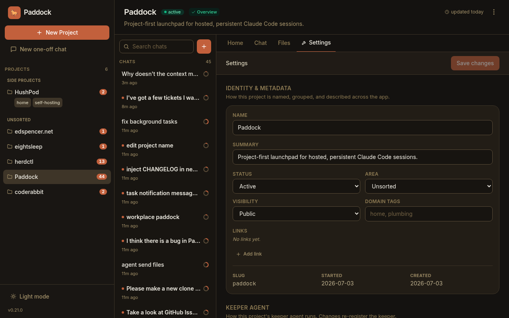

The headline changes in recent Paddock releases, newest first. These are the
things you'll *notice* — not an exhaustive changeset. For the full, per-package
detail see the changelogs on GitHub
([server](https://github.com/edspencer/paddock/blob/main/packages/server/CHANGELOG.md),
[web](https://github.com/edspencer/paddock/blob/main/packages/web/CHANGELOG.md)).

:::note[Reading older entries]
Each entry describes a release as it shipped. Some things were refined later — for
example the separate `set_schedule` and `set_hook` self-management tools below were
unified into a single `set_trigger` family in a subsequent release.
:::

A theme runs through this stretch: Paddock grew from a place to *chat with*
agents into a place where agents **run on their own** — fired by events and
schedules, spawning and reporting back to each other — with the UI making all
that unattended work legible at a glance.

## 0.34 — Event hooks

- **Event hooks.** Run an agent turn automatically when a lifecycle event fires.
  The first event is **`onArchive`** — when a chat is archived, each of the
  project's enabled hooks fires as its own agent. A hook's granted tools *are* its
  capability: a hook that must tidy up is given `Bash` and does the work itself.
  New hooks start **disabled**, so nothing runs until you arm it.
- **Hook chats are visible and legible.** A hook run shows up in the chat list
  with a small lightning-bolt badge, and opening it floats a read-only banner
  telling you it's a hook agent, what event triggered it, and exactly which tools
  it was granted.
- **Manage hooks from a chat.** Keepers with the opt-in hook MCP can declare,
  edit, and remove their own hooks (`list_hooks` / `set_hook` / `remove_hook`).
- **Steer the sweeper per project.** Drop a `.paddock/hooks/sweep.md` file in a
  project and its contents are appended to the sweeper's instructions — so each
  project can shape how its `OVERVIEW.md` / `CHANGELOG.md` get curated.

## 0.33 — Who sent this, and a lighter stream

- **Per-message attribution.** Machine-injected turns now say who added them —
  "↩ sent by *⟨chat⟩*" for a `send_message` from another chat, or "⏰ scheduled by
  *⟨name⟩*" for a schedule fire. Human-typed messages stay unlabelled. An injected
  message also streams into an already-open chat immediately, no refresh needed.
- **Schedule yourself from a chat.** New self-management tools let a keeper create
  and manage its project's durable schedules (`set_schedule` / `remove_schedule` /
  `list_schedules`) — "schedule yourself to triage issues every morning" — not
  just a human clicking through Settings.
- **Cheaper streaming.** The CPU cost of watching a chat stream dropped sharply:
  the continuous 60fps animations were trimmed, respect `prefers-reduced-motion`,
  and pause while the tab is in the background.

## 0.32 — Schedules & run history

- **Scheduled chats.** A project can declare **schedules** (cron or interval) that
  start a chat on their own. A scheduled run is a first-class chat — it streams
  live, is re-attachable, and a human can open it and keep the conversation going.
  Manage them from a **Schedules** section in the project's Settings, including
  enable/disable and **trigger-now**.
- **"While you were away."** A new project **History** tab lists recent runs with
  their origin (human / scheduled / spawned), flags the ones that are new since you
  last looked, and banners how many ran unattended — so cron-fired and agent-spawned
  work is easy to find and open.

## 0.31 — Provenance, spawn-depth & YAML config

- **Provenance badges.** The chat list marks **scheduled** and **spawned** chats
  with a subtle icon, so the runs that happened without you stand out from the ones
  you started. Human chats stay unadorned.
- **Spawned children can report back.** A chat spawned by another chat now gets the
  self-management tools (bounded by a new **`maxSpawnDepth`**, default `1`), so a
  child can `send_message` its parent when it's done — enabling the manager-agent
  pattern without runaway recursion.
- **Configure an instance from a YAML file.** Instead of a long list of `PADDOCK_*`
  environment variables, an instance can keep its settings in a single
  [`paddock.config.yaml`](/configuration/config-file/) — with environment variables
  still overriding the file. Env-only deployments are unaffected.

## 0.30 — Files, Changes & self-archiving

- **Browse into subdirectories.** The Files tab now lets you click into folders,
  with deep-linkable, refresh-safe URLs and a breadcrumb — so anything a project
  filed under `design/`, `docs/`, etc. is finally reachable.
- **Selective commits.** The Changes tab gained a checkbox per changed file (with
  select-all/none) and a "Commit N selected" action, a `+A −R` line stat per file,
  and a dirty-file count on the projects grid so pending work is visible before you
  open a project.
- **Agents can archive themselves.** New `archive_chat` / `unarchive_chat`
  self-management tools power the "do the work, then archive myself on success;
  leave un-archived on failure so a human sees it" convention.

## 0.29 — First-class MCP tool rendering

- **Paddock's own tools render as first-class UI.** Every `mcp__…` tool call now
  shows a humanized name (`mcp__paddock_manage__create_chat` → "Create chat") with
  a brand badge instead of the raw string, and the `paddock_manage` tools get rich
  bodies parsed from their output — project chips, a chat list with live running
  dots, transcript previews — that link straight into the chats they touched.

---

*Maintaining this page:* add a short, user-facing entry here whenever you cut a
release (see [RELEASING.md](https://github.com/edspencer/paddock/blob/main/RELEASING.md)).
