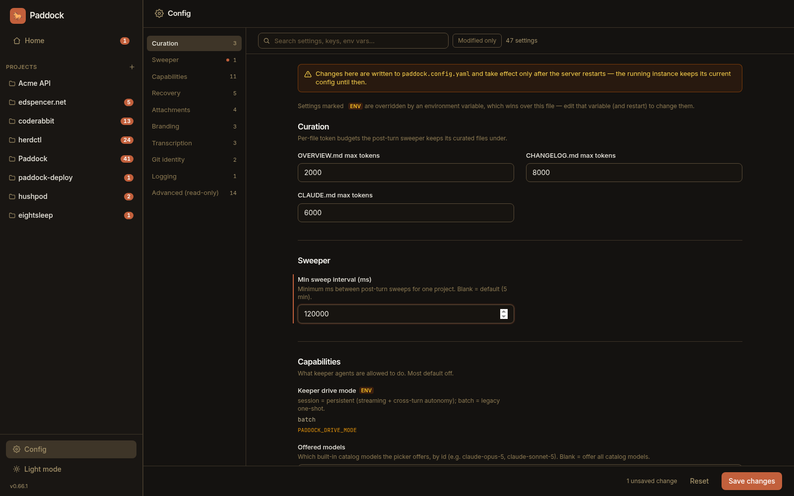
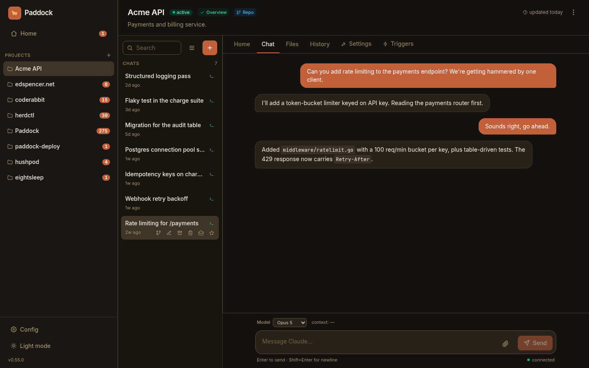
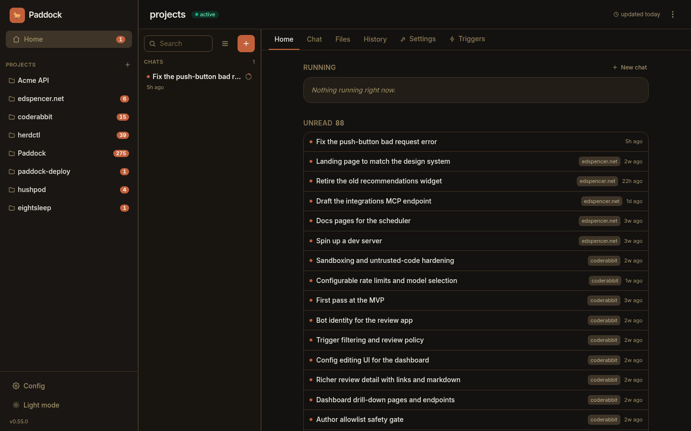

import DemoVideo from '../../components/DemoVideo.astro';

:::note[Reading older entries]
Each entry describes a release **as it shipped**, and later releases sometimes
supersede one. Where that has happened the older entry says so and links
forward — most notably 0.61.1's `--isolated-claude-home`, which 0.62 removed in
favour of the `claude:` config block.
:::

## 0.66.1 — Nothing you typed while it was busy goes missing

- **Three separate ways a queued message could vanish are closed.** The queue is
  the chip above the composer that holds what you type while a turn is running.
  It could lose your message to a **clock**: its dedup marker was keyed on a
  timestamp supplied by *your browser* and compared as an ordering, so one laptop
  running five minutes fast parked the marker in the future and every later
  queued message on that chat — from **any** client — was quietly taken, marked
  already-sent, and deleted. Identity is now an opaque server-side id compared
  for equality, and the clock belongs to the server.
- **The queue is shared state, so a second tab merges instead of overwriting.**
  One slot per chat, broadcast to every client attached to it. Previously a
  second window silently destroyed the first one's message — with no error, and
  with the first window still showing a chip for a message that no longer existed
  anywhere. Worse, when the turn ended that client watched *someone else's* text
  appear in the transcript as though they had typed it. A client that queues
  without having seen the current slot now has its text **appended**, not
  substituted.
- **A queued message escapes on every path a turn can end by.** The drain used to
  be called from exactly one of the eight places a turn finishes, so anything
  queued behind a `/compact`, a trigger, a scheduled wake or a background
  sub-agent was persisted and then stranded — surfacing only when some *later*
  message completed, which landed it in the transcript **behind** something you
  typed minutes afterwards. It now hangs off a turn-end hook every path goes
  through, which covers paths that do not exist yet.
- **Stopping a turn hands your queued message back rather than sending it.**
  Deliberately the one exception to the above: pressing **Stop** means *give me
  control back*, not *start immediately*, so the text lands in your composer,
  merged above whatever draft was already there. Other clients see the shared
  slot clear with a reason attached instead of a chip disappearing for no visible
  cause, and if the stopping tab has gone the message is parked rather than swept
  out behind something typed later.

## 0.66.0 — A Config screen you can navigate

- **The instance Config screen is navigable instead of one long slab.** Forty-seven
  settings in ten groups used to render as a single narrow column — **5,508
  pixels, about seven screenfuls** — with no way to reach a setting you already
  knew the name of except scrolling past everything else. It now has a **section
  rail** with per-group counts and scroll-spy, a **live filter**, and a **Modified
  only** lens that shows just what differs from the built-in defaults. The design
  follows VS Code's settings screen rather than tabs, and that distinction is the
  whole argument: *tabs partition, which is exactly what defeats a search.* A rail
  scroll-spying over one document means "jump to Branding" and "find every field
  mentioning `token`" are both available and neither disables the other.

  The filter matches labels, dotted keys, help text, enum values **and environment
  variable names** — so an operator who thinks in `PADDOCK_*` finds a field by
  typing one. Settings overridden by the environment now carry a small chip and
  the variable's name, with the explanation stated **once, in a legend**; repeating
  that two-line notice beside twenty fields was the single largest source of the
  old page's length on a containerised instance. Read-only bindings are no longer
  input-shaped, booleans are a switch on the label line, and short fields pair into
  two columns. Saving, dirty-tracking and restart-required semantics are unchanged.



<DemoVideo
	src="/demo/config-filter.mp4"
	poster="/demo/config-filter-poster.jpg"
	alt="Paddock's instance Config screen. Typing 'token' into the filter narrows 47 settings to 3 and collapses the section rail to the single group that still matches. Clearing it and switching on 'Modified only' shows just the 9 settings that differ from their defaults, several carrying an ENV chip and the name of the variable overriding them. Clicking Branding in the rail scrolls that group into view rather than swapping to a separate tab, with the rest of the document still beneath it."
	caption="One document, filtered and jumped. Searching by environment-variable name is the case tabs would have made impossible."
/>

- **Breaking: the default port moves from 4000 to 7233.** Port 4000 is one of the
  most contested in local development — Jekyll has used it since 2008, Phoenix
  uses it, and every hand-rolled Node server reaches for it — so Paddock's own
  code had long described `EADDRINUSE` on 4000 as the likeliest first-run failure.
  A default that makes the first run fail is the wrong default. 7233 is `PADD` on
  a phone keypad and is not IANA-registered. **If you set `PORT`, `port:` or
  `--port`, nothing changes.** If you rely on the default, everything in front of
  Paddock needs the new number: your reverse proxy, your `docker run -p`, your
  Kubernetes Service `targetPort`, your SSH tunnels. Pin the old behaviour with
  `PORT=4000`. In fairness, 7233 is Temporal's frontend port — judged the better
  trade because Temporal is one specific server usually run under Compose or
  Kubernetes where a published port is trivially remapped, and because the failure
  is loud at boot rather than silent.
- **Both on-disk formats now declare a `schemaVersion`, so a downgrade can't
  quietly eat your settings.** The problem this solves is downgrades, not
  migrations: `npx @edspencer/paddock@0.62.0` is one command away, and an older
  build reading a newer data directory dropped every key it didn't recognise and
  wrote the file back without them — a `path:` or a `managed:` disappearing with
  no error. A `paddock.config.yaml` from the future now **refuses to start**,
  naming both versions and the fix, because instance config decides auth mode and
  bind host and half-understanding those is worse than not booting. A
  `project.yaml` from the future is **skipped loudly** instead, leaving the file
  untouched — bricking a whole instance because one project directory was copied
  from a newer box would be worse than the loss being prevented. Nothing on disk
  changes: the current shape *is* version 1, and an absent field reads as 1.
- **The UI says "adopt" where it used to say "import".** Reported from real use:
  when a project's transcripts are your own `~/.claude` directory, the sessions
  being offered are **already there** — the action registers them so they appear
  in the chat list, and moves nothing. The backend has always called it adoption;
  the UI was the only layer speaking a second language. The confirmation dialog,
  the provenance badge and the History chip all follow, so a button saying *Adopt*
  no longer yields a chat badged *Imported*. The dialog also stopped claiming your
  history "is copied, never moved" — true in one mode, wrong in the other — in
  favour of the promise that holds in both: **your originals are never moved or
  deleted.** Note the seam: the headless script is still `npm run import-chats`,
  and the REST routes are unchanged.
- **Deleting, reverting or promoting a chat now stops the turn first, and waits
  until it is verifiably dead.** The transcript is written by `claude` itself,
  straight through the symlink Paddock plants — Paddock never holds the file
  handle. So unlinking a transcript mid-turn did not delete the chat: the
  surviving process wrote itself back and the chat **returned**, named after its
  raw session id, opening on an orphaned tool result with no prior history.
  Promote was worse — it lost the chat from *both* projects, with nothing in the
  UI offering a way back. These operations now cancel the turn, confirm it is
  gone, and report that they did; if death can't be confirmed within ten seconds
  they refuse with a clear error rather than mutating under a live writer. The
  resurrection is now impossible by construction rather than by winning a race.
- **A sub-agent that is still working keeps its place in the running bar.**
  Because the SDK backgrounds sub-agents, the launching `Task` call pairs within
  milliseconds while the sub-agent keeps going — and the code stamped a *final*
  duration at that moment, so a live sub-agent was declared finished and dropped
  out of the bar for the rest of its run. The tell was a "final" duration that
  kept climbing. A duration is now published only once the sub-agent's own
  transcript has settled. Separately, reloading a chat no longer lifts a
  sub-agent's nested steps out of its card and into the transcript as top-level
  rows.
- **On `driveMode: batch` only:** deleting the chat you just finished and then
  messaging an older one no longer misfiles that message into a brand-new
  session. Nothing looked wrong at the time — the reply streamed into the chat
  you were reading — but on reload the message had moved to a stray new chat, and
  the answer had been written with no memory of the conversation. The default
  `session` mode was never affected.

## 0.65 — An agent can promote its own project

- **A keeper can turn its own notebook project into a repo-backed one.** The REST
  route has done this for a long time, but there was no MCP verb — so an agent
  that realised its notes-only project should really be a codebase had to stop and
  ask a human, or create a *second* project and abandon the first, **losing every
  chat in it**. `promote_project` takes a git URL and defaults to the project the
  agent is running in: it clones, re-points the working directory, and
  re-registers the agent against the existing chat store, so the conversation
  history stays listed and resumable. A failed clone rolls back to a byte-identical
  notebook. It rides the existing "may provision projects" permission rather than
  adding a third switch — though note that operators who granted that at 0.64 did
  not knowingly grant promotion.

## 0.64 — Point Paddock at a checkout you already have

- **`path:` links a directory that already exists, and Paddock uses it in place.**
  No copy, no clone, no import: your checkout keeps its real history, branches and
  remotes, and Claude works in the actual repository. **Paddock writes nothing into
  it** — no transcript folder, no sidecar `.gitignore`, no `CLAUDE.md` — and
  deleting the project never touches the directory.
- **Two independent axes replace one overloaded flag.** *Managed* now means
  Paddock looks after the project's own files — the sweeper curating `CLAUDE.md`,
  `OVERVIEW.md` and `CHANGELOG.md`, which is what "notebook" used to mean.
  *Unmanaged* means the content is code you version-control yourself. **Whether a
  git repo sits behind it is a separate question and not a type.** The old
  `repoBacked` boolean was one flag answering four questions and is **removed from
  the API response**, so anything reading the projects API needs updating. Existing
  projects keep their meaning on upgrade, and both new fields are fixed at creation
  time.
- **The Changes tab reports on the code, not the notes.** It had been reading the
  *metadata* directory, so for a repo-backed project it showed you the notes folder
  rather than the checkout — and it asked whether the projects root was a
  repository rather than the directory actually in question. Both are now answered
  per-directory.

## 0.63 — Your laptop's Claude Code plugins, inside Paddock

- **A plugin you installed in Claude Code now works in Paddock, MCP servers and
  all.** Previously it was invisible on every setting — a Slack plugin on your
  laptop simply did not exist here — because the SDK enables a discovered plugin
  from a settings source Paddock's agents are not invoked with. Paddock now reads
  the CLI's own plugin registry and passes the directories explicitly, which needs
  no such grant. Two levers gate it, because a plugin is mostly instructions and
  only sometimes servers: sharing **instructions** brings the plugin's commands,
  agents, skills and hooks; sharing **MCP servers** as well brings its servers too.
  Each plugin server is added to the agent's allowed tools automatically — without
  that the server connects and then has every call denied with no prompt.
- **A bearer-authenticated or `sse` MCP server survives being inherited.** Its
  `headers` and explicit `type` are now carried through verbatim rather than
  stripped — which matters more than it sounds, because a stored OAuth token is
  keyed on a hash that includes both, so stripping them broke token lookup
  entirely. The two boot warnings 0.62 shipped about this are gone.
- **A security note, deliberately surfaced rather than buried.** If you declare an
  MCP server with a credential in `mcpServers:`, Paddock keeps that secret out of
  every surface it owns. But on **`driveMode: batch`** the engine serialises the
  whole server definition — credential included — into a single command-line
  argument, and process arguments are readable by any local user for as long as
  the turn runs. Paddock cannot close this from its side, so it now says so at
  startup instead of staying quiet. The default `session` mode passes the value
  in-process and is unaffected.

## 0.62 — Five levers instead of one

Paddock sits next to Claude Code state you already have: transcripts, a login,
an MCP server or two, a curated `CLAUDE.md`. Until this release it reached all
of that through **one** lever — which Claude home it pointed at — with every
distinct concern welded to it. Moving it for one reason changed four others,
which is how a single week produced [data
loss](https://github.com/edspencer/paddock/issues/682), an [invisible macOS
login](https://github.com/edspencer/paddock/issues/683), and a [delete that
destroyed real terminal history](https://github.com/edspencer/paddock/issues/689).
0.62 splits it into five independent keys.

- **You can now read what Paddock touches off a config file, instead of
  inferring it.** Each key answers one question — *whose X does this instance
  use?* — in one vocabulary:

  ```yaml
  claude:
    transcripts: own    # own | host — default own
    credentials: host   # own | host — default host
    instructions: own   # own | host — default own
    hooks: own          # own | host — default own
    mcpServers: own     # own | host — default own
  ```

  `own` is Paddock's, isolated inside the data dir; `host` is this machine's
  Claude Code. Omit the block for the default, which is full isolation apart
  from your login. There is a new page — [What Paddock touches on your
  machine](/guides/what-paddock-touches/) — that states the guarantee in one
  place, and [the config file reference](/configuration/config-file/#claude--what-this-instance-shares-with-your-claude-code)
  covers each key in depth.

- **⚠️ If you keep a curated `~/.claude/CLAUDE.md`, read this one.**
  `instructions` defaults to `own`, so your user-level `CLAUDE.md`, `agents/`,
  `commands/` and `plugins/` are **not** loaded. Every release before 0.62
  bridged them in unconditionally. To keep the old behaviour:

  ```yaml
  claude:
    instructions: host
  ```

  Two things make this smaller than it sounds, and one makes it larger. Smaller:
  each **project's** own `CLAUDE.md` is loaded in every mode and is untouched by
  this key, and on a default chat turn these four files were already inert —
  Paddock's chat runtime loads only the `project` setting source, so the host's
  user-level files had stopped applying there when chats moved to the Agent SDK.
  Larger: they *do* still apply on the CLI paths — the post-turn sweeper,
  triggers, and `driveMode: batch` chats — so this is a real change there, and
  Paddock's startup notice about it is written at `info`, which the `npx`
  launcher's quiet default filters out. If you had it, you will not be told you
  lost it. Hence this entry.

  *Superseded:* that notice is now a **warning**
  ([#706](https://github.com/edspencer/paddock/issues/706)), so it survives the
  `npx` quiet default and you are told — still only when you actually have
  `~/.claude` instruction files that are not being loaded.

- **Your `~/.claude/settings.json` hooks no longer run inside Paddock turns.**
  Hooks are shell commands bound to tool use, and until now every one you had
  ever configured ran in Paddock with no key to turn it off. `hooks: own` is the
  default; `hooks: host` restores them. The rest of that file — `permissions`,
  `model`, `statusLine` — still applies either way: under `own` Paddock writes
  its own `settings.json` carrying your other keys with `hooks` dropped, and
  regenerates it at each startup. Note the name is exact: this stops host
  **hooks**, not every host **command**, because several other `settings.json`
  keys also name a script to run ([#698](https://github.com/edspencer/paddock/issues/698)).

- **Your own MCP servers can reach Paddock's agents — two different ways.**
  `claude.mcpServers: host` attaches the servers already declared in your
  `~/.claude.json`. Separately, a **sibling** `mcpServers:` block declares
  servers to Paddock itself, which is the answer for a container or a server
  where there is nothing on the machine to borrow:

  ```yaml
  mcpServers:
    notion:
      command: npx
      args: ["-y", "@notionhq/notion-mcp-server"]
      env:
        NOTION_TOKEN: env:NOTION_TOKEN     # a reference, not the token
  ```

  `env:VAR_NAME` works anywhere a string goes, so tokens stay out of the file —
  which matters, because that file is git-tracked and editable from the Config
  screen. Paddock never prints a value from this block back to you.

  One limit worth knowing, and it is downstream of Paddock rather than a bug in
  it: `env:VAR_NAME` keeps a credential out of the *file*, and under
  **`driveMode: batch`** it does not keep it out of `ps`. On that runtime the
  engine passes the whole server definition to `claude` as a `--mcp-config`
  command-line argument, and process arguments are world-readable on Linux
  (`/proc/<pid>/cmdline`). The default **`driveMode: session`** hands the same
  record over in-process, so the server receives its `env` the way any process
  does — owner-readable only, exactly as your own Claude Code does it. Prefer the
  default for any server holding a credential; Paddock warns at startup if you
  are on `batch` with one.

- **Deleting a shared chat releases it instead of destroying it.** Under
  `transcripts: host` a Paddock chat and a `claude --resume` in the same
  directory are the same file, in both directions and with no re-import. So
  delete no longer means `rm`: the transcript stays on disk because it is your
  history rather than Paddock's copy. (The chat does not yet disappear from your
  list — that half needs a tombstone and is tracked as
  [#693](https://github.com/edspencer/paddock/issues/693).)

- **Paddock always owns its own Claude home, and refuses to start if you aim it
  at yours.** `CLAUDE_HOME` and `--isolated-claude-home` are **removed** — the
  `claude:` block replaces both. `CLAUDE_CONFIG_DIR` is still honoured, as "put
  Paddock's own home here", but a value resolving to your `~/.claude` is now a
  startup refusal rather than a silent re-coupling: it is the one setting that
  recreates every bug above and breaks agent memory. Existing instances need no
  migration — transcripts already live in each project's `.chats/`, so the home
  moving moves no data.

## 0.61.1 — Your `~/.claude`, left alone and finally usable

- **Paddock no longer plants anything in a Claude home it doesn't own** — and if an
  earlier build planted one, it now tells you where. Paddock used to redirect a
  directory's transcripts by replacing `~/.claude/projects/<encoded-dir>` with a
  symlink to the workspace's `.chats/`. It skipped that for directories you already
  had history in, but not for ones you didn't — and a directory with no history is
  exactly what `--here` is usually pointed at. From that moment *every* `claude`
  session you started in that directory was written into Paddock's store, so deleting
  `.chats/` — an ordinary thing to do — took real history with it. One person lost
  30 transcripts this way.

  Nothing is created under `~/.claude` now, in any configuration. Import stays the
  way you bring history in: offered, confirmed by you, originals untouched.

  :::caution[Check for a leftover link if you used `--here` before 0.61.1]
  `--here` on **0.59.1–0.60** planted one with no special configuration, as did
  0.61.0 with `CLAUDE_HOME=~/.claude`. Paddock now names any it finds at startup.
  To look yourself:

  ```sh
  ls -l ~/.claude/projects | grep -- '-> .*\.chats'
  ```

  Any link listed there still redirects that directory's sessions. Deleting the link
  restores normal behaviour; **move the transcripts out of the `.chats/` it points at
  first** if you want to keep them. Paddock won't remove it for you — not writing to
  `~/.claude` has to include not deleting from it.
  :::

- **On a Mac, your existing Claude Code login just works.** Claude Code files its
  Keychain entry under a name derived from whether `CLAUDE_CONFIG_DIR` is set, so
  once Paddock started pointing at its own Claude home (0.61.0), a perfectly good
  login became invisible: `npx @edspencer/paddock --here` would start, load the UI,
  and fail every turn with `Not logged in`. A Keychain entry can't be shared the way
  a `.credentials.json` can, so there was no bridging it.

  With no token in your environment, the CLI now runs against your own `~/.claude`
  and uses the login already there. Your transcripts stay where Claude Code has
  always written them rather than moving into `.chats/`, and it says so on startup.
  Pass `--isolated-claude-home` for a Claude home of Paddock's own. Servers, the
  container image and `node dist/index.js` are unchanged — isolation is a server
  concern, and `--here` means *my* directory, *my* login.

  *Superseded by 0.62:* `--isolated-claude-home` was removed, Paddock now always
  keeps its own Claude home, and `--here` no longer decides anything about
  credentials or transcripts — [`claude.credentials`](/configuration/config-file/#credentials)
  and [`claude.transcripts`](/configuration/config-file/#transcripts) do,
  independently of each other and of the flag.

- **A first run with no credentials looks like a message, not a crash.** It used to
  print several screens of stack trace with the entire sweeper system prompt in it,
  four times over, with the one useful line — `Not logged in` — about forty lines
  down. The server was fine and still serving; nothing about that output said so.
  A known, non-fatal background failure is now one line naming the cause and the fix.
  `--verbose` (or `HERDCTL_LOG_LEVEL=debug`) still gets you everything.

## 0.59.1–0.60 — One command, on your own history

- **`npx @edspencer/paddock` — nothing to install, nothing to clone.** Paddock is
  published to npm as a single self-contained package: the server, the web UI, and
  the Claude Code runtime, in one command. If you have Node 22+, you have
  everything you need. It starts quiet (the several hundred boot log lines used to
  scroll the one URL you wanted off the top of the terminal), tells you where your
  data lives the first time it creates it, and warns you up front rather than
  silently failing if it can't find Claude credentials.

- **`--here` opens the directory you're standing in.** Run
  `npx @edspencer/paddock --here` inside a project and Paddock adopts *that*
  directory as its workspace: Claude works in your files, and any Claude Code
  sessions you already have for the directory are offered for import. So the
  fastest way to find out whether Paddock is for you is to point it at work you
  already did — not at an empty instance.

  The flag is the consent, and it says what it's about to do: it creates
  `.paddock/` for the workspace's state and `.chats/` for transcripts, and adds both
  to your `.gitignore`. Later runs in the same
  directory resume it with no flag needed — the git model, where `--here` is
  `git init` and `.paddock/` is `.git`. Without the flag, Paddock never touches the
  directory you ran it from.

  :::caution[As shipped, `--here` did touch your `~/.claude`]
  This entry originally said your `~/.claude` was left alone. That was **wrong for
  the versions it describes**: on 0.59.0–0.60, `--here` also linked
  `~/.claude/projects/<encoded-dir>` at the new workspace, so terminal `claude`
  sessions in that directory afterwards wrote into Paddock's store — and one
  report lost 30 transcripts to it. 0.61.1 stopped Paddock planting a link in a
  Claude home it does not own, and warns about any already planted. If you ran
  `--here` on those versions, check the 0.61.1 entry below.
  :::

- **Published with provenance.** Releases go to npm from CI through OIDC trusted
  publishing, carrying a signed SLSA attestation that ties each version back to the
  exact commit and workflow that built it. The release fails if the attestation
  doesn't appear.

:::caution[Use 0.59.1 or later]
The npm package first shipped in 0.56.0, but **0.57.0 through 0.59.0 are broken** — the
CLI silently did nothing and exited 0 when run through `npx` or a global install. Fixed
in 0.59.1. `npx @edspencer/paddock@latest` always gets you a working one.
:::

## 0.55 — Bring your terminal history with you

:::note[This feature is now called "adopt"]
The button, badge and toast described below were renamed from *Import* to
*Adopt* in a later release, matching what the API always called it
([#744](https://github.com/edspencer/paddock/issues/744)). The entry below is
left as it shipped. Two details it states are also now specific to the default
`claude.transcripts: own`: under
[`transcripts: host`](/configuration/config-file/#transcripts) (added in 0.62) the project's
transcript store *is* your `~/.claude` folder, so adopting copies nothing at
all — it only registers sessions that are already there. See [Adopt your
terminal `claude` history](/using/working-in-chats/#adopt-your-terminal-claude-history)
for current behaviour.
:::

- **Import the Claude Code chats you already have.** A project is backed by a
  working directory, and you very often already have months of terminal `claude`
  history for it — or for your own checkout of the same repo, somewhere else
  entirely. Until now none of that was visible here. When a workspace has
  importable sessions, an **Import _N_ native chats** button appears at the top of
  its chat list; one click, no confirmation dialog, and they arrive. Imported
  chats carry an **Imported** badge so you can tell them from chats started here,
  and they keep their original timestamps, so a conversation from three weeks ago
  sorts where it actually belongs rather than collapsing to "today". **Your
  `~/.claude` history is copied, never moved** — nothing you have in the terminal
  is disturbed. The count is live rather than a dismissable prompt, so it comes
  back if you accrue new terminal sessions later, and it reaches zero only when
  there is genuinely nothing left to bring over. There is a headless equivalent,
  `npm run import-chats`, for when the transcripts and the server don't share a
  filesystem — a containerised instance only sees what you have mounted.

<DemoVideo
	src="/demo/import-chats.mp4"
	poster="/demo/import-chats-poster.jpg"
	alt="A newly added project called Acme API has no chats yet. Above its empty chat list sits a button reading 'Import 7 native chats'. Clicking it fills the list with seven conversations from the terminal — 'Rate limiting for /payments', 'Webhook retry backoff', 'Idempotency keys on charges' and four more — each with a small terminal icon marking it as imported, and each dated when it actually happened: 2 days ago through to 2 weeks ago. A toast confirms 'Imported 7 chats' and the button disappears, because there is nothing left to bring over."
	caption="Seven terminal sessions adopted into a project in one click. The dates are the original ones — imported chats sort by when the conversation really happened, not when you imported it."
/>

- **Detection is deliberately forgiving about where your checkout lives.** A
  repo-backed project matches any transcript folder whose recorded working
  directory has the same checkout name, so history from a clone at a completely
  different path still comes over; a notebook project matches its exact path. The
  working directory is read out of the transcript itself rather than decoded from
  the folder name, because that encoding is lossy — `/a/b-c`, `/a-b/c` and
  `/a/b/c` all collapse to the same folder. Empty and slash-command-only
  transcripts are held back as noise and reported separately, so a lower count
  always has an explanation rather than looking like something went missing.


- **Operator action: point your health probes at `/api/health`.** Five paths
  (`/healthz`, `/-/health`, `/health`, `/readyz`, `/livez`) were exempt from
  authentication but served by no route at all, so they fell through to the
  front-end catch-all and answered `200` with the app shell — to *anyone*, signed
  in or not. A monitoring check aimed at `/healthz` therefore reported healthy
  whatever the instance was actually doing. They are now gated like any other
  unknown path. `/api/health` is the real one, returns `{"ok":true}`, and is what
  the shipped Dockerfile and Kubernetes manifests already use.
- **Two measured memory fixes on the paths you hit constantly.** The jobs index
  was retaining every record body it exists specifically to avoid retaining — the
  YAML parser hands back string slices that pin the whole source document alive,
  so caching three small fields per record kept all of it. Measured against this
  instance's own jobs directory: **95.7 MB retained before, 1.9 MB after.**
  Separately, the per-chat usage endpoint fanned out one file read per chat
  simultaneously — 1,515 chats meant 1,515 concurrent reads — and bounding it
  **halves peak memory** with no measurable latency cost. Neither changes a single
  byte of what the endpoints return.
- **The running sub-agents bar survives leaving a chat and coming back.**
  Re-opening a chat rehydrates it from history, and a sub-agent that was still
  working had no completed tool result to join against, so the bar emptied for the
  rest of its run and its cards stopped expanding — healing only once the
  sub-agent finished, which is exactly when you no longer needed it.
- **The self-management tools stop lying by omission.** `read_chat` now says
  outright that tool entries come back empty and still count against your limit,
  that thinking blocks and sub-agent transcripts are dropped, and where the
  lossless transcript actually lives — so it is no longer mistaken for an audit
  tool. It also flags that an unknown session id returns an empty result rather
  than an error, which had already produced one confident report about a chat that
  was never opened. And the whole surface can finally see the **root workspace**:
  root chats were previously unlistable and unreadable, with two of the three
  failure modes silent.

## 0.54 — Claude, not "the keeper"

- **The UI says Claude now.** Paddock is a thin layer over Claude Code, and the
  "keeper" persona was inventing a second actor that does not exist — you were
  messaging Claude the whole time. So the composer says **Message Claude…**,
  Settings has a **Claude** section rather than *Keeper agent*, and the turn
  notices say *Claude reached its turn limit*. Where a sentence didn't need an
  actor at all, the word is simply gone rather than swapped: "a dedicated keeper
  agent" drops out of the empty-projects copy entirely.
- **Breaking: the `keeper` names are gone from config, env and the API, with no
  aliases.** Pre-1.0, a minor release may break the one before it. If you set
  either of these, rename them:

  | before | after |
  | --- | --- |
  | `PADDOCK_KEEPER_DRIVE_MODE` | `PADDOCK_DRIVE_MODE` |
  | `PADDOCK_KEEPER_NATIVE_PROMPT` | `PADDOCK_NATIVE_PROMPT` |

  In `paddock.yaml` and instance settings, `keeperDriveMode` → `driveMode`. An
  instance still setting the old key falls back to the built-in default rather
  than failing to boot — quietly, so check yours. On `GET /api/models`,
  `keeperDefault` → `defaultModel` and `keeperDriveModeDefault` →
  `driveModeDefault`. The `keeper-` prefix on agent *names* is deliberately
  untouched: it is persisted in job records and session directories, and renaming
  it would orphan all of them.
- **Home leads with what needs you: running chats first, then unread.** Home used
  to open on a list of recent chats — the same list the sidebar already shows in
  full — so the front door duplicated the furniture and buried the signal. It now
  opens on the two states that actually want a decision from you. The root's Home
  is fleet-wide, covering every project's live work as well as its own, while a
  project's Home is scoped to itself; both run through one component that never
  learns which it is rendering. Running state is read from the live session hub
  rather than guessed from timestamps, so it can't disagree with the streaming
  dots, and a chat is never in both lists at once. **This is also what fixed the
  in-flight badge**: watching the running set is now itself a reason to hold a
  socket open, so landing on Home is correct on first paint instead of looking
  like a quiet instance.


- **`OVERVIEW.md` now renders on Home beside `CHANGELOG.md`**, both collapsible
  with the choice remembered per workspace. The old Overview card at the bottom —
  a summary plus a metadata table — is gone; it described the workspace rather
  than offering a way into it, and Settings already owns editing that. The
  **Projects** section left Home too, taking the New Project button to the
  sidebar's Projects header, where it sits directly above the list it adds to.
- **Foreground sub-agents stopped duplicating themselves into the transcript.**
  Launching a sub-agent in the foreground printed every one of its steps twice —
  once inside its card, correctly, and once as top-level rows of the parent chat
  next to the card that already contained them. The filter that prevents this
  existed but ran on only one of the five paths that stream a turn. It runs on all
  five now, which also keeps a sub-agent's context out of the parent's context
  meter. The bug was live-only — a reload always "healed" it — which is why it
  read as a streaming glitch and survived so long.
- **A live bar above the composer shows what running sub-agents are doing.** A
  sub-agent could work for minutes behind a collapsed card showing only a cost,
  usually scrolled well out of view. Each running sub-agent now lists its latest
  step and step count as it works; tapping one scrolls its card into view, expands
  it and flashes it so your eye lands on the right place. Liveness and duration
  come from the sub-agent's own transcript rather than the parent's — the parent
  finishing its turn no longer makes a sub-agent that is still working look idle.
- **A chat can no longer be bound to the curator's transcript.** For a notebook
  project the curation sweeper shared a working directory with Claude, and since a
  sweep is scheduled after every turn, the two raced for the same session
  directory. When the sweeper's transcript landed first, your turn was handed the
  sweeper's session id — so the curation text streamed back as the reply, resuming
  the chat resumed the *curation* transcript with no memory of your conversation,
  and the chat could disappear from the project's list entirely. The sweeper now
  has its own directory, which removes the shared-directory collision structurally
  rather than by timing.

## 0.53 — Home says what it's holding

- **The sidebar's Home link now carries the same unread badge as every project
  row.** 0.52 reduced the sidebar to a single **Home** link, and that link stayed
  mute: the root is a workspace with chats of its own, yet it was the one row in
  the sidebar that could never tell you something had come back. Now it says
  exactly what every other workspace row says — an accent pill counting unread
  replies, a spinner and count for turns in flight, and *nothing at all* when it
  is quiet. It is the same badge component with the same accessible labels ("2
  unread replies", "1 chat in flight"), rather than a root-shaped lookalike, so
  Home and a project row read the same way at a glance instead of each needing
  its own interpretation. **The in-flight half rides the live chat socket, and in
  0.53 nothing opened that socket until you opened a chat — so on a Home you had
  only just loaded you saw the unread pill but not yet the spinner.** That was a
  known gap rather than the intended design, and it is fixed in the next release:
  watching the running set is now itself a reason to hold a socket, so the
  spinner is correct on first paint too.
- **Home also costs one request less.** The project list used to be followed by a
  second, full fetch of the root workspace — its changelog and its whole chat
  list included — from which everything but a few metadata fields was thrown
  away. The root's counts now arrive alongside the projects on the request that
  was already being made.
- **Promoting a chat into a project puts it in the sidebar straight away.** The
  action always did the right thing on the server — the project was created and
  the chat's transcript re-homed — but the new project simply wasn't in the left
  nav until you reloaded, which made a working action look like a failed one. Two
  further faults in that dialog are fixed with it: a project name you had typed
  was silently reverted to the chat's name whenever the view behind it
  re-rendered, which in a live chat is often; and a promote that failed could
  never show you why, because the error was wiped one render after it appeared.
- **The project Settings tab no longer prints the same date twice.** It showed
  **Started** and **Created** as two adjacent rows carrying an identical value —
  the second was an alias of the first, kept to reconcile two old specs. Only
  **Started** remains, and it still means the date the project was created.
- **Some long-dead compatibility surface is gone, which external clients should
  know about.** Three things left the wire: `created` on the project object (the
  duplicate above), `sweeperDefault` on `GET /api/models` (the sweeper's model is
  resolved on the server and was never selectable, so the field only ever
  described a decision a client couldn't make), and the `target` field on
  WebSocket frames, which was a byte-for-byte duplicate of `projectSlug` kept for
  early frontends that never existed. If you built against `projectSlug` — as
  Paddock's own client always has — nothing changes.

:::danger[Breaking: two environment variables were renamed, with no aliases]
Retiring "keeper" as a user-facing word also renamed the env vars carrying it:

| before | after |
|---|---|
| `PADDOCK_KEEPER_DRIVE_MODE` | `PADDOCK_DRIVE_MODE` |
| `PADDOCK_KEEPER_NATIVE_PROMPT` | `PADDOCK_NATIVE_PROMPT` |

**An old name is not an error — it is ignored**, so an instance still setting one
falls back to the built-in default instead of failing to start. For drive mode
that default is `session`, so anyone who had pinned
`PADDOCK_KEEPER_DRIVE_MODE=batch` is now on the SDK runtime without being told.
Check your environment for the old names.

The `paddock.yaml` key `keeperDriveMode` → `driveMode` changed the same way.
:::

---

## Earlier releases

Everything from **0.52 back to 0.29** lives on
**[What's New — earlier releases](/whats-new-archive/)**: subtree actions and the
one-front-door sidebar, the root becoming a workspace, scratch being retired,
driving Paddock from outside over MCP, per-message fork and revert, attachments,
streaming, unified triggers, and the rest.

---

*Maintaining this page:* add a short, user-facing entry here whenever you cut a
release (see [RELEASING.md](https://github.com/edspencer/paddock/blob/main/RELEASING.md)).
When this page gets unwieldy, move the oldest entries to the archive page
verbatim — the archive is append-only and its entries are never rewritten.
