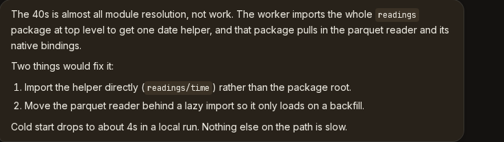
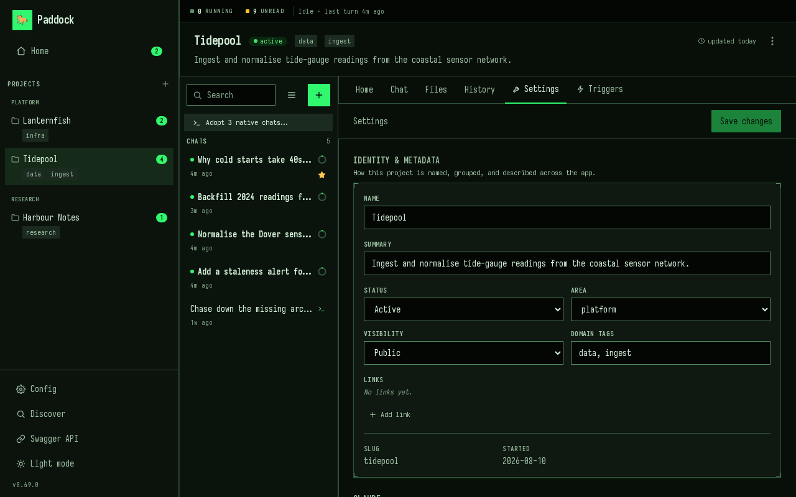
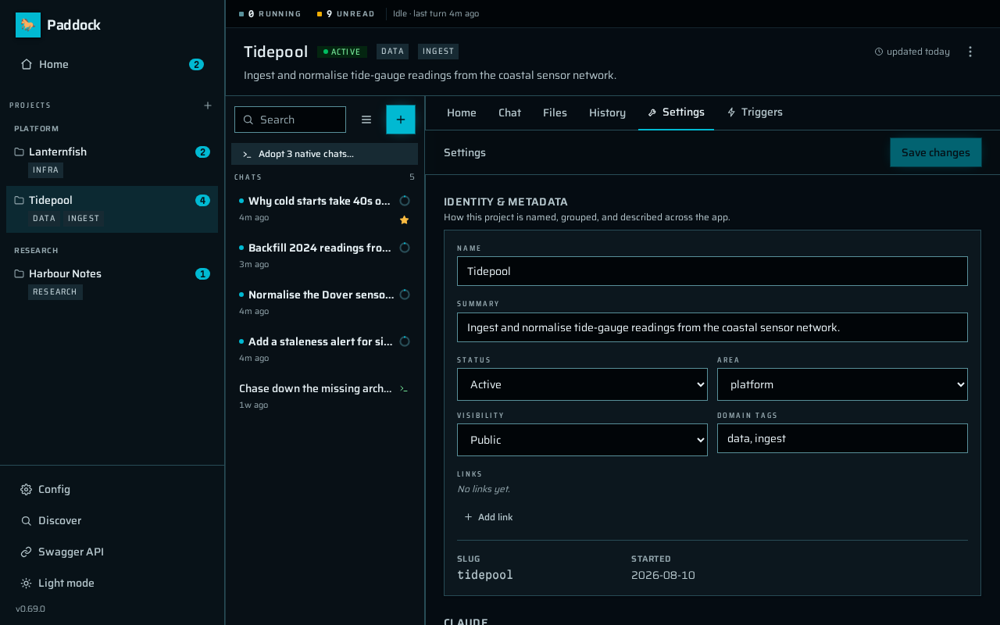

import DemoVideo from '../../components/DemoVideo.astro';

:::note[Reading older entries]
Each entry describes a release **as it shipped**, and later releases sometimes
supersede one. Where that has happened the older entry says so and links
forward — most notably 0.61.1's `--isolated-claude-home`, which 0.62 removed in
favour of the `claude:` config block, and 0.59.1–0.60's `--here`, which 0.68
removed in favour of Discover.
:::

## 0.72 — One key for the whole posture

- **`profile: paranoid | balanced | yolo` sets an instance's security posture in
  one line**, instead of a dozen `PADDOCK_*` variables. It supplies the defaults
  for the Claude sharing modes, spawn depth and the capability toggles, and
  nothing else — it cannot change your port, bind address or auth. **The default
  is `balanced`: on upgrade, an instance with no config file starts inheriting
  the host's `instructions` and `mcpServers`, and `profile: paranoid` restores
  the old behaviour exactly.**

  `paddock config show --resolved` is the answer to "so what am I actually
  running?" — every effective value, and the layer it came from:

  ```
  Profile      balanced  (built-in default)

  Capabilities
    driveMode                       session     default
    selfMcpEnabled                  true        profile (balanced)
    selfMcpWriteEnabled             false       profile (balanced)
    maxSpawnDepth                   1           profile (balanced)
    …
  Advanced (read-only)
    claude.transcripts              own         profile (balanced)
    claude.credentials              host        profile (balanced)
    claude.instructions             host        profile (balanced)
    claude.hooks                    own         profile (balanced)
    claude.mcpServers               host        profile (balanced)
  ```

  Every lever, key by key, is on [Config profiles](/configuration/profiles/).
  `paddock config eject` writes the whole resolution into `paddock.config.yaml`
  for anyone who would rather pin it in git than inherit it; it previews by
  default and applies with `--write`.

- **Your chats can move into `~/.claude`, so `claude --resume` in a terminal can
  see them.** Paddock keeps a project's chats in its own `.chats/` by default,
  which is right for trying it and wrong for keeping it. The fleet readout offers
  the move when there is something to move, and nothing is deleted: a chat you
  leave unticked is set aside in `.chats-pre-migration/` beside its project.

  

- **Fixed: flipping `claude.transcripts` from `host` back to `own` left the
  instance writing into your real `~/.claude`.** `host` plants a symlink at
  `<project>/.chats` pointing out at your Claude home and nothing ever removed
  it, so `own` stopped isolating and deleting a chat unlinked a transcript
  Paddock had never owned. The stale link is now unplanted on every boot, and
  the delete refuses to run while a store is still a planted symlink.

- **Forking from a message asks for a name first**, like the sidebar's fork
  button already did, rather than firing on click and titling the result
  `Fork of <chat>`. The message you picked is still the branch point.
  *(Versioned as 0.71.3, which was never released; it reached users in 0.72.)*

## 0.71.2 — Service control

- **An installed Paddock service survives a graceful stop.** Both unit files
  relaunched Paddock only on a **non-zero** exit, while the server handles
  `SIGTERM` by exiting `0` — so sleep, logout or a stray `kill` all read as an
  intended stop and Paddock stayed down until the next login. A crash was the
  survivable case. Upgrading does not rewrite a unit file, so `paddock service
  status` now says when yours has the old shape and names the fix.

- **`paddock service start | stop | restart`.** Bouncing an installed service
  previously meant uninstalling it or dropping to the raw supervisor. `start`
  and `restart` wait for the URL to answer before reporting success, so it can
  no longer claim to be running over a service that is crash-looping on a port
  clash.

- **Home dropped its Files section.**

## 0.71.1 — The front door

- **The root workspace's Home is the instance's onboarding surface.** A brand-new
  install used to dead-end on its own front door: `/` rendered Discovery *instead
  of* the workspace whenever the instance was empty, and on a machine with no
  Claude Code history both of Discovery's exits were gated on something that
  could never happen — a front door with no button anywhere on it. `/` is now
  always the root workspace, carrying Discovery inline while the instance is
  empty. Two cards sit on it permanently, each showing one entry at a time:

  

- **A chat's "updated X ago" comes from its last message, not the file's mtime.**
  Paddock touches transcripts for reasons that are not conversation — discovery
  re-stats, attribution, a resume appending a mode record — so idle chats were
  restamped as "updated a few minutes ago" and floated to the top of the list in
  batches, phase-locked to a periodic task.

- **`paddock service install` names each stage as it starts it**, rather than
  sitting silent for several seconds and then dumping the whole success block.

## 0.71.0 — Stop one thing, not everything

- **You can stop a single piece of background work.** Each row in the
  running-work bar gets a ✕, and a **Stop all** appears once more than one thing
  is running — so a session with fifteen stray shells no longer has to be reaped
  whole. A shell stops in one click; a sub-agent asks first, because the kill
  cascades to everything that sub-agent started. A stop the runtime refuses says
  `can't stop` and stays retryable rather than hanging at `stopping…`.

  Each shell now shows the **command** it is running beside the description it
  was launched with, which is the difference between three plausible-looking
  waits and three copies of one loop polling a file that does not exist:

  

- **Deep-link to a single message.** The per-message hover rail's time/context
  pill is a real anchor: click it to copy the URL, and opening that URL loads the
  chat scrolled to the message. A link whose target has been reverted away says
  so instead of doing nothing.

- **A measured zero draws as an empty gauge.** The fleet readout lit one of six
  segments for a chat measuring 0% context while its own tooltip read "Context 0%
  full". A barely-started chat still lights one segment, so it cannot be mistaken
  for one that was never measured.

## 0.70.1 — Linked directories, all the way through

- **The Changes tab, the file browser and Push act on the project's own
  directory.** For a project whose working directory isn't its metadata directory
  — a linked worktree, a linked checkout, a repo-backed clone — three surfaces
  had been left behind, each failing silently: an untracked file rendered "File
  not found", **the Push button pushed the backing store rather than the
  project's own repository**, and a managed project with a `path:` had an empty
  Files tab.

- **The running-work bar collapses above four rows.** A real session hit fifteen
  rows, taller than the composer the bar docks above, pushing the conversation
  off screen at the moment you most want to read it. It now opens as one line
  naming the mix and the age of the oldest task:

  

- **The Triggers tab stopped re-parsing the whole jobs directory every ten
  seconds.** Measured against 2,016 job records, a warm call went from ~1,050 ms
  to ~75 ms.

## 0.70 — Inline code you can see

Mostly documentation and capture-rig work. Three things a user sees:

- **Inline `code` has its background back, and blockquotes their colour.** The
  code chip borrowed a surface token, and when 0.68's colour restoration raised
  the prose card underneath it the gap between the two closed to 1.04:1 —
  invisible. Both roles have tokens of their own now.

  

- **`recovery.limboTimeoutMs` is gone** — parsed, defaulted, editable in
  Settings, and read by nothing since the day it was introduced. A
  `limboTimeoutMs:` left in a config file is ignored exactly as it was before,
  and `PADDOCK_RECOVERY_LIMBO_MS` can be dropped from your environment.

- **The root workspace's Settings tab shows `(root)` instead of a blank slug**,
  and `PADDOCK_SELF_MCP_PROJECTS` now says that as well as creating projects it
  gates `promote_project`, which `git clone`s a URL the agent supplies.

## 0.69 — Background work you can see

- **Anything still running is pinned above the composer, not just sub-agents.**
  A background `Bash`, a `Monitor` or a workflow could run for minutes behind a
  card scrolled far up the transcript, and the only hint was a static `running`
  chip — which meant "no completion notification was found in the transcript",
  not "we checked". A killed task kept that chip forever. The bar now names each
  running thing, what it is doing right now, how long it has been going and how
  many steps it has taken, and it clears when the work actually ends. It renders
  nothing when nothing is running.

  Two limits are worth knowing. The signal is **per-process**, so after a server
  restart the bar is empty until something new starts — which is right rather
  than a gap, because Paddock stops the fleet without waiting for jobs and those
  tasks really are dead, unlike the old chip that went on claiming a killed one
  was alive. And it is **`driveMode: session` only**: the CLI runtime reads the
  transcript file, and these are stream-only control messages that never reach
  it.

- **A chat that is still working no longer reports itself idle.** This is the fix
  proper. Background work outlives the turn that launched it, so the moment the
  reply landed the sidebar's streaming dot, Home's in-flight badge, the
  running-only filter and the fleet strip were all told the session had stopped
  while minutes of work carried on. They now read the truth. The composer is
  deliberately *not* locked while only background work runs — an hour-long
  `Monitor` should not make the chat unusable — so "this chat is busy" and "a
  model turn is in flight" are now two different questions with two different
  answers.

  **Still open: sending into a chat that has live background work is not solved
  yet** ([#806](https://github.com/edspencer/paddock/issues/806)). The composer
  is unlocked, but a message sent while a background task is still running can
  sit waiting on the runtime's collision guard for up to five minutes before the
  new turn starts, and **Stop** still means *end the session*, which kills the
  work you were watching rather than interrupting the turn.

- **Fixed from 0.68: an imported directory appears in the sidebar straight
  away.** Discover's success screen said "they are in the sidebar now" while the
  sidebar still said "No projects yet" until you reloaded the browser. The list
  refreshes the moment the run finishes, and the results screen — including the
  rows that failed and have something to say about it — now stays up until you
  leave it rather than being unmounted by its own refresh. *(Shipped to npm as
  0.68.1, which has no git tag or release page of its own.)*

## 0.68 — Discover, and `--here` is gone

- **A new instance opens on Discover** instead of an empty project list. It reads
  your Claude Code history, works out which **directories** on this machine you
  have actually been using `claude` in, and offers them as projects — with
  conversation counts, last-used dates and git remotes, so you can tell them
  apart. Tick the ones you want, press **Import *N* projects**, and each becomes
  a project pointing at that directory with its conversations brought across as
  resumable chats. It stays in the sidebar afterwards; it is not only a first-run
  screen.

<DemoVideo
  src="/demo/discover.mp4"
  poster="/demo/discover-poster.jpg"
  alt="Paddock's Discover screen listing three directories on the machine that already have Claude Code history — harbour-charts, sensor-net and tide-atlas — each with its conversation count and last-used date. Two are ticked and imported; the result panel reports two projects and seven conversations, and both appear in the sidebar."
  caption="Discover offers the directories you have actually been using Claude Code in. Importing links the directory and copies its conversations across — your own history is never moved or deleted."
/>

  The heuristic is most of the feature. A naive scan of a real developer machine
  surfaces around 166 transcript folders, roughly 150 of them throwaway temp-dir
  sessions, plus `/`, `~/Downloads` and `/tmp`. Discover drops those, along with
  system paths, Paddock's own directories, your home directory itself, and
  anything already a project. Two rules are **soft** — no git repository, and
  outside your home — and appear as toggles below the list, but only when
  relaxing one would actually reveal something. A line above them says how many
  went each way, so "why 5 and not 12?" has an answer on screen rather than
  looking like a bug.

  Rows expand **lazily**, fetching a directory's sessions only when you open one,
  and their tickboxes go three-state so you can take some conversations and not
  others. A directory whose transcripts record a *different spelling* of its path
  — a symlinked home, `/var` against `/private/var` — is warned about **before**
  you import, that being how an import otherwise comes back mysteriously empty.
  Rows fail independently and each says why: a project that was created but whose
  chats did not come across is called out in amber rather than green, because it
  leaves a real empty project behind.

- **`--here` is removed, and nothing replaces it — because nothing needs to.**
  It opened the directory you were standing in as the workspace. Discover covers
  the job it was built for, from **one** instance with as many linked directories
  as you like, which is also the only shape that can run as a background service
  ([#796](https://github.com/edspencer/paddock/issues/796)): a launchd agent
  hosts one instance, so three directories opened with `--here` were three
  instances of which it could run at most one.

  There is nothing to migrate — the flag is now rejected like any other unknown
  option, and a run that used to resume a directory now starts the ordinary
  `~/.paddock` instance. If you did open a directory with it, its state is the
  `.paddock/` and `.chats/` folders inside it: add the directory through Discover
  to bring its conversations across, then delete those two folders and the two
  lines `--here` added to your `.gitignore`.

  :::caution[It could adopt your entire home directory]
  Worth knowing if you ever ran `paddock` from `$HOME`. `--here`'s marker for
  "this directory is a workspace" was a `.paddock/` folder — the same name as the
  default data directory at `~/.paddock`. So on any machine where Paddock had
  ever run bare, a later bare run from your home directory *resumed your home
  directory* as the workspace, wrote a `~/.gitignore`, and created `~/.chats`.
  An explicit `--data-dir` did not help, and because it looked like a resume
  rather than a first open there was no consent message — the only tell was the
  word `(resumed)` in the startup output. Removing the flag deletes this outright.
  :::

- **Where you run `paddock` from no longer affects anything.** `--data-dir` (or
  `PADDOCK_DATA_DIR`) is the only thing that picks which instance you get. The
  startup line that used to name a workspace now names the data directory.

- **Importing a directory writes nothing into it.** No `.paddock/`, no `.chats/`,
  no `.gitignore` edit, no `CLAUDE.md` — the project record and its transcripts
  both live in the data dir, and the project simply points at the path. Under the
  default `claude.transcripts: own`, your `~/.claude` transcripts are *copied*
  with their timestamps preserved, never moved or deleted, so your terminal
  `claude` is unaffected. Under `claude.transcripts: host` nothing is copied at
  all — the project reads your `~/.claude` folder directly, and adopting only
  registers the sessions that are already there. [Working in
  chats](/using/working-in-chats/) sets out the difference.

- **Paddock can keep itself running.** `paddock service install` registers the
  instance as a per-user **launchd** agent on macOS or a **`systemd --user`**
  unit on Linux, so it starts when you log in rather than when you remember —
  with `uninstall` and `status` alongside it. Nothing else needs installing:
  the unit runs the Node binary you already have, by absolute path, and restarts
  on a crash but not on a clean exit. [Keeping Paddock running on your
  laptop](/guides/running-as-a-service/) covers it.

## 0.67 — A design system, four themes, and the fleet readout

The UI had no design document and no token layer. Colour was addressed by
palette step in 1017 places, with 722 hand-written `dark:` pairs, and a single
ramp tuned against a dark canvas had been reused unchanged against a light one —
which is why light mode failed WCAG AA at its most-used tokens. 0.67 replaces the
whole colour layer, then builds three more themes on top of it.

- **Light mode now passes AA.** Help text and field labels went 3.75:1 → 6.71:1,
  muted text and placeholders 2.81:1 → 4.90:1, and the primary button's white
  label 4.17:1 → 5.53:1. Light and dark ramps are derived separately in OKLCH now
  rather than one being reused for both, and the mid-steps lose the high-chroma
  tan cast that made light mode read muddy.

  Contrast is **enforced rather than asserted**: a test parses the real
  stylesheet and fails the build if any text-on-surface pair drops below 4.5:1
  (3:1 for control boundaries) in either mode, or if a colour falls outside the
  sRGB gamut. Along the way dialogs started trapping and restoring focus, menus
  gained arrow-key navigation, `prefers-reduced-motion` is honoured throughout,
  and chat messages no longer animate in — a 250ms fade-with-translate on
  something that happens a hundred times a day.

- **Four themes, in Config → Appearance, applied instantly.** **Foundation** is
  the neutral base — warm ground, terracotta accent. **Parchment** is a 90s RPG
  menu: wine chrome, brass fittings, corner brackets, an old-style serif.
  **Terminal** is green phosphor and ANSI in the dark, greenbar and ribbon ink in
  the light. **Sci-Fi** is a deep-space ground and luminous cyan. Both light and
  dark are designed for each theme, not inverted from one another, and every
  theme is contrast-guarded in both modes by the same build-time check — which
  now also fails both ways, on a theme registered with no stylesheet and on a
  stylesheet no one registered.

  It is a **per-browser** choice: no save, no restart, nothing an operator sets
  for everyone, and it survives a reload without a flash.

The same screen — a project's Settings tab — in each of the four, all in dark
mode:






- **Pick any colour for the accent and it stays readable.** The picker takes a
  colour and nothing else. The theme supplies its own saturation and its own
  target contrast, and the *lightness is solved* to clear that floor — so the
  colour you pick is re-solved against whichever theme and mode you are in,
  rather than used at whatever lightness it happened to arrive with. Flip to dark
  and it is solved again. There is a spectrum strip, ten named hues, and a
  **Theme's own** button to put it back.

  Optionally the same colour tints the page ground — **None**, **A little**,
  **More** — which is the fast way to tell two Paddock instances apart at a
  glance. No colour theory is exposed anywhere in the UI.

  `PADDOCK_BRAND_ACCENT` still composes: with no colour picked, the solver reads
  the hue your brand colour produced and re-solves it against the active theme,
  so it is now a hue seed rather than a literal colour. A colour you pick
  yourself overrides it.


<DemoVideo
  src="/demo/accent-picker.mp4"
  poster="/demo/accent-picker-poster.jpg"
  alt="The Appearance section of Paddock's Config screen. Clicking Teal, then Ember, then Violet recolours the whole interface each time — sidebar wordmark, buttons, links and status dots — with no save step. Navigating to a project keeps the chosen colour. Then the four theme cards are clicked in turn: Parchment, Terminal and Sci-Fi each change the background, typeface and chrome together."
  caption="Change the accent and the whole UI follows — and a theme changes ground, type and chrome together. Applies immediately, per browser, with no save step."
/>

  Also fixed here: in dark mode the primary button's fill *lightened* on hover,
  taking its white label from 5.53:1 to 4.17:1 — below AA, on hover, on the
  most-clicked control in the app. Hover raises contrast in both modes now.

- **A live strip above every screen says what the herd is doing.** How many turns
  are in flight fleet-wide, how many chats are holding a reply you have not read,
  and a channel per running turn carrying its project, a live elapsed clock and a
  segmented context gauge. Longest-running first, up to three channels depending
  on the width of your window and an honest `+N` for the rest — the counts
  themselves stay exact. Clicking a channel opens that chat.

  Two of those did not exist anywhere in the UI before. A turn that had been
  going forty minutes and one that started eight seconds ago looked identical,
  and context pressure was visible only inside the chat it belonged to — by which
  point you had already opened it. An idle fleet costs nothing: no timers, no
  requests. While something is running it refreshes the chat names and context
  fills every thirty seconds, and the only thing that animates is the clocks,
  because a persistent readout is on screen 100% of the time and anything
  decorative in it is decorative forever.

  *(Since 0.69 the strip also counts chats that are only running background work,
  which have no turn to time — those channels show `—:—` where the clock would
  be.)*

- **Home's empty states are invitations, and the Config screen is readable.** A
  quiet workspace used to render five near-identical rounded boxes down one
  viewport, four of them dead ends, with the first two saying the same thing
  twice. The two attention feeds now collapse into a **single** "All caught up"
  panel when both are empty — one state, not two — and it is the only thing on
  the screen carrying a primary action. It is deliberately not shown while the
  feed is loading or after it errored, because claiming all is caught up before
  the answer arrives is a lie the reader acts on. The remaining empty states say
  *who* fills them in and *when*: `OVERVIEW.md` and `CHANGELOG.md` are written by
  the post-turn sweeper, not by hand.

  On Config, one measure replaces four unrelated left edges, fields became rows
  instead of a ragged two-column grid, everything routes through the same card
  and control primitives as the other settings screen, and the dirty marker no
  longer shoves an edited field out of its own track. The section rail used to
  vanish below 1024px, handing you back the 5,500px scroll its whole flat shape
  was justified by; it runs horizontally under the filter at those widths now.
  The twenty amber `env` chips are quiet, because being set from the environment
  is a fact about a field rather than a warning about it. The restart banner
  stays loud. It earned it.

## 0.66.2 — Nothing you typed goes missing

- **A file staged while a turn was running no longer rides the next message.**
  Attachments were consumed by *sending* and never by *queueing*, so a file
  staged mid-turn sat in the tray and went out silently with whatever you sent
  next. Attachments now travel with the queued message, every window sees them,
  and Stop hands them back.
- **Reloading mid-turn no longer eats the reply.** A remount fetched the
  transcript and applied it wholesale, throwing away every frame that arrived
  while the fetch was in flight — losing the assistant's entire reply and leaving
  a sub-agent card spinning on "running" until another reload.
- **The sidebar unread badge can always be cleared.** It counted deleted chats,
  so it could read `3` with one chat left and no way to reach zero. Deleting a
  chat now takes its bookkeeping with it, and an instance already stuck heals
  itself on the next load.
- **A new project with an old project's name starts empty.** Re-creating "Foo"
  used to inherit the deleted Foo's run history and a phantom unread badge.
- **Archiving a chat silences it everywhere.** It used to count toward the
  sidebar badge while being excluded from Home's Unread feed.

## 0.66.1 — Queued messages

- **Three ways a queued message could be silently lost are fixed.** The queue —
  the chip holding what you type while a turn runs — deduped on a timestamp from
  *your browser*, so one fast clock destroyed every later queued message on that
  chat. It also drained from only one of the eight places a turn can end, so
  anything queued behind a `/compact`, a trigger or a background sub-agent sat
  stranded until a later message flushed it.
- **A second tab merges instead of overwriting.** The queue is one shared slot per
  chat. Previously a second window replaced the first one's message, and that
  client then watched someone else's text appear as though they had typed it.
- **Stop returns your queued message to the composer** rather than sending it.

## 0.66.0 — Config screen, and a new default port

- **The instance Config screen is now navigable.** Forty-seven settings that
  rendered as one 5,508-pixel column get a **section rail** with counts and
  scroll-spy, a **live filter**, and a **Modified only** lens. It follows VS Code's
  settings screen rather than tabs, and that is the argument: *tabs partition,
  which is exactly what defeats a search.* The filter matches labels, keys, help
  text **and environment variable names**. Env-overridden settings carry a chip,
  explained once in a legend rather than beside twenty fields.


<DemoVideo
	src="/demo/config-filter.mp4"
	poster="/demo/config-filter-poster.jpg"
	alt="Paddock's instance Config screen. Typing 'token' into the filter narrows 47 settings to 3 and collapses the section rail to the single group that still matches. Clearing it and switching on 'Modified only' shows just the 9 settings that differ from their defaults, several carrying an ENV chip and the name of the variable overriding them. Clicking Branding in the rail scrolls that group into view rather than swapping to a separate tab, with the rest of the document still beneath it."
	caption="One document, filtered and jumped. Searching by environment-variable name is the case tabs would have made impossible."
/>

- **Breaking: the default port moves from 4000 to 7233.** Setting `PORT`, `port:`
  or `--port` changes nothing. If you rely on the default, update your reverse
  proxy, `docker run -p`, Kubernetes `targetPort` and SSH tunnels — or pin
  `PORT=4000`.
- **Both on-disk formats declare a `schemaVersion`.** An older build used to drop
  keys it didn't recognise and write the file back without them. A config file
  from the future now refuses to start; a project file is skipped loudly. Nothing
  on disk changes — the current shape is version 1.
- **Deleting or reverting a chat stops the turn first.** `claude` writes the
  transcript itself, so unlinking it mid-turn didn't delete the chat — the live
  process wrote itself back, stripped of history. Promote lost it from *both*
  projects.
- **The UI says "adopt" rather than "import"** — where the transcripts are your
  own `~/.claude`, the sessions offered are already there and the action only
  registers them. Your originals are never moved or deleted.
- **A running sub-agent keeps its place in the bar.** Backgrounded sub-agents pair
  within milliseconds, so one was stamped with a *final* duration that kept
  climbing.
- On **`driveMode: batch` only**, deleting the chat you just finished no longer
  misfiles your next message into a new session.

## 0.65 — `promote_project` over MCP

- **An agent can convert its own notebook project to a repo-backed one.** Without
  an MCP verb it had to stop and ask, or create a second project and abandon the
  first — losing every chat in it. `promote_project` clones, re-points the working
  directory and re-registers against the existing chat store. A failed clone rolls
  back.

## 0.64 — Linked directories, managed and unmanaged

- **`path:` links a directory that already exists, used in place.** No copy, no
  clone: your checkout keeps its history, branches and remotes. Paddock writes
  nothing into it, and deleting the project never touches it.
- **Two axes replace one flag.** *Managed* means Paddock curates the project's own
  files; *unmanaged* means you version-control the content yourself. Whether a git
  repo sits behind it is a separate question. `repoBacked` is **removed from the
  API response**.
- **The Changes tab reports on the code, not the notes** — it had been reading the
  metadata directory.

## 0.63 — Host plugins and MCP server fidelity

- **A plugin installed in Claude Code now works here.** Sharing **instructions**
  brings its commands, agents and skills; sharing **MCP servers** brings its
  servers too, each allow-listed automatically — without that they connect and
  have every call denied with no prompt.
- **`headers` and `type` on an inherited MCP server are carried through** rather
  than stripped, which matters because a stored OAuth token is keyed on a hash
  including both.
- **On `driveMode: batch`, a credential declared in `mcpServers:` is readable in
  process arguments** by any local user while a turn runs. Paddock can't fix this
  from its side, so it warns at startup. The default `session` mode is unaffected.

## 0.62 — Granular host Claude inheritance options

Paddock sits next to Claude Code state you already have: transcripts, a login, an
MCP server or two, a curated `CLAUDE.md`. Until this release it reached all of
that through **one** lever — which Claude home it pointed at — so moving it for
one reason changed four others. That is how a single week produced [data
loss](https://github.com/edspencer/paddock/issues/682), an [invisible macOS
login](https://github.com/edspencer/paddock/issues/683), and a [delete that
destroyed real terminal history](https://github.com/edspencer/paddock/issues/689).

- **Five independent keys, each answering *whose X does this instance use?***

  ```yaml
  claude:
    transcripts: own    # own | host — default own
    credentials: host   # own | host — default host
    instructions: own   # own | host — default own
    hooks: own          # own | host — default own
    mcpServers: own     # own | host — default own
  ```

  `own` is Paddock's, isolated inside the data dir; `host` is this machine's
  Claude Code. Omit the block for full isolation apart from your login. [What
  Paddock touches on your machine](/guides/what-paddock-touches/) states the
  guarantee in one place.

- **⚠️ If you keep a curated `~/.claude/CLAUDE.md`, read this one.**
  `instructions` defaults to `own`, so your user-level `CLAUDE.md`, `agents/`,
  `commands/` and `plugins/` are **not** loaded; every release before 0.62
  bridged them in unconditionally. Set `instructions: host` to keep the old
  behaviour. Each **project's** own `CLAUDE.md` is loaded in every mode and is
  unaffected. The change bites on the CLI paths — the sweeper, triggers and
  `driveMode: batch` — where those files did still apply. *(0.64 raised the
  startup notice to a warning, so you are now told.)*
- **Host `settings.json` hooks no longer run inside Paddock turns.** Every hook
  you had ever configured used to run here with no way to turn it off. `hooks:
  host` restores them; the rest of that file still applies either way.
- **Your own MCP servers can reach Paddock two ways.** `claude.mcpServers: host`
  attaches what is already in your `~/.claude.json`. A sibling `mcpServers:`
  block declares servers to Paddock itself — the answer for a container with
  nothing to borrow — where `env:VAR_NAME` references keep tokens out of a
  git-tracked file.
- **Deleting a shared chat releases it instead of destroying it.** Under
  `transcripts: host` a Paddock chat and a `claude --resume` in the same
  directory are the same file, so delete no longer means `rm` — the transcript is
  your history, not Paddock's copy.
- **`CLAUDE_HOME` and `--isolated-claude-home` are removed**, replaced by the
  block above. `CLAUDE_CONFIG_DIR` still works as "put Paddock's home here", but
  a value resolving to your `~/.claude` is now a startup refusal rather than a
  silent re-coupling. No migration needed.

## 0.61.1 — CLI login, and symlinks into your Claude home

- **Paddock no longer plants anything in a Claude home it doesn't own.** It used
  to redirect a directory's transcripts by replacing
  `~/.claude/projects/<encoded-dir>` with a symlink to the workspace's `.chats/`.
  It skipped directories you already had history in, but not empty ones — which was
  exactly what `--here` (removed in 0.68) was usually pointed at. From then on every `claude` session
  in that directory was written into Paddock's store, so deleting `.chats/` took
  real history with it. One person lost 30 transcripts this way.

  :::caution[Check for a leftover link if you used `--here` before 0.61.1]
  `--here` on **0.59.1–0.60** planted one with no special configuration, as did
  0.61.0 with `CLAUDE_HOME=~/.claude`. Paddock now names any it finds at startup.
  To look yourself:

  ```sh
  ls -l ~/.claude/projects | grep -- '-> .*\.chats'
  ```

  Deleting the link restores normal behaviour; **move the transcripts out of the
  `.chats/` it points at first** if you want to keep them. Paddock won't remove it
  for you — not writing to `~/.claude` has to include not deleting from it.
  :::

- **On a Mac, your existing Claude Code login works again.** Claude Code files its
  Keychain entry under a name derived from whether `CLAUDE_CONFIG_DIR` is set, so
  once Paddock pointed at its own Claude home a perfectly good login went
  invisible and every turn failed with `Not logged in`. A Keychain entry can't be
  bridged the way a `.credentials.json` can, so with no token in your environment
  the CLI now runs against your own `~/.claude`. *(0.62 removed
  `--isolated-claude-home`; `claude.credentials` and `claude.transcripts` decide
  this now.)*
- **A first run with no credentials prints a message, not a crash.** It used to
  emit several screens of stack trace containing the whole sweeper system prompt,
  four times, with the useful line forty lines down.

## 0.61.0 — Paddock's own Claude home

- **Transcripts move out of `~/.claude` into Paddock's data directory.** They were
  the last state living outside it, reached by planting symlinks into your Claude
  home — and the code doing that would, on every agent registration, copy your
  transcripts out and **delete the originals**, inside a bare `catch`. Paddock now
  keeps its own home under the data dir and only ever reads `~/.claude`.

  :::caution[This moved twice more]
  0.61.1 made the CLI run against your `~/.claude` again, because an isolated home
  cannot see a macOS Keychain login; 0.62 replaced the mechanism entirely. To know
  what your instance does today, read 0.62.
  :::

- **Four turn-level fixes.** Appending to a queued message no longer discards the
  addition; **Stop** works on a `/compact`, where slash-command turns had never
  registered a cancellable id; marking the chat you are reading as unread survives
  its own turn landing; and the sidebar stops flashing to skeletons twice per turn.
- **Paddock is MIT licensed, and the packaging now says so.** There was no licence
  file and no `license` field, while the publish script defaulted it to MIT — so
  every release told npm one thing while the source granted another.

## 0.59.1–0.60 — npx install, `--here`, and confirmed adoption

:::note[`--here` was removed in 0.68]
This entry describes it as it shipped. Discover replaced it — see
[0.68](#068--discover-and---here-is-gone), which also explains the `$HOME` bug
its marker directory caused.
:::

- **`npx @edspencer/paddock` starts an instance in one command** — server, web UI
  and Claude Code runtime, no Docker and no clone. It starts quiet, says where it
  put your data, and warns up front rather than failing on the first turn.
- **`--here` opens the directory you are standing in** as the workspace, rather
  than creating a project somewhere else. It creates `.paddock/` for state and
  `.chats/` for transcripts and adds both to your `.gitignore`; later runs resume
  with no flag. The model is `git init`, with `.paddock/` as `.git`.

  :::caution[As shipped, `--here` did touch your `~/.claude`]
  On 0.59.0–0.60 it also linked `~/.claude/projects/<encoded-dir>` at the new
  workspace, so terminal `claude` sessions in that directory afterwards wrote into
  Paddock's store — one report lost 30 transcripts. 0.61.1 stopped it and warns
  about any link already planted.
  :::

- **Adoption asks before it takes anything.** The old button imported everything
  on one click and could not be undone. It now opens a dialog listing candidate
  sessions **grouped by source directory** — the source path being the detail that
  makes "these are from a scratch copy, not my checkout" visible *before* you
  commit — and a successful adoption offers **Undo**.
- **It stops offering chats that were never yours.** Paddock's own curation runs
  were being offered as terminal history, and a same-named directory anywhere on
  disk counted as your checkout; a repo-backed project now requires the git
  remotes to match.
- **Published with provenance** — releases go to npm from CI through OIDC trusted
  publishing, with a signed attestation tying each version to the commit.

## Earlier releases

Everything from **0.58 back to 0.29** lives on
**[What's New — earlier releases](/whats-new-archive/)**: adopting Claude Code
CLI chats, the npm package, the environment system prompt, Home's attention
feeds, subtree actions and the one-front-door sidebar, the root becoming a
workspace, scratch being retired, driving Paddock from outside over MCP,
per-message fork and revert, attachments, streaming, unified triggers, and the
rest.

---

*Maintaining this page:* add a short, user-facing entry here whenever you cut a
release (see [RELEASING.md](https://github.com/edspencer/paddock/blob/main/RELEASING.md)).
When this page gets unwieldy, move the oldest entries to the archive page
verbatim — the archive is append-only and its entries are never rewritten.
