import DemoVideo from '../../components/DemoVideo.astro';

:::note[Reading older entries]
Each entry describes a release **as it shipped**, and later releases sometimes
supersede one. Where that has happened the older entry says so and links
forward — most notably 0.61.1's `--isolated-claude-home`, which 0.62 removed in
favour of the `claude:` config block.
:::

## 0.62 — Five levers instead of one

Paddock sits next to Claude Code state you already have: transcripts, a login,
an MCP server or two, a curated `CLAUDE.md`. Until this release it reached all
of that through **one** lever — which Claude home it pointed at — with every
distinct concern welded to it. Moving it for one reason changed four others,
which is how a single week produced [data
loss](https://github.com/edspencer/paddock/issues/682), an [invisible macOS
login](https://github.com/edspencer/paddock/issues/683), and a [delete that
destroyed real terminal history](https://github.com/edspencer/paddock/issues/689).
0.62 splits it into five independent keys.

- **You can now read what Paddock touches off a config file, instead of
  inferring it.** Each key answers one question — *whose X does this instance
  use?* — in one vocabulary:

  ```yaml
  claude:
    transcripts: own    # own | host — default own
    credentials: host   # own | host — default host
    instructions: own   # own | host — default own
    hooks: own          # own | host — default own
    mcpServers: own     # own | host — default own
  ```

  `own` is Paddock's, isolated inside the data dir; `host` is this machine's
  Claude Code. Omit the block for the default, which is full isolation apart
  from your login. There is a new page — [What Paddock touches on your
  machine](/guides/what-paddock-touches/) — that states the guarantee in one
  place, and [the config file reference](/configuration/config-file/#claude--what-this-instance-shares-with-your-claude-code)
  covers each key in depth.

- **⚠️ If you keep a curated `~/.claude/CLAUDE.md`, read this one.**
  `instructions` defaults to `own`, so your user-level `CLAUDE.md`, `agents/`,
  `commands/` and `plugins/` are **not** loaded. Every release before 0.62
  bridged them in unconditionally. To keep the old behaviour:

  ```yaml
  claude:
    instructions: host
  ```

  Two things make this smaller than it sounds, and one makes it larger. Smaller:
  each **project's** own `CLAUDE.md` is loaded in every mode and is untouched by
  this key, and on a default chat turn these four files were already inert —
  Paddock's chat runtime loads only the `project` setting source, so the host's
  user-level files had stopped applying there when chats moved to the Agent SDK.
  Larger: they *do* still apply on the CLI paths — the post-turn sweeper,
  triggers, and `driveMode: batch` chats — so this is a real change there, and
  Paddock's startup notice about it is written at `info`, which the `npx`
  launcher's quiet default filters out. If you had it, you will not be told you
  lost it. Hence this entry.

  *Superseded:* that notice is now a **warning**
  ([#706](https://github.com/edspencer/paddock/issues/706)), so it survives the
  `npx` quiet default and you are told — still only when you actually have
  `~/.claude` instruction files that are not being loaded.

- **Your `~/.claude/settings.json` hooks no longer run inside Paddock turns.**
  Hooks are shell commands bound to tool use, and until now every one you had
  ever configured ran in Paddock with no key to turn it off. `hooks: own` is the
  default; `hooks: host` restores them. The rest of that file — `permissions`,
  `model`, `statusLine` — still applies either way: under `own` Paddock writes
  its own `settings.json` carrying your other keys with `hooks` dropped, and
  regenerates it at each startup. Note the name is exact: this stops host
  **hooks**, not every host **command**, because several other `settings.json`
  keys also name a script to run ([#698](https://github.com/edspencer/paddock/issues/698)).

- **Your own MCP servers can reach Paddock's agents — two different ways.**
  `claude.mcpServers: host` attaches the servers already declared in your
  `~/.claude.json`. Separately, a **sibling** `mcpServers:` block declares
  servers to Paddock itself, which is the answer for a container or a server
  where there is nothing on the machine to borrow:

  ```yaml
  mcpServers:
    notion:
      command: npx
      args: ["-y", "@notionhq/notion-mcp-server"]
      env:
        NOTION_TOKEN: env:NOTION_TOKEN     # a reference, not the token
  ```

  `env:VAR_NAME` works anywhere a string goes, so tokens stay out of the file —
  which matters, because that file is git-tracked and editable from the Config
  screen. Paddock never prints a value from this block back to you.

  One limit worth knowing, and it is downstream of Paddock rather than a bug in
  it: `env:VAR_NAME` keeps a credential out of the *file*, and under
  **`driveMode: batch`** it does not keep it out of `ps`. On that runtime the
  engine passes the whole server definition to `claude` as a `--mcp-config`
  command-line argument, and process arguments are world-readable on Linux
  (`/proc/<pid>/cmdline`). The default **`driveMode: session`** hands the same
  record over in-process, so the server receives its `env` the way any process
  does — owner-readable only, exactly as your own Claude Code does it. Prefer the
  default for any server holding a credential; Paddock warns at startup if you
  are on `batch` with one.

- **Deleting a shared chat releases it instead of destroying it.** Under
  `transcripts: host` a Paddock chat and a `claude --resume` in the same
  directory are the same file, in both directions and with no re-import. So
  delete no longer means `rm`: the transcript stays on disk because it is your
  history rather than Paddock's copy. (The chat does not yet disappear from your
  list — that half needs a tombstone and is tracked as
  [#693](https://github.com/edspencer/paddock/issues/693).)

- **Paddock always owns its own Claude home, and refuses to start if you aim it
  at yours.** `CLAUDE_HOME` and `--isolated-claude-home` are **removed** — the
  `claude:` block replaces both. `CLAUDE_CONFIG_DIR` is still honoured, as "put
  Paddock's own home here", but a value resolving to your `~/.claude` is now a
  startup refusal rather than a silent re-coupling: it is the one setting that
  recreates every bug above and breaks agent memory. Existing instances need no
  migration — transcripts already live in each project's `.chats/`, so the home
  moving moves no data.

## 0.61.1 — Your `~/.claude`, left alone and finally usable

- **Paddock no longer plants anything in a Claude home it doesn't own** — and if an
  earlier build planted one, it now tells you where. Paddock used to redirect a
  directory's transcripts by replacing `~/.claude/projects/<encoded-dir>` with a
  symlink to the workspace's `.chats/`. It skipped that for directories you already
  had history in, but not for ones you didn't — and a directory with no history is
  exactly what `--here` is usually pointed at. From that moment *every* `claude`
  session you started in that directory was written into Paddock's store, so deleting
  `.chats/` — an ordinary thing to do — took real history with it. One person lost
  30 transcripts this way.

  Nothing is created under `~/.claude` now, in any configuration. Import stays the
  way you bring history in: offered, confirmed by you, originals untouched.

  :::caution[Check for a leftover link if you used `--here` before 0.61.1]
  `--here` on **0.59.1–0.60** planted one with no special configuration, as did
  0.61.0 with `CLAUDE_HOME=~/.claude`. Paddock now names any it finds at startup.
  To look yourself:

  ```sh
  ls -l ~/.claude/projects | grep -- '-> .*\.chats'
  ```

  Any link listed there still redirects that directory's sessions. Deleting the link
  restores normal behaviour; **move the transcripts out of the `.chats/` it points at
  first** if you want to keep them. Paddock won't remove it for you — not writing to
  `~/.claude` has to include not deleting from it.
  :::

- **On a Mac, your existing Claude Code login just works.** Claude Code files its
  Keychain entry under a name derived from whether `CLAUDE_CONFIG_DIR` is set, so
  once Paddock started pointing at its own Claude home (0.61.0), a perfectly good
  login became invisible: `npx @edspencer/paddock --here` would start, load the UI,
  and fail every turn with `Not logged in`. A Keychain entry can't be shared the way
  a `.credentials.json` can, so there was no bridging it.

  With no token in your environment, the CLI now runs against your own `~/.claude`
  and uses the login already there. Your transcripts stay where Claude Code has
  always written them rather than moving into `.chats/`, and it says so on startup.
  Pass `--isolated-claude-home` for a Claude home of Paddock's own. Servers, the
  container image and `node dist/index.js` are unchanged — isolation is a server
  concern, and `--here` means *my* directory, *my* login.

  *Superseded by 0.62:* `--isolated-claude-home` was removed, Paddock now always
  keeps its own Claude home, and `--here` no longer decides anything about
  credentials or transcripts — [`claude.credentials`](/configuration/config-file/#credentials)
  and [`claude.transcripts`](/configuration/config-file/#transcripts) do,
  independently of each other and of the flag.

- **A first run with no credentials looks like a message, not a crash.** It used to
  print several screens of stack trace with the entire sweeper system prompt in it,
  four times over, with the one useful line — `Not logged in` — about forty lines
  down. The server was fine and still serving; nothing about that output said so.
  A known, non-fatal background failure is now one line naming the cause and the fix.
  `--verbose` (or `HERDCTL_LOG_LEVEL=debug`) still gets you everything.

## 0.59.1–0.60 — One command, on your own history

- **`npx @edspencer/paddock` — nothing to install, nothing to clone.** Paddock is
  published to npm as a single self-contained package: the server, the web UI, and
  the Claude Code runtime, in one command. If you have Node 22+, you have
  everything you need. It starts quiet (the several hundred boot log lines used to
  scroll the one URL you wanted off the top of the terminal), tells you where your
  data lives the first time it creates it, and warns you up front rather than
  silently failing if it can't find Claude credentials.

- **`--here` opens the directory you're standing in.** Run
  `npx @edspencer/paddock --here` inside a project and Paddock adopts *that*
  directory as its workspace: Claude works in your files, and any Claude Code
  sessions you already have for the directory are offered for import. So the
  fastest way to find out whether Paddock is for you is to point it at work you
  already did — not at an empty instance.

  The flag is the consent, and it says what it's about to do: it creates
  `.paddock/` for the workspace's state and `.chats/` for transcripts, and adds both
  to your `.gitignore`. **Your `~/.claude` is not touched** — sessions there are
  *offered* for import, and nothing is moved, copied or linked until you confirm, so
  your terminal `claude` keeps working exactly as before. Later runs in the same
  directory resume it with no flag needed — the git model, where `--here` is
  `git init` and `.paddock/` is `.git`. Without the flag, Paddock never touches the
  directory you ran it from.

- **Published with provenance.** Releases go to npm from CI through OIDC trusted
  publishing, carrying a signed SLSA attestation that ties each version back to the
  exact commit and workflow that built it. The release fails if the attestation
  doesn't appear.

:::caution[Use 0.59.1 or later]
The npm package first shipped in 0.56.0, but **0.57.0 through 0.59.0 are broken** — the
CLI silently did nothing and exited 0 when run through `npx` or a global install. Fixed
in 0.59.1. `npx @edspencer/paddock@latest` always gets you a working one.
:::

## 0.55 — Bring your terminal history with you

- **Import the Claude Code chats you already have.** A project is backed by a
  working directory, and you very often already have months of terminal `claude`
  history for it — or for your own checkout of the same repo, somewhere else
  entirely. Until now none of that was visible here. When a workspace has
  importable sessions, an **Import _N_ native chats** button appears at the top of
  its chat list; one click, no confirmation dialog, and they arrive. Imported
  chats carry an **Imported** badge so you can tell them from chats started here,
  and they keep their original timestamps, so a conversation from three weeks ago
  sorts where it actually belongs rather than collapsing to "today". **Your
  `~/.claude` history is copied, never moved** — nothing you have in the terminal
  is disturbed. The count is live rather than a dismissable prompt, so it comes
  back if you accrue new terminal sessions later, and it reaches zero only when
  there is genuinely nothing left to bring over. There is a headless equivalent,
  `npm run import-chats`, for when the transcripts and the server don't share a
  filesystem — a containerised instance only sees what you have mounted.

<DemoVideo
	src="/demo/import-chats.mp4"
	poster="/demo/import-chats-poster.jpg"
	alt="A newly added project called Acme API has no chats yet. Above its empty chat list sits a button reading 'Import 7 native chats'. Clicking it fills the list with seven conversations from the terminal — 'Rate limiting for /payments', 'Webhook retry backoff', 'Idempotency keys on charges' and four more — each with a small terminal icon marking it as imported, and each dated when it actually happened: 2 days ago through to 2 weeks ago. A toast confirms 'Imported 7 chats' and the button disappears, because there is nothing left to bring over."
	caption="Seven terminal sessions adopted into a project in one click. The dates are the original ones — imported chats sort by when the conversation really happened, not when you imported it."
/>

- **Detection is deliberately forgiving about where your checkout lives.** A
  repo-backed project matches any transcript folder whose recorded working
  directory has the same checkout name, so history from a clone at a completely
  different path still comes over; a notebook project matches its exact path. The
  working directory is read out of the transcript itself rather than decoded from
  the folder name, because that encoding is lossy — `/a/b-c`, `/a-b/c` and
  `/a/b/c` all collapse to the same folder. Empty and slash-command-only
  transcripts are held back as noise and reported separately, so a lower count
  always has an explanation rather than looking like something went missing.


- **Operator action: point your health probes at `/api/health`.** Five paths
  (`/healthz`, `/-/health`, `/health`, `/readyz`, `/livez`) were exempt from
  authentication but served by no route at all, so they fell through to the
  front-end catch-all and answered `200` with the app shell — to *anyone*, signed
  in or not. A monitoring check aimed at `/healthz` therefore reported healthy
  whatever the instance was actually doing. They are now gated like any other
  unknown path. `/api/health` is the real one, returns `{"ok":true}`, and is what
  the shipped Dockerfile and Kubernetes manifests already use.
- **Two measured memory fixes on the paths you hit constantly.** The jobs index
  was retaining every record body it exists specifically to avoid retaining — the
  YAML parser hands back string slices that pin the whole source document alive,
  so caching three small fields per record kept all of it. Measured against this
  instance's own jobs directory: **95.7 MB retained before, 1.9 MB after.**
  Separately, the per-chat usage endpoint fanned out one file read per chat
  simultaneously — 1,515 chats meant 1,515 concurrent reads — and bounding it
  **halves peak memory** with no measurable latency cost. Neither changes a single
  byte of what the endpoints return.
- **The running sub-agents bar survives leaving a chat and coming back.**
  Re-opening a chat rehydrates it from history, and a sub-agent that was still
  working had no completed tool result to join against, so the bar emptied for the
  rest of its run and its cards stopped expanding — healing only once the
  sub-agent finished, which is exactly when you no longer needed it.
- **The self-management tools stop lying by omission.** `read_chat` now says
  outright that tool entries come back empty and still count against your limit,
  that thinking blocks and sub-agent transcripts are dropped, and where the
  lossless transcript actually lives — so it is no longer mistaken for an audit
  tool. It also flags that an unknown session id returns an empty result rather
  than an error, which had already produced one confident report about a chat that
  was never opened. And the whole surface can finally see the **root workspace**:
  root chats were previously unlistable and unreadable, with two of the three
  failure modes silent.

## 0.54 — Claude, not "the keeper"

- **The UI says Claude now.** Paddock is a thin layer over Claude Code, and the
  "keeper" persona was inventing a second actor that does not exist — you were
  messaging Claude the whole time. So the composer says **Message Claude…**,
  Settings has a **Claude** section rather than *Keeper agent*, and the turn
  notices say *Claude reached its turn limit*. Where a sentence didn't need an
  actor at all, the word is simply gone rather than swapped: "a dedicated keeper
  agent" drops out of the empty-projects copy entirely.
- **Breaking: the `keeper` names are gone from config, env and the API, with no
  aliases.** Pre-1.0, a minor release may break the one before it. If you set
  either of these, rename them:

  | before | after |
  | --- | --- |
  | `PADDOCK_KEEPER_DRIVE_MODE` | `PADDOCK_DRIVE_MODE` |
  | `PADDOCK_KEEPER_NATIVE_PROMPT` | `PADDOCK_NATIVE_PROMPT` |

  In `paddock.yaml` and instance settings, `keeperDriveMode` → `driveMode`. An
  instance still setting the old key falls back to the built-in default rather
  than failing to boot — quietly, so check yours. On `GET /api/models`,
  `keeperDefault` → `defaultModel` and `keeperDriveModeDefault` →
  `driveModeDefault`. The `keeper-` prefix on agent *names* is deliberately
  untouched: it is persisted in job records and session directories, and renaming
  it would orphan all of them.
- **Home leads with what needs you: running chats first, then unread.** Home used
  to open on a list of recent chats — the same list the sidebar already shows in
  full — so the front door duplicated the furniture and buried the signal. It now
  opens on the two states that actually want a decision from you. The root's Home
  is fleet-wide, covering every project's live work as well as its own, while a
  project's Home is scoped to itself; both run through one component that never
  learns which it is rendering. Running state is read from the live session hub
  rather than guessed from timestamps, so it can't disagree with the streaming
  dots, and a chat is never in both lists at once. **This is also what fixed the
  in-flight badge**: watching the running set is now itself a reason to hold a
  socket open, so landing on Home is correct on first paint instead of looking
  like a quiet instance.


- **`OVERVIEW.md` now renders on Home beside `CHANGELOG.md`**, both collapsible
  with the choice remembered per workspace. The old Overview card at the bottom —
  a summary plus a metadata table — is gone; it described the workspace rather
  than offering a way into it, and Settings already owns editing that. The
  **Projects** section left Home too, taking the New Project button to the
  sidebar's Projects header, where it sits directly above the list it adds to.
- **Foreground sub-agents stopped duplicating themselves into the transcript.**
  Launching a sub-agent in the foreground printed every one of its steps twice —
  once inside its card, correctly, and once as top-level rows of the parent chat
  next to the card that already contained them. The filter that prevents this
  existed but ran on only one of the five paths that stream a turn. It runs on all
  five now, which also keeps a sub-agent's context out of the parent's context
  meter. The bug was live-only — a reload always "healed" it — which is why it
  read as a streaming glitch and survived so long.
- **A live bar above the composer shows what running sub-agents are doing.** A
  sub-agent could work for minutes behind a collapsed card showing only a cost,
  usually scrolled well out of view. Each running sub-agent now lists its latest
  step and step count as it works; tapping one scrolls its card into view, expands
  it and flashes it so your eye lands on the right place. Liveness and duration
  come from the sub-agent's own transcript rather than the parent's — the parent
  finishing its turn no longer makes a sub-agent that is still working look idle.
- **A chat can no longer be bound to the curator's transcript.** For a notebook
  project the curation sweeper shared a working directory with Claude, and since a
  sweep is scheduled after every turn, the two raced for the same session
  directory. When the sweeper's transcript landed first, your turn was handed the
  sweeper's session id — so the curation text streamed back as the reply, resuming
  the chat resumed the *curation* transcript with no memory of your conversation,
  and the chat could disappear from the project's list entirely. The sweeper now
  has its own directory, which removes the shared-directory collision structurally
  rather than by timing.

## 0.53 — Home says what it's holding

- **The sidebar's Home link now carries the same unread badge as every project
  row.** 0.52 reduced the sidebar to a single **Home** link, and that link stayed
  mute: the root is a workspace with chats of its own, yet it was the one row in
  the sidebar that could never tell you something had come back. Now it says
  exactly what every other workspace row says — an accent pill counting unread
  replies, a spinner and count for turns in flight, and *nothing at all* when it
  is quiet. It is the same badge component with the same accessible labels ("2
  unread replies", "1 chat in flight"), rather than a root-shaped lookalike, so
  Home and a project row read the same way at a glance instead of each needing
  its own interpretation. **The in-flight half rides the live chat socket, and in
  0.53 nothing opened that socket until you opened a chat — so on a Home you had
  only just loaded you saw the unread pill but not yet the spinner.** That was a
  known gap rather than the intended design, and it is fixed in the next release:
  watching the running set is now itself a reason to hold a socket, so the
  spinner is correct on first paint too.
- **Home also costs one request less.** The project list used to be followed by a
  second, full fetch of the root workspace — its changelog and its whole chat
  list included — from which everything but a few metadata fields was thrown
  away. The root's counts now arrive alongside the projects on the request that
  was already being made.
- **Promoting a chat into a project puts it in the sidebar straight away.** The
  action always did the right thing on the server — the project was created and
  the chat's transcript re-homed — but the new project simply wasn't in the left
  nav until you reloaded, which made a working action look like a failed one. Two
  further faults in that dialog are fixed with it: a project name you had typed
  was silently reverted to the chat's name whenever the view behind it
  re-rendered, which in a live chat is often; and a promote that failed could
  never show you why, because the error was wiped one render after it appeared.
- **The project Settings tab no longer prints the same date twice.** It showed
  **Started** and **Created** as two adjacent rows carrying an identical value —
  the second was an alias of the first, kept to reconcile two old specs. Only
  **Started** remains, and it still means the date the project was created.
- **Some long-dead compatibility surface is gone, which external clients should
  know about.** Three things left the wire: `created` on the project object (the
  duplicate above), `sweeperDefault` on `GET /api/models` (the sweeper's model is
  resolved on the server and was never selectable, so the field only ever
  described a decision a client couldn't make), and the `target` field on
  WebSocket frames, which was a byte-for-byte duplicate of `projectSlug` kept for
  early frontends that never existed. If you built against `projectSlug` — as
  Paddock's own client always has — nothing changes.

:::danger[Breaking: two environment variables were renamed, with no aliases]
Retiring "keeper" as a user-facing word also renamed the env vars carrying it:

| before | after |
|---|---|
| `PADDOCK_KEEPER_DRIVE_MODE` | `PADDOCK_DRIVE_MODE` |
| `PADDOCK_KEEPER_NATIVE_PROMPT` | `PADDOCK_NATIVE_PROMPT` |

**An old name is not an error — it is ignored**, so an instance still setting one
falls back to the built-in default instead of failing to start. For drive mode
that default is `session`, so anyone who had pinned
`PADDOCK_KEEPER_DRIVE_MODE=batch` is now on the SDK runtime without being told.
Check your environment for the old names.

The `paddock.yaml` key `keeperDriveMode` → `driveMode` changed the same way.
:::

## 0.52 — Subtree actions & one front door

- **The sidebar is one Home link, and the projects grid lives on it.** The two
  buttons that used to sit in the sidebar — **New Project** and **New root chat** —
  are gone, replaced by a single **Home** link to `/`. Both actions moved to where
  the thing they create actually lives: the projects grid on root Home carries
  **New Project**, and Home's Chats section carries **New chat**. The **Projects**
  tab is gone too — the grid is now a *section* of the Home pane rather than a tab
  of its own, so the instance's front door is one page instead of a choice between
  two. Home's sections read Chats → Projects → Files → CHANGELOG.md → Overview:
  chats lead because every workspace has them, so the page opens the same way
  whether or not it has children, and the overview trails because it describes a
  workspace rather than offering a way into one. Only the root gets a Projects
  section, since it's the only workspace with children today. Old links and
  bookmarks still work — `/projects` now lands you straight on `/`.

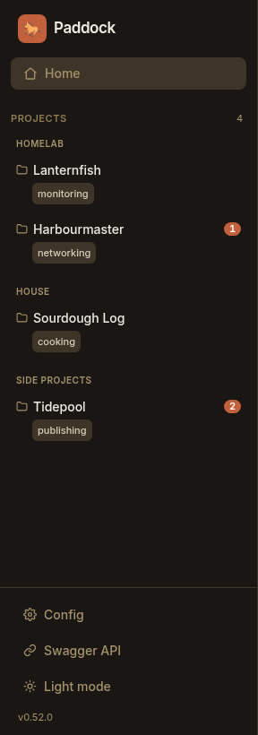

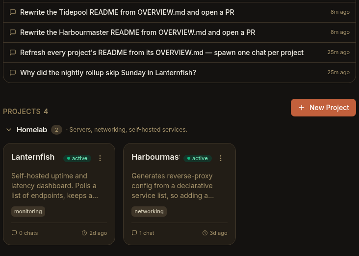

- **Instance Config and workspace Settings are two screens now, named for the
  files they write.** 0.51 stacked them: the instance-wide `paddock.config.yaml`
  form rendered as a second section *beneath* the root workspace's own settings
  form, two save bars and one page inside another — and in practice the stacking
  squashed the workspace form to zero height, so the tab had nothing it could
  scroll. They're now separate. **Config** (the sidebar gear, at `/config`) writes
  `paddock.config.yaml`, which is frozen at boot and so needs a restart to apply.
  **Settings** is a tab on each workspace, writes that workspace's `project.yaml`,
  and applies on save. The root's Settings tab is now identical to any project's.
- **Find the chats that are working right now.** The chat list's **Chats** count
  badge splits the moment a turn goes live: the total on the left, the running
  count on the right — and the right half is a button that filters the list down to
  just the chats working right now. Running chats were always findable by hunting
  down the sidebar for a spinning ring; now they're a target you can hit. The
  filtered view deliberately renders **flat**, because a running child indented
  under its running parent would put back exactly the nesting the filter exists to
  strip away, and it keeps whatever chat you currently have open pinned in so it
  can't vanish from under you the instant its turn lands. The filter composes with
  search rather than fighting it, and because it's sticky it can outlive the work
  it was filtering for — so when the last turn ends the list says "No chats are
  running." and offers you **Show all chats**.

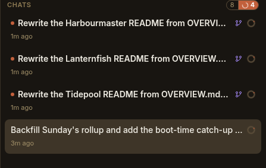

- **Nesting itself is now optional.** A second button beside **+** toggles the
  list between the nested tree and a flat one. Both this and the running filter are
  remembered per browser and applied everywhere, not per project — how you like to
  read a list isn't a fact about one project.


- **Hold Shift to act on a whole family of chats.** The nested list could only ever
  act on one chat at a time, which made archiving a parent quietly destructive to
  the *shape* of the list: the children lost their parent from the active set and
  scattered back into the top level. **Shift-click** on archive, delete, or
  mark-read/unread now applies to a chat **and all of its descendants**,
  recursively, however deep the family goes. A plain
  click is unchanged. Deleting goes through a confirmation that counts what's
  about to go ("Manager and its 3 nested chats will be permanently removed"),
  because a collapsed parent means a shift-delete can destroy chats that aren't
  even on screen and there is no undo. The dialog also names the nested chats it
  will **keep**, since deleting a parent on its own re-homes its children to the
  top level and an irreversible action shouldn't rearrange the list without
  saying so.
- **Detach a chat from its parent.** An unlink action on any nested row promotes
  that chat to the top level with its own subtree intact — so you can archive a
  whole family *except* one chat you're still using. Nothing is destroyed;
  re-attaching is just clearing the override.
- **Real tooltips, instead of whatever your browser did.** Every native `title=`
  in the chat list is replaced by a themed tooltip that escapes the sidebar's
  scroll container and is rich enough to carry the hint that makes the subtree
  actions discoverable at all — "… · **Shift-click** to archive all 4", counting
  the chat itself along with its descendants — shown only on the rows that
  actually have any. The same hint is in each button's accessible name, so the
  affordance reaches the keyboard too.

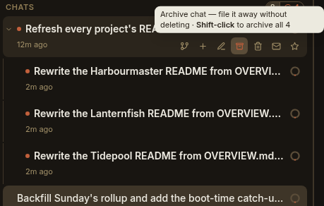

- **No more grey browser dialogs.** The last three `window.prompt()` /
  `window.confirm()` calls — renaming a chat, reverting a chat, deleting a
  trigger — are Paddock modals now. They were unthemed browser chrome sitting one
  button away from a styled dialog, prefixed with "*⟨host⟩* says" in the installed
  PWA, and they blocked the main thread (including the live transcript) until you
  dismissed them. The revert dialog gains more than polish: its warning — that
  tool calls made after the revert point are **not** undone, only the conversation
  is — used to be glued into one undifferentiated paragraph, so the most important
  sentence in the most destructive of the three actions read like boilerplate.
  It's structured content now, with the message and tool-call counts emphasised
  and the caveat as its own callout: "**Those actions are not undone.** Files
  written, PRs opened and messages sent stay as they are — only the conversation is
  rewound." Two small behaviours were kept rather than
  lost in the move: clearing the rename field still resets a chat to its generated
  name — the modal now says so out loud ("Clear the box to reset it to the
  generated name.") and relabels its button to **Reset name**, where the old
  prompt could only be discovered by accident — and the revert
  dialog refuses to dismiss on a backdrop click, because it carries text meant to
  be read.

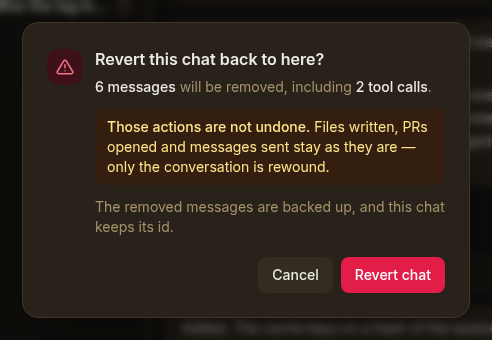

- **Opening a project is three times faster, and the archived half costs nothing
  until you look at it.** A project's context rings had no stored counter behind
  them: every ring was derived by streaming that chat's transcript, and its
  sub-agents', end to end. The sidebar collapses the Archived group by default, so
  most of that work produced rings nobody ever saw — on one real project, 182 of
  234 chats and 349 MB of the 495 MB of transcript were archived. The rings are now
  fetched by scope, and the archived half only once you actually expand the group.
  Measured on that project: opening it went **4.18 s → 1.23 s** cold and
  **0.40 s → 0.017 s** warm.

## 0.51 — The root is a workspace

- **The root is a workspace, not a project with a magic slug.** 0.49 made the
  instance's root behave like a project by giving it a reserved `__root` slug;
  0.51 replaces that with a **workspace** model keyed by each workspace's path
  relative to your projects root. The root's key is therefore the empty string —
  the zero value already in the key space rather than a reserved name — so
  resolving it needs no special case at all. What you notice is that **the root
  always exists**: no `project.yaml` to seed, no creation endpoint, no "Enable"
  card on the grid, and no `Project not found: __root` when you click **New chat**
  on a fresh instance. Its name defaults to your projects-root directory's own
  name, and a record is only written when you actually change a setting. `/` is
  the root workspace's Home, and the projects grid is its children tab.
- **The root and a project run literally the same code.** The workspace-scoped
  routes are one Fastify plugin **mounted twice** — at `/api/root` for the empty
  key and at `/api/projects/:slug` for everything else. Same handlers, same
  schemas, same error paths, so "the root behaves exactly like a project" is true
  by construction instead of being a property someone has to remember to preserve.
  That matters because the previous design had two resolution branches to keep in
  step and one of them was missed, which 404'd every root file route in 0.49.
- **Three quiet bugs around root chats, fixed.** All three were the same
  falsy-versus-absent mistake, which an empty-string key is very good at exposing:
  a chat whose parent was a *root* chat had its recorded parent edge thrown away
  and rendered as an orphan; root chats were skipped by the recovery nudge, which
  silently disabled **Continue** and automatic re-drive for them; and root chats
  were dropped from the per-workspace unread badge.

## 0.50 — Scratch retired, and a much faster server

- **Scratch is retired — a one-off chat is a root chat now.** Scratch existed only
  because a chat had to belong to *some* agent and there was no agent for "the
  instance itself". Once the root had an ordinary keeper, scratch was redundant and
  strictly worse: it had been deliberately denied self-management tools, curation,
  triggers, attachments, run history, the `CLAUDE.md` walk-up from your projects
  root, and more than one turn at a time. A root chat gets every one of those for
  free. `/chat` is unconditionally a root chat, and the projects grid's Inbox
  section is gone.
- **Breaking: the one-off chat API is gone.** Every `/api/chats/*` endpoint went
  with the scratch agent — eleven mirrored routes, along with roughly fourteen "is
  this scratch?" branches that were the *only* reason several code paths had two of
  them. The unscoped `GET /api/commands` went too; slash commands are
  workspace-scoped now, so they live under a workspace like everything else. An
  external client using the one-off chat API moves to the root workspace's chat
  routes. **Note that 0.50's own migration advice named
  `/api/projects/__root/chats/*`, which 0.51 invalidated one release later — the
  address today is `/api/root/chats/*`, and `/api/root/commands` for commands.**
- **Promoting a chat is generalised rather than deleted.** The old "promote this
  scratch chat into a project" action was never really about scratch — it moves one
  chat from one keeper's store to another's — so it's now a generic
  workspace-to-workspace move, offered on root chats in the UI.
- **Nothing is migrated, on purpose.** Existing scratch transcripts stay exactly
  where they are on disk and simply stop being listed; the companion migration was
  dropped rather than shipped, since it meant a permanent boot-time code path
  carrying a one-time, few-hundred-kilobyte move. **0.50 kept
  `PADDOCK_SCRATCH_DIR` as a documented legacy setting; it was removed outright in a
  later release, since the install base it protected didn't exist. Setting it today
  is simply ignored — an old env file or `paddock.config.yaml` still boots.** Your
  old transcripts are untouched at `<dataDir>/scratch/.chats` and can be deleted by
  hand whenever you like.
- **The server got dramatically faster.** Two endpoints behind the unread badge
  used to `readdir` and YAML-parse **every** job record on every `/api/projects`,
  `/api/projects/:slug` and `/chats` request. On a real instance — 1,996 records,
  46.6 MB — a CPU profile put **61% of all busy server CPU** in that one parse, and
  because it's synchronous work on a single event loop it pinned throughput at
  about 1.1 requests per second and made an unrelated 2 ms endpoint take nearly a
  second whenever a scan was in flight. Both now read through an index keyed on
  each file's mtime and size, warmed at boot so the first page load doesn't pay for
  the cold pass, and a record is only cached once it has finished — so a running
  turn can never be memoised as final. Measured on that same corpus:
  `/api/projects` **0.86 s → 0.036 s**, the projects grid's seven parallel chat
  calls **6.19 s → 0.13 s**, throughput at eight concurrent requests
  **1.06 → 18.5 req/s**, and in-browser load of a project page 2.31 s → 0.33 s. A
  companion bump to herdctl's own index-backed job listing took a project's
  **History** tab from 1.47 s to 0.15 s.
- **devbox gains Python, `uv`, `jq`, `rsync` and `kubectl`.** Python is the default
  reach for a ten-line data transform whatever the surrounding project is written
  in, and `python3: not found` turned that into "rewrite it in Node" every time;
  `jq` and `rsync` were the same gap from the other end. `uv` is there to make a
  per-project virtualenv cheap enough that libraries don't need baking into the
  image — the rule being interpreters and small CLI utilities in the image,
  libraries in the project. `kubectl` joins them because a keeper asked "is the
  deploy healthy?" needs the client present before any amount of credentials
  helps, and it can't be added downstream: it's in none of the apt sources the
  image carries. As with the Docker CLI already there, it's the **client only** —
  no kubeconfig and no cluster credentials are baked in.

## 0.49 — The root becomes a project

- **A Paddock instance can now be as capable at its root as inside any project.**
  The framing is simply that the root is the project whose directory *is* your
  projects root rather than a subdirectory of it — so its keeper is an ordinary
  keeper, with the same self-management tools, the same chat tree, the same
  per-chat model and the same sweeper. `/` is root Home and `/chat` its chats, with
  the projects grid moving to `/projects`; `/` always renders Home, with no
  redirect and no sticky last tab, so the instance's front door never lands you on
  Files.
- **Worth being blunt about the escalation this buys.** The root keeper's working
  directory *contains* every project, so root chats can read and edit any
  project's files. That's the intent — the root is where you act across the whole
  instance — but it's a real step up from a project keeper, which is confined to
  its own subtree.
- **Opt-in, and nothing changes until you opt in.** An existing instance has no
  root project until you create one from an **Enable** card on the projects grid;
  without it, `/` is the grid and `/chat` is a scratch chat exactly as before.
- **The full tab bar at the root.** History, Settings and Triggers arrive too, so
  there's no tab a project gets and the root doesn't. At the root, **Settings**
  showed the root's own workspace config above the instance-wide runtime config —
  kept as two sections rather than fused, because one is hot-applied on save and
  the other is frozen until you restart, and fusing them would hide that. (0.52
  split them into separate screens instead.) The root's overflow menu has **Edit**
  but deliberately no **Delete**: its directory *is* your projects root, so the
  action could only ever produce an error.
- **A spawned chat now records which chat created it.** The nested chat list has
  always preferred a recorded parent edge and fallen back to inferring one from
  who sent the opening prompt — but the dominant way children get made, the
  `create_chat` tool, was dropping the parent when it stamped provenance. The
  result was stark: **not one** of the 169 provenance records on the dogfood
  instance carried the field, so every edge in the live tree came from inference —
  which had already needed narrowing once after it re-parented human chats that a
  child had reported back to. New chats now record the real edge. Inference is
  unchanged and still backfills historical chats; this only stops manufacturing
  new ones that need it.
- **The file surface refuses hidden paths outright, rather than just omitting
  them.** Listing had always dropped dot-prefixed entries from what it *returned*,
  but that's presentation, not access control: naming the path explicitly still
  resolved it, and because the read route decodes an escaped slash, a nominally
  single-segment route accepted a whole nested path. Together that meant a request
  could fetch a chat transcript out of `.chats`, or a `.git/config` — which carries
  credentials when a remote embeds a token. Any dot-prefixed *segment* is now
  rejected, checked against the resolved path so `./.git` and `a/../.git` are
  caught alongside a literal one. **Honest severity: this is defense-in-depth, not
  a privilege boundary.** Paddock has no per-user role model, and anyone who can
  reach these routes can already start a keeper chat and run `Bash` — strictly more
  capability than reading a file — and the read-only `/mcp` token surface exposes
  no file verb at all, so it was never reachable there. It's worth closing because
  "hidden from the listing" shouldn't be the only thing between an API and a
  transcript. A dotfile *leaf* is still readable, deliberately: the Changes pane
  renders an untracked file's contents through this same surface, and `.gitignore`
  is untracked in a fresh repo-backed project.

## 0.48 — A trustworthy plaintext guard & a tidier chat list

- **`list_chats` hides archived chats by default, like the UI already did.** An
  agent listing a project's chats was getting the whole pile, archived ones
  included, which is not what the same list looks like on screen. Archived chats
  are now withheld unless you pass `include_archived: true`, every chat reports its
  own `archived` flag, and the result always carries an `omittedArchived` count —
  so an archived chat's session id is never *silently* unreachable.
- **The `/mcp` plaintext guard now only believes a proxy you've named.** The guard
  refuses a bearer token sent over a plaintext non-loopback connection, but it
  honoured `X-Forwarded-Proto: https` from **any** peer — so the guard could be
  switched off by the caller, including by the operator it exists to protect,
  copy-pasting a header out of a smoke-test recipe onto a real network. The
  forwarded scheme is now believed only when the immediate socket peer — which no
  client can set — is a trusted proxy. The new
  `PADDOCK_MANAGEMENT_TRUSTED_PROXIES` takes IPs, CIDRs, or the presets
  `loopback` / `linklocal` / `uniquelocal` / `none` / `all`. Its default is
  loopback plus the private address space, so every sidecar deployment keeps
  working while a **public** peer can no longer switch the guard off; name your TLS
  terminator explicitly to turn it into a real control, and the server warns once
  per peer while it's leaning on the default. This is not an authentication
  change — `/mcp` still requires a valid token, and spoofing the header never
  granted access.
- **A keeper reporting back no longer re-parents the chat it reported to.** On the
  documented report-back workflow — you start a manager, the manager spawns a
  child, the child messages home when it's done — the manager ended up adopting
  its own child *as its parent*. Both edges pointed at each other, so the tree
  builder's cycle guard picked a winner per render and the manager visibly flipped
  between sitting at the top level and sitting nested underneath its own child. A
  chat whose provenance already marks it as a root is no longer put through parent
  inference at all. Two sidebar counts are fixed alongside it: the search badge,
  which read "1/40" for a search matching five chats under one parent, and the
  Archived badge, which undercounted nested archived chats.
- **Your unread count is the same on every device now.** The same account could
  report genuinely different unread counts on different devices. Read state is
  stored per user on the server, but the client layered a *persistent* local mirror
  on top and took whichever of the two was further ahead — so a value the server
  never received marked a chat read on that device only, and the mirror never
  synced back up. The persistence is gone and the optimism stays: opening a chat
  still clears its cue instantly, but that's session-scoped, so every reload
  re-derives from the server and divergence is structurally impossible rather than
  something that had to be repaired. A failed update now rolls its optimistic bump
  back, so the cue reappears honestly instead of sticking, and a one-time migration
  pushed any read state already sitting in a browser up to the server before
  clearing it out.
- **The sweeper stops occasionally replacing a whole changelog with one sentence.**
  Post-turn curation has replaced whole files since 0.41, but the prompt registered
  with the model still described the old append-only contract — asking for "exactly
  ONE changelog bullet line" and calling `CLAUDE.md` amend-only. A model that
  weighted that over the per-sweep instructions did the obvious thing and replaced
  an entire `CHANGELOG.md` with a single sentence, which was observed in the wild
  on Paddock's own changelog. The prompt now describes what the curator actually
  does, and a test pins the contract so the two can't drift apart again silently.
- **Two image gaps closed.** The base image shipped `git` with no ssh transport, so
  every `git@` remote failed mid-turn with `cannot run ssh: No such file or
  directory` — it now installs `openssh-client`. And devbox shipped the Docker CLI
  with an empty plugin path, so `docker compose` and `docker buildx` were both
  `unknown command`; both plugins are now installed. Each was a missing runtime
  dependency of tooling the images already deliberately included.

## 0.47 — The chat list learns who spawned whom

- **Spawned chats now nest under the chat that created them.** The sidebar was
  the last place a fan-out still looked like a flat pile: a keeper that split
  work eight ways gave you eight top-level rows, in no obvious relationship to
  each other or to the chat that started it. Now a chat sits **underneath its
  parent**, indented, with a twisty to fold the whole family away and a count
  pill telling you how many chats you just folded. Everything starts expanded,
  and what you collapse is remembered per project, in that browser — folding a
  noisy fan-out on a laptop shouldn't fold it on a phone.

  The tree also changes how the list *sorts*. Siblings order by the most recent
  activity anywhere in their subtree, so a parent rises with its working
  children instead of sinking while they run, and a starred chat now floats to
  the top of **its own group** rather than the top of everything. A nested chat
  drops its violet `spawned` badge, since sitting under its parent says the same
  thing more loudly — it keeps the badge on the rare occasion it's shown at the
  top level, because its parent is archived, in another project, or filtered out
  by a search. Search pulls a match's ancestors along with it so you can see
  where a hit sits, and temporarily ignores what you'd folded.

  The edge behind all this is recorded on the chat's provenance at creation, so
  it's the same data that already drove the origin badges — now shaping the list
  rather than just decorating it. Forks record it too, nesting under the chat
  they were forked *from*. Chats you start yourself, and chats fired by a
  schedule or an event hook, stay roots: they weren't created by another chat.
  There's no migration for chats that predate this, so Paddock falls back to
  inferring the parent from who injected the chat's opening prompt — which
  recovers most existing spawned chats, though a fork made with no kickoff
  prompt left no trace to recover and stays flat.

## 0.46 — Drive Paddock from outside

- **An external MCP client can now drive Paddock.** The management operations are
  served over a streamable-HTTP MCP transport at `/mcp`, so a Claude Code session
  on your laptop — and eventually a peer Paddock — can list projects, read chats
  and, with the scope for it, start turns, all bounded by the credential it
  presents. External callers get the *same* toolset a keeper receives in-process
  rather than a parallel one, so adding a self-management tool exposes it over
  `/mcp` for free and the two surfaces can't drift. The transport is **stateless**
  — a fresh server per request, no session store, restarts transparent — and
  publishes RFC 9728 discovery metadata once you've configured an authorization
  server.
- **Management auth stands on its own, and is read-only by default.** Paddock
  authenticates `/mcp` itself, independent of `PADDOCK_AUTH_MODE` and of any
  reverse proxy, so the endpoint stays credential-gated even on an instance
  running `auth.mode: none`. Policy is enforced at the operations layer rather
  than per-transport, so every future access path inherits identical scoping
  instead of reimplementing it. Client tokens are *referenced*, never inlined —
  `auth: { ref: "env:VAR" }`, and a literal secret in the config file is a hard
  error. A client configured without an explicit scope gets read-only on purpose:
  any write scope can start keeper turns, and a keeper has `Bash`, so granting one
  is effectively remote code execution on the host. The whole thing fails closed —
  `/mcp` 404s until clients *and* a public URL are configured, and a bad
  credential gets a `401`, never a redirect to a login page no MCP client can
  follow.
- **Hover a message to see when it happened — and how full the window was.**
  Hovering any message in a transcript reveals a small rail at its top-right
  showing that message's timestamp and the context-window fill **as of that
  point**. It's a point-in-time read rather than a running total, so on a long
  chat you can finally see *where* the window actually filled up, and whether what
  you're reading is from minutes or days ago.

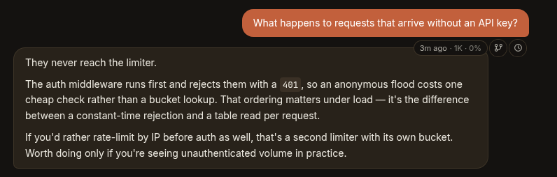

- **Fork or rewind from any point in a chat.** The same rail carries two actions.
  **Fork from here** starts a new chat containing only the transcript *up to* that
  message, leaving the original untouched — so you can try a second approach from
  the moment things diverged. **Revert to here** truncates the chat in place: it
  keeps the session id, so the URL and lineage survive, and backs the discarded
  tail up to a `.reverts/` sidecar. The confirm dialog counts the messages and
  tool calls about to disappear and says plainly what reverting does *not* undo —
  files written, PRs opened, messages sent all stay done. You're rewinding the
  conversation, not the world.
- **Mark a conversation unread.** A sixth action on each chat row toggles its read
  state, borrowing the email-client move for "I glanced at this at midnight,
  resurface it in the morning" — marking a read chat unread re-raises its accent
  dot in the list. The flag is per-user rather than shared like starring and
  archiving, since "I haven't dealt with this yet" is personal, and opening or
  focusing the chat spends it.

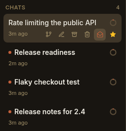

- **An API reference, generated from the code.** Every REST route now carries a
  schema, collected into a live OpenAPI 3 document. Set `PADDOCK_OPENAPI_ENABLED`
  (**off by default**) and a Paddock-branded Swagger UI mounts at `/open-api` —
  raw spec at `/open-api.json` — reachable from a new **Swagger API** link in the
  sidebar, with an Authorize button that reflects your instance's auth mode. A
  static copy is published on this site too, as the [API reference](/api/). (The
  sidebar's "Instance settings" link became just **Settings** in this release; 0.52
  renamed it again to **Config** when instance config and workspace settings split
  into separate screens.)

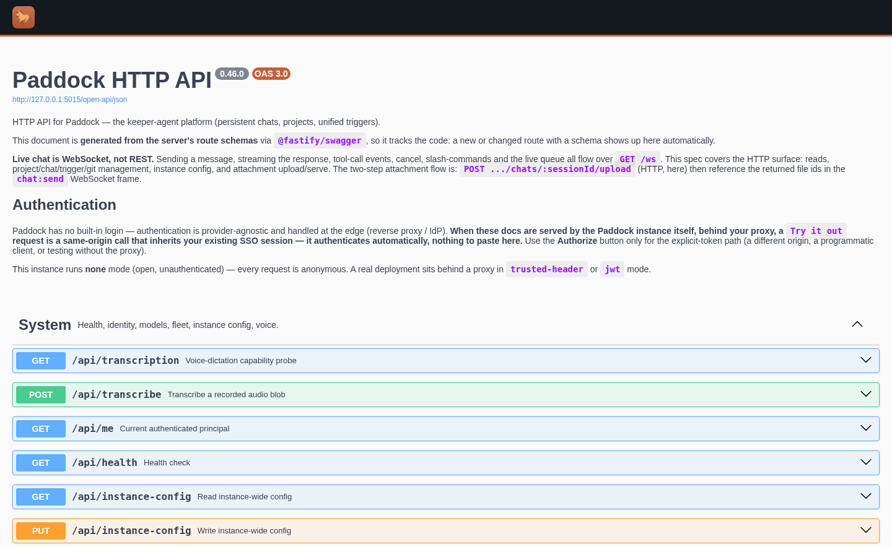

- **Keepers can create projects.** A new `create_project` self-management tool
  lets an agent provision a project rather than stopping to ask you to click
  **New project** — a notebook, or repo-backed by passing a git URL, which clones
  into a nested checkout and rolls back cleanly if the clone fails. It's gated
  behind its own `PADDOCK_SELF_MCP_PROJECTS` flag, **off by default**: unlike
  every other write tool it creates instance-level state and clones a URL the
  caller supplied, so it deliberately doesn't ride along on the general write
  gate.

## 0.45 — Opus 5, and a configurable model list

- **Claude Opus 5 is the default keeper model.** `claude-opus-5` heads the model
  picker — a 1M-token context window at the same per-token price as Opus 4.8, with
  markedly better verification-and-iteration behaviour for the money. New projects
  and any keeper you haven't overridden run on it now. `claude-opus-4-8` stays
  selectable for regression comparison or prompts tuned to its behaviour, and the
  sweeper keeps its cheaper Haiku default, so curation costs the same as before.
- **Choose which models your instance offers.** The picker used to show every
  model in the built-in catalog. An instance can now set an allow-list — the
  `PADDOCK_MODELS` environment variable (comma-separated ids), a `models:` list in
  `paddock.config.yaml`, or the field on the **Settings** screen — and each
  project's **Settings** tab can narrow it further, though a project may only
  *subset* what the instance offers. Leave it unset and every catalog model is
  offered, exactly as before. The catalog still owns each model's context limit
  and pricing, so an allow-list picks from it by id and can't misconfigure them.

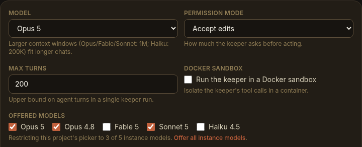

- **A queued follow-up is no longer dropped.** Type a second message while the
  keeper is still replying and it now reliably sends once the turn lands. In
  session mode a turn that produced a complete reply can still report failure in
  its trailing result frame; the queue drain — along with the post-turn curation
  sweep and the recovery watch — took that at face value and silently discarded
  the message. A real reply now supersedes a benign trailing failure, while a
  genuinely dead turn still holds its queue and keeps its error banner.
- **`releases/latest/download/…` resolves at last.** Each GitHub Release now
  carries a stable-named `paddock-latest.tgz` (and its `.sha256`) alongside the
  version-named tarball, so a self-hoster or a deploy recipe can fetch the newest
  build from a fixed URL — GitHub's `latest/download` redirect only works when the
  filename is identical across every release. Pin `paddock-<version>.tgz` instead
  when you'd rather not float.

## 0.44 — Two official images & ready-made deploy recipes

- **Two published images.** The Docker build now ships as **two** tags from the
  same source: `ghcr.io/edspencer/paddock:latest` — the lean **base** image (app +
  `git`, `gh`, the `claude` CLI) — and `ghcr.io/edspencer/paddock:devbox`, which
  layers the coding-agent toolbox on top (`pm`/PM2 preview servers, `ffmpeg`, a
  headless Playwright browser, the Docker CLI). Same app and `/data` layout, so you
  can swap tags against one volume. See [Getting started](/getting-started/#two-image-flavors-base-vs-devbox)
  and [The Dev Box flavor](/guides/dev-box-flavor/).
- **A recipes repo.** Self-hosting recipes now live in their own public repo,
  [**`paddock-deploy`**](https://github.com/edspencer/paddock-deploy):
  [`docker/`](https://github.com/edspencer/paddock-deploy/tree/main/docker)
  (base + devbox compose), `proxmox-iac/` (Tofu + Ansible for a dev box or home
  box), `kubernetes/` (Kustomize manifests), and `auth-basic/` (a Caddy Basic Auth
  sidecar → `trusted-header`). The [Deploying](/guides/deploying/),
  [Proxmox (LXC)](/guides/proxmox-lxc/), [Kubernetes](/guides/kubernetes/), and
  [Securing](/guides/securing/) guides each point at the matching recipe.
- **Safe-by-default binding.** A fresh source/tarball run now binds `127.0.0.1`
  (loopback only) and refuses to expose itself without either a real auth mode or
  an explicit `PADDOCK_DANGEROUSLY_ALLOW_OPEN` opt-in. Container images still bind
  `0.0.0.0` (the network namespace is their boundary); the recipes carry the
  host-side publish posture.
- **Live nested sub-agent cards.** When a keeper spawns sub-agents — even several
  levels deep — each one now renders as its own live card that fills in as it
  runs: a running spinner, streaming progress, and a cost that rolls its
  descendants' costs up into the parent. Nested unattended work is legible while
  it happens, not just after a refresh.

## 0.43 — Background work that outlives the turn

- **Background tasks survive the turn boundary.** In session mode, work a keeper
  kicks off in the background — a `run_in_background` sub-agent or shell, a build,
  a deploy, a scheduled wake-up — now keeps running when the turn that started it
  ends, and **delivers its result live** the moment it finishes, waking the keeper
  to continue or report back. No reload, and no more work lost to Paddock's own
  turn teardown. This is what makes "kick off something slow, get pinged when it's
  done" reliable for keepers. A task can still be killed from further upstream —
  that case is unchanged, and it's what
  [keeper-chat recovery](/configuration/keeper-recovery/) is for.

## 0.42 — Instance settings, curation budgets & pinned files

- **An instance-wide Settings screen.** A new top-level **Instance settings**
  screen (the gear in the sidebar) edits your `paddock.config.yaml` straight from
  the UI — grouped fields for curation, capability gates, auth, attachments and
  more. Instance config is read once at boot and frozen, so a save writes the file
  and shows a **restart-to-apply** banner; a field already pinned by an environment
  variable renders read-only with an "overridden by `ENV`" note, so the precedence
  is never a surprise. (This screen is **Config**, at `/config`, as of 0.52 —
  "Settings" now means a *workspace's* own `project.yaml`.)

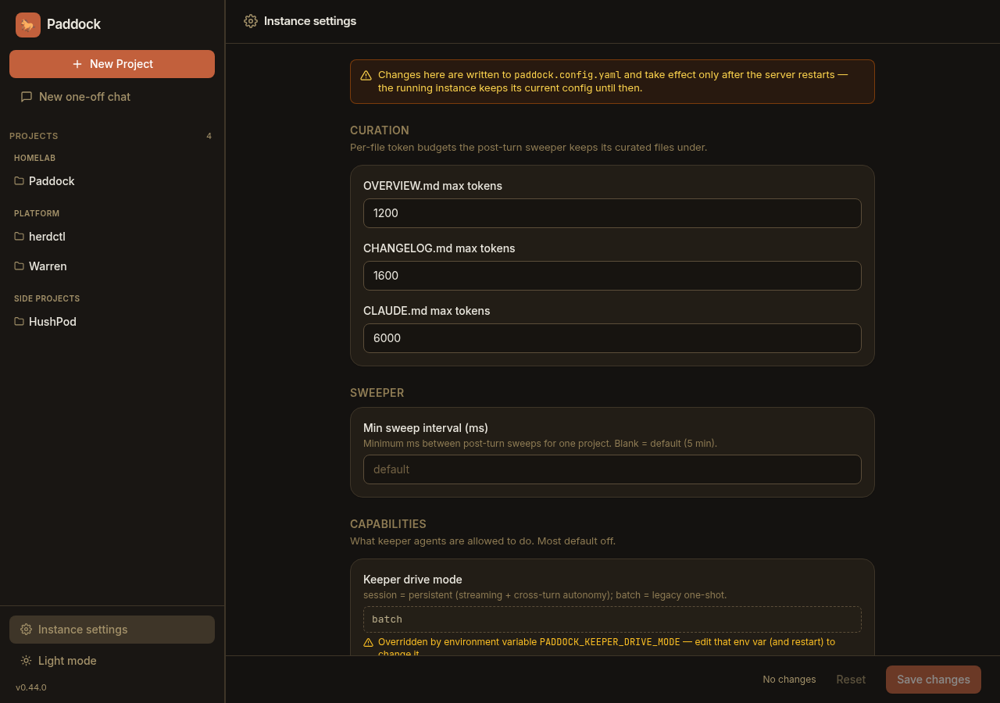

- **Per-project curation budgets.** Each project's **Settings** tab can now cap the
  post-turn sweeper's per-file token budgets — how big it lets `OVERVIEW.md`,
  `CHANGELOG.md` and `CLAUDE.md` grow — or leave a field blank to inherit the
  instance default. Lower a budget to shrink the context a chatty project injects
  into every one of its chats.

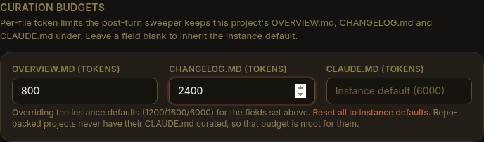

- **Pin any file as a tab — at any depth.** The Files browser's pin now works on a
  file **anywhere** in the tree, including nested ones; a pinned file rides along
  as a persistent tab in the project header next to Home / Chat / Files, one click
  from whatever you keep coming back to.


## 0.41 — Pinned chats, resizable panes & a smarter sweeper

- **Star a chat to pin it.** Star any chat and it floats to the top of its list —
  a lightweight way to keep the conversation you're living in (or the run you're
  waiting on) one click away. Starring is purely presentational and independent of
  archiving: starred chats float to the top of both the active and the archived
  sections.

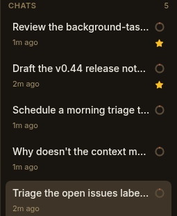

- **Draggable, persisted pane widths.** Grab the divider to resize the side-nav and
  the chat-list column to taste; your widths are remembered in the browser across
  reloads, so the layout you like stays put.
- **A one-row mobile header.** On a phone the project header collapses to a single
  row and the composer typography was tidied up, so the small-screen layout stops
  fighting for vertical space.
- **The sweeper is a full-file curator.** Post-turn curation now **rewrites** the
  whole `OVERVIEW.md` / `CHANGELOG.md` to stay within a token budget, instead of
  only ever appending — so those files stay tight and readable rather than growing
  without bound. (0.42's per-project budgets tune exactly these limits.)

## 0.40 — Promote a notebook to a repo, dictate while it types

- **Promote a notebook project to repo-backed, in place.** A notes-only project can
  now be turned into a full code project without recreating it: point it at a git
  repo and Paddock clones it as the keeper's working directory — the repo's own
  `CLAUDE.md`, branches and PR flow take over from there — keeping the project's
  history and chats.
- **Dictate while the keeper is replying.** The composer's microphone stays usable
  **during** a streaming reply, so you can start dictating your next message while
  the agent is still writing its last one — no waiting for the turn to land.

## 0.39 — Dead-end turns, made legible

- **Turn errors and usage-limit hits surface in the UI.** A keeper turn can stop
  *without* a normal reply — a subscription/usage-limit hit, the max-turns cap, or
  an outright error. These used to leave a chat looking mysteriously dead. Each now
  shows a distinct inline notice: a usage-limit note with the reset time, a
  turn-limit note with a **Continue** button, or an error with **Retry**.


- **Run-now + live status for triggers.** The **Triggers** tab regained a
  **Run now** action to fire any schedule or event on demand, plus live run-status
  and Last/Next-run columns — so you can test a trigger and watch it go without
  waiting for its clock.
- **Spawned chats can pick their model.** The `create_chat` / fork self-management
  tools can now set the model of the chat they spawn, so a manager keeper can send
  cheap work to a smaller model and hard work to a bigger one.
- **Client-local slash commands render.** `/context` and `/usage` now show their
  formatted output inline instead of an empty (or raw-XML) bubble.

## 0.38 — Send files & images to a keeper

- **Attachments in the composer.** Attach files and images to a message —
  **pick** them with the paperclip, **drag & drop** onto the composer, or **paste**
  (⌘V / Ctrl+V) a screenshot straight in. Staged files sit in a removable tray;
  images preview as thumbnails, everything else as a chip. The keeper reads them
  directly — **native vision** on images and PDFs, plain-text reads on the rest —
  and sent files stay with the chat, re-rendering on reload. Per-instance and
  per-project caps (default 25 MB/file, 10 files/message, all types) keep it sane.
  See [Sending files & images](/using/sending-files-and-images/).

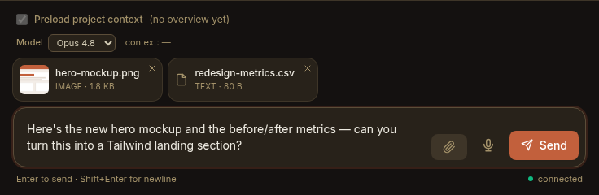

## 0.37 — Triggers, unified

- **One Triggers tab.** The per-project **Hooks** tab and the **Settings →
  Schedules** section merged into a single **Triggers** list. Every trigger type —
  schedule, event, and the reserved webhook — lives in one place, each row showing
  its type, its firing condition, a capability summary, and an enabled toggle.
- **One self-management surface.** The old `set_hook` / `set_schedule` tool
  families are replaced by unified **`set_trigger` / `list_triggers` /
  `remove_trigger`**, carrying the trigger *type*, its *run*, and *enabled* — so a
  keeper declares any kind of trigger the same way.
- **Schedules can be scoped.** A schedule that declares a tool allow-list now runs
  on its **own scoped agent** with just those tools (like an event trigger); a
  schedule with no tools keeps running as the keeper, as before.
- **The sweeper is a trigger.** Post-turn curation is now the implicit default
  **`curate-overview`** trigger — declare one to give a project a bigger model or
  extra instructions, or disable it entirely. Undeclared projects curate exactly as
  before. See [The sweeper](/concepts/sweeper/#customise-or-disable-it).

:::note[Webhook triggers are reserved]
The **`webhook`** trigger type is shape-reserved — it appears in the model and the
Triggers form but is **not yet fireable** (there's no inbound webhook ingress yet).
:::

## 0.36 — Streaming, and session mode by default

- **Token-by-token streaming.** In session mode a keeper's reply now accretes into
  the live bubble **as it's written**, instead of appearing all at once when the
  turn finishes. (Batch mode still renders each message whole.) See
  [Token-by-token streaming](/concepts/chats/#token-by-token-streaming).
- **Session mode is the default.** A fresh instance now drives keeper turns through
  the persistent session (SDK) runtime by default, so cross-turn autonomy
  (`ScheduleWakeup`, `/loop`) and streaming work out of the box.
  `PADDOCK_DRIVE_MODE=batch` (and the per-project `driveMode`) still switch
  back to the one-shot path.
- **The trigger foundation.** Under the hood, hooks and schedules were unified onto
  one discriminated **trigger** model (`schedule` / `event` / `webhook`) over a
  single execution core — the groundwork the 0.37 Triggers tab is built on.

## 0.35 — Keepers that unstick themselves

- **Keeper-chat recovery.** When a keeper starts a background task and ends its turn
  while it's still running, the task can be killed at the turn boundary and leave
  the keeper idle-but-alive. Paddock now surfaces that as a distinct amber
  *"background task terminated — the keeper is idle"* affordance with a one-click
  **Continue** that wakes the keeper to finish or report. An optional
  **automatic** re-drive (off by default) does the same without you. See
  [Keeper-chat recovery](/configuration/keeper-recovery/).

## 0.34 — Event hooks

- **Event hooks.** Run an agent turn automatically when a lifecycle event fires.
  The first event is **`onArchive`** — when a chat is archived, each of the
  project's enabled hooks fires as its own agent. A hook's granted tools *are* its
  capability: a hook that must tidy up is given `Bash` and does the work itself.
  New hooks start **disabled**, so nothing runs until you arm it.
- **Hook chats are visible and legible.** A hook run shows up in the chat list
  with a small lightning-bolt badge, and opening it floats a read-only banner
  telling you it's a hook agent, what event triggered it, and exactly which tools
  it was granted.
- **Manage hooks from a chat.** Keepers with the opt-in hook MCP can declare,
  edit, and remove their own hooks (`list_hooks` / `set_hook` / `remove_hook`).
- **Steer the sweeper per project.** Drop a `.paddock/hooks/sweep.md` file in a
  project and its contents are appended to the sweeper's instructions — so each
  project can shape how its `OVERVIEW.md` / `CHANGELOG.md` get curated.

## 0.33 — Who sent this, and a lighter stream

- **Per-message attribution.** Machine-injected turns now say who added them —
  "↩ sent by *⟨chat⟩*" for a `send_message` from another chat, or "⏰ scheduled by
  *⟨name⟩*" for a schedule fire. Human-typed messages stay unlabelled. An injected
  message also streams into an already-open chat immediately, no refresh needed.
- **Schedule yourself from a chat.** New self-management tools let a keeper create
  and manage its project's durable schedules (`set_schedule` / `remove_schedule` /
  `list_schedules`) — "schedule yourself to triage issues every morning" — not
  just a human clicking through Settings.
- **Cheaper streaming.** The CPU cost of watching a chat stream dropped sharply:
  the continuous 60fps animations were trimmed, respect `prefers-reduced-motion`,
  and pause while the tab is in the background.

## 0.32 — Schedules & run history

- **Scheduled chats.** A project can declare **schedules** (cron or interval) that
  start a chat on their own. A scheduled run is a first-class chat — it streams
  live, is re-attachable, and a human can open it and keep the conversation going.
  Manage them from a **Schedules** section in the project's Settings, including
  enable/disable and **trigger-now**.
- **"While you were away."** A new project **History** tab lists recent runs with
  their origin (human / scheduled / spawned), flags the ones that are new since you
  last looked, and banners how many ran unattended — so cron-fired and agent-spawned
  work is easy to find and open.

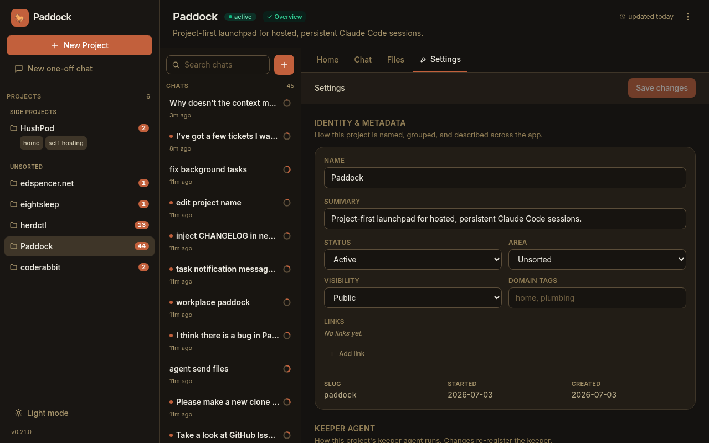

## 0.31 — Provenance, spawn-depth & YAML config

- **Provenance badges.** The chat list marks **scheduled** and **spawned** chats
  with a subtle icon, so the runs that happened without you stand out from the ones
  you started. Human chats stay unadorned.
- **Spawned children can report back.** A chat spawned by another chat now gets the
  self-management tools (bounded by a new **`maxSpawnDepth`**, default `1`), so a
  child can `send_message` its parent when it's done — enabling the manager-agent
  pattern without runaway recursion.
- **Configure an instance from a YAML file.** Instead of a long list of `PADDOCK_*`
  environment variables, an instance can keep its settings in a single
  [`paddock.config.yaml`](/configuration/config-file/) — with environment variables
  still overriding the file. Env-only deployments are unaffected.

## 0.30 — Files, Changes & self-archiving

- **Browse into subdirectories.** The Files tab now lets you click into folders,
  with deep-linkable, refresh-safe URLs and a breadcrumb — so anything a project
  filed under `design/`, `docs/`, etc. is finally reachable.
- **Selective commits.** The Changes tab gained a checkbox per changed file (with
  select-all/none) and a "Commit N selected" action, a `+A −R` line stat per file,
  and a dirty-file count on the projects grid so pending work is visible before you
  open a project.
- **Agents can archive themselves.** New `archive_chat` / `unarchive_chat`
  self-management tools power the "do the work, then archive myself on success;
  leave un-archived on failure so a human sees it" convention.


## 0.29 — First-class MCP tool rendering

- **Paddock's own tools render as first-class UI.** Every `mcp__…` tool call now
  shows a humanized name (`mcp__paddock_manage__create_chat` → "Create chat") with
  a brand badge instead of the raw string, and the `paddock_manage` tools get rich
  bodies parsed from their output — project chips, a chat list with live running
  dots, transcript previews — that link straight into the chats they touched.


---

*Maintaining this page:* add a short, user-facing entry here whenever you cut a
release (see [RELEASING.md](https://github.com/edspencer/paddock/blob/main/RELEASING.md)).
