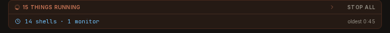
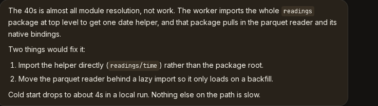
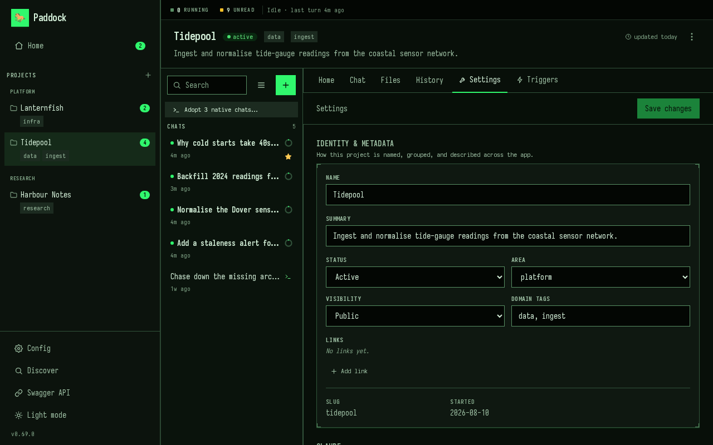
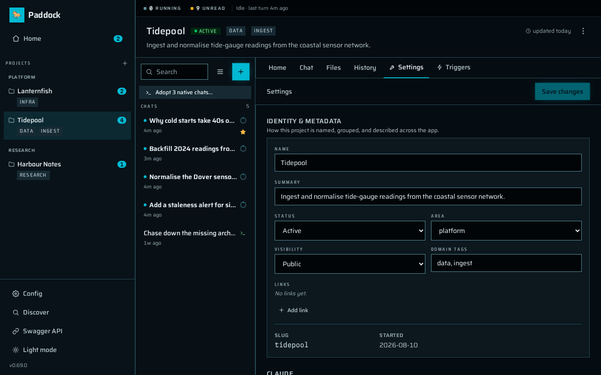

import DemoVideo from '../../components/DemoVideo.astro';

:::note[Reading older entries]
Each entry describes a release **as it shipped**, and later releases sometimes
supersede one. Where that has happened the older entry says so and links
forward — most notably 0.61.1's `--isolated-claude-home`, which 0.62 removed in
favour of the `claude:` config block, and 0.59.1–0.60's `--here`, which 0.68
removed in favour of Discover. Both of those entries are now on the
[archive page](/whats-new-archive/).
:::

## 0.78.2 — Agents can save memories under `transcripts: host`

- **Memory writes work again when chats are shared with your terminal.** With
  [`claude.transcripts: host`](/configuration/config-file/#transcripts), every
  attempt by an agent to save a memory was refused as "a sensitive file", and
  with nobody there to approve it the memory was simply lost. Paddock now hands
  each agent the real path of its memory folder, which Claude Code accepts. It
  is the same folder as before, still shared with your terminal sessions, so no
  existing memories move. Instances on the default `own` setting were not
  affected.

## 0.78 — A real GPU for the devbox browser

- **Agents on the devbox image can get hardware WebGL in their browser.** The
  browser MCP's Chromium drew WebGL with SwiftShader, a software renderer that
  pegged eight cores to manage 14 fps on a simple shader. Map the host's render
  node into the container (`--device /dev/dri/renderD128`) and Paddock hands
  Chromium a real GPU instead. On an Intel UHD 630 that measured **12.7× faster
  on 16× less CPU**. Setup and a one-line check are in
  [the devbox guide](/guides/dev-box-flavor/#hardware-webgl-if-the-host-has-a-gpu).

  Nothing changes on a host without a GPU. The flags are passed only when the
  device actually opens, because on this image passing them without one removes
  WebGL entirely rather than falling back. The boot log names which renderer
  agents got either way. `docker: true` projects keep the defaults.

## 0.77 — Tabs you can tell apart, and chats that wait for you

- **Browser tabs say what they're showing.** Every tab used to read just the
  instance name, so three open chats were three identical tabs. A chat's tab now
  reads `Fix the leaking tap · hushpod — Paddock`, and Files, Discover, Config
  and tag pages are named the same way. The root workspace's pages leave its
  name out, since the instance name already says where you are. The title follows
  a rename.

  

  *A mock tab strip: Playwright can't photograph Chrome's own. Every title and icon
  in it was read from the running build's page.*

- **The tab icon is the instance's brand chip, and it shows live status.** The
  favicon is your `brand.logo` on your accent colour. A renamed instance that
  kept the default accent gets a colour picked from its name, so two instances'
  tabs stop looking alike. While a turn runs, the title gains a `● ` and the icon
  an orange dot. When a reply lands in a background tab, a chat's tab gets `✓ `
  and a project or Home tab gets a count like `(2) `, with a green dot. The count
  is only what's new since you last looked at that tab, not the whole unread
  backlog.

  

  *Also a mock tab strip, with background tabs simulated by overriding
  `document.visibilityState`. The titles and icons are live values from the build.*

  A chat open in a background tab is no longer marked read until you actually
  look at it. That means "finished while you were away" now shows in the sidebar
  and on the fleet strip too.

- **Sidebar projects get a coloured initial instead of a folder icon**, so you
  can find one at a glance. The colour comes from the project's slug, out of the
  same twelve-colour palette as the tab icon.

  

- **Finished chats stay on the fleet strip until you read them.** A turn that
  landed while you were elsewhere used to drop off the strip the moment it
  stopped running. Now its channel stays to the right of the running ones, with a
  dashed outline and "4m ago" in place of the clock, until you open the chat. The
  row scrolls sideways (wheel or finger) instead of collapsing to `+N`.

  Home's separate Running and Unread tables are now one **Running & Recent**
  list: live turns first, in the strip's order, then every other chat newest
  first, with unread ones marked. The old Unread table wasn't sorted by time, so
  a three-day-old reply could sit above one from this morning.

<DemoVideo
  src="/demo/running-and-recent.mp4"
  poster="/demo/running-and-recent-poster.jpg"
  alt="Home on a demo instance. The fleet strip across the top shows running channels with live clocks, then dashed finished channels reading '2m ago' and '3h ago'. Below, the Running & Recent list shows two running chats first, then the rest newest first. A Trail Atlas turn starts: it joins the running group, then finishes, and its row and strip channel switch to 'just now' while the unread count rises from 9 to 10."
  caption="A turn starts and finishes, recorded on a credential-free demo instance. It moves from the running group to the top of the recent group, and its channel stays on the strip as 'just now'."
/>

  On a phone, the strip hides the "Merge chats" chip, which is still on the Config
  screen. That widens the channels from 44px to 169px on a 390px screen.

## 0.76 — Copy and Download on sent files

- **A sent file's header has Copy and Download buttons.** Copy puts a text
  file's source on your clipboard: the markdown, not the rendered page. It works
  while the file is collapsed. Download saves any text file or video under the
  name the agent gave it. Images and PDFs keep the Download they already had.

  

## 0.75 — Sent files, full screen

- **Any file the agent sent can open full screen, and ←/→ step through the
  chat's other sent files.** A new ⛶ button sits in every sent file's header,
  and clicking an image does the same. As you step, the chat scrolls to each
  file's message behind the viewer, so closing it leaves you where that file was.
  If [the render cap](#073--long-chats-open-fast) is hiding older messages,
  stepping back past the oldest loaded file loads them first, so no file is
  skipped.

<DemoVideo
  src="/demo/sent-file-viewer.mp4"
  poster="/demo/sent-file-viewer-poster.jpg"
  alt="A chat holding several files the agent sent, starting with a screenshot of a light theme. The full-screen viewer opens and steps with the arrow keys through a dark-theme screenshot, a PDF contrast report, a TypeScript tokens file, a Mermaid flowchart and an HTML page of accent swatches. Each shows its name and a position like '3/8' in the top corner."
  caption="Stepping through a chat's eight sent files with the arrow keys: images, a PDF, code, a diagram and HTML."
/>

## 0.74.1–0.74.4 — Fixes, a slimmer header, and a batch-mode security fix

- **0.74.1: fixed chats failing on the new default model.** 0.74 made Claude
  Opus 5.5 the default, but the `claude` binary bundled with Paddock was too old
  to run it. Every message on a project without a pinned model failed with
  `API Error: 400 … version 2.1.280 or newer is required`. The bundled binary is
  now 2.1.283. Projects that pinned an older model were never affected.

- **0.74.2: finished sub-agents leave the running-work bar right away.** An agent
  that fanned out, waited, and fanned out again used to pile up stale rows: five
  finished deep-reads beside three live edits under "8 sub-agents running",
  until the whole turn ended. Each row now goes the moment its task does.

  

- **0.74.3: the project header is one row.** The project's name, then its tabs.
  The status pill, domain tags, Overview / Repo / Linked badges, the "updated"
  stamp and the `⋯` menu are gone, and the tab strip moves up into the space they
  left. That gives every tab back a whole band of height: 79px at 1440×900. The
  menu's "Edit details" only opened Settings, which is in the strip, and delete
  now lives in Settings too. The project summary moved to the top of its Home
  tab. On phones the tabs keep their own row.

  

- **0.74.4: a security fix for `driveMode: batch`.** On batch, the tools Paddock
  injects into a turn (`send_file`, and `paddock_manage` where enabled) were
  served over an HTTP bridge. That bridge listened on every network interface
  with no authentication while a turn ran. It now binds to `127.0.0.1` and needs
  its own bearer token. Batch turns also stop putting MCP server credentials on
  `claude`'s command line, where `ps` could read them. A `docker: true` project
  on batch is the one exception, and the startup warning names it. **The default
  `driveMode: session` never used the bridge.** No configuration changes are
  needed.

## 0.74 — Claude Opus 5.5, and delete from Settings

:::caution[Upgrade to 0.74.1 or later]
On 0.74.0 itself, every message on a project without a pinned model fails with a
400, because the bundled `claude` binary is too old for Opus 5.5.
[0.74.1](#07410744--fixes-a-slimmer-header-and-a-batch-mode-security-fix) fixed it.
:::

- **Claude Opus 5.5 is in the model picker and is the instance default.** It is
  newer and cheaper than Opus 5: $4/$20 per million tokens against $5/$25, with
  cheaper cache reads too. A project that hasn't pinned a model gets the better
  model for less. Every older model stays in the catalog, so existing pins keep
  working. If your `models:` allow-list names models explicitly, nothing moves
  until you add `claude-opus-5-5`.

  **Sonnet 5's estimated cost was 50% too high.** Its scheduled rise to $3/$15
  was cancelled and $2/$10 became the standard price, but Paddock had encoded the
  rise.

- **Delete a project from its Settings tab.** Settings now ends in a **Danger
  zone**. The confirmation also stops lying about linked projects. It used to say
  the project "and all its chats and files will be permanently removed", but
  deleting a linked project only unlinks it, and your directory is untouched. The
  dialog now says so and names the directory. The root workspace has no Danger
  zone, because it can't be deleted.

  

- **Discover has a button beside the `+` in the side nav's Projects header.**
  It used to be only in the footer, grouped with Config and the theme toggle,
  where an early user couldn't find it. Both doors lead to the same screen.

- **The root workspace is titled "Home"**, the word the side nav already used.
  Before, it was titled after the projects directory, which on a fresh install
  meant lowercase `projects`. A name you set yourself is kept. If you saved root
  settings on an older build, your root `project.yaml` may hold a derived
  `name:` line; delete it by hand to get "Home".

## 0.73 — Long chats open fast

- **A chat renders only its most recent 500 messages**, so opening one that has
  run for days is quick. Mounting a few thousand messages was what made switching
  into it slow. Nothing is deleted: the transcript says how many earlier messages
  it isn't showing, and a deep link to one of them still works. Change the cap
  with `ui.transcriptRenderLimit` in Settings → Interface or the
  [config file](/configuration/config-file/) (`0` means no limit).

  

- **PDFs open in the Files and Changes tabs.** Before, a `.pdf` there showed
  pages of garbled text. It now gets the same built-in viewer as a PDF the agent
  sends.

  

- **Claude Fable 5.1 is in the model picker.** Fable 5 stays for existing pins.
  Paddock also learned Fable 5.1's much cheaper cache reads. Without that, a
  Fable 5.1 chat's estimated cost would have read roughly four times too high.

- **A big batch of attachments no longer pushes the message box off screen.**
  The tray above the composer stops growing at a fixed height and scrolls
  instead. Two or more files get a **Clear all** button.

## 0.72.1 — A shorter migration dialog

- **The dialog that merges chats into `~/.claude` says the same thing in fewer
  words**: 39% fewer, and 29% less height on the same plan. Per-row explanations
  became tooltips, and the destination is shown relative to your home
  directory.

## 0.72 — One key for the whole posture

- **`profile: paranoid | balanced | yolo` sets an instance's security posture in
  one line**, instead of a dozen `PADDOCK_*` variables. It supplies the defaults
  for the Claude sharing modes, spawn depth and the capability toggles, and
  nothing else — it cannot change your port, bind address or auth. **The default
  is `balanced`: on upgrade, an instance with no config file starts inheriting
  the host's `instructions` and `mcpServers`, and `profile: paranoid` restores
  the old behaviour exactly.**

  `paddock config show --resolved` is the answer to "so what am I actually
  running?" — every effective value, and the layer it came from:

  ```
  Profile      balanced  (built-in default)

  Capabilities
    driveMode                       session     default
    selfMcpEnabled                  true        profile (balanced)
    selfMcpWriteEnabled             false       profile (balanced)
    maxSpawnDepth                   1           profile (balanced)
    …
  Advanced (read-only)
    claude.transcripts              own         profile (balanced)
    claude.credentials              host        profile (balanced)
    claude.instructions             host        profile (balanced)
    claude.hooks                    own         profile (balanced)
    claude.mcpServers               host        profile (balanced)
  ```

  Every lever, key by key, is on [Config profiles](/configuration/profiles/).
  `paddock config eject` writes the whole resolution into `paddock.config.yaml`
  for anyone who would rather pin it in git than inherit it; it previews by
  default and applies with `--write`.

- **Your chats can move into `~/.claude`, so `claude --resume` in a terminal can
  see them.** Paddock keeps a project's chats in its own `.chats/` by default,
  which is right for trying it and wrong for keeping it. The fleet readout offers
  the move when there is something to move, and nothing is deleted: a chat you
  leave unticked is set aside in `.chats-pre-migration/` beside its project.

  

- **Fixed: flipping `claude.transcripts` from `host` back to `own` left the
  instance writing into your real `~/.claude`.** `host` plants a symlink at
  `<project>/.chats` pointing out at your Claude home and nothing ever removed
  it, so `own` stopped isolating and deleting a chat unlinked a transcript
  Paddock had never owned. The stale link is now unplanted on every boot, and
  the delete refuses to run while a store is still a planted symlink.

- **Forking from a message asks for a name first**, like the sidebar's fork
  button already did, rather than firing on click and titling the result
  `Fork of <chat>`. The message you picked is still the branch point.
  *(Versioned as 0.71.3, which was never released; it reached users in 0.72.)*

## 0.71.2 — Service control

- **An installed Paddock service survives a graceful stop.** Both unit files
  relaunched Paddock only on a **non-zero** exit, while the server handles
  `SIGTERM` by exiting `0` — so sleep, logout or a stray `kill` all read as an
  intended stop and Paddock stayed down until the next login. A crash was the
  survivable case. Upgrading does not rewrite a unit file, so `paddock service
  status` now says when yours has the old shape and names the fix.

- **`paddock service start | stop | restart`.** Bouncing an installed service
  previously meant uninstalling it or dropping to the raw supervisor. `start`
  and `restart` wait for the URL to answer before reporting success, so it can
  no longer claim to be running over a service that is crash-looping on a port
  clash.

- **Home dropped its Files section.**

## 0.71.1 — The front door

- **The root workspace's Home is the instance's onboarding surface.** A brand-new
  install used to dead-end on its own front door: `/` rendered Discovery *instead
  of* the workspace whenever the instance was empty, and on a machine with no
  Claude Code history both of Discovery's exits were gated on something that
  could never happen — a front door with no button anywhere on it. `/` is now
  always the root workspace, carrying Discovery inline while the instance is
  empty. Two cards sit on it permanently, each showing one entry at a time:

  

- **A chat's "updated X ago" comes from its last message, not the file's mtime.**
  Paddock touches transcripts for reasons that are not conversation — discovery
  re-stats, attribution, a resume appending a mode record — so idle chats were
  restamped as "updated a few minutes ago" and floated to the top of the list in
  batches, phase-locked to a periodic task.

- **`paddock service install` names each stage as it starts it**, rather than
  sitting silent for several seconds and then dumping the whole success block.

## 0.71.0 — Stop one thing, not everything

- **You can stop a single piece of background work.** Each row in the
  running-work bar gets a ✕, and a **Stop all** appears once more than one thing
  is running — so a session with fifteen stray shells no longer has to be reaped
  whole. A shell stops in one click; a sub-agent asks first, because the kill
  cascades to everything that sub-agent started. A stop the runtime refuses says
  `can't stop` and stays retryable rather than hanging at `stopping…`.

  Each shell now shows the **command** it is running beside the description it
  was launched with, which is the difference between three plausible-looking
  waits and three copies of one loop polling a file that does not exist:

  

- **Deep-link to a single message.** The per-message hover rail's time/context
  pill is a real anchor: click it to copy the URL, and opening that URL loads the
  chat scrolled to the message. A link whose target has been reverted away says
  so instead of doing nothing.

- **A measured zero draws as an empty gauge.** The fleet readout lit one of six
  segments for a chat measuring 0% context while its own tooltip read "Context 0%
  full". A barely-started chat still lights one segment, so it cannot be mistaken
  for one that was never measured.

## 0.70.1 — Linked directories, all the way through

- **The Changes tab, the file browser and Push act on the project's own
  directory.** For a project whose working directory isn't its metadata directory
  — a linked worktree, a linked checkout, a repo-backed clone — three surfaces
  had been left behind, each failing silently: an untracked file rendered "File
  not found", **the Push button pushed the backing store rather than the
  project's own repository**, and a managed project with a `path:` had an empty
  Files tab.

- **The running-work bar collapses above four rows.** A real session hit fifteen
  rows, taller than the composer the bar docks above, pushing the conversation
  off screen at the moment you most want to read it. It now opens as one line
  naming the mix and the age of the oldest task:

  

- **The Triggers tab stopped re-parsing the whole jobs directory every ten
  seconds.** Measured against 2,016 job records, a warm call went from ~1,050 ms
  to ~75 ms.

## 0.70 — Inline code you can see

Mostly documentation and capture-rig work. Three things a user sees:

- **Inline `code` has its background back, and blockquotes their colour.** The
  code chip borrowed a surface token, and when 0.68's colour restoration raised
  the prose card underneath it the gap between the two closed to 1.04:1 —
  invisible. Both roles have tokens of their own now.

  

- **`recovery.limboTimeoutMs` is gone** — parsed, defaulted, editable in
  Settings, and read by nothing since the day it was introduced. A
  `limboTimeoutMs:` left in a config file is ignored exactly as it was before,
  and `PADDOCK_RECOVERY_LIMBO_MS` can be dropped from your environment.

- **The root workspace's Settings tab shows `(root)` instead of a blank slug**,
  and `PADDOCK_SELF_MCP_PROJECTS` now says that as well as creating projects it
  gates `promote_project`, which `git clone`s a URL the agent supplies.

## 0.69 — Background work you can see

- **Anything still running is pinned above the composer, not just sub-agents.**
  A background `Bash`, a `Monitor` or a workflow could run for minutes behind a
  card scrolled far up the transcript, and the only hint was a static `running`
  chip — which meant "no completion notification was found in the transcript",
  not "we checked". A killed task kept that chip forever. The bar now names each
  running thing, what it is doing right now, how long it has been going and how
  many steps it has taken, and it clears when the work actually ends. It renders
  nothing when nothing is running.

  Two limits are worth knowing. The signal is **per-process**, so after a server
  restart the bar is empty until something new starts — which is right rather
  than a gap, because Paddock stops the fleet without waiting for jobs and those
  tasks really are dead, unlike the old chip that went on claiming a killed one
  was alive. And it is **`driveMode: session` only**: the CLI runtime reads the
  transcript file, and these are stream-only control messages that never reach
  it.

- **A chat that is still working no longer reports itself idle.** This is the fix
  proper. Background work outlives the turn that launched it, so the moment the
  reply landed the sidebar's streaming dot, Home's in-flight badge, the
  running-only filter and the fleet strip were all told the session had stopped
  while minutes of work carried on. They now read the truth. The composer is
  deliberately *not* locked while only background work runs — an hour-long
  `Monitor` should not make the chat unusable — so "this chat is busy" and "a
  model turn is in flight" are now two different questions with two different
  answers.

  **Still open: sending into a chat that has live background work is not solved
  yet** ([#806](https://github.com/edspencer/paddock/issues/806)). The composer
  is unlocked, but a message sent while a background task is still running can
  sit waiting on the runtime's collision guard for up to five minutes before the
  new turn starts, and **Stop** still means *end the session*, which kills the
  work you were watching rather than interrupting the turn.

- **Fixed from 0.68: an imported directory appears in the sidebar straight
  away.** Discover's success screen said "they are in the sidebar now" while the
  sidebar still said "No projects yet" until you reloaded the browser. The list
  refreshes the moment the run finishes, and the results screen — including the
  rows that failed and have something to say about it — now stays up until you
  leave it rather than being unmounted by its own refresh. *(Shipped to npm as
  0.68.1, which has no git tag or release page of its own.)*

## 0.68 — Discover, and `--here` is gone

- **A new instance opens on Discover** instead of an empty project list. It reads
  your Claude Code history, works out which **directories** on this machine you
  have actually been using `claude` in, and offers them as projects — with
  conversation counts, last-used dates and git remotes, so you can tell them
  apart. Tick the ones you want, press **Import *N* projects**, and each becomes
  a project pointing at that directory with its conversations brought across as
  resumable chats. It stays in the sidebar afterwards; it is not only a first-run
  screen.

<DemoVideo
  src="/demo/discover.mp4"
  poster="/demo/discover-poster.jpg"
  alt="Paddock's Discover screen listing three directories on the machine that already have Claude Code history — harbour-charts, sensor-net and tide-atlas — each with its conversation count and last-used date. Two are ticked and imported; the result panel reports two projects and seven conversations, and both appear in the sidebar."
  caption="Discover offers the directories you have actually been using Claude Code in. Importing links the directory and copies its conversations across — your own history is never moved or deleted."
/>

  The heuristic is most of the feature. A naive scan of a real developer machine
  surfaces around 166 transcript folders, roughly 150 of them throwaway temp-dir
  sessions, plus `/`, `~/Downloads` and `/tmp`. Discover drops those, along with
  system paths, Paddock's own directories, your home directory itself, and
  anything already a project. Two rules are **soft** — no git repository, and
  outside your home — and appear as toggles below the list, but only when
  relaxing one would actually reveal something. A line above them says how many
  went each way, so "why 5 and not 12?" has an answer on screen rather than
  looking like a bug.

  Rows expand **lazily**, fetching a directory's sessions only when you open one,
  and their tickboxes go three-state so you can take some conversations and not
  others. A directory whose transcripts record a *different spelling* of its path
  — a symlinked home, `/var` against `/private/var` — is warned about **before**
  you import, that being how an import otherwise comes back mysteriously empty.
  Rows fail independently and each says why: a project that was created but whose
  chats did not come across is called out in amber rather than green, because it
  leaves a real empty project behind.

- **`--here` is removed, and nothing replaces it — because nothing needs to.**
  It opened the directory you were standing in as the workspace. Discover covers
  the job it was built for, from **one** instance with as many linked directories
  as you like, which is also the only shape that can run as a background service
  ([#796](https://github.com/edspencer/paddock/issues/796)): a launchd agent
  hosts one instance, so three directories opened with `--here` were three
  instances of which it could run at most one.

  There is nothing to migrate — the flag is now rejected like any other unknown
  option, and a run that used to resume a directory now starts the ordinary
  `~/.paddock` instance. If you did open a directory with it, its state is the
  `.paddock/` and `.chats/` folders inside it: add the directory through Discover
  to bring its conversations across, then delete those two folders and the two
  lines `--here` added to your `.gitignore`.

  :::caution[It could adopt your entire home directory]
  Worth knowing if you ever ran `paddock` from `$HOME`. `--here`'s marker for
  "this directory is a workspace" was a `.paddock/` folder — the same name as the
  default data directory at `~/.paddock`. So on any machine where Paddock had
  ever run bare, a later bare run from your home directory *resumed your home
  directory* as the workspace, wrote a `~/.gitignore`, and created `~/.chats`.
  An explicit `--data-dir` did not help, and because it looked like a resume
  rather than a first open there was no consent message — the only tell was the
  word `(resumed)` in the startup output. Removing the flag deletes this outright.
  :::

- **Where you run `paddock` from no longer affects anything.** `--data-dir` (or
  `PADDOCK_DATA_DIR`) is the only thing that picks which instance you get. The
  startup line that used to name a workspace now names the data directory.

- **Importing a directory writes nothing into it.** No `.paddock/`, no `.chats/`,
  no `.gitignore` edit, no `CLAUDE.md` — the project record and its transcripts
  both live in the data dir, and the project simply points at the path. Under the
  default `claude.transcripts: own`, your `~/.claude` transcripts are *copied*
  with their timestamps preserved, never moved or deleted, so your terminal
  `claude` is unaffected. Under `claude.transcripts: host` nothing is copied at
  all — the project reads your `~/.claude` folder directly, and adopting only
  registers the sessions that are already there. [Working in
  chats](/using/working-in-chats/) sets out the difference.

- **Paddock can keep itself running.** `paddock service install` registers the
  instance as a per-user **launchd** agent on macOS or a **`systemd --user`**
  unit on Linux, so it starts when you log in rather than when you remember —
  with `uninstall` and `status` alongside it. Nothing else needs installing:
  the unit runs the Node binary you already have, by absolute path, and restarts
  on a crash but not on a clean exit. [Keeping Paddock running on your
  laptop](/guides/running-as-a-service/) covers it.

## 0.67 — A design system, four themes, and the fleet readout

The UI had no design document and no token layer. Colour was addressed by
palette step in 1017 places, with 722 hand-written `dark:` pairs, and a single
ramp tuned against a dark canvas had been reused unchanged against a light one —
which is why light mode failed WCAG AA at its most-used tokens. 0.67 replaces the
whole colour layer, then builds three more themes on top of it.

- **Light mode now passes AA.** Help text and field labels went 3.75:1 → 6.71:1,
  muted text and placeholders 2.81:1 → 4.90:1, and the primary button's white
  label 4.17:1 → 5.53:1. Light and dark ramps are derived separately in OKLCH now
  rather than one being reused for both, and the mid-steps lose the high-chroma
  tan cast that made light mode read muddy.

  Contrast is **enforced rather than asserted**: a test parses the real
  stylesheet and fails the build if any text-on-surface pair drops below 4.5:1
  (3:1 for control boundaries) in either mode, or if a colour falls outside the
  sRGB gamut. Along the way dialogs started trapping and restoring focus, menus
  gained arrow-key navigation, `prefers-reduced-motion` is honoured throughout,
  and chat messages no longer animate in — a 250ms fade-with-translate on
  something that happens a hundred times a day.

- **Four themes, in Config → Appearance, applied instantly.** **Foundation** is
  the neutral base — warm ground, terracotta accent. **Parchment** is a 90s RPG
  menu: wine chrome, brass fittings, corner brackets, an old-style serif.
  **Terminal** is green phosphor and ANSI in the dark, greenbar and ribbon ink in
  the light. **Sci-Fi** is a deep-space ground and luminous cyan. Both light and
  dark are designed for each theme, not inverted from one another, and every
  theme is contrast-guarded in both modes by the same build-time check — which
  now also fails both ways, on a theme registered with no stylesheet and on a
  stylesheet no one registered.

  It is a **per-browser** choice: no save, no restart, nothing an operator sets
  for everyone, and it survives a reload without a flash.

The same screen — a project's Settings tab — in each of the four, all in dark
mode:






- **Pick any colour for the accent and it stays readable.** The picker takes a
  colour and nothing else. The theme supplies its own saturation and its own
  target contrast, and the *lightness is solved* to clear that floor — so the
  colour you pick is re-solved against whichever theme and mode you are in,
  rather than used at whatever lightness it happened to arrive with. Flip to dark
  and it is solved again. There is a spectrum strip, ten named hues, and a
  **Theme's own** button to put it back.

  Optionally the same colour tints the page ground — **None**, **A little**,
  **More** — which is the fast way to tell two Paddock instances apart at a
  glance. No colour theory is exposed anywhere in the UI.

  `PADDOCK_BRAND_ACCENT` still composes: with no colour picked, the solver reads
  the hue your brand colour produced and re-solves it against the active theme,
  so it is now a hue seed rather than a literal colour. A colour you pick
  yourself overrides it.


<DemoVideo
  src="/demo/accent-picker.mp4"
  poster="/demo/accent-picker-poster.jpg"
  alt="The Appearance section of Paddock's Config screen. Clicking Teal, then Ember, then Violet recolours the whole interface each time — sidebar wordmark, buttons, links and status dots — with no save step. Navigating to a project keeps the chosen colour. Then the four theme cards are clicked in turn: Parchment, Terminal and Sci-Fi each change the background, typeface and chrome together."
  caption="Change the accent and the whole UI follows — and a theme changes ground, type and chrome together. Applies immediately, per browser, with no save step."
/>

  Also fixed here: in dark mode the primary button's fill *lightened* on hover,
  taking its white label from 5.53:1 to 4.17:1 — below AA, on hover, on the
  most-clicked control in the app. Hover raises contrast in both modes now.

- **A live strip above every screen says what the herd is doing.** How many turns
  are in flight fleet-wide, how many chats are holding a reply you have not read,
  and a channel per running turn carrying its project, a live elapsed clock and a
  segmented context gauge. Longest-running first, up to three channels depending
  on the width of your window and an honest `+N` for the rest — the counts
  themselves stay exact. Clicking a channel opens that chat.

  Two of those did not exist anywhere in the UI before. A turn that had been
  going forty minutes and one that started eight seconds ago looked identical,
  and context pressure was visible only inside the chat it belonged to — by which
  point you had already opened it. An idle fleet costs nothing: no timers, no
  requests. While something is running it refreshes the chat names and context
  fills every thirty seconds, and the only thing that animates is the clocks,
  because a persistent readout is on screen 100% of the time and anything
  decorative in it is decorative forever.

  *(Since 0.69 the strip also counts chats that are only running background work,
  which have no turn to time — those channels show `—:—` where the clock would
  be.)*

- **Home's empty states are invitations, and the Config screen is readable.** A
  quiet workspace used to render five near-identical rounded boxes down one
  viewport, four of them dead ends, with the first two saying the same thing
  twice. The two attention feeds now collapse into a **single** "All caught up"
  panel when both are empty — one state, not two — and it is the only thing on
  the screen carrying a primary action. It is deliberately not shown while the
  feed is loading or after it errored, because claiming all is caught up before
  the answer arrives is a lie the reader acts on. The remaining empty states say
  *who* fills them in and *when*: `OVERVIEW.md` and `CHANGELOG.md` are written by
  the post-turn sweeper, not by hand.

  On Config, one measure replaces four unrelated left edges, fields became rows
  instead of a ragged two-column grid, everything routes through the same card
  and control primitives as the other settings screen, and the dirty marker no
  longer shoves an edited field out of its own track. The section rail used to
  vanish below 1024px, handing you back the 5,500px scroll its whole flat shape
  was justified by; it runs horizontally under the filter at those widths now.
  The twenty amber `env` chips are quiet, because being set from the environment
  is a fact about a field rather than a warning about it. The restart banner
  stays loud. It earned it.

## 0.66.2 — Nothing you typed goes missing

- **A file staged while a turn was running no longer rides the next message.**
  Attachments were consumed by *sending* and never by *queueing*, so a file
  staged mid-turn sat in the tray and went out silently with whatever you sent
  next. Attachments now travel with the queued message, every window sees them,
  and Stop hands them back.
- **Reloading mid-turn no longer eats the reply.** A remount fetched the
  transcript and applied it wholesale, throwing away every frame that arrived
  while the fetch was in flight — losing the assistant's entire reply and leaving
  a sub-agent card spinning on "running" until another reload.
- **The sidebar unread badge can always be cleared.** It counted deleted chats,
  so it could read `3` with one chat left and no way to reach zero. Deleting a
  chat now takes its bookkeeping with it, and an instance already stuck heals
  itself on the next load.
- **A new project with an old project's name starts empty.** Re-creating "Foo"
  used to inherit the deleted Foo's run history and a phantom unread badge.
- **Archiving a chat silences it everywhere.** It used to count toward the
  sidebar badge while being excluded from Home's Unread feed.

## 0.66.1 — Queued messages

- **Three ways a queued message could be silently lost are fixed.** The queue —
  the chip holding what you type while a turn runs — deduped on a timestamp from
  *your browser*, so one fast clock destroyed every later queued message on that
  chat. It also drained from only one of the eight places a turn can end, so
  anything queued behind a `/compact`, a trigger or a background sub-agent sat
  stranded until a later message flushed it.
- **A second tab merges instead of overwriting.** The queue is one shared slot per
  chat. Previously a second window replaced the first one's message, and that
  client then watched someone else's text appear as though they had typed it.
- **Stop returns your queued message to the composer** rather than sending it.

## Earlier releases

Everything from **0.66.0 back to 0.29** lives on
**[What's New — earlier releases](/whats-new-archive/)**: the Config screen
redesign and the move to port 7233, `promote_project` over MCP, managed and
unmanaged linked directories, host plugins, the `claude:` inheritance block,
Paddock's own Claude home, the npx install, adopting Claude Code CLI chats, the npm package, the environment system prompt, Home's attention
feeds, subtree actions and the one-front-door sidebar, the root becoming a
workspace, scratch being retired, driving Paddock from outside over MCP,
per-message fork and revert, attachments, streaming, unified triggers, and the
rest.

---

*Maintaining this page:* add a short, user-facing entry here whenever you cut a
release (see [RELEASING.md](https://github.com/edspencer/paddock/blob/main/RELEASING.md)).
When this page gets unwieldy, move the oldest entries to the archive page
verbatim — the archive is append-only and its entries are never rewritten.
